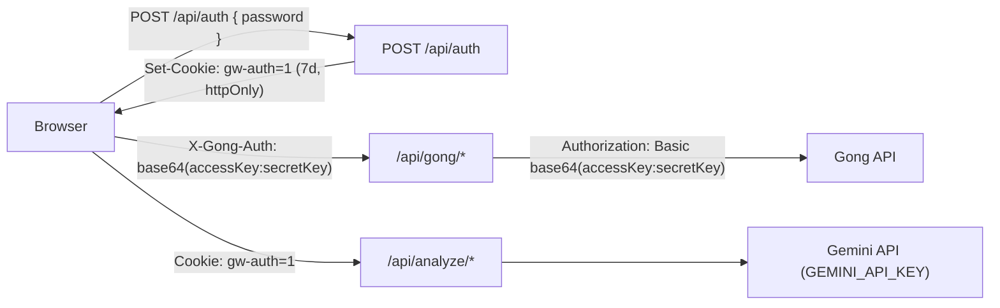
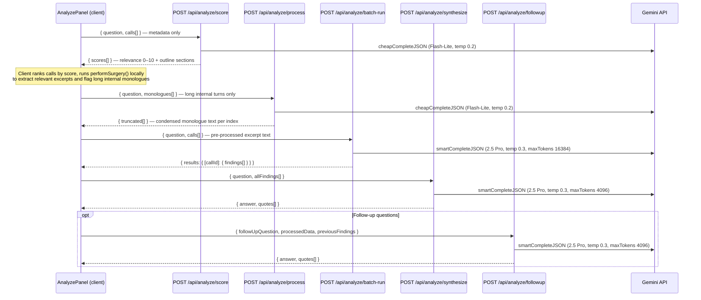

# API Routes

GongWizard exposes two categories of API routes: **Gong proxy routes** that forward requests to the Gong API using client-supplied credentials, and **AI analysis routes** that run transcript content through Gemini models. A single **auth route** handles site-level access.

---

## Route Summary Table

### Auth

| Method | Path | Auth Required | Purpose | Response Type |
|--------|------|---------------|---------|---------------|
| POST | `/api/auth` | None | Validate site password; issue `gw-auth` cookie | `{ ok: true }` |

### Gong Proxy

| Method | Path | Auth Required | Purpose | Response Type |
|--------|------|---------------|---------|---------------|
| POST | `/api/gong/calls` | `X-Gong-Auth` header | Fetch paginated call list with full extensive metadata | `{ calls: NormalizedCall[] }` |
| POST | `/api/gong/connect` | `X-Gong-Auth` header | Validate credentials; fetch users, trackers, workspaces | `{ users, trackers, workspaces, internalDomains, baseUrl }` |
| POST | `/api/gong/search` | `X-Gong-Auth` header | Keyword search across transcripts, streamed as NDJSON | `application/x-ndjson` stream |
| POST | `/api/gong/transcripts` | `X-Gong-Auth` header | Fetch transcript monologues for a list of call IDs | `{ transcripts: CallTranscript[] }` |

### Analyze (AI)

| Method | Path | Auth Required | Purpose | Response Type |
|--------|------|---------------|---------|---------------|
| POST | `/api/analyze/batch-run` | `gw-auth` cookie | Extract findings from multiple calls in one AI call | `{ results: { [callId]: { findings[] } } }` |
| POST | `/api/analyze/followup` | `gw-auth` cookie | Answer a follow-up question against extracted call evidence | `{ answer, quotes[] }` |
| POST | `/api/analyze/process` | `gw-auth` cookie | Smart-truncate long internal monologues for a single call | `{ truncated: { index, kept }[] }` |
| POST | `/api/analyze/run` | `gw-auth` cookie | Extract findings from a single call's formatted transcript | `{ findings: Finding[] }` |
| POST | `/api/analyze/score` | `gw-auth` cookie | Score calls for relevance to a research question | `{ scores: ScoredCall[] }` |
| POST | `/api/analyze/synthesize` | `gw-auth` cookie | Synthesize findings from multiple analyzed calls into one answer | `{ answer, quotes[] }` |

---

## Authentication

GongWizard uses two independent auth layers.

### Layer 1 — Site gate (`gw-auth` cookie)

`src/middleware.ts` runs on all matched paths (everything except `_next/static`, `_next/image`, `favicon.ico`). The middleware checks for an httpOnly cookie named `gw-auth` with value `"1"`. If absent, the request is redirected to `/gate`.

Paths exempted from the cookie check: `/gate`, `/api/auth`, `/favicon`. All other routes — including `/api/gong/*` and `/api/analyze/*` — require a valid `gw-auth` cookie.

The cookie is issued by `POST /api/auth` after verifying the submitted password against `process.env.SITE_PASSWORD`. Cookie properties: `httpOnly: true`, `sameSite: lax`, `path: /`, `maxAge: 604800` (7 days).

### Layer 2 — Gong API credentials (`X-Gong-Auth` header)

All `/api/gong/*` routes require an `X-Gong-Auth` request header containing a Base64-encoded Basic auth string. The client constructs this as `btoa("accessKey:secretKey")` and stores the result in `sessionStorage` under `gongwizard_session` (managed by `src/lib/session.ts`). Each proxy route forwards it as HTTP Basic auth to Gong (`Authorization: Basic <value>`). Credentials are never persisted server-side and are cleared when the browser tab closes.

AI analysis routes (`/api/analyze/*`) do not require Gong credentials — they receive pre-processed call data in the request body.



---

## Per-Route Detail

---

### `POST /api/auth`

**File:** `src/app/api/auth/route.ts`

**Auth:** None. This route is middleware-exempt — it is the route that issues the `gw-auth` cookie.

**Request body:**

```json
{ "password": "string" }
```

**Response — success (200):**

```json
{ "ok": true }
```

Sets `Set-Cookie: gw-auth=1; HttpOnly; SameSite=Lax; Max-Age=604800; Path=/`.

**Error responses:**

| Status | Body |
|--------|------|
| 401 | `{ "error": "Incorrect password." }` |
| 500 | `{ "error": "Server misconfigured" }` — `SITE_PASSWORD` env var missing |

**Notable behavior:** If `request.json()` throws (malformed body), `password` resolves to `undefined` and the 401 path is taken.

---

### `POST /api/gong/connect`

**File:** `src/app/api/gong/connect/route.ts`

**Auth:** `gw-auth` cookie + `X-Gong-Auth` header.

**Purpose:** Called once on the Connect page to validate Gong credentials and bootstrap the client session. Fetches all users (paginated), all keyword trackers (paginated), and all workspaces concurrently via `Promise.allSettled`. Derives `internalDomains` from user email addresses for speaker classification.

**Request body:**

```typescript
{
  baseUrl?: string  // Optional custom Gong instance URL. Default: "https://api.gong.io". Trailing slashes stripped.
}
```

**Gong API calls made (parallel):**
- `GET /v2/users` — paginated; all users in the workspace
- `GET /v2/settings/trackers` — paginated; all company keyword trackers
- `GET /v2/workspaces` — single request

**Response — success (200):**

```typescript
{
  users: GongUser[];
  trackers: SessionTracker[];
  workspaces: GongWorkspace[];
  internalDomains: string[];   // Email domains from user records, e.g. ["acme.com"]
  baseUrl: string;             // Echoed back normalized base URL
  warnings?: string[];         // Non-fatal failures, e.g. "Failed to fetch trackers."
}
```

Types from `src/types/gong.ts`:

```typescript
interface GongUser {
  id: string;
  emailAddress: string;
  firstName?: string;
  lastName?: string;
  title?: string;
}

interface SessionTracker {
  id: string;
  name: string;
}

interface GongWorkspace {
  id: string;
  name: string;
}
```

**Error responses:**

| Status | Body |
|--------|------|
| 401 | `{ "error": "Missing credentials" }` — `X-Gong-Auth` header absent |
| 401 | `{ "error": "Invalid API credentials" }` — Gong returned 401 on users fetch |
| 500 | `{ "error": "<message>" }` |

**Notable behavior:**
- Users and trackers are fetched with full cursor-based pagination; 350 ms sleep (`GONG_RATE_LIMIT_MS`) between pages.
- All three fetches run concurrently. Partial failures (trackers or workspaces) produce `warnings` entries rather than a hard error.
- If the users fetch fails with 401, returns 401 immediately regardless of other fetch outcomes.
- `internalDomains` is the sole mechanism for internal/external speaker classification in downstream routes.

---

### `POST /api/gong/calls`

**File:** `src/app/api/gong/calls/route.ts`

**Auth:** `gw-auth` cookie + `X-Gong-Auth` header.

**Purpose:** Fetches a complete call list for a date range with full metadata. Executes in two steps: (1) paginates `GET /v2/calls` across 30-day date chunks to collect call IDs; (2) fetches full metadata via `POST /v2/calls/extensive` in batches of 10. Falls back to basic call data if `/v2/calls/extensive` returns 403.

**Request body:**

```typescript
{
  fromDate: string;      // ISO 8601 datetime, required
  toDate: string;        // ISO 8601 datetime, required
  baseUrl?: string;      // Default: "https://api.gong.io"
  workspaceId?: string;  // Optional Gong workspace filter
}
```

**Response — success (200):**

```typescript
{
  calls: NormalizedCall[];
}
```

`NormalizedCall` is the output of `normalizeExtensiveCall()`:

```typescript
{
  id: string;
  title: string;
  started: string;           // ISO datetime
  duration: number;          // seconds
  url?: string;
  direction?: string;
  parties: GongParty[];
  topics: string[];
  trackers: Array<{
    name?: string;
    count?: number;
    occurrences: Array<{
      startTimeMs: number;   // converted from Gong's seconds × 1000
      speakerId?: string;
      phrase?: string;
    }>;
  }>;
  brief: string;
  keyPoints: string[];
  actionItems: string[];
  outline: Array<{
    name: string;
    startTimeMs: number;     // converted from seconds × 1000
    durationMs: number;      // converted from seconds × 1000
    items: Array<{
      text: string;
      startTimeMs: number;
      durationMs: number;
    }>;
  }>;
  questions: any[];
  interactionStats: InteractionStats | null;
  context: any[];
  accountName: string;       // extracted from CRM context (objectType: "Account", field: "name")
  accountIndustry: string;
  accountWebsite: string;
}
```

`InteractionStats` from `src/types/gong.ts`:

```typescript
interface InteractionStats {
  talkRatio?: number;
  longestMonologue?: number;
  interactivity?: number;
  patience?: number;
  questionRate?: number;
}
```

**Error responses:**

| Status | Body |
|--------|------|
| 400 | `{ "error": "fromDate and toDate are required" }` |
| 400 | `{ "error": "Date range exceeds maximum of 365 days" }` |
| 401 | `{ "error": "Missing credentials" }` |
| 500 | `{ "error": "<message>" }` |

**Notable behavior:**
- `MAX_DATE_RANGE_DAYS = 365`. Range check runs before any Gong API calls.
- Date range is split into 30-day chunks (`CHUNK_DAYS = 30`) via `buildDateChunks()` to work within Gong pagination limits. Chunks are fetched sequentially with 350 ms delays between chunks.
- Duplicate call IDs across chunk boundaries are deduplicated with a `Set<string>`.
- Extensive batch size: 10 calls per request (`EXTENSIVE_BATCH_SIZE`); 350 ms sleep between batches.
- On 403 from `/v2/calls/extensive`, logs a warning and falls back to basic call data. Fallback records have empty `parties`, `topics`, `trackers`, `brief`, `outline`, and `questions`.
- All `startTime` values from Gong (seconds) are converted to `startTimeMs` (milliseconds) in `normalizeExtensiveCall()` and `normalizeOutline()`.
- `accountName`, `accountIndustry`, `accountWebsite` are extracted from the nested `context[].objects[].fields[]` CRM context structure via `extractFieldValues()`.

---

### `POST /api/gong/transcripts`

**File:** `src/app/api/gong/transcripts/route.ts`

**Auth:** `gw-auth` cookie + `X-Gong-Auth` header.

**Purpose:** Fetches transcript monologues for a list of call IDs. Batches requests to `POST /v2/calls/transcript` in groups of 50, handles cursor pagination within each batch, and merges all monologues per call across pages.

**Request body:**

```typescript
{
  callIds: string[];  // Required. Array of Gong call IDs.
  baseUrl?: string;   // Default: "https://api.gong.io"
}
```

**Response — success (200):**

```typescript
{
  transcripts: Array<{
    callId: string;
    transcript: TranscriptMonologue[];
  }>
}
```

Types from `src/types/gong.ts`:

```typescript
interface TranscriptMonologue {
  speakerId: string;
  sentences: TranscriptSentence[];
}

interface TranscriptSentence {
  text: string;
  start: number;  // milliseconds from call start
  end?: number;   // milliseconds from call start
}
```

**Error responses:**

| Status | Body |
|--------|------|
| 400 | `{ "error": "callIds array is required" }` |
| 401 | `{ "error": "Missing credentials" }` |
| 500 | `{ "error": "<message>" }` |

**Notable behavior:**
- Batch size: 50 call IDs per Gong request (`TRANSCRIPT_BATCH_SIZE`).
- 350 ms sleep between batches and between paginated pages within a batch.
- Monologues for a given `callId` are accumulated into `transcriptMap[callId]` across all pages.
- Calls with no transcript data are silently omitted from the response.

---

### `POST /api/gong/search`

**File:** `src/app/api/gong/search/route.ts`

**Auth:** `gw-auth` cookie + `X-Gong-Auth` header.

**Purpose:** Keyword substring search across transcript sentences for a set of call IDs. Results are streamed progressively as NDJSON so the client can display matches incrementally while the search is in progress.

**Request body:**

```typescript
{
  callIds: string[];  // Required. Capped to first 500 entries server-side.
  keyword: string;    // Required. Case-insensitive substring match against sentence text.
  baseUrl?: string;   // Default: "https://api.gong.io"
}
```

**Response:** `Content-Type: application/x-ndjson`. Each newline-delimited JSON object is one of three shapes:

```typescript
// A keyword match found in a sentence:
{
  type: "match";
  callId: string;
  speakerId: string;
  timestamp: string;  // formatted as "M:SS" by formatTimestamp() from src/lib/format-utils.ts
  text: string;       // the matching sentence text
  context: string;    // preceding sentence text, or "" if first sentence in monologue
}

// Progress update emitted after each batch of 50 call IDs:
{
  type: "progress";
  searched: number;
  total: number;
  matchCount: number;
}

// Terminal event when all batches are complete:
{
  type: "done";
  searched: number;
  matchCount: number;
}
```

**Error responses (returned before stream starts):**

| Status | Body |
|--------|------|
| 401 | `{ "error": "Missing auth" }` |
| 400 | `{ "error": "Missing callIds or keyword" }` |

**Notable behavior:**
- Transcript fetching uses the same 50-ID batching and 350 ms rate limiting as `/api/gong/transcripts`.
- Batches that fail are silently skipped (logged via `console.error`); the stream continues with remaining batches.
- A `progress` event is emitted after every batch regardless of whether matches were found.
- `sentence.start` from Gong is in seconds; the route converts to milliseconds before passing to `formatTimestamp`.

---

### `POST /api/analyze/score`

**File:** `src/app/api/analyze/score/route.ts`

**Auth:** `gw-auth` cookie (enforced by middleware). No Gong credentials required.

**AI model:** `gemini-2.0-flash-lite` via `cheapCompleteJSON` from `src/lib/ai-providers.ts`.

**Purpose:** Scores a batch of calls for relevance to a research question using call metadata only (brief, key points, trackers, topics, outline structure). No transcript content is used. First step of the analysis pipeline — identifies which calls to analyze in depth and which outline sections to focus on.

**Request body:**

```typescript
{
  question: string;
  calls: Array<{
    id: string;
    title?: string;
    brief?: string;
    keyPoints?: string[];
    trackers?: Array<{ name?: string } | string>;
    topics?: string[];
    talkRatio?: number;              // 0–1 float
    outline?: Array<{
      name?: string;
      items?: Array<{ text?: string }>;
    }>;
  }>;
}
```

**AI parameters:** `temperature: 0.2`, `maxTokens: 4096`.

**Response — success (200):**

```typescript
{
  scores: Array<{
    callId: string;
    score: number;              // 0–10, clamped via Math.max(0, Math.min(10, s.score))
    reason: string;             // one-sentence explanation
    relevantSections: string[]; // outline section names most likely to contain signal
  }>
}
```

**Error responses:**

| Status | Body |
|--------|------|
| 400 | `{ "error": "question and calls[] are required" }` |
| 500 | `{ "error": "<message>" }` |

**Notable behavior:**
- All calls are sent to the model in a single prompt; results are returned for all calls in input order.
- On AI failure (inner try/catch), returns neutral fallback scores (`score: 5`, all outline section names as `relevantSections`) so the pipeline can continue with all calls included at equal priority.

---

### `POST /api/analyze/process`

**File:** `src/app/api/analyze/process/route.ts`

**Auth:** `gw-auth` cookie (enforced by middleware).

**AI model:** `gemini-2.0-flash-lite` via `cheapCompleteJSON` from `src/lib/ai-providers.ts`.

**Purpose:** Surgically truncates long internal rep monologues (those flagged `needsSmartTruncation: true` by `performSurgery()` in `src/lib/transcript-surgery.ts`) to retain only sentences relevant to the research question. Called after `score` and `performSurgery()`, before `run`/`batch-run`. All long monologues for one call are batched into a single AI request.

**Request body:**

```typescript
{
  question: string;
  monologues: Array<{
    index: number;  // index into the SurgeryResult.excerpts[] array — used for round-trip correlation
    text: string;   // full monologue text
  }>;
}
```

The prompt is built by `buildSmartTruncationPrompt(question, monologues)` from `src/lib/transcript-surgery.ts`.

**AI parameters:** `temperature: 0.2`, `maxTokens: 2048`.

**Response — success (200):**

```typescript
{
  truncated: Array<{
    index: number;  // echoed from input for caller correlation
    kept: string;   // retained sentences verbatim, or "[context omitted]"
  }>
}
```

**Error responses:**

| Status | Body |
|--------|------|
| 400 | `{ "error": "question and monologues[] are required" }` |
| 500 | `{ "error": "<message>" }` |

**Notable behavior:** The model is instructed to keep only sentences that set up a customer response, contain pricing or product claims relevant to the research question, or ask a question the customer then answers. Pleasantries, filler, and repetition are dropped.

---

### `POST /api/analyze/run`

**File:** `src/app/api/analyze/run/route.ts`

**Auth:** `gw-auth` cookie (enforced by middleware).

**AI model:** `gemini-2.5-pro` via `smartCompleteJSON` from `src/lib/ai-providers.ts`. `maxDuration = 60`.

**Purpose:** Analyzes a single call's pre-processed transcript excerpts for evidence relevant to a research question. Extracts verbatim quotes exclusively from external speakers (prospects, customers, partners). Use for single-call analysis; use `batch-run` for multiple calls.

**Request body:**

```typescript
{
  question: string;
  callData: string;           // Pre-formatted transcript text from formatExcerptsForAnalysis()
  speakerDirectory?: Array<{
    speakerId: string;
    name: string;
    jobTitle: string;
    company: string;
    isInternal: boolean;
  }>;
  callMeta?: { title: string; date: string };
}
```

**AI parameters:** `temperature: 0.3`, `maxTokens: 4096`.

**Response — success (200):**

```typescript
{
  findings: Array<{
    exact_quote: string;
    speaker_name: string;
    job_title: string;
    company: string;
    is_external: boolean;   // always true — only external speaker quotes returned
    timestamp: string;
    context: string;        // brief description of what prompted the statement
    significance: "high" | "medium" | "low";
    finding_type: "objection" | "need" | "competitive" | "question" | "feedback";
  }>
}
```

**Error responses:**

| Status | Body |
|--------|------|
| 400 | `{ "error": "question and callData required" }` |
| 500 | `{ "error": "<message>" }` |

**Notable behavior:**
- Returns `findings: []` when no relevant external speaker evidence exists.
- This route uses `new Response(JSON.stringify(result), { headers: { 'Content-Type': 'application/json' } })` for both success and error paths rather than `NextResponse.json()`.

---

### `POST /api/analyze/batch-run`

**File:** `src/app/api/analyze/batch-run/route.ts`

**Auth:** `gw-auth` cookie (enforced by middleware).

**AI model:** `gemini-2.5-pro` via `smartCompleteJSON` from `src/lib/ai-providers.ts`. `maxDuration = 60`.

**Purpose:** Analyzes multiple calls in a single AI prompt. Same extraction goal as `/api/analyze/run` but sends all calls together to reduce round-trip latency and allow the model to build cross-call context. Returns findings keyed by `callId`.

**Request body:**

```typescript
{
  question: string;
  calls: Array<{
    callId: string;
    callData: string;           // Pre-formatted transcript excerpts
    brief: string;
    speakerDirectory: Array<{
      speakerId: string;
      name: string;
      jobTitle: string;
      company: string;
      isInternal: boolean;
    }>;
    callMeta: { title: string; date: string };
  }>;
}
```

**AI parameters:** `temperature: 0.3`, `maxTokens: 16384`.

**Response — success (200):**

```typescript
{
  results: {
    [callId: string]: {
      findings: Array<{
        exact_quote: string;
        speaker_name: string;
        job_title: string;
        company: string;
        is_external: boolean;
        timestamp: string;
        context: string;
        significance: "high" | "medium" | "low";
        finding_type: "objection" | "need" | "competitive" | "question" | "feedback";
      }>
    }
  }
}
```

**Error responses:**

| Status | Body |
|--------|------|
| 400 | `{ "error": "question and calls required" }` |
| 500 | `{ "error": "<message>" }` |

**Notable behavior:**
- Every `callId` from the input is present as a key in `results`, even if `findings` is empty for that call.
- External speakers across all calls are compiled into a shared speaker header in the prompt for cross-call attribution context.
- Uses `new Response(JSON.stringify(result), ...)` rather than `NextResponse.json()` for both success and error paths.

---

### `POST /api/analyze/synthesize`

**File:** `src/app/api/analyze/synthesize/route.ts`

**Auth:** `gw-auth` cookie (enforced by middleware).

**AI model:** `gemini-2.5-pro` via `smartCompleteJSON` from `src/lib/ai-providers.ts`. `maxDuration = 60`.

**Purpose:** Takes findings extracted from multiple analyzed calls and produces a direct 2–4 sentence answer to the research question supported by verbatim quotes with full attribution. Final step of the analysis pipeline after scoring, processing, and finding extraction.

**Request body:**

```typescript
{
  question: string;
  allFindings: Array<{
    callId: string;
    callTitle: string;
    callDate: string;
    account: string;
    findings: Array<{
      exact_quote: string;
      speaker_name: string;
      job_title: string;
      company: string;
      is_external: boolean;
      timestamp: string;
      context: string;
      significance?: string;
      finding_type?: string;
    }>;
  }>;
}
```

**AI parameters:** `temperature: 0.3`, `maxTokens: 4096`.

**Response — success (200):**

```typescript
{
  answer: string;    // 2–4 sentence direct answer
  quotes: Array<{
    quote: string;
    speaker_name: string;
    job_title: string;
    company: string;
    call_title: string;
    call_date: string;
  }>
}
```

**Error responses:**

| Status | Body |
|--------|------|
| 400 | `{ "error": "question and allFindings[] are required" }` |
| 500 | `{ "error": "<message>" }` |

**Notable behavior:**
- Only findings where `is_external === true` are included in the synthesis prompt.
- If `allFindings` contains no external speaker findings at all, returns a fixed `answer` of `"No relevant statements from external speakers were found in the analyzed calls."` with `quotes: []` without making an AI call.
- The system prompt forbids paraphrasing — all quotes in the response must be verbatim from the input evidence.

---

### `POST /api/analyze/followup`

**File:** `src/app/api/analyze/followup/route.ts`

**Auth:** `gw-auth` cookie (enforced by middleware).

**AI model:** `gemini-2.5-pro` via `smartCompleteJSON` from `src/lib/ai-providers.ts`. `maxDuration = 60`.

**Purpose:** Answers a follow-up question against previously extracted call evidence without re-fetching or re-analyzing transcripts. Enables conversational research sessions within the `AnalyzePanel` component.

**Request body:**

```typescript
{
  followUpQuestion: string;   // Required
  processedData: string;      // Required — pre-formatted evidence text (external speaker quotes with attribution)
  question?: string;          // Original research question for context
  previousFindings?: unknown; // Prior answers serialized to JSON for conversation context
}
```

**AI parameters:** `temperature: 0.3`, `maxTokens: 4096`.

**Response — success (200):**

```typescript
{
  answer: string;
  quotes: Array<{
    quote: string;
    speaker_name: string;
    job_title: string;
    company: string;
    call_title: string;
    call_date: string;
  }>
}
```

**Error responses:**

| Status | Body |
|--------|------|
| 400 | `{ "error": "followUpQuestion and processedData are required" }` |
| 500 | `{ "error": "<message>" }` |

**Notable behavior:**
- `previousFindings` is `JSON.stringify`-ed and appended to the prompt when present.
- Constrained to external speaker quotes only, identical to all other analysis routes.

---

## Middleware

**File:** `src/middleware.ts`

```typescript
export const config = {
  matcher: ['/((?!_next/static|_next/image|favicon.ico).*)'],
};
```

Decision logic on every matched request:

1. Path starts with `/gate`, `/api/auth`, or `/favicon` → pass through unconditionally.
2. Cookie `gw-auth` equals `"1"` → pass through.
3. Otherwise → redirect to `/gate`.

Note: `/api/gong/*` and `/api/analyze/*` are **not** in the exemption list. Both route groups require a valid `gw-auth` cookie in addition to their respective credential checks.

---

## AI Provider Details

All analysis routes use the shared abstraction in `src/lib/ai-providers.ts`. The `GoogleGenAI` client is lazy-initialized from `process.env.GEMINI_API_KEY` on first use.

| Function | Model | JSON mode | Default max tokens | Used by |
|----------|-------|-----------|--------------------|---------|
| `cheapCompleteJSON` | `gemini-2.0-flash-lite` | Yes (`responseMimeType: 'application/json'`) | 1024 | `score`, `process` |
| `smartCompleteJSON` | `gemini-2.5-pro` | Yes | 8192 | `run`, `batch-run`, `synthesize`, `followup` |
| `smartStream` | `gemini-2.5-pro` | No | 8192 | Defined but not currently used by any route handler |

All routes pass `temperature` and `maxTokens` overrides that differ from the defaults (see per-route sections above). `smartCompleteJSON` additionally accepts a `systemPrompt` option passed as `systemInstruction` to the Gemini API.

---

## Gong API Rate Limiting

All proxy routes use shared constants and helpers from `src/lib/gong-api.ts`:

| Constant | Value | Applied to |
|----------|-------|------------|
| `GONG_RATE_LIMIT_MS` | 350 ms | Sleep between all paginated/batched Gong requests |
| `EXTENSIVE_BATCH_SIZE` | 10 | `/v2/calls/extensive` batches in `/api/gong/calls` |
| `TRANSCRIPT_BATCH_SIZE` | 50 | `/v2/calls/transcript` batches in `/api/gong/transcripts` and `/api/gong/search` |

`makeGongFetch(baseUrl, authHeader)` returns a fetch wrapper that applies exponential backoff with up to 5 retries on 429 and 5xx responses. `handleGongError(error)` maps `GongApiError` instances to appropriate HTTP responses.

---

## Analysis Pipeline Flow

The full four-stage pipeline is orchestrated client-side by `src/components/analyze-panel.tsx`:


