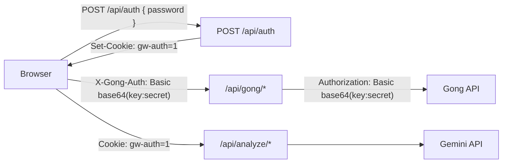
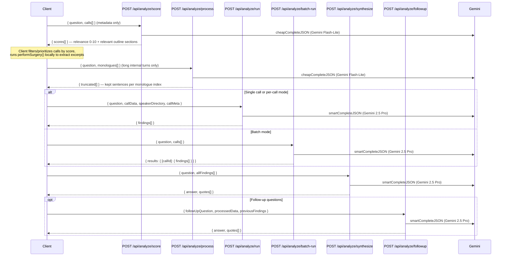

# API Routes

GongWizard exposes two categories of API routes: **Gong proxy routes** that forward requests to the Gong API using client-supplied credentials, and **AI analysis routes** that run transcript content through Gemini models. A single **auth route** handles site-level access.

---

## Authentication

GongWizard uses two independent auth layers.

### Layer 1 — Site gate (`gw-auth` cookie)

All routes except `/gate`, `/api/auth`, `/api/gong/*`, `/_next/*`, and `/favicon` are protected by Edge middleware (`src/middleware.ts`). The middleware checks for a `gw-auth` cookie with value `"1"`. If absent, the request is redirected to `/gate`.

The cookie is issued by `POST /api/auth` after verifying the submitted password against `process.env.SITE_PASSWORD`. It is `httpOnly`, `sameSite: lax`, valid for 7 days.

Gong proxy routes (`/api/gong/*`) are explicitly exempted from the cookie check because they run before a session is established and enforce their own credential check via Layer 2.

### Layer 2 — Gong API credentials (`X-Gong-Auth` header)

All `/api/gong/*` routes require an `X-Gong-Auth` request header containing a Base64-encoded Basic auth string (`accessKey:secretKey`). This header is constructed client-side from user-supplied credentials, stored in `sessionStorage` under `gongwizard_session` (managed by `src/lib/session.ts`), and forwarded by each proxy route as HTTP Basic auth to Gong. The server never persists these credentials.

AI analysis routes (`/api/analyze/*`) are protected by the `gw-auth` cookie (enforced by middleware) but do not require Gong credentials — they receive pre-processed call data in the request body.



---

## Route Summary Table

### Auth

| Method | Path | Auth Required | Purpose | Response Type |
| --- | --- | --- | --- | --- |
| POST | `/api/auth` | None | Validate site password; issue `gw-auth` cookie | `{ ok: true }` |

### Gong Proxy

| Method | Path | Auth Required | Purpose | Response Type |
| --- | --- | --- | --- | --- |
| POST | `/api/gong/calls` | `X-Gong-Auth` header | Fetch paginated call list with full extensive metadata | `{ calls: NormalizedCall[] }` |
| POST | `/api/gong/connect` | `X-Gong-Auth` header | Validate credentials; fetch users, trackers, workspaces | `{ users, trackers, workspaces, internalDomains, baseUrl }` |
| POST | `/api/gong/search` | `X-Gong-Auth` header | Keyword search across transcripts, streamed as NDJSON | NDJSON stream |
| POST | `/api/gong/transcripts` | `X-Gong-Auth` header | Fetch transcript monologues for a list of call IDs | `{ transcripts: CallTranscript[] }` |

### Analyze (AI)

| Method | Path | Auth Required | Purpose | Response Type |
| --- | --- | --- | --- | --- |
| POST | `/api/analyze/batch-run` | `gw-auth` cookie | Extract findings from multiple calls in one AI call | `{ results: { [callId]: { findings[] } } }` |
| POST | `/api/analyze/followup` | `gw-auth` cookie | Answer a follow-up question against extracted call evidence | `{ answer, quotes[] }` |
| POST | `/api/analyze/process` | `gw-auth` cookie | Smart-truncate long internal monologues for a single call | `{ truncated: { index, kept }[] }` |
| POST | `/api/analyze/run` | `gw-auth` cookie | Extract findings from a single call's formatted transcript | `{ findings: Finding[] }` |
| POST | `/api/analyze/score` | `gw-auth` cookie | Score calls for relevance to a research question | `{ scores: ScoredCall[] }` |
| POST | `/api/analyze/synthesize` | `gw-auth` cookie | Synthesize findings from multiple analyzed calls into one answer | `{ answer, quotes[] }` |

---

## Per-Route Detail

---

### `POST /api/auth`

**File:** `src/app/api/auth/route.ts`

**Auth:** None. This route is middleware-exempt — it is the route that issues auth.

**Request body:**

```json
{ "password": "string" }
```

**Response — success (200):**

```json
{ "ok": true }
```

Sets `Set-Cookie: gw-auth=1; HttpOnly; SameSite=Lax; Max-Age=604800; Path=/`

**Error responses:**

| Status | Body |
| --- | --- |
| 401 | `{ "error": "Incorrect password." }` |
| 500 | `{ "error": "Server misconfigured" }` — `SITE_PASSWORD` env var missing |

**Notable behavior:** If `request.json()` throws (malformed body), `password` resolves to `undefined` and the 401 path is taken. Cookie `maxAge` is `60 * 60 * 24 * 7 = 604800` seconds (7 days).

---

### `POST /api/gong/connect`

**File:** `src/app/api/gong/connect/route.ts`

**Auth:** `X-Gong-Auth: <base64(accessKey:secretKey)>` required. Returns 401 if absent or if Gong rejects the credentials.

**Purpose:** Called once on the Connect page to validate credentials and bootstrap the client session. Fetches all users (paginated), all keyword trackers (paginated), and all workspaces in parallel via `Promise.allSettled`. Derives `internalDomains` from the email addresses of all users.

**Request body:**

```typescript
{
  baseUrl?: string  // Optional custom Gong instance URL. Defaults to "https://api.gong.io". Trailing slashes stripped.
}
```

**Response — success (200):**

```typescript
{
  users: GongUser[];           // All users from /v2/users (paginated)
  trackers: SessionTracker[];  // All trackers from /v2/settings/trackers (paginated)
  workspaces: GongWorkspace[]; // From /v2/workspaces
  internalDomains: string[];   // Email domains derived from user records, e.g. ["acme.com"]
  baseUrl: string;             // Echoed back normalized base URL
  warnings?: string[];         // Non-fatal failures, e.g. "Failed to fetch trackers."
}
```

Types from `src/types/gong.ts`:

```typescript
interface GongUser {
  id: string;
  emailAddress: string;
  firstName?: string;
  lastName?: string;
  title?: string;
}

interface SessionTracker {
  id: string;
  name: string;
}

interface GongWorkspace {
  id: string;
  name: string;
}
```

**Error responses:**

| Status | Body |
| --- | --- |
| 401 | `{ "error": "Missing credentials" }` — header absent |
| 401 | `{ "error": "Invalid API credentials" }` — Gong returned 401 on users fetch |
| 500 | `{ "error": "Internal server error" }` |

**Notable behavior:**

- Users and trackers are fetched with full cursor-based pagination. A 350 ms sleep (`GONG_RATE_LIMIT_MS`) is inserted between paginated pages.
- All three fetches run concurrently. Partial failures on trackers or workspaces produce entries in `warnings` rather than a hard error.
- If the users fetch fails with 401, the route returns 401 immediately regardless of other fetch outcomes.
- `internalDomains` is computed by extracting the domain segment from every `emailAddress` in the users list. This is the sole mechanism for speaker classification in downstream routes.

---

### `POST /api/gong/calls`

**File:** `src/app/api/gong/calls/route.ts`

**Auth:** `X-Gong-Auth` required.

**Purpose:** Fetches a complete call list for a date range with full metadata. Executes in two steps: (1) paginates `/v2/calls` across 30-day date chunks to collect call IDs, then (2) fetches full metadata via `/v2/calls/extensive` in batches of 10. Falls back to basic call data if `/v2/calls/extensive` returns 403.

**Request body:**

```typescript
{
  fromDate: string;      // ISO 8601 datetime, required
  toDate: string;        // ISO 8601 datetime, required
  baseUrl?: string;      // Default: "https://api.gong.io"
  workspaceId?: string;  // Optional Gong workspace filter
}
```

**Response — success (200):**

```typescript
{
  calls: NormalizedCall[];
}
```

`NormalizedCall` is the output of `normalizeExtensiveCall()`. Shape:

```typescript
{
  id: string;
  title: string;
  started: string;           // ISO datetime
  duration: number;          // seconds
  url?: string;
  direction?: string;
  parties: GongParty[];
  topics: string[];
  trackers: Array<{
    name?: string;
    count?: number;
    occurrences: Array<{
      startTimeMs: number;   // converted from Gong's seconds × 1000
      speakerId?: string;
      phrase?: string;
    }>;
  }>;
  brief: string;
  keyPoints: string[];
  actionItems: string[];
  outline: Array<{
    name: string;
    startTimeMs: number;     // converted from seconds × 1000
    durationMs: number;      // converted from seconds × 1000
    items: Array<{
      text: string;
      startTimeMs: number;
      durationMs: number;
    }>;
  }>;
  questions: any[];
  interactionStats: InteractionStats | null;
  context: any[];
  accountName: string;       // extracted from CRM context
  accountIndustry: string;
  accountWebsite: string;
}
```

`InteractionStats` type from `src/types/gong.ts`:

```typescript
interface InteractionStats {
  talkRatio?: number;
  longestMonologue?: number;
  interactivity?: number;
  patience?: number;
  questionRate?: number;
}
```

**Error responses:**

| Status | Body |
| --- | --- |
| 400 | `{ "error": "fromDate and toDate are required" }` |
| 400 | `{ "error": "Date range exceeds maximum of 365 days" }` |
| 401 | `{ "error": "Missing credentials" }` |
| 401 | `{ "error": "Invalid API credentials" }` |
| 500 | `{ "error": "Internal server error" }` |

**Notable behavior:**

- `MAX_DATE_RANGE_DAYS = 365`. The range check runs before any Gong API calls.
- Date range is split into 30-day chunks (`CHUNK_DAYS = 30`) via `buildDateChunks()` to avoid Gong pagination limits. Chunks are fetched sequentially with 350 ms delays.
- Duplicate call IDs across chunk boundaries are deduplicated with a `Set<string>`.
- Extensive batch size: 10 calls per request (`EXTENSIVE_BATCH_SIZE`). 350 ms sleep between batches.
- On 403 from `/v2/calls/extensive`, falls back to basic call data. Fallback records have empty `parties`, `topics`, `trackers`, `brief`, `outline`, and `questions`.
- `accountName`, `accountIndustry`, `accountWebsite` are extracted from the nested `context[].objects[].fields[]` structure via `extractFieldValues()`, filtering by `objectType = "Account"`.
- All `startTime` values from Gong (seconds) are converted to `startTimeMs` (milliseconds) by `normalizeExtensiveCall()` and `normalizeOutline()`.

---

### `POST /api/gong/transcripts`

**File:** `src/app/api/gong/transcripts/route.ts`

**Auth:** `X-Gong-Auth` required.

**Purpose:** Fetches transcript monologues for a list of call IDs. Batches requests to Gong's `/v2/calls/transcript` endpoint in groups of 50, supports cursor pagination within each batch, and merges monologues from all pages per call.

**Request body:**

```typescript
{
  callIds: string[];  // Required. Array of Gong call IDs.
  baseUrl?: string;   // Default: "https://api.gong.io"
}
```

**Response — success (200):**

```typescript
{
  transcripts: Array<{
    callId: string;
    transcript: Array<{          // TranscriptMonologue[]
      speakerId: string;
      sentences: Array<{
        text: string;
        start: number;           // milliseconds from call start
        end?: number;            // milliseconds from call start
      }>;
    }>;
  }>
}
```

Types from `src/types/gong.ts`:

```typescript
interface TranscriptMonologue {
  speakerId: string;
  sentences: TranscriptSentence[];
}

interface TranscriptSentence {
  text: string;
  start: number;  // milliseconds
  end?: number;   // milliseconds
}
```

**Error responses:**

| Status | Body |
| --- | --- |
| 400 | `{ "error": "callIds array is required" }` |
| 401 | `{ "error": "Missing credentials" }` |
| 401 | `{ "error": "Invalid API credentials" }` |
| 500 | `{ "error": "Internal server error" }` |

**Notable behavior:**

- Batch size: 50 call IDs per Gong request (`TRANSCRIPT_BATCH_SIZE`).
- 350 ms sleep between batches and between paginated pages within a batch.
- Monologues for a given `callId` are accumulated across all pages into `transcriptMap[callId]`.
- Only calls with transcript data appear in the response — calls with no transcript are silently omitted.

---

### `POST /api/gong/search`

**File:** `src/app/api/gong/search/route.ts`

**Auth:** `X-Gong-Auth` required. Returns 401 if absent.

**Purpose:** Performs a keyword substring search across transcript sentences for a list of call IDs. Results are streamed progressively as NDJSON so the client can display matches incrementally while the search is in progress.

**Request body:**

```typescript
{
  callIds: string[];  // Required. Capped to first 500.
  keyword: string;    // Required. Case-insensitive substring match against sentence text.
  baseUrl?: string;   // Default: "https://api.gong.io"
}
```

**Response:** `Content-Type: application/x-ndjson`. Each newline-delimited JSON object is one of three shapes:

```typescript
// A keyword match found in a sentence:
{
  type: "match";
  callId: string;
  speakerId: string;
  timestamp: string;  // formatted as "M:SS" by formatTimestamp() from src/lib/format-utils.ts
  text: string;       // the matching sentence text
  context: string;    // preceding sentence text, or "" if first sentence in monologue
}

// Progress update after each batch of call IDs:
{
  type: "progress";
  searched: number;
  total: number;
  matchCount: number;
}

// Terminal event when all batches are complete:
{
  type: "done";
  searched: number;
  matchCount: number;
}
```

**Error responses:**

| Status | Body |
| --- | --- |
| 401 | `{ "error": "Missing auth" }` |
| 400 | `{ "error": "Missing callIds or keyword" }` |

**Notable behavior:**

- Transcript fetching uses 50-ID batching and 350 ms rate limiting, identical to `/api/gong/transcripts`.
- Batches that fail are silently skipped (`console.error` logged); the stream continues with remaining batches.
- A progress event is emitted after every batch regardless of whether matches were found.
- `callIds` input is sliced to 500 maximum before processing.

---

### `POST /api/analyze/score`

**File:** `src/app/api/analyze/score/route.ts`

**Auth:** `gw-auth` cookie (enforced by middleware).

**Purpose:** Scores a batch of calls for relevance to a research question using call metadata only (brief, key points, trackers, topics, outline). No transcript content is used. Intended as the first step of the analysis pipeline to prioritize which calls to analyze.

**Request body:**

```typescript
{
  question: string;
  calls: Array<{
    id: string;
    title?: string;
    brief?: string;
    keyPoints?: string[];
    trackers?: Array<{ name?: string } | string>;
    topics?: string[];
    talkRatio?: number;              // 0–1 float
    outline?: Array<{
      name?: string;
      items?: Array<{ text?: string }>;
    }>;
  }>;
}
```

**Response — success (200):**

```typescript
{
  scores: Array<{
    callId: string;
    score: number;              // 0–10, clamped via Math.max/Math.min
    reason: string;             // one-sentence explanation
    relevantSections: string[]; // outline section names most likely to contain signal
  }>
}
```

**Error responses:**

| Status | Body |
| --- | --- |
| 400 | `{ "error": "question and calls[] are required" }` |
| 500 | `{ "error": "<message>" }` |

**Notable behavior:**

- Uses `cheapCompleteJSON` (Gemini Flash-Lite), `temperature: 0.2`, `maxTokens: 4096`.
- All calls are sent to the model in a single prompt; results are returned for all calls in input order.
- On AI failure, returns neutral fallback scores (`score: 5`, all outline section names as `relevantSections`) rather than an error — the pipeline can continue with all calls included at equal priority.
- `score` is clamped to [0, 10] after the model response.

---

### `POST /api/analyze/process`

**File:** `src/app/api/analyze/process/route.ts`

**Auth:** `gw-auth` cookie (enforced by middleware).

**Purpose:** Surgically truncates long internal rep monologues (those marked `needsSmartTruncation` by `performSurgery()`) to retain only sentences relevant to the research question. Called per-call after `performSurgery()` identifies excerpts. Reduces transcript volume before the more expensive `/api/analyze/run` step.

**Request body:**

```typescript
{
  question: string;
  monologues: Array<{
    index: number;  // index into the SurgeryResult.excerpts[] array (for round-trip correlation)
    text: string;   // full monologue text
  }>;
}
```

**Response — success (200):**

```typescript
{
  truncated: Array<{
    index: number;  // echoed back from input for correlation
    kept: string;   // retained sentences verbatim, or "[context omitted]"
  }>
}
```

**Error responses:**

| Status | Body |
| --- | --- |
| 400 | `{ "error": "question and monologues[] are required" }` |
| 500 | `{ "error": "<message>" }` |

**Notable behavior:**

- Uses `cheapCompleteJSON` (Gemini Flash-Lite), `temperature: 0.2`, `maxTokens: 2048`.
- Prompt is built by `buildSmartTruncationPrompt()` from `src/lib/transcript-surgery.ts`. All monologues for one call are batched into a single AI request.
- The model is instructed to keep only sentences that set up a customer response, contain pricing/product claims, or ask a question the customer then answers.

---

### `POST /api/analyze/run`

**File:** `src/app/api/analyze/run/route.ts`

**Auth:** `gw-auth` cookie (enforced by middleware).

**Purpose:** Analyzes a single call's pre-processed transcript for evidence relevant to a research question. Extracts verbatim quotes from external speakers only (prospects, customers, partners — never internal team members).

**Request body:**

```typescript
{
  question: string;
  callData: string;           // Pre-formatted transcript text from formatExcerptsForAnalysis()
  speakerDirectory?: Array<{
    speakerId: string;
    name: string;
    jobTitle: string;
    company: string;
    isInternal: boolean;
  }>;
  callMeta?: { title: string; date: string };
}
```

**Response — success (200):**

```typescript
{
  findings: Array<{
    exact_quote: string;
    speaker_name: string;
    job_title: string;
    company: string;
    is_external: boolean;   // always true — only external speaker quotes are returned
    timestamp: string;
    context: string;
    significance: "high" | "medium" | "low";
    finding_type: "objection" | "need" | "competitive" | "question" | "feedback";
  }>
}
```

**Error responses:**

| Status | Body |
| --- | --- |
| 400 | `{ "error": "question and callData required" }` |
| 500 | `{ "error": "<message>" }` |

**Notable behavior:**

- Uses `smartCompleteJSON` (Gemini 2.5 Pro), `temperature: 0.3`, `maxTokens: 4096`.
- Returns `findings: []` when no relevant external speaker evidence exists — never returns null or omits the key.
- This route uses `new Response(JSON.stringify(result), ...)` for both success and error paths rather than `NextResponse.json()` — the only route in the codebase to do so.

---

### `POST /api/analyze/batch-run`

**File:** `src/app/api/analyze/batch-run/route.ts`

**Auth:** `gw-auth` cookie (enforced by middleware).

**Vercel timeout:** `export const maxDuration = 60` (60-second function timeout).

**Purpose:** Analyzes multiple calls in a single AI prompt for efficiency. Same extraction goal as `/api/analyze/run` but sends all calls together to avoid per-call latency. Returns findings keyed by `callId`.

**Request body:**

```typescript
{
  question: string;
  calls: Array<{
    callId: string;
    callData: string;           // Pre-formatted transcript text
    brief: string;
    speakerDirectory: Array<{
      speakerId: string;
      name: string;
      jobTitle: string;
      company: string;
      isInternal: boolean;
    }>;
    callMeta: { title: string; date: string };
  }>;
}
```

**Response — success (200):**

```typescript
{
  results: {
    [callId: string]: {
      findings: Array<{
        exact_quote: string;
        speaker_name: string;
        job_title: string;
        company: string;
        is_external: boolean;
        timestamp: string;
        context: string;
        significance: "high" | "medium" | "low";
        finding_type: "objection" | "need" | "competitive" | "question" | "feedback";
      }>
    }
  }
}
```

**Error responses:**

| Status | Body |
| --- | --- |
| 400 | `{ "error": "question and calls required" }` |
| 500 | `{ "error": "<message>" }` |

**Notable behavior:**

- Uses `smartCompleteJSON` (Gemini 2.5 Pro), `temperature: 0.3`, `maxTokens: 16384`.
- Every input `callId` is guaranteed present in the response `results`, even if `findings` is empty for that call.
- External speakers across all calls are compiled into a shared header in the prompt for cross-call attribution context.

---

### `POST /api/analyze/synthesize`

**File:** `src/app/api/analyze/synthesize/route.ts`

**Auth:** `gw-auth` cookie (enforced by middleware).

**Purpose:** Takes findings extracted from multiple analyzed calls and synthesizes a 2–4 sentence direct answer to the research question with supporting verbatim quotes. Designed as the final step of the analysis pipeline after scoring, processing, and running.

**Request body:**

```typescript
{
  question: string;
  allFindings: Array<{
    callId: string;
    callTitle: string;
    callDate: string;
    account: string;
    findings: Array<{
      exact_quote: string;
      speaker_name: string;
      job_title: string;
      company: string;
      is_external: boolean;
      timestamp: string;
      context: string;
      significance?: string;
      finding_type?: string;
    }>;
  }>;
}
```

**Response — success (200):**

```typescript
{
  answer: string;    // 2–4 sentence direct answer
  quotes: Array<{
    quote: string;
    speaker_name: string;
    job_title: string;
    company: string;
    call_title: string;
    call_date: string;
  }>
}
```

**Error responses:**

| Status | Body |
| --- | --- |
| 400 | `{ "error": "question and allFindings[] are required" }` |
| 500 | `{ "error": "<message>" }` |

**Notable behavior:**

- Uses `smartCompleteJSON` (Gemini 2.5 Pro), `temperature: 0.3`, `maxTokens: 4096`.
- Only findings where `is_external === true` are included in the synthesis prompt.
- If no external speaker findings exist in `allFindings`, returns a fixed answer `"No relevant statements from external speakers were found in the analyzed calls."` with `quotes: []` without making an AI call.
- All quotes in the response must be verbatim from the input evidence — the system prompt forbids paraphrasing.

---

### `POST /api/analyze/followup`

**File:** `src/app/api/analyze/followup/route.ts`

**Auth:** `gw-auth` cookie (enforced by middleware).

**Purpose:** Answers a follow-up question against previously extracted call evidence without re-fetching or re-analyzing transcripts. Enables conversational research sessions.

**Request body:**

```typescript
{
  followUpQuestion: string;   // Required
  processedData: string;      // Required — pre-formatted evidence text (external speaker quotes with attribution)
  question?: string;          // Original research question for context
  previousFindings?: unknown; // Prior answers to include as context (optional)
}
```

**Response — success (200):**

```typescript
{
  answer: string;
  quotes: Array<{
    quote: string;
    speaker_name: string;
    job_title: string;
    company: string;
    call_title: string;
    call_date: string;
  }>
}
```

**Error responses:**

| Status | Body |
| --- | --- |
| 400 | `{ "error": "followUpQuestion and processedData are required" }` |
| 500 | `{ "error": "<message>" }` |

**Notable behavior:**

- Uses `smartCompleteJSON` (Gemini 2.5 Pro), `temperature: 0.3`, `maxTokens: 4096`.
- `previousFindings` is `JSON.stringify`-ed and included in the prompt when present.
- Constrained to external speaker quotes only, identical to all other analysis routes.

---

## Middleware

**File:** `src/middleware.ts`

```typescript
export const config = {
  matcher: ['/((?!_next/static|_next/image|favicon.ico).*)'],
};
```

The middleware runs on all matched paths. Decision logic:

1. Path starts with `/gate`, `/api/auth`, `/api/gong/`, or `/_next/` — pass through.
2. Cookie `gw-auth` equals `"1"` — pass through.
3. Otherwise — redirect to `/gate`.

Note: `/api/analyze/*` routes are **not** in the exemption list, so they are protected by the `gw-auth` cookie check.

---

## AI Provider Details

All analysis routes use the shared abstraction in `src/lib/ai-providers.ts`:

| Function | Model | Temperature | Max tokens | Used by |
| --- | --- | --- | --- | --- |
| `cheapCompleteJSON` | `gemini-3.1-flash-lite-preview` | 0.2 | 2048–4096 | `score`, `process` |
| `smartCompleteJSON` | `gemini-2.5-pro` | 0.3 | 4096–16384 | `run`, `batch-run`, `synthesize`, `followup` |
| `smartStream` | `gemini-2.5-pro` | 0.3 | 8192 | Not currently used by any route handler |

The `GoogleGenAI` client from `@google/genai` is initialized lazily on first use from `process.env.GEMINI_API_KEY`. All analysis routes fail with a 500 error if this key is absent.

---

## Gong API Rate Limiting

All proxy routes enforce a 350 ms delay (`GONG_RATE_LIMIT_MS`) between paginated requests using the `sleep()` helper from `src/lib/gong-api.ts`. Batch size constants:

| Constant | Value | Applied to |
| --- | --- | --- |
| `GONG_RATE_LIMIT_MS` | 350 ms | All paginated/batched Gong requests |
| `EXTENSIVE_BATCH_SIZE` | 10 | `/v2/calls/extensive` batches in `/api/gong/calls` |
| `TRANSCRIPT_BATCH_SIZE` | 50 | `/v2/calls/transcript` batches in `/api/gong/transcripts` and `/api/gong/search` |

Gong errors are handled by `handleGongError()` in `src/lib/gong-api.ts`, which maps `GongApiError` status codes to appropriate HTTP responses.

---

## Analysis Pipeline Flow

The full analysis pipeline is orchestrated client-side:


