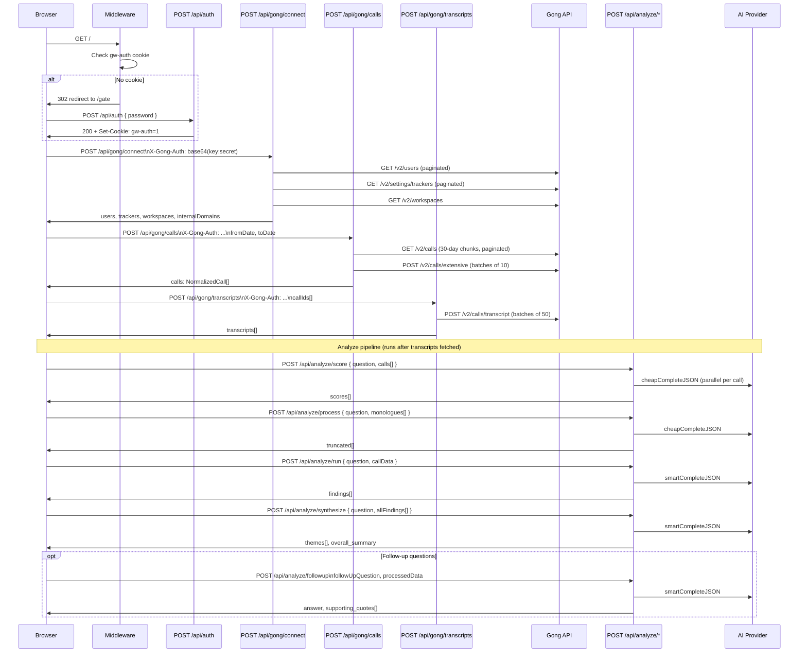

# GongWizard — API Routes

## Authentication

GongWizard uses a two-layer auth model.

### Layer 1: Site password gate (cookie)

All page routes (except `/gate`, `/api/*`, `/_next/*`, `/favicon`) are protected by `src/middleware.ts`. The middleware checks for a `gw-auth` cookie with value `"1"`. If absent, it redirects to `/gate`.

The cookie is issued by `POST /api/auth` after the user supplies the correct `SITE_PASSWORD` environment variable. It is set as `httpOnly`, `sameSite: lax`, with a 7-day `maxAge`. There is no JWT or session database — the cookie value is a plain sentinel string.

API routes are explicitly excluded from the middleware check (`pathname.startsWith('/api/')`). They enforce their own credential requirements via the `X-Gong-Auth` header.

### Layer 2: Gong API credentials (request header)

All three Gong proxy routes (`/api/gong/connect`, `/api/gong/calls`, `/api/gong/transcripts`) require a `X-Gong-Auth` header. Its value is the Base64 encoding of `accessKey:secretKey` — identical to an HTTP Basic auth credential string, but passed as a custom header. The proxy forwards it verbatim as `Authorization: Basic <value>` on every Gong API request.

Credentials are never stored server-side. The client creates the header in the browser from user-supplied keys and holds it in `sessionStorage` under the key `gongwizard_session`. The session is cleared when the tab closes.

The analyze routes (`/api/analyze/*`) do not require `X-Gong-Auth`. They call internal AI providers and receive already-processed call data in the request body.

---

## Route Summary Table

### Auth

| Method | Path | Auth Required | Purpose | Response Type |
|--------|------|---------------|---------|---------------|
| POST | `/api/auth` | None | Validate site password; issue `gw-auth` cookie | `{ ok: true }` |

### Gong Proxy

| Method | Path | Auth Required | Purpose | Response Type |
|--------|------|---------------|---------|---------------|
| POST | `/api/gong/calls` | `X-Gong-Auth` | Fetch calls by date range with full extensive metadata | `{ calls: NormalizedCall[] }` |
| POST | `/api/gong/connect` | `X-Gong-Auth` | Validate Gong credentials; fetch users, trackers, workspaces | `{ users, trackers, workspaces, internalDomains, baseUrl }` |
| POST | `/api/gong/transcripts` | `X-Gong-Auth` | Fetch transcript monologues for a list of call IDs | `{ transcripts: { callId, transcript[] }[] }` |

### Analyze (AI)

| Method | Path | Auth Required | Purpose | Response Type |
|--------|------|---------------|---------|---------------|
| POST | `/api/analyze/followup` | None | Answer a follow-up question against processed call data | `{ answer, supporting_quotes[], calls_referenced[] }` |
| POST | `/api/analyze/process` | None | Smart-truncate call monologues to retain question-relevant content | `{ truncated: { index, kept }[] }` |
| POST | `/api/analyze/run` | None | Extract findings from a formatted transcript excerpt | `{ findings: Finding[] }` |
| POST | `/api/analyze/score` | None | Score calls for relevance to a research question | `{ scores: CallScore[] }` |
| POST | `/api/analyze/synthesize` | None | Synthesize cross-call themes from aggregated findings | `{ themes: Theme[], overall_summary }` |

---

## Per-Route Detail

### `POST /api/auth`

**File:** `src/app/api/auth/route.ts`

**Auth:** None. This is the route that issues auth.

**Request body:**
```json
{ "password": "string" }
```

**Success response (200):**
```json
{ "ok": true }
```
Sets cookie: `gw-auth=1; HttpOnly; SameSite=Lax; Max-Age=604800; Path=/`

**Error responses:**

| Status | Body |
|--------|------|
| 401 | `{ "error": "Incorrect password." }` |
| 500 | `{ "error": "Server misconfigured" }` (when `SITE_PASSWORD` env var is missing) |

**Notable behavior:** If `request.json()` fails to parse, `password` will be `undefined` and the 401 path is taken. The cookie `maxAge` is exactly `60 * 60 * 24 * 7` = 604800 seconds (7 days).

---

### `POST /api/gong/connect`

**File:** `src/app/api/gong/connect/route.ts`

**Auth:** `X-Gong-Auth: <base64(accessKey:secretKey)>` required. Returns 401 if absent or if Gong rejects the credentials.

**Request body:**
```json
{
  "baseUrl": "https://api.gong.io"
}
```
`baseUrl` is optional. Defaults to `https://api.gong.io`. Trailing slashes are stripped.

**Success response (200):**
```typescript
{
  users: GongUser[];           // All users fetched from /v2/users (paginated)
  trackers: GongTracker[];     // All trackers from /v2/settings/trackers (paginated)
  workspaces: GongWorkspace[]; // From /v2/workspaces
  internalDomains: string[];   // Email domains extracted from user records
  baseUrl: string;             // Normalized base URL used for the requests
  warnings?: string[];         // Non-fatal fetch failures (e.g., trackers unavailable)
}
```

**Error responses:**

| Status | Body |
|--------|------|
| 401 | `{ "error": "Missing credentials" }` (no header) |
| 401 | `{ "error": "Invalid API credentials" }` (Gong 401) |
| 500 | `{ "error": "Internal server error" }` |

**Notable behavior:**
- Fetches users, trackers, and workspaces in parallel via `Promise.allSettled`. Partial failures are tolerated — missing trackers or users produce a `warnings` array rather than a hard error.
- If the users fetch fails with 401, the route returns 401 immediately (credential check).
- `internalDomains` is derived by extracting the domain portion of every `emailAddress` in the users list. This is used client-side for speaker classification (internal vs. external).
- Rate limit: 350ms sleep between paginated requests (`GONG_RATE_LIMIT_MS`).

---

### `POST /api/gong/calls`

**File:** `src/app/api/gong/calls/route.ts`

**Auth:** `X-Gong-Auth` required.

**Request body:**
```typescript
{
  fromDate: string;      // ISO 8601 datetime, required
  toDate: string;        // ISO 8601 datetime, required
  baseUrl?: string;      // Default: "https://api.gong.io"
  workspaceId?: string;  // Optional Gong workspace filter
}
```

**Success response (200):**
```typescript
{
  calls: NormalizedCall[];
}
```

`NormalizedCall` shape (output of `normalizeExtensiveCall`):
```typescript
{
  id: string;
  title: string;
  started: string;           // ISO datetime
  duration: number;          // seconds
  url?: string;
  direction?: string;
  parties: any[];
  topics: string[];
  trackers: Array<{
    name?: string;
    occurrences: Array<{ startTimeMs: number; [key: string]: any }>;
    [key: string]: any;
  }>;
  brief: string;
  keyPoints: string[];
  actionItems: string[];
  outline: Array<{
    name: string;
    startTimeMs: number;
    durationMs: number;
    items: Array<{ text: string; startTimeMs: number; durationMs: number }>;
  }>;
  questions: any[];
  interactionStats: any | null;
  context: any[];
  accountName: string;
  accountIndustry: string;
  accountWebsite: string;
}
```

**Error responses:**

| Status | Body |
|--------|------|
| 400 | `{ "error": "fromDate and toDate are required" }` |
| 400 | `{ "error": "Date range exceeds maximum of 365 days" }` |
| 401 | `{ "error": "Missing credentials" }` |
| 401 | `{ "error": "Invalid API credentials" }` |
| 500 | `{ "error": "Internal server error" }` |

**Notable behavior:**
- Maximum date range: 365 days (`MAX_DATE_RANGE_DAYS`). Enforced before any Gong requests.
- The range is split into 30-day chunks (`CHUNK_DAYS = 30`) to avoid Gong API pagination limits. Chunks are fetched sequentially with 350ms delays between each.
- Duplicate call IDs across chunk boundaries are deduplicated via a `Set`.
- Extensive metadata is fetched in batches of 10 (`EXTENSIVE_BATCH_SIZE`) via `POST /v2/calls/extensive`. If that endpoint returns 403 (insufficient API scope), the route falls back to basic call data with empty `parties`, `topics`, `trackers`, `brief`, and `outline`.
- `normalizeExtensiveCall` converts Gong's nested `metaData`/`content`/`interaction` structure into a flat shape. `startTime` (seconds) is converted to `startTimeMs` (milliseconds) for outline and tracker occurrence fields.
- CRM fields (`accountName`, `accountIndustry`, `accountWebsite`) are extracted from the nested `context.objects.fields` array via `extractFieldValues`, filtering by `objectType = "Account"`.
- Retry logic: up to 5 attempts (`MAX_RETRIES`) per request. 429 responses respect the `Retry-After` header; other errors use exponential backoff capped at 30s.

---

### `POST /api/gong/transcripts`

**File:** `src/app/api/gong/transcripts/route.ts`

**Auth:** `X-Gong-Auth` required.

**Request body:**
```typescript
{
  callIds: string[];   // Required. Array of Gong call IDs.
  baseUrl?: string;    // Default: "https://api.gong.io"
}
```

**Success response (200):**
```typescript
{
  transcripts: Array<{
    callId: string;
    transcript: Array<{
      speakerId: string;
      sentences: Array<{
        start: number;  // ms from call start
        end: number;
        text: string;
      }>;
    }>;
  }>;
}
```
The `transcript` array shape mirrors the Gong `callTranscripts[].transcript` monologue structure from `/v2/calls/transcript`.

**Error responses:**

| Status | Body |
|--------|------|
| 400 | `{ "error": "callIds array is required" }` |
| 401 | `{ "error": "Missing credentials" }` |
| 401 | `{ "error": "Invalid API credentials" }` |
| 500 | `{ "error": "Internal server error" }` |

**Notable behavior:**
- Batch size: 50 call IDs per request to Gong (`TRANSCRIPT_BATCH_SIZE`).
- Batches are processed sequentially with 350ms delays between each.
- Monologues for a given `callId` are aggregated across paginated responses — if Gong paginates within a batch, all pages are fetched and merged into `transcriptMap[callId]`.
- Response is built by iterating `Object.entries(transcriptMap)` and flattening to an array of `{ callId, transcript }`.

---

### `POST /api/analyze/score`

**File:** `src/app/api/analyze/score/route.ts`

**Auth:** None.

**Request body:**
```typescript
{
  question: string;
  calls: Array<{
    id: string;
    title?: string;
    brief?: string;
    keyPoints?: string[];
    outline?: Array<{ name: string }>;
    trackers?: Array<{ name?: string } | string>;
    topics?: string[];
    talkRatio?: number;
  }>;
}
```

**Success response (200):**
```typescript
{
  scores: Array<{
    callId: string;
    score: number;             // 0–10, clamped
    reason: string;            // one-sentence explanation
    relevantSections: string[];
  }>;
}
```

**Error responses:**

| Status | Body |
|--------|------|
| 400 | `{ "error": "question and calls[] are required" }` |
| 500 | `{ "error": "<message>" }` |

**Notable behavior:**
- All calls are scored in parallel via `Promise.all`.
- Uses `cheapCompleteJSON`, `temperature: 0.2`, `maxTokens: 256`.
- If scoring fails for an individual call, it defaults to `score: 5` (neutral) with a fallback reason rather than failing the whole request. `relevantSections` falls back to all outline section names.
- Score is clamped to [0, 10] via `Math.max(0, Math.min(10, result.score))`.

---

### `POST /api/analyze/process`

**File:** `src/app/api/analyze/process/route.ts`

**Auth:** None.

**Request body:**
```typescript
{
  question: string;
  monologues: any[];  // Transcript monologue objects for a single call
}
```

**Success response (200):**
```typescript
{
  truncated: Array<{
    index: number;
    kept: string;   // Retained excerpt relevant to the question
  }>;
}
```

**Error responses:**

| Status | Body |
|--------|------|
| 400 | `{ "error": "question and monologues[] are required" }` |
| 500 | `{ "error": "<message>" }` |

**Notable behavior:**
- Builds prompt via `buildSmartTruncationPrompt` from `src/lib/transcript-surgery.ts`. All monologues for a single call are batched into one prompt.
- Uses `cheapCompleteJSON`, `temperature: 0.2`, `maxTokens: 2048`.
- Purpose is to reduce transcript volume before passing to the more expensive `analyze/run` step — filters out monologues irrelevant to the research question.

---

### `POST /api/analyze/run`

**File:** `src/app/api/analyze/run/route.ts`

**Auth:** None.

**Request body:**
```typescript
{
  question: string;
  callData: string;  // Formatted transcript excerpt string from formatExcerptsForAnalysis
}
```

**Success response (200):**
```typescript
{
  findings: Array<{
    exact_quote: string;
    timestamp: string;
    context: string;
    significance: "high" | "medium" | "low";
    finding_type: "objection" | "need" | "competitive" | "question" | "feedback";
  }>;
}
```

**Error responses:**

| Status | Body |
|--------|------|
| 400 | `{ "error": "question and callData required" }` |
| 500 | `{ "error": "<message>" }` |

**Notable behavior:**
- This route uses `new Response(...)` rather than `NextResponse.json(...)` for both success and error paths — the only route in the codebase to do so.
- Uses `smartCompleteJSON` (higher-quality model), `temperature: 0.3`, `maxTokens: 4096`.
- System prompt instructs the model to use verbatim quotes only — no paraphrasing.
- Returns `findings: []` when the model finds no relevant evidence in the transcript.

---

### `POST /api/analyze/synthesize`

**File:** `src/app/api/analyze/synthesize/route.ts`

**Auth:** None.

**Request body:**
```typescript
{
  question: string;
  allFindings: Array<{
    callId: string;
    callTitle: string;
    account: string;
    findings: Array<{
      exact_quote: string;
      finding_type: string;
      significance: string;
      context: string;
    }>;
  }>;
}
```

**Success response (200):**
```typescript
{
  themes: Array<{
    theme: string;
    frequency: number;
    representative_quotes: string[];
    call_ids: string[];
  }>;
  overall_summary: string;
}
```

If `allFindings` contains no entries with non-empty `findings` arrays, returns early with:
```json
{
  "themes": [],
  "overall_summary": "No relevant findings were identified across the analyzed calls."
}
```

**Error responses:**

| Status | Body |
|--------|------|
| 400 | `{ "error": "question and allFindings[] are required" }` |
| 500 | `{ "error": "<message>" }` |

**Notable behavior:**
- Uses `smartCompleteJSON`, `temperature: 0.3`, `maxTokens: 4096`.
- Input is pre-formatted server-side into a human-readable text block before prompting; the model receives a formatted string, not raw JSON.
- Designed as the final step of the multi-stage analyze pipeline: score → process → run → synthesize.

---

### `POST /api/analyze/followup`

**File:** `src/app/api/analyze/followup/route.ts`

**Auth:** None.

**Request body:**
```typescript
{
  question?: string;           // Original research question (optional context)
  followUpQuestion: string;    // Required
  processedData: string;       // Required — pre-processed transcript text
  previousFindings?: object;   // Optional — findings from prior analyze/run calls
}
```

**Success response (200):**
```typescript
{
  answer: string;
  supporting_quotes: Array<{
    quote: string;
    call: string;
    timestamp: string;
  }>;
  calls_referenced: string[];
}
```

**Error responses:**

| Status | Body |
|--------|------|
| 400 | `{ "error": "followUpQuestion and processedData are required" }` |
| 500 | `{ "error": "<message>" }` |

**Notable behavior:**
- Uses `smartCompleteJSON`, `temperature: 0.3`, `maxTokens: 4096`.
- `previousFindings` is serialized to JSON and included in the prompt when present, enabling conversational follow-up within a research session.
- System prompt frames the model as a "sales research assistant" restricted to citing only the provided data.

---

## Middleware

**File:** `src/middleware.ts`

```typescript
export const config = {
  matcher: ['/((?!_next/static|_next/image|favicon.ico).*)'],
};
```

The middleware runs on all matched paths. Logic:

1. Path starts with `/gate`, `/api/`, or `/_next/` — pass through unconditionally.
2. Cookie `gw-auth` equals `"1"` — pass through.
3. Otherwise — redirect to `/gate`.

API routes have no cookie-based protection. The Gong proxy routes enforce credentials via `X-Gong-Auth`. The analyze routes have no authentication of any kind.

---

## AI Provider Routing

The analyze routes use two internal helpers from `src/lib/ai-providers.ts`:

- `cheapCompleteJSON` — used by `score` and `process`. Lower-cost model, fast, small output. Temperature 0.2.
- `smartCompleteJSON` — used by `run`, `synthesize`, and `followup`. Higher-quality model for nuanced extraction and synthesis. Temperature 0.3.

Neither function is exposed as an HTTP endpoint. They are called server-side within the route handlers.

---

## Request Flow Diagram


