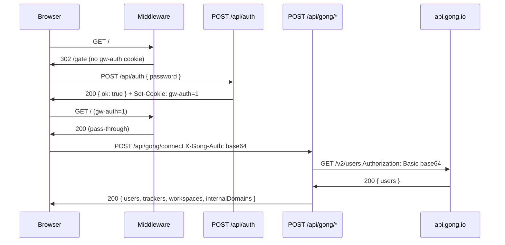

# API Routes

## Route Summary Table

| Method | Path | Auth Required | Purpose | Response Type |
|--------|------|---------------|---------|---------------|
| POST | `/api/auth` | None (public) | Validate site password; issue `gw-auth` session cookie | `{ ok: true }` |
| POST | `/api/gong/calls` | `gw-auth` cookie + `X-Gong-Auth` header | Fetch paginated call list and extensive call metadata for a date range | `{ calls: NormalizedCall[] }` |
| POST | `/api/gong/connect` | `gw-auth` cookie + `X-Gong-Auth` header | Verify Gong credentials; fetch users, trackers, workspaces, derive internal domains | `{ users, trackers, workspaces, internalDomains, baseUrl, warnings? }` |
| POST | `/api/gong/transcripts` | `gw-auth` cookie + `X-Gong-Auth` header | Fetch transcript monologues for a batch of call IDs | `{ transcripts: { callId, transcript }[] }` |

Routes are grouped by feature area below.

---

## Authentication

GongWizard uses a two-layer auth model with no database.

### Layer 1 — Site password gate

Every page request (except `/gate`, `/api/*`, `/_next/*`, and `/favicon`) passes through `src/middleware.ts`. The middleware checks for a `gw-auth` cookie with value `"1"`. If absent, the request is redirected to `/gate`.

The `gw-auth` cookie is issued by `POST /api/auth` after the user submits the correct `SITE_PASSWORD` environment variable. The cookie is `httpOnly`, `sameSite: lax`, and expires after 7 days (604800 seconds).

API routes (`/api/*`) are explicitly excluded from the middleware check — they rely on Layer 2 instead.

### Layer 2 — Gong API credentials via `X-Gong-Auth` header

All three Gong proxy routes (`/api/gong/connect`, `/api/gong/calls`, `/api/gong/transcripts`) require the `X-Gong-Auth` request header. The value is a Base64-encoded `accessKey:secretKey` string, produced in the browser via `btoa(`${accessKey}:${secretKey}`)`. The server forwards it as `Authorization: Basic <value>` on every upstream Gong API call via `makeGongFetch` in `src/lib/gong-api.ts`.

Credentials are never stored server-side. The browser holds them in `sessionStorage` under the key `gongwizard_session`, which is cleared when the tab closes.



---

## Per-Route Detail

### POST `/api/auth`

**File:** `src/app/api/auth/route.ts`

**Auth required:** None. This is the endpoint that issues auth.

**Handler:** `POST(request: Request)`

**Request body:**

```typescript
{ password: string }
```

**Success response — 200:**

```typescript
{ ok: true }
```

Sets cookie: `gw-auth=1; HttpOnly; Max-Age=604800; Path=/; SameSite=Lax`

**Error responses:**

| Status | Body | Condition |
|--------|------|-----------|
| 401 | `{ error: "Incorrect password." }` | Password does not match `SITE_PASSWORD` |
| 500 | `{ error: "Server misconfigured" }` | `SITE_PASSWORD` env var is not set |

**Notable behavior:**

- Malformed JSON bodies are silently coerced to `{}` via `.catch(() => ({}))`, which produces a 401 rather than a parse error.
- No rate limiting is implemented at the route level.
- The middleware explicitly passes all `/api/` paths through without the cookie check, so this route is always reachable regardless of auth state.

---

### POST `/api/gong/connect`

**File:** `src/app/api/gong/connect/route.ts`

**Auth required:** `X-Gong-Auth` header (Base64 `accessKey:secretKey`).

**Handler:** `POST(request: NextRequest)`

**Request body:**

```typescript
{
  baseUrl?: string  // Default: "https://api.gong.io". Trailing slashes stripped.
}
```

Empty body `{}` is valid.

**What it does:**

Calls three Gong API endpoints in parallel via `Promise.allSettled`:

1. `GET /v2/users` (paginated) — fetches all workspace users
2. `GET /v2/settings/trackers` (paginated) — fetches company keyword trackers
3. `GET /v2/workspaces` — fetches workspace list (single request, not paginated)

From the users list, it extracts all unique email domains into `internalDomains`. The browser uses this array to classify call participants as internal or external speakers.

Pagination is handled by the local `fetchAllPages` helper, which follows `records.cursor` until exhausted, sleeping `GONG_RATE_LIMIT_MS` (350 ms) between pages.

**Success response — 200:**

```typescript
{
  users: object[],             // All users in the workspace (Gong /v2/users shape)
  trackers: object[],          // Company keyword trackers (Gong /v2/settings/trackers shape)
  workspaces: object[],        // Available workspaces (Gong /v2/workspaces shape)
  internalDomains: string[],   // Unique email domains derived from users[].emailAddress
  baseUrl: string,             // Normalized base URL used for this session
  warnings?: string[]          // Present only if users or trackers fetch failed non-fatally
}
```

**Error responses:**

| Status | Body | Condition |
|--------|------|-----------|
| 401 | `{ error: "Missing credentials" }` | `X-Gong-Auth` header absent |
| 401 | `{ error: "Invalid API credentials" }` | Gong returns 401 on `/v2/users` |
| 4xx/500 | `{ error: "Gong API error (<status>): <message>" }` | Other Gong API errors via `handleGongError` |
| 500 | `{ error: "Internal server error" }` | Unexpected non-`GongApiError` exception |

**Notable behavior:**

- Uses `Promise.allSettled` so a failed trackers or workspaces fetch does not fail the whole request. A degraded 200 with `warnings` is returned instead.
- A 401 from Gong on `/v2/users` is treated as a hard failure (credentials invalid). 401s on trackers/workspaces are swallowed into the `warnings` array.
- The `baseUrl` field in the response is the normalized value actually used (trailing slashes removed), so the browser can store and reuse it exactly.

---

### POST `/api/gong/calls`

**File:** `src/app/api/gong/calls/route.ts`

**Auth required:** `X-Gong-Auth` header.

**Handler:** `POST(request: NextRequest)`

**Request body:**

```typescript
{
  fromDate: string,       // ISO 8601 datetime e.g. "2024-01-01T00:00:00Z"
  toDate: string,         // ISO 8601 datetime e.g. "2024-03-01T23:59:59Z"
  baseUrl?: string,       // Default: "https://api.gong.io"
  workspaceId?: string    // Optional Gong workspace ID filter
}
```

`fromDate` and `toDate` are required. Returns 400 if either is missing.

**What it does:**

Executes a two-step pipeline:

**Step 1** — Paginated `GET /v2/calls?fromDateTime=...&toDateTime=...` to collect all call IDs in the date range. Respects optional `workspaceId` filter. Follows `records.cursor` pagination with 350 ms inter-page delay.

**Step 2** — Batched `POST /v2/calls/extensive` in groups of `EXTENSIVE_BATCH_SIZE` (10). Each batch requests:
- `exposedFields.parties: true`
- `exposedFields.content.topics: true`
- `exposedFields.content.trackers: true`
- `exposedFields.content.brief: true`
- `exposedFields.content.keyPoints: true`
- `exposedFields.content.actionItems: true`
- `exposedFields.content.outline: true`
- `exposedFields.content.structure: true`
- `context: "Extended"` (CRM data)

If Step 2 returns a 403 (insufficient API scope), `extensiveFailed` is set and the route falls back to the basic call data from Step 1 with empty enriched fields.

All calls are normalized to a consistent shape by `normalizeExtensiveCall` before returning. CRM fields (`accountName`, `accountIndustry`, `accountWebsite`) are extracted from the nested `context[].objects[].fields[]` structure by `extractFieldValues`.

**Success response — 200:**

```typescript
{
  calls: Array<{
    id: string,
    title: string,
    started: string,              // ISO datetime
    duration: number,             // seconds
    url?: string,                 // Gong call recording URL
    direction?: string,           // "Inbound" | "Outbound" | "Conference" | "Unknown"
    parties: object[],            // Call participants; empty on 403 fallback
    topics: string[],             // Gong AI-detected topics; empty on 403 fallback
    trackers: object[],           // Matched company trackers; empty on 403 fallback
    brief: string,                // Gong AI summary; empty on 403 fallback
    keyPoints: string[],
    actionItems: string[],
    interactionStats: object | null,
    context: object[],            // Raw CRM context objects
    accountName: string,          // Extracted Account.name from context
    accountIndustry: string,      // Extracted Account.industry from context
    accountWebsite: string,       // Extracted Account.website from context
  }>
}
```

If no calls exist for the date range, returns `{ calls: [] }` immediately (Step 2 is skipped entirely).

**Error responses:**

| Status | Body | Condition |
|--------|------|-----------|
| 400 | `{ error: "fromDate and toDate are required" }` | Missing required body fields |
| 401 | `{ error: "Missing credentials" }` | `X-Gong-Auth` header absent |
| 401 | `{ error: "Invalid API credentials" }` | Gong returns 401 |
| 4xx/500 | `{ error: "Gong API error (<status>): <message>" }` | Other Gong errors via `handleGongError` |
| 500 | `{ error: "Internal server error" }` | Unexpected exception |

**Notable behavior:**

- Rate limiting: 350 ms (`GONG_RATE_LIMIT_MS`) between every paginated page and between every extensive batch.
- `EXTENSIVE_BATCH_SIZE = 10` is a hard Gong API limit for `/v2/calls/extensive`.
- On 403 from extensive, the route logs `console.warn` and returns degraded data rather than an error response. The browser receives a valid `calls` array but with empty enrichment fields.
- `extractFieldValues` handles both regular `fields[].value` lookups and the special `objectId` field, which lives directly on the object rather than in the fields array.

---

### POST `/api/gong/transcripts`

**File:** `src/app/api/gong/transcripts/route.ts`

**Auth required:** `X-Gong-Auth` header.

**Handler:** `POST(request: NextRequest)`

**Request body:**

```typescript
{
  callIds: string[],   // Non-empty array of Gong call IDs
  baseUrl?: string     // Default: "https://api.gong.io"
}
```

`callIds` must be a non-empty array. Returns 400 if missing, not an array, or empty.

**What it does:**

Fetches transcript monologues for the given call IDs by calling `POST /v2/calls/transcript` in batches of `TRANSCRIPT_BATCH_SIZE` (50). Each batch may be paginated; `records.cursor` is followed until exhausted.

The request body sent to Gong is:
```typescript
{
  filter: { callIds: string[] },  // up to 50 IDs
  cursor?: string                  // present only when paginating
}
```

Monologues from all pages are accumulated into `transcriptMap: Record<string, any[]>` keyed by `callId`. The final response flattens this into an array of `{ callId, transcript }` objects.

**Success response — 200:**

```typescript
{
  transcripts: Array<{
    callId: string,
    transcript: object[]  // Array of Gong monologue objects from /v2/calls/transcript
                          // Each monologue contains speakerId and sentences with text + start time
  }>
}
```

Calls with no transcript data will not appear in the `transcripts` array.

**Error responses:**

| Status | Body | Condition |
|--------|------|-----------|
| 400 | `{ error: "callIds array is required" }` | Missing, non-array, or empty `callIds` |
| 401 | `{ error: "Missing credentials" }` | `X-Gong-Auth` header absent |
| 401 | `{ error: "Invalid API credentials" }` | Gong returns 401 |
| 4xx/500 | `{ error: "Gong API error (<status>): <message>" }` | Other Gong errors |
| 500 | `{ error: "Internal server error" }` | Unexpected exception |

**Notable behavior:**

- Rate limiting: 350 ms between pages within a batch, and 350 ms between batches.
- `TRANSCRIPT_BATCH_SIZE = 50` is a hard Gong API limit for `/v2/calls/transcript`.
- Multiple pages of results for the same batch are merged: `transcriptMap[id].push(...monologues)` appends monologues rather than replacing them.
- Calls absent from `transcriptMap` after all batches are simply omitted from the response rather than included as empty entries.

---

## Shared Library: `src/lib/gong-api.ts`

All three Gong proxy routes import from this module.

**`GongApiError`** — extends `Error` with `status: number` and `endpoint: string`. Thrown by `makeGongFetch` when Gong returns a non-2xx response.

**`makeGongFetch(baseUrl, authHeader)`** — factory that returns a `gongFetch(endpoint, options?)` function. Every request automatically sets `Authorization: Basic <authHeader>` and `Content-Type: application/json`. Non-2xx responses throw `GongApiError`.

**`handleGongError(error)`** — converts `GongApiError` and unknown errors into `NextResponse` with appropriate HTTP status. 401 from Gong → 401, other 4xx → passthrough, everything else → 500.

**`sleep(ms)`** — `Promise`-based delay used between rate-limited requests.

**Constants:**

| Name | Value | Purpose |
|------|-------|---------|
| `GONG_RATE_LIMIT_MS` | `350` | Milliseconds to sleep between paginated Gong requests |
| `EXTENSIVE_BATCH_SIZE` | `10` | Max call IDs per `/v2/calls/extensive` request |
| `TRANSCRIPT_BATCH_SIZE` | `50` | Max call IDs per `/v2/calls/transcript` request |
