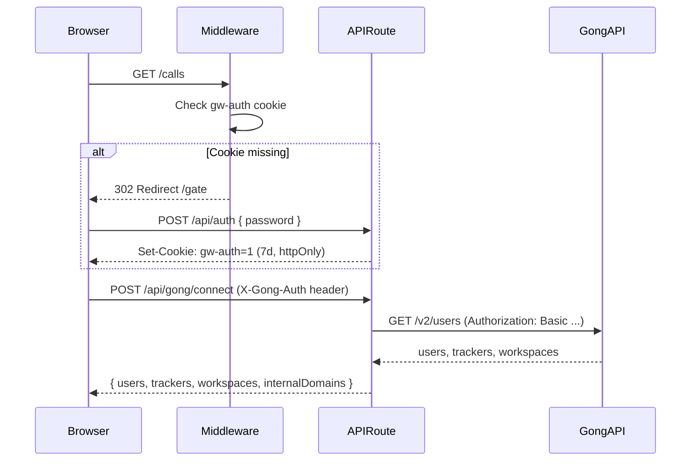
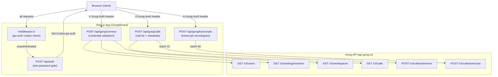

# GongWizard API Route Documentation

## Route Summary Table

| Method | Path | Auth Required | Purpose | Response Type |
|--------|------|--------------|---------|--------------|
| POST | `/api/auth` | None | Verify site password, set session cookie | `{ ok: true }` or `{ error: string }` |
| POST | `/api/gong/calls` | `gw-auth` cookie + `X-Gong-Auth` header | Fetch and normalize calls for a date range | `{ calls: NormalizedCall[] }` |
| POST | `/api/gong/connect` | `gw-auth` cookie + `X-Gong-Auth` header | Validate Gong credentials, fetch users/trackers/workspaces | `{ users, trackers, workspaces, internalDomains, baseUrl, warnings? }` |
| POST | `/api/gong/transcripts` | `gw-auth` cookie + `X-Gong-Auth` header | Fetch transcript monologues for a list of call IDs | `{ transcripts: { callId: string, transcript: any[] }[] }` |

---

## Authentication

### How Auth Works

GongWizard uses two separate auth layers:

**1. Site Password (gw-auth cookie)**

All non-API, non-gate routes are protected by the middleware at `src/middleware.ts`. On every request, the middleware checks for the `gw-auth` cookie with value `"1"`. If absent, the request is redirected to `/gate`.

The `/gate` page calls `POST /api/auth` with a password. If the password matches the `SITE_PASSWORD` environment variable, the server sets an `httpOnly` cookie named `gw-auth` with a 7-day TTL.

Paths that bypass the middleware check:
- `/gate` (the login page itself)
- `/api/*` (all API routes — they handle their own auth)
- `/_next/*` (Next.js internals)
- `/favicon*`

**2. Gong API Credentials (X-Gong-Auth header)**

All three Gong proxy routes require the client to send a `X-Gong-Auth` header containing a Base64-encoded `accessKey:secretKey` string. The server forwards this directly as `Authorization: Basic <value>` to the Gong API. Credentials are never stored server-side — this is a stateless proxy pattern.



---

## Per-Route Detail

### POST /api/auth

**File:** `src/app/api/auth/route.ts`

**Authentication:** None required.

**Purpose:** Validates the site-wide password and establishes a browser session by setting the `gw-auth` cookie. Called by the `GatePage` component (`src/app/gate/page.tsx`).

**Request Body:**

```typescript
{
  password: string;
}
```

**Response — Success (200):**

```json
{ "ok": true }
```

Sets cookie: `gw-auth=1; HttpOnly; Max-Age=604800; Path=/; SameSite=lax`

**Response — Error (401):**

```json
{ "error": "Incorrect password." }
```

**Notable Behavior:**
- Password is compared directly against the `SITE_PASSWORD` environment variable (plain string equality).
- The cookie is `httpOnly`, so it cannot be read by JavaScript.
- `maxAge` is `60 * 60 * 24 * 7` = 604800 seconds (7 days).
- No rate limiting is implemented on this route.

---

### POST /api/gong/calls

**File:** `src/app/api/gong/calls/route.ts`

**Authentication:** `X-Gong-Auth` header required (Base64 Gong credentials).

**Purpose:** Fetches calls for a given date range. Internally calls Gong's `GET /v2/calls` to enumerate call IDs, then fetches full metadata from `POST /v2/calls/extensive` in batches of 10. Falls back to basic call data if the extensive endpoint returns 403.

**Request Body:**

```typescript
{
  fromDate: string;    // ISO 8601 datetime, e.g. "2024-01-01T00:00:00Z"
  toDate: string;      // ISO 8601 datetime, e.g. "2024-01-31T23:59:59Z"
  baseUrl?: string;    // Gong API base URL, defaults to "https://api.gong.io"
  workspaceId?: string; // Filter calls by Gong workspace ID
}
```

`fromDate` and `toDate` are required. Returns 400 if either is missing.

**Response — Success (200):**

```typescript
{
  calls: NormalizedCall[];
}
```

Where `NormalizedCall` is shaped as:

```typescript
{
  id: string;
  title: string;
  started: string;           // ISO datetime
  duration: number;          // seconds
  url?: string;              // Gong call URL
  direction?: string;        // "Inbound" | "Outbound" | "Conference"
  parties: any[];            // Speaker/participant records from Gong
  topics: string[];          // Topic names from call content
  trackers: any[];           // Tracker hits from call content
  brief: string;             // AI-generated brief
  keyPoints: string[];       // Extracted key points (text only)
  actionItems: string[];     // Extracted action items (snippet only)
  interactionStats: any | null; // Interaction/talk-time stats
  context: any[];            // Raw Gong context objects (CRM data)
  accountName: string;       // Extracted from context.objects (Account.name)
  accountIndustry: string;   // Extracted from context.objects (Account.industry)
  accountWebsite: string;    // Extracted from context.objects (Account.website)
  metaData?: any;            // Present only in fallback (basic) mode
}
```

When `POST /v2/calls/extensive` returns 403, the response falls back to basic call shape with empty `parties`, `topics`, `trackers`, `brief`, `interactionStats`, and the raw basic call in `metaData`.

**Response — Errors:**

| Status | Body | Condition |
|--------|------|-----------|
| 400 | `{ "error": "fromDate and toDate are required" }` | Missing date params |
| 401 | `{ "error": "Missing credentials" }` | No `X-Gong-Auth` header |
| 401 | `{ "error": "Invalid API credentials" }` | Gong returns 401 |
| 4xx | `{ "error": "Gong API error (N): <message>" }` | Gong 4xx (non-401) |
| 500 | `{ "error": "Failed to fetch calls from Gong" }` | Network or unexpected error |

**Notable Behavior:**
- **Two-phase fetch:** First paginates `GET /v2/calls` to get all call IDs, then batches those IDs 10 at a time into `POST /v2/calls/extensive`.
- **Pagination delay:** A 350ms sleep is inserted between paginated requests to avoid Gong rate limits.
- **Extensive content requested:** `contentSelector.exposedFields` includes `parties`, `topics`, `trackers`, `brief`, `keyPoints`, `actionItems`, `outline`, `structure`. Context is set to `'Extended'` for CRM fields.
- **CRM extraction:** `extractFieldValues()` walks `context[].objects[].fields[]` to pull `Account` object fields (name, industry, website).
- **403 fallback:** If extensive endpoint returns 403 (likely a scope/permission issue), the route gracefully falls back to the basic call list without throwing.

---

### POST /api/gong/connect

**File:** `src/app/api/gong/connect/route.ts`

**Authentication:** `X-Gong-Auth` header required (Base64 Gong credentials).

**Purpose:** Validates Gong credentials and fetches the workspace configuration data needed to initialize the app: all users (for internal domain detection), tracker definitions, and workspace list. Called once on initial connection.

**Request Body:**

```typescript
{
  baseUrl?: string;  // Gong API base URL, defaults to "https://api.gong.io"
}
```

Body is optional; an empty body is accepted.

**Response — Success (200):**

```typescript
{
  users: any[];            // All Gong users from GET /v2/users (paginated)
  trackers: any[];         // All tracker definitions from GET /v2/settings/trackers
  workspaces: any[];       // Workspace list from GET /v2/workspaces
  internalDomains: string[]; // Unique email domains extracted from users
  baseUrl: string;         // Resolved base URL used for all requests
  warnings?: string[];     // Non-fatal fetch failures (e.g., trackers unavailable)
}
```

**Response — Errors:**

| Status | Body | Condition |
|--------|------|-----------|
| 401 | `{ "error": "Missing credentials" }` | No `X-Gong-Auth` header |
| 401 | `{ "error": "Invalid API credentials" }` | Gong /v2/users returns 401 |
| 4xx | `{ "error": "Gong API error (N): <message>" }` | Gong 4xx from any endpoint |
| 500 | `{ "error": "Failed to connect to Gong" }` | Network or unexpected error |

**Notable Behavior:**
- All three Gong calls (`/v2/users`, `/v2/settings/trackers`, `/v2/workspaces`) are fired in parallel via `Promise.allSettled`, so partial failures do not abort the whole response.
- If users fetch fails with 401, that specific error is promoted to a 401 response (credential check). Other partial failures (trackers, workspaces) are reported as `warnings` strings but do not fail the request.
- `internalDomains` is derived by extracting the domain portion of each user's `emailAddress` field. These are used client-side to classify call participants as internal vs. external speakers.
- Pagination delay: 350ms between paginated pages for `/v2/users` and `/v2/settings/trackers`.

---

### POST /api/gong/transcripts

**File:** `src/app/api/gong/transcripts/route.ts`

**Authentication:** `X-Gong-Auth` header required (Base64 Gong credentials).

**Purpose:** Fetches transcript monologues for a provided list of call IDs. Batches requests to Gong's `POST /v2/calls/transcript` in groups of 50.

**Request Body:**

```typescript
{
  callIds: string[];   // Array of Gong call IDs — required, must be non-empty
  baseUrl?: string;    // Gong API base URL, defaults to "https://api.gong.io"
}
```

Returns 400 if `callIds` is missing, not an array, or empty.

**Response — Success (200):**

```typescript
{
  transcripts: Array<{
    callId: string;
    transcript: any[];  // Monologue objects from Gong's callTranscripts[].transcript
  }>;
}
```

Each monologue object in `transcript` is a raw Gong utterance record (speaker, sentences, topic, etc.) as returned by the Gong API.

**Response — Errors:**

| Status | Body | Condition |
|--------|------|-----------|
| 400 | `{ "error": "callIds array is required" }` | Missing/empty callIds |
| 401 | `{ "error": "Missing credentials" }` | No `X-Gong-Auth` header |
| 401 | `{ "error": "Invalid API credentials" }` | Gong returns 401 |
| 4xx | `{ "error": "Gong API error (N): <message>" }` | Gong 4xx (non-401) |
| 500 | `{ "error": "Failed to fetch transcripts from Gong" }` | Network or unexpected error |

**Notable Behavior:**
- **Batch size:** 50 call IDs per request to `POST /v2/calls/transcript` (Gong API limit).
- **Pagination within batches:** Each batch is also paginated via cursor. The `cursor` field is passed in the POST body (not query string) on subsequent pages.
- **Result merging:** Monologues for a given `callId` may be spread across multiple pages. The handler accumulates all monologues into a `transcriptMap` keyed by `callId` before returning.
- **Pagination delay:** 350ms between paginated pages and between batches.
- **Output shape:** The response is an array of `{ callId, transcript }` objects — not a map — for easier consumption by the UI.

---

## Data Flow Diagram


