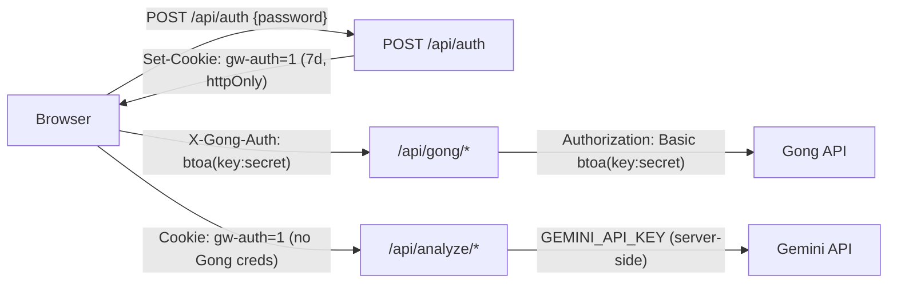
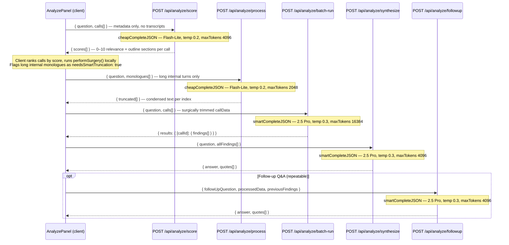

# API Routes

GongWizard exposes three categories of HTTP routes: a **site auth route**, **Gong proxy routes** that forward requests to the Gong API using client-supplied credentials, and **AI analysis routes** that run pre-processed transcript content through Gemini models.

---

## Route Summary

### Auth

| Method | Path        | Auth Required | Purpose                                        | Response Type      |
| ------ | ----------- | ------------- | ---------------------------------------------- | ------------------ |
| POST   | `/api/auth` | None          | Validate site password; issue `gw-auth` cookie | `application/json` |

### Gong Proxy

| Method | Path                    | Auth Required             | Purpose                                                 | Response Type          |
| ------ | ----------------------- | ------------------------- | ------------------------------------------------------- | ---------------------- |
| POST   | `/api/gong/calls`       | `gw-auth` + `X-Gong-Auth` | Paginated call list with extensive metadata; streaming  | `application/x-ndjson` |
| POST   | `/api/gong/connect`     | `gw-auth` + `X-Gong-Auth` | Validate credentials; fetch users, trackers, workspaces | `application/json`     |
| POST   | `/api/gong/search`      | `gw-auth` + `X-Gong-Auth` | Keyword search across transcripts; streaming            | `application/x-ndjson` |
| POST   | `/api/gong/transcripts` | `gw-auth` + `X-Gong-Auth` | Batch transcript monologue fetch                        | `application/json`     |

### AI Analysis

| Method | Path                      | Auth Required | Purpose                                                                  | Response Type      |
| ------ | ------------------------- | ------------- | ------------------------------------------------------------------------ | ------------------ |
| POST   | `/api/analyze/batch-run`  | `gw-auth`     | Multi-call finding extraction (Gemini 2.5 Pro)                           | `application/json` |
| POST   | `/api/analyze/followup`   | `gw-auth`     | Follow-up Q&A against cached evidence (Gemini 2.5 Pro)                   | `application/json` |
| POST   | `/api/analyze/process`    | `gw-auth`     | Smart truncation of long internal monologues (Gemini Flash-Lite)         | `application/json` |
| POST   | `/api/analyze/run`        | `gw-auth`     | Single-call finding extraction (Gemini 2.5 Pro)                          | `application/json` |
| POST   | `/api/analyze/score`      | `gw-auth`     | Relevance scoring of calls vs. research question (Gemini Flash-Lite)     | `application/json` |
| POST   | `/api/analyze/synthesize` | `gw-auth`     | Cross-call synthesis: direct answer + supporting quotes (Gemini 2.5 Pro) | `application/json` |

---

## Authentication

GongWizard uses a two-layer auth model.

### Layer 1 — Site password gate (`gw-auth` cookie)

`src/middleware.ts` is an Edge middleware that runs on every request matched by `/((?!_next/static|_next/image|favicon.ico).*)`.

Decision logic per request:

1. Path starts with `/gate`, `/api/auth`, or `/favicon` → pass through unconditionally.
2. Cookie `gw-auth` equals `"1"` → pass through.
3. Otherwise → `302` redirect to `/gate`.

The `gw-auth` cookie is issued by `POST /api/auth` after the user submits the correct `SITE_PASSWORD`. It is `httpOnly: true`, `sameSite: lax`, `path: /`, and expires after 7 days (`maxAge: 604800`).

Both `/api/gong/*` and `/api/analyze/*` are in the protected set — neither is in the middleware exemption list.

### Layer 2 — Gong API credentials (`X-Gong-Auth` header)

All `/api/gong/*` routes require an `X-Gong-Auth` request header. The client constructs this as `btoa("accessKey:secretKey")` and stores it in `sessionStorage` under the key `gongwizard_session` (managed by `src/lib/session.ts`). Each proxy route reads the header and forwards it as `Authorization: Basic <value>` to Gong via `makeGongFetch` from `src/lib/gong-api.ts`. Credentials are never persisted server-side and are cleared when the browser tab closes.

AI analysis routes (`/api/analyze/*`) do not require Gong credentials — they receive pre-processed call data in the request body and call Gemini using the server-side `GEMINI_API_KEY` environment variable.



---

## Per-Route Detail

---

### `POST /api/auth`

**File:** `src/app/api/auth/route.ts`

Validates the site password and issues the `gw-auth` session cookie. The only route exempt from the middleware auth check — it is the route that sets the cookie.

**Request body:**

```json
{ "password": "string" }
```

If `request.json()` throws (malformed body), `password` resolves to `undefined` and the 401 path is taken.

**Response — 200 OK:**

```json
{ "ok": true }
```

Sets `Set-Cookie: gw-auth=1; HttpOnly; SameSite=Lax; Max-Age=604800; Path=/`.

**Error responses:**

| Status | Body                                                                    |
| ------ | ----------------------------------------------------------------------- |
| 401    | `{ "error": "Incorrect password." }`                                    |
| 500    | `{ "error": "Server misconfigured" }` — `SITE_PASSWORD` env var missing |

---

### `POST /api/gong/connect`

**File:** `src/app/api/gong/connect/route.ts`

Called once on the Connect page. Validates Gong credentials and bootstraps session data. Fetches all users (paginated), all keyword trackers (paginated), and all workspaces in parallel via `Promise.allSettled`. Derives `internalDomains` from user email addresses — the sole mechanism used for internal/external speaker classification in downstream UI and export logic.

**Request headers:**

| Header        | Required | Value                         |
| ------------- | -------- | ----------------------------- |
| `X-Gong-Auth` | Yes      | `btoa("accessKey:secretKey")` |

**Request body:**

```typescript
{
  baseUrl?: string  // Optional custom Gong instance URL. Default: "https://api.gong.io". Trailing slashes stripped.
}
```

**Gong API calls made (concurrent via `Promise.allSettled`):**

- `GET /v2/users` — fully paginated; all workspace users
- `GET /v2/settings/trackers` — fully paginated; all company keyword trackers
- `GET /v2/workspaces` — single request; workspace list

**Response — 200 OK:**

```typescript
{
  users: GongUser[];           // all /v2/users pages
  trackers: SessionTracker[];  // all /v2/settings/trackers pages
  workspaces: GongWorkspace[]; // from /v2/workspaces
  internalDomains: string[];   // email domains extracted from users, e.g. ["acme.com"]
  baseUrl: string;             // echoed back, normalized
  warnings?: string[];         // present only on non-fatal partial failures
}
```

Types from `src/types/gong.ts`:

```typescript
interface GongUser {
  id: string;
  emailAddress: string;
  firstName?: string;
  lastName?: string;
  title?: string;
}

interface SessionTracker {
  id: string;
  name: string;
}

interface GongWorkspace {
  id: string;
  name: string;
}
```

**Error responses:**

| Status | Body                                                                        |
| ------ | --------------------------------------------------------------------------- |
| 401    | `{ "error": "Missing credentials" }` — `X-Gong-Auth` absent                 |
| 401    | `{ "error": "Invalid API credentials" }` — Gong returned 401 on users fetch |
| 500    | `{ "error": "Internal server error" }`                                      |

**Notable behavior:**

- Partial failures (trackers or workspaces rejected) produce `warnings` entries rather than a hard error. A 401 from the users fetch is a hard error.
- Users and trackers are cursor-paginated; 350 ms sleep (`GONG_RATE_LIMIT_MS`) between pages.
- `internalDomains` is built by splitting each `user.emailAddress` on `@` and lowercasing the domain.

---

### `POST /api/gong/calls`

**File:** `src/app/api/gong/calls/route.ts`

Fetches the full call list with extensive metadata for a date range. Executes in two steps:

1. Pages through `GET /v2/calls` across 30-day date chunks to collect call IDs — emitting `status` NDJSON events as it goes.
2. Batch-fetches `POST /v2/calls/extensive` in groups of 10 — emitting `calls` and `progress` NDJSON events per batch.

Falls back to basic call data if `/v2/calls/extensive` returns 403.

**Request headers:**

| Header        | Required | Value                         |
| ------------- | -------- | ----------------------------- |
| `X-Gong-Auth` | Yes      | `btoa("accessKey:secretKey")` |

**Request body:**

```typescript
{
  fromDate?:    string;  // ISO 8601 datetime. Default: 90 days ago.
  toDate?:      string;  // ISO 8601 datetime. Default: now.
  baseUrl?:     string;  // Default: "https://api.gong.io"
  workspaceId?: string;  // Optional Gong workspace filter on /v2/calls
}
```

**Response:** `Content-Type: application/x-ndjson` — one JSON object per newline-delimited line.

```typescript
// Emitted during ID collection and batch progress
{ type: "status"; message: string }

// Batch of normalized calls (one event per EXTENSIVE_BATCH_SIZE group)
{ type: "calls"; calls: NormalizedCall[] }

// After each extensive batch
{ type: "progress"; batch: number; totalBatches: number; callsProcessed: number; totalCalls: number }

// Terminal success
{ type: "done"; totalCalls: number }

// Terminal error
{ type: "error"; message: string }
```

`NormalizedCall` is the output of `normalizeExtensiveCall()`:

```typescript
{
  id: string;
  title: string;
  started: string;           // ISO datetime
  duration: number;          // seconds
  url?: string;
  direction?: string;
  parties: GongParty[];      // from src/types/gong.ts
  topics: string[];          // topic names
  trackers: string[];        // tracker names only (for display/filter)
  trackerData: Array<{
    name?: string;
    count?: number;
    occurrences: Array<{
      startTimeMs: number;   // converted from Gong's seconds × 1000
      speakerId?: string;
      phrase?: string;
    }>;
  }>;
  brief: string;
  keyPoints: string[];
  actionItems: string[];
  outline: Array<{           // normalized from /v2/calls/extensive content.structure
    name: string;
    startTimeMs: number;     // seconds × 1000
    durationMs: number;      // seconds × 1000
    items: Array<{ text: string; startTimeMs: number; durationMs: number }>;
  }>;
  questions: any[];
  interactionStats: InteractionStats | null;
  context: any[];            // raw Gong CRM context objects
  accountName: string;       // extracted via extractFieldValues(context, "name", "Account")
  accountIndustry: string;
  accountWebsite: string;
}
```

`GongParty` and `InteractionStats` from `src/types/gong.ts`:

```typescript
interface GongParty {
  speakerId?: string;
  name?: string;
  title?: string;
  emailAddress?: string;
  affiliation?: string; // "Internal" | "External" | "Unknown"
  userId?: string;
  methods?: string[];
}

interface InteractionStats {
  talkRatio?: number;
  longestMonologue?: number;
  interactivity?: number;
  patience?: number;
  questionRate?: number;
}
```

**Notable behavior:**

- Date range split into 30-day chunks via `buildDateChunks()`. A `GongApiError` with `status === 404` on a chunk is silently skipped (Gong returns 404 when a date window has no calls).
- Duplicate call IDs across chunk boundaries are deduplicated with `seenCallIds: Set<string>`.
- On `GongApiError` with `status === 403` from `/v2/calls/extensive`, extensive fetching stops immediately and the route emits a fallback `calls` event with basic data (`title`, `started`, `duration`; empty `parties`, `topics`, `trackers`, `brief`, `outline`, `questions`, `interactionStats: null`).
- Extensive batch size: `EXTENSIVE_BATCH_SIZE = 10`. Transcript batch size (used in other routes): `TRANSCRIPT_BATCH_SIZE = 50`.
- 350 ms delay (`GONG_RATE_LIMIT_MS`) between every paginated request and every batch.
- The `contentSelector` sent to `/v2/calls/extensive` requests: `parties`, `topics`, `trackers`, `trackerOccurrences`, `brief`, `keyPoints`, `actionItems`, `structure`, `interactionStats`, `questions`, `publicComments`, and `context: "Extended"`.

---

### `POST /api/gong/transcripts`

**File:** `src/app/api/gong/transcripts/route.ts`

Fetches full transcript monologues for a list of call IDs. Used by `useCallExport` hook before rendering any export format. Calls `POST /v2/calls/transcript` in batches of 50, handles cursor pagination within each batch, and merges all monologues per call.

**Request headers:**

| Header        | Required | Value                         |
| ------------- | -------- | ----------------------------- |
| `X-Gong-Auth` | Yes      | `btoa("accessKey:secretKey")` |

**Request body:**

```typescript
{
  callIds: string[];  // Required. Non-empty array of Gong call IDs.
  baseUrl?: string;   // Default: "https://api.gong.io"
}
```

**Response — 200 OK:**

```typescript
{
  transcripts: Array<{
    callId: string;
    transcript: TranscriptMonologue[];
  }>
}
```

Types from `src/types/gong.ts`:

```typescript
interface TranscriptMonologue {
  speakerId: string;
  sentences: TranscriptSentence[];
}

interface TranscriptSentence {
  text: string;
  start: number;   // milliseconds from call start
  end?: number;    // milliseconds from call start
}
```

**Error responses:**

| Status | Body                                                                                            |
| ------ | ----------------------------------------------------------------------------------------------- |
| 400    | `{ "error": "callIds array is required" }`                                                      |
| 401    | `{ "error": "Missing credentials" }`                                                            |
| 401    | `{ "error": "Invalid API credentials" }` — Gong returned 401                                    |
| 500    | `{ "error": "Gong API error (<status>): <message>" }` or `{ "error": "Internal server error" }` |

**Notable behavior:**

- Batch size: `TRANSCRIPT_BATCH_SIZE = 50`.
- 350 ms sleep between batches and between paginated pages within a batch.
- Monologues for a given `callId` are accumulated across all pages into `transcriptMap[callId]`.
- Calls with no transcript data are silently omitted from the response array.
- Error handling via `handleGongError(error)` from `src/lib/gong-api.ts`.

---

### `POST /api/gong/search`

**File:** `src/app/api/gong/search/route.ts`

Case-insensitive keyword substring search across transcript sentences for a set of call IDs. Fetches transcripts in batches of 50 and emits NDJSON match and progress events as each batch completes, so the UI can display results incrementally.

**Request headers:**

| Header        | Required | Value                         |
| ------------- | -------- | ----------------------------- |
| `X-Gong-Auth` | Yes      | `btoa("accessKey:secretKey")` |

**Request body:**

```typescript
{
  callIds: string[];  // Required. Silently capped to first 500.
  keyword: string;    // Required. Case-insensitive substring match on sentence text.
  baseUrl?: string;   // Default: "https://api.gong.io"
}
```

**Response:** `Content-Type: application/x-ndjson`

```typescript
// One per matching sentence
{
  type: "match";
  callId: string;
  speakerId: string;
  timestamp: string;  // "M:SS" formatted via formatTimestamp() in src/lib/format-utils.ts
  text: string;       // the matching sentence
  context: string;    // preceding sentence text, or "" if first sentence in monologue
}

// After each batch of 50 call IDs
{
  type: "progress";
  searched: number;
  total: number;
  matchCount: number;
}

// Terminal event
{
  type: "done";
  searched: number;
  matchCount: number;
}
```

**Error responses (before stream starts):**

| Status | Body                                        |
| ------ | ------------------------------------------- |
| 401    | `{ "error": "Missing auth" }`               |
| 400    | `{ "error": "Missing callIds or keyword" }` |

**Notable behavior:**

- `sentence.start` in the Gong API is in seconds; the route multiplies by 1000 before passing to `formatTimestamp`.
- Transcript batches that throw are logged (`console.error`) and skipped; the stream continues.
- A `progress` event is always emitted after each batch regardless of match count.

---

### `POST /api/analyze/score`

**File:** `src/app/api/analyze/score/route.ts`

**AI model:** `gemini-2.0-flash-lite` via `cheapCompleteJSON` from `src/lib/ai-providers.ts`.

Stage 1 of the four-stage analysis pipeline. Scores all candidate calls for relevance to a research question using call metadata only — no transcript content is sent. Identifies which calls to analyze and which outline sections to focus on.

**Request body:**

```typescript
{
  question: string;
  calls: Array<{
    id: string;
    title?: string;
    brief?: string;
    keyPoints?: string[];
    trackers?: Array<{ name?: string } | string>;
    topics?: string[];
    talkRatio?: number;              // 0–1 float (internal talk ratio)
    outline?: Array<{
      name?: string;
      items?: Array<{ text?: string }>;
    }>;
  }>;
}
```

**AI parameters:** `temperature: 0.2`, `maxTokens: 4096`.

**Response — 200 OK:**

```typescript
{
  scores: Array<{
    callId: string;
    score: number;              // 0–10, clamped via Math.max(0, Math.min(10, s.score))
    reason: string;             // one-sentence explanation
    relevantSections: string[]; // outline section names most likely to contain relevant signal
  }>
}
```

**Error responses:**

| Status | Body                                               |
| ------ | -------------------------------------------------- |
| 400    | `{ "error": "question and calls[] are required" }` |
| 500    | `{ "error": "<message>" }`                         |

**Notable behavior:**

- All calls are sent in a single prompt; results are ordered identically to the input.
- On AI failure (inner try/catch), returns fallback neutral scores (`score: 5`, `reason: "Scoring failed — included at neutral priority"`, `relevantSections` set to all outline section names) so the pipeline can continue with all calls at equal priority.

---

### `POST /api/analyze/process`

**File:** `src/app/api/analyze/process/route.ts`

**AI model:** `gemini-2.0-flash-lite` via `cheapCompleteJSON` from `src/lib/ai-providers.ts`.

Stage 2 sub-step. Compresses long internal rep monologues flagged by `performSurgery()` in `src/lib/transcript-surgery.ts` (those with `needsSmartTruncation: true`) down to sentences relevant to the research question. The prompt is built by `buildSmartTruncationPrompt(question, monologues)`. All long monologues for a single call are batched into one AI request.

**Request body:**

```typescript
{
  question: string;
  monologues: Array<{
    index: number;  // index into SurgeryResult.excerpts[] — echoed back for caller correlation
    text: string;   // full monologue text
  }>;
}
```

**AI parameters:** `temperature: 0.2`, `maxTokens: 2048`.

**Response — 200 OK:**

```typescript
{
  truncated: Array<{
    index: number;  // echoed from input
    kept: string;   // retained sentences, or "[context omitted]"
  }>
}
```

**Error responses:**

| Status | Body                                                    |
| ------ | ------------------------------------------------------- |
| 400    | `{ "error": "question and monologues[] are required" }` |
| 500    | `{ "error": "<message>" }`                              |

---

### `POST /api/analyze/run`

**File:** `src/app/api/analyze/run/route.ts`

**AI model:** `gemini-2.5-pro` via `smartCompleteJSON` from `src/lib/ai-providers.ts`.

**Vercel:** `export const maxDuration = 60`

Stage 3 (single-call path). Extracts verbatim findings exclusively from external speakers in one call's pre-processed transcript excerpts. Use for single-call analysis; use `batch-run` for multiple calls.

**Request body:**

```typescript
{
  question: string;
  callData: string;           // pre-formatted transcript text from formatExcerptsForAnalysis()
  speakerDirectory?: Array<{
    speakerId: string;
    name: string;
    jobTitle: string;
    company: string;
    isInternal: boolean;
  }>;
  callMeta?: { title: string; date: string };
}
```

**AI parameters:** `temperature: 0.3`, `maxTokens: 4096`.

**Response — 200 OK:**

```typescript
{
  findings: Array<{
    exact_quote: string;
    speaker_name: string;
    job_title: string;
    company: string;
    is_external: boolean;   // always true — only external speaker quotes returned
    timestamp: string;
    context: string;        // brief description of what prompted the statement
    significance: "high" | "medium" | "low";
    finding_type: "objection" | "need" | "competitive" | "question" | "feedback";
  }>
}
```

Returns `{ "findings": [] }` when no relevant external speaker evidence is found.

**Error responses:**

| Status | Body                                            |
| ------ | ----------------------------------------------- |
| 400    | `{ "error": "question and callData required" }` |
| 500    | `{ "error": "<message>" }`                      |

**Notable behavior:**

- Uses `new Response(JSON.stringify(result), { headers: { 'Content-Type': 'application/json' } })` for both success and error paths (not `NextResponse.json()`).
- The system prompt passed to `smartCompleteJSON` as `systemPrompt` (mapped to `systemInstruction` on the Gemini API) explicitly forbids quoting internal team members.

---

### `POST /api/analyze/batch-run`

**File:** `src/app/api/analyze/batch-run/route.ts`

**AI model:** `gemini-2.5-pro` via `smartCompleteJSON` from `src/lib/ai-providers.ts`.

**Vercel:** `export const maxDuration = 60`

Stage 3 (multi-call path). Extracts findings from multiple calls in a single AI prompt. All call sections are concatenated under `=== CALL [callId]: title | date ===` headers. A shared external speaker directory header is prepended listing all external speakers across all calls.

**Request body:**

```typescript
{
  question: string;
  calls: Array<{
    callId: string;
    callData: string;           // pre-formatted transcript excerpts
    brief: string;
    speakerDirectory: Array<{
      speakerId: string;
      name: string;
      jobTitle: string;
      company: string;
      isInternal: boolean;
    }>;
    callMeta: { title: string; date: string };
  }>;
}
```

**AI parameters:** `temperature: 0.3`, `maxTokens: 16384`.

**Response — 200 OK:**

```typescript
{
  results: {
    [callId: string]: {
      findings: Array<{
        exact_quote: string;
        speaker_name: string;
        job_title: string;
        company: string;
        is_external: boolean;
        timestamp: string;
        context: string;
        significance: "high" | "medium" | "low";
        finding_type: "objection" | "need" | "competitive" | "question" | "feedback";
      }>
    }
  }
}
```

**Error responses:**

| Status | Body                                         |
| ------ | -------------------------------------------- |
| 400    | `{ "error": "question and calls required" }` |
| 500    | `{ "error": "<message>" }`                   |

**Notable behavior:**

- Every `callId` from the input is guaranteed to appear as a key in `results`, even with an empty `findings` array.
- Uses `new Response(JSON.stringify(result), ...)` for both success and error paths.
- `maxTokens: 16384` (4× the single-call route) to accommodate multi-call output.

---

### `POST /api/analyze/synthesize`

**File:** `src/app/api/analyze/synthesize/route.ts`

**AI model:** `gemini-2.5-pro` via `smartCompleteJSON` from `src/lib/ai-providers.ts`.

**Vercel:** `export const maxDuration = 60`

Stage 4. Takes all per-call findings from `run`/`batch-run` and produces a direct 2–4 sentence answer to the research question plus curated verbatim supporting quotes with full attribution.

**Request body:**

```typescript
{
  question: string;
  allFindings: Array<{
    callId: string;
    callTitle: string;
    callDate: string;
    account: string;
    findings: Array<{
      exact_quote: string;
      speaker_name: string;
      job_title: string;
      company: string;
      is_external: boolean;
      timestamp: string;
      context: string;
      significance?: string;
      finding_type?: string;
    }>;
  }>;
}
```

**AI parameters:** `temperature: 0.3`, `maxTokens: 4096`.

**Response — 200 OK:**

```typescript
{
  answer: string;    // 2–4 sentence direct answer
  quotes: Array<{
    quote: string;
    speaker_name: string;
    job_title: string;
    company: string;
    call_title: string;
    call_date: string;
  }>
}
```

**Error responses:**

| Status | Body                                                     |
| ------ | -------------------------------------------------------- |
| 400    | `{ "error": "question and allFindings[] are required" }` |
| 500    | `{ "error": "<message>" }`                               |

**Notable behavior:**

- Filters `allFindings` to only calls with at least one `is_external === true` finding before building the prompt.
- If no external findings exist across all calls, returns without making an AI call: `{ "answer": "No relevant statements from external speakers were found in the analyzed calls.", "quotes": [] }`.
- All quotes in the response must be verbatim from the input evidence — the system prompt forbids paraphrasing.

---

### `POST /api/analyze/followup`

**File:** `src/app/api/analyze/followup/route.ts`

**AI model:** `gemini-2.5-pro` via `smartCompleteJSON` from `src/lib/ai-providers.ts`.

**Vercel:** `export const maxDuration = 60`

Answers a follow-up question against the same evidence used in synthesis — without re-fetching or re-running any Gong API calls. Enables conversational research sessions within `src/components/analyze-panel.tsx`.

**Request body:**

```typescript
{
  followUpQuestion: string;      // Required
  processedData: string;         // Required — pre-formatted evidence text (output of formatExcerptsForAnalysis from src/lib/transcript-surgery.ts)
  question?: string;             // Original research question for context
  previousFindings?: unknown;    // Prior synthesis result; JSON.stringify-ed into prompt
}
```

**AI parameters:** `temperature: 0.3`, `maxTokens: 4096`.

**Response — 200 OK:**

```typescript
{
  answer: string;
  quotes: Array<{
    quote: string;
    speaker_name: string;
    job_title: string;
    company: string;
    call_title: string;
    call_date: string;
  }>
}
```

**Error responses:**

| Status | Body                                                             |
| ------ | ---------------------------------------------------------------- |
| 400    | `{ "error": "followUpQuestion and processedData are required" }` |
| 500    | `{ "error": "<message>" }`                                       |

**Notable behavior:**

- `previousFindings` is inserted into the prompt as `JSON.stringify(previousFindings, null, 2)` when present.
- Constrained to external speaker quotes only; internal speakers are excluded by the system prompt.

---

## Middleware

**File:** `src/middleware.ts`

```typescript
export const config = {
  matcher: ['/((?!_next/static|_next/image|favicon.ico).*)'],
};
```

The middleware function reads `request.nextUrl.pathname` and `request.cookies.get('gw-auth')`. Paths starting with `/gate`, `/api/auth`, or `/favicon` bypass the check unconditionally. All other paths require `gw-auth === "1"` or are redirected to `/gate` via `NextResponse.redirect`.

---

## Shared Gong API Infrastructure

**File:** `src/lib/gong-api.ts`

All proxy routes share these constants and helpers:

| Export                               | Value / Type | Description                                 |
| ------------------------------------ | ------------ | ------------------------------------------- |
| `GONG_RATE_LIMIT_MS`                 | `350`        | ms sleep between paginated/batched requests |
| `EXTENSIVE_BATCH_SIZE`               | `10`         | max IDs per `/v2/calls/extensive` request   |
| `TRANSCRIPT_BATCH_SIZE`              | `50`         | max IDs per `/v2/calls/transcript` request  |
| `MAX_RETRIES`                        | `5`          | max retry attempts with exponential backoff |
| `makeGongFetch(baseUrl, authHeader)` | function     | Returns a fetch wrapper with retry logic    |
| `handleGongError(error)`             | function     | Maps `GongApiError` to `NextResponse`       |
| `GongApiError`                       | class        | `status: number`, `endpoint: string`        |
| `sleep(ms)`                          | function     | Promise-based delay                         |

`makeGongFetch` applies exponential backoff (`Math.min(2^attempt * 2, 30) * 1000` ms) up to `MAX_RETRIES` times for 429 and 5xx responses. 401, 403, and 404 are thrown immediately without retry as `GongApiError`.

---

## AI Provider Details

**File:** `src/lib/ai-providers.ts`

The `GoogleGenAI` client is lazy-initialized from `process.env.GEMINI_API_KEY`.

| Function            | Model                   | JSON mode                                    | Default maxTokens | Used by routes                               |
| ------------------- | ----------------------- | -------------------------------------------- | ----------------- | -------------------------------------------- |
| `cheapCompleteJSON` | `gemini-2.0-flash-lite` | Yes (`responseMimeType: 'application/json'`) | 1024              | `score`, `process`                           |
| `smartCompleteJSON` | `gemini-2.5-pro`        | Yes                                          | 8192              | `run`, `batch-run`, `synthesize`, `followup` |
| `smartStream`       | `gemini-2.5-pro`        | No                                           | 8192              | Defined; not used by any current route       |

Each route passes `temperature` and `maxTokens` overrides at call time. `smartCompleteJSON` accepts an optional `systemPrompt` string passed as `systemInstruction` to the Gemini API.

---

## Analysis Pipeline Flow

The four-stage pipeline is orchestrated client-side by `src/components/analyze-panel.tsx`:


