# GongWizard Architecture Overview

## System Overview

GongWizard is a Next.js 15 web application that acts as a stateless proxy to the Gong API, enabling users to browse, filter, and export call transcripts in formats optimized for LLM analysis (Markdown, XML, JSONL, summary CSV, utterance-level CSV). The system uses a two-layer auth model: a site-level password gate (`gw-auth` httpOnly cookie, enforced by Edge Middleware on every request) followed by user-supplied Gong API credentials stored only in browser `sessionStorage` for the tab's lifetime. No database exists — every request that needs Gong data passes credentials via the `X-Gong-Auth` request header, and server-side route handlers forward them as HTTP Basic auth to Gong's REST API.

The application has two distinct functional areas. The first is the call browser and export pipeline: users connect their Gong credentials on the home page, browse up to 365 days of calls on `/calls` with text/tracker/topic/duration/talk-ratio filters, select calls, and trigger client-side export rendering into one of five output formats. All export business logic runs in the browser — speaker classification, turn grouping, monologue condensing, token estimation, tracker alignment, and format rendering live in `src/hooks/useCallExport.ts` and `src/lib/transcript-formatter.ts`. The second is the AI-powered research pipeline: the `AnalyzePanel` component orchestrates a four-stage sequence (relevance scoring via Gemini Flash-Lite → surgical transcript extraction → finding extraction via Gemini 2.5 Pro → cross-call synthesis + follow-up Q&A) across selected calls, with all AI calls routed through dedicated `/api/analyze/*` server-side route handlers.

The server component is thin and stateless: route handlers in `src/app/api/` either proxy Gong API calls with rate limiting (350ms delay, exponential backoff up to 5 retries) or call Google Gemini using the server-side `GEMINI_API_KEY`. Speaker classification is derived at connect time from `/v2/users` email domains — no configuration file is required. The frontend is a React 19 three-page flow (Gate → Connect → Calls) with all UI primitives sourced from shadcn/ui backed by Radix UI.

---

## Architecture Diagram

```mermaid
flowchart TD
    subgraph Browser["Browser (Client)"]
        GatePage["GatePage\nsrc/app/gate/page.tsx"]
        ConnectPage["ConnectPage\nsrc/app/page.tsx"]
        CallsPage["CallsPage\nsrc/app/calls/page.tsx"]
        AnalyzePanel["AnalyzePanel\nsrc/components/analyze-panel.tsx"]
        useCallExport["useCallExport\nsrc/hooks/useCallExport.ts"]
        useFilterState["useFilterState\nsrc/hooks/useFilterState.ts"]
        SS[(sessionStorage\ngongwizard_session)]
        LS[(localStorage\ngongwizard_filters)]
    end

    subgraph Middleware["Edge Middleware"]
        MW["src/middleware.ts\ngw-auth cookie check\n→ redirect to /gate if absent"]
    end

    subgraph ServerAPI["Next.js Route Handlers (src/app/api/)"]
        subgraph AuthRoutes["Auth"]
            AR["/api/auth/route.ts\nvalidates SITE_PASSWORD\nsets gw-auth cookie"]
        end
        subgraph GongRoutes["Gong Proxy Routes"]
            GC["/api/gong/connect/route.ts\nusers · trackers · workspaces\n→ internalDomains"]
            GL["/api/gong/calls/route.ts\npaginated call list\n+ extensive metadata batch"]
            GT["/api/gong/transcripts/route.ts\nbatched monologue fetch (50/batch)"]
            GS["/api/gong/search/route.ts\nstreaming NDJSON keyword search"]
        end
        subgraph AnalyzeRoutes["AI Analysis Routes"]
            AS["/api/analyze/score/route.ts\nGemini Flash-Lite\nrelevance scoring 0–10"]
            AP["/api/analyze/process/route.ts\nGemini Flash-Lite\nmonologue smart truncation"]
            ABR["/api/analyze/batch-run/route.ts\nGemini 2.5 Pro\nfinding extraction (maxDuration=60)"]
            ASY["/api/analyze/synthesize/route.ts\nGemini 2.5 Pro\ncross-call synthesis (maxDuration=60)"]
            AF["/api/analyze/followup/route.ts\nGemini 2.5 Pro\nfollow-up Q&A (maxDuration=60)"]
        end
    end

    subgraph LibLayer["src/lib/"]
        GA["gong-api.ts\nmakeGongFetch · GongApiError\nhandleGongError · sleep\nGONG_RATE_LIMIT_MS=350\nTRANSCRIPT_BATCH_SIZE=50"]
        AIprov["ai-providers.ts\ncheapCompleteJSON (Flash-Lite)\nsmartCompleteJSON (2.5 Pro)\nsmartStream"]
        TF["transcript-formatter.ts\ngroupTranscriptTurns\ntruncateLongInternalTurns\nbuildMarkdown · buildXML\nbuildJSONL · buildCSVSummary\nbuildUtteranceCSV · buildExportContent"]
        TS["transcript-surgery.ts\nperformSurgery\nformatExcerptsForAnalysis\nbuildSmartTruncationPrompt\nfindNearestOutlineItem"]
        TA["tracker-alignment.ts\nbuildUtterances\nalignTrackersToUtterances\nextractTrackerOccurrences"]
        FL["filters.ts\nmatchesTextSearch\nmatchesTrackers · matchesTopics\nmatchesDurationRange\nmatchesTalkRatioRange\nmatchesParticipantName\nmatchesMinExternalSpeakers\nmatchesAiContentSearch"]
        SES["session.ts\nsaveSession · getSession"]
        FU["format-utils.ts\nformatDuration · formatTimestamp\nisInternalParty\ntruncateToFirstSentence"]
        TK["token-utils.ts\nestimateTokens · contextLabel\ncontextColor"]
        BU["browser-utils.ts\ndownloadFile"]
        UT["utils.ts\ncn()"]
    end

    subgraph External["External Services"]
        GongExt[("Gong REST API\napi.gong.io")]
        GeminiExt[("Google Gemini API\nFlash-Lite + 2.5 Pro")]
    end

    GatePage -->|"POST /api/auth"| AR
    AR -->|"Set-Cookie: gw-auth"| GatePage
    GatePage -->|redirect on success| ConnectPage

    ConnectPage -->|"POST /api/gong/connect\nX-Gong-Auth header"| GC
    GC -->|users · trackers · workspaces\ninternalDomains| ConnectPage
    ConnectPage -->|saveSession| SS
    ConnectPage -->|redirect| CallsPage

    CallsPage -->|getSession| SS
    CallsPage -->|"POST /api/gong/calls\nX-Gong-Auth header"| GL
    CallsPage --> useFilterState
    useFilterState <-->|read/write| LS
    CallsPage --> useCallExport
    CallsPage --> AnalyzePanel

    useCallExport -->|"POST /api/gong/transcripts\nX-Gong-Auth header"| GT
    useCallExport --> TF
    useCallExport --> BU

    AnalyzePanel --> TS
    AnalyzePanel -->|"POST /api/gong/transcripts"| GT
    AnalyzePanel -->|"POST /api/gong/search\nstreaming NDJSON"| GS
    AnalyzePanel -->|"POST /api/analyze/score"| AS
    AnalyzePanel -->|"POST /api/analyze/process"| AP
    AnalyzePanel -->|"POST /api/analyze/batch-run"| ABR
    AnalyzePanel -->|"POST /api/analyze/synthesize"| ASY
    AnalyzePanel -->|"POST /api/analyze/followup"| AF

    MW -->|"blocks → /gate"| GatePage
    MW -.->|"passes through"| CallsPage

    GC --> GA
    GL --> GA
    GT --> GA
    GS --> GA
    GA -->|"HTTP Basic auth\n350ms rate limit\nexponential backoff"| GongExt

    AS --> AIprov
    AP --> AIprov
    ABR --> AIprov
    ASY --> AIprov
    AF --> AIprov
    AIprov --> GeminiExt

    TF --> TA
    TF --> TS
    TF --> TK
    TF --> FU
    TS --> TA
```

---

## Key Components

### `src/middleware.ts`

- **Purpose:** Edge middleware that enforces the site-level password gate on every request. Checks for the `gw-auth` httpOnly cookie; redirects unauthenticated requests to `/gate`. Bypasses `/gate`, `/api/auth`, and `/favicon` without checking.
- **Key functions/classes:** `middleware` (default export)
- **Dependencies:** `next/server`
- **Depended on by:** All page and API routes (runs before every handler at the framework level)

---

### `src/app/api/auth/route.ts`

- **Purpose:** Validates the site password against `SITE_PASSWORD` env var and sets the `gw-auth` httpOnly cookie (7-day TTL, `sameSite: lax`) on success.
- **Key functions/classes:** `POST` handler
- **Dependencies:** `next/server`
- **Depended on by:** `GatePage`

---

### `src/app/gate/page.tsx` — `GatePage`

- **Purpose:** Site password entry form. POSTs to `/api/auth`, receives the `gw-auth` cookie on success, and redirects to `/`.
- **Key functions/classes:** `GatePage` (default export)
- **Dependencies:** `Button`, `Card`, `CardContent`, `CardHeader`, `CardTitle`, `Input`, `Label` from `src/components/ui/`; `lucide-react` (`Eye`, `EyeOff`, `Loader2`)
- **Depended on by:** Middleware redirects here; no other components reference it

---

### `src/app/page.tsx` — Connect Page

- **Purpose:** Step 1 of the user flow. Collects Gong access key and secret key, Base64-encodes them as `authHeader`, POSTs to `/api/gong/connect`, and saves the returned session data (`users`, `trackers`, `workspaces`, `internalDomains`, `baseUrl`, `authHeader`) to `sessionStorage` via `saveSession`. Redirects to `/calls` on success.
- **Key functions/classes:** Default page export
- **Dependencies:** `src/lib/session.ts`, shadcn/ui components
- **Depended on by:** Entry point after gate; feeds session to `/calls`

---

### `src/app/calls/page.tsx`

- **Purpose:** The main application view. Loads calls from `/api/gong/calls`, applies filter predicates from `src/lib/filters.ts`, renders the call list with selection checkboxes, hosts filter controls, triggers export via `useCallExport`, and renders `AnalyzePanel`. Speaker domain classification and all client-side filtering happen here.
- **Key functions/classes:** Default page export
- **Dependencies:** `useCallExport`, `useFilterState`, `AnalyzePanel`, `src/lib/filters.ts`, `src/lib/format-utils.ts`, `src/lib/session.ts`, `src/lib/token-utils.ts`, shadcn/ui components
- **Depended on by:** Terminal page in the user flow; the heaviest consumer of library modules

---

### `src/components/analyze-panel.tsx` — `AnalyzePanel`

- **Purpose:** Orchestrates the four-stage AI research pipeline. Stage 1: POSTs call metadata to `/api/analyze/score` to rank calls by relevance (0–10). Stage 2: fetches transcripts from `/api/gong/transcripts`, calls `performSurgery` + `formatExcerptsForAnalysis` from `transcript-surgery.ts` to compress each transcript to dense evidence, and sends long internal monologues to `/api/analyze/process` for smart truncation. Stage 3: sends all processed call evidence to `/api/analyze/batch-run` for finding extraction (external speaker quotes only). Stage 4: sends findings to `/api/analyze/synthesize` for a direct answer with supporting quotes. Handles follow-up questions via `/api/analyze/followup` and streaming keyword search via `/api/gong/search`.
- **Key functions/classes:** `AnalyzePanel` (default export)
- **Dependencies:** `src/lib/transcript-surgery.ts`, `src/lib/tracker-alignment.ts`, `src/lib/format-utils.ts`, all five `/api/analyze/*` routes, `/api/gong/transcripts`, `/api/gong/search`, shadcn/ui primitives
- **Depended on by:** `src/app/calls/page.tsx`

---

### `src/hooks/useCallExport.ts` — `useCallExport`

- **Purpose:** Encapsulates all transcript export logic. Fetches monologues from `/api/gong/transcripts`, builds `Speaker` objects (classifying internal vs. external via `isInternalParty`), assembles `CallForExport` structs using `groupTranscriptTurns`, and dispatches to `buildExportContent` for the selected format. Handles single-file download, clipboard copy, and ZIP export (via `client-zip`) with a per-call manifest.
- **Key functions/classes:** `useCallExport` hook
- **Dependencies:** `src/lib/transcript-formatter.ts`, `src/lib/format-utils.ts`, `src/lib/browser-utils.ts`, `src/lib/token-utils.ts`, `client-zip`, `date-fns`
- **Depended on by:** `src/app/calls/page.tsx`

---

### `src/hooks/useFilterState.ts` — `useFilterState`

- **Purpose:** Manages all filter state for the call list. Persists numeric/boolean filters (`excludeInternal`, `durationRange`, `talkRatioRange`, `minExternalSpeakers`) to `localStorage` under the key `gongwizard_filters`. Keeps session-specific text searches (`searchText`, `participantSearch`, `aiContentSearch`) and multi-select sets (`activeTrackers`, `activeTopics`) in React state only.
- **Key functions/classes:** `useFilterState` hook; returns 15+ state values and setters including `resetFilters`, `toggleTracker`, `toggleTopic`
- **Dependencies:** React hooks, `localStorage`
- **Depended on by:** `src/app/calls/page.tsx`

---

### `src/lib/gong-api.ts`

- **Purpose:** Shared Gong API utilities for all four proxy routes. `makeGongFetch` returns a fetch wrapper that injects the `Authorization: Basic <authHeader>` header and `Content-Type: application/json`, implements exponential backoff on 429/5xx responses (up to `MAX_RETRIES = 5`). Constants: `GONG_RATE_LIMIT_MS = 350`, `TRANSCRIPT_BATCH_SIZE = 50`, `EXTENSIVE_BATCH_SIZE = 10`.
- **Key functions/classes:** `GongApiError`, `makeGongFetch`, `handleGongError`, `sleep`, `GONG_RATE_LIMIT_MS`, `TRANSCRIPT_BATCH_SIZE`, `EXTENSIVE_BATCH_SIZE`, `MAX_RETRIES`
- **Dependencies:** `next/server`
- **Depended on by:** `/api/gong/connect/route.ts`, `/api/gong/calls/route.ts`, `/api/gong/transcripts/route.ts`, `/api/gong/search/route.ts`

---

### `src/lib/ai-providers.ts`

- **Purpose:** Abstraction over Google Gemini via `@google/genai`. Two tiers: `cheapCompleteJSON` (calls `gemini-2.0-flash-lite` for scoring and monologue truncation) and `smartCompleteJSON`/`smartStream` (calls `gemini-2.5-pro` for finding extraction, synthesis, follow-up Q&A). Lazily initializes a singleton `GoogleGenAI` client from `GEMINI_API_KEY`.
- **Key functions/classes:** `cheapCompleteJSON`, `smartCompleteJSON`, `smartStream`
- **Dependencies:** `@google/genai`, `GEMINI_API_KEY` environment variable
- **Depended on by:** All five `/api/analyze/*` route handlers

---

### `src/lib/transcript-formatter.ts`

- **Purpose:** All five export format renderers. `groupTranscriptTurns` converts flat sentence arrays into per-speaker `FormattedTurn` objects. `truncateLongInternalTurns` applies the 150-word threshold rule (condenses to first 2 + last 2 sentences with `[...]`). Five builders: `buildMarkdown`, `buildXML`, `buildJSONL`, `buildCSVSummary`, `buildUtteranceCSV`. `buildExportContent` dispatches by format string and returns `{ content, extension, mimeType }`. `buildUtteranceCSV` uses `buildUtterances` + `alignTrackersToUtterances` from `tracker-alignment.ts` to produce utterance-level rows with tracker hits, outline section, and prior-turn context.
- **Key functions/classes:** `groupTranscriptTurns`, `truncateLongInternalTurns`, `buildMarkdown`, `buildXML`, `buildJSONL`, `buildCSVSummary`, `buildUtteranceCSV`, `buildExportContent`; types `Speaker`, `FormattedTurn`, `CallForExport`, `ExportOptions`
- **Dependencies:** `src/lib/token-utils.ts`, `src/lib/format-utils.ts`, `src/lib/tracker-alignment.ts`, `src/lib/transcript-surgery.ts` (`findNearestOutlineItem`)
- **Depended on by:** `src/hooks/useCallExport.ts`

---

### `src/lib/transcript-surgery.ts`

- **Purpose:** Prepares transcripts for AI analysis by removing non-signal content. `performSurgery` filters utterances to relevant outline sections (from the scoring stage), strips greetings/closings (first/last 60s, utterances under 8 words), enriches external utterances with speaker metadata, and flags long internal monologues (`needsSmartTruncation = true` when over 60 words). `formatExcerptsForAnalysis` renders excerpts as a structured text block grouped by outline section. `buildSmartTruncationPrompt` builds the Gemini Flash-Lite batch prompt for `/api/analyze/process`. `findNearestOutlineItem` maps utterance timestamps to Gong outline section names (used by `buildUtteranceCSV`).
- **Key functions/classes:** `performSurgery`, `formatExcerptsForAnalysis`, `buildSmartTruncationPrompt`, `findNearestOutlineItem`, `buildChapterWindows`; types `SurgicalExcerpt`, `SurgeryResult`, `OutlineSection`
- **Dependencies:** `src/lib/tracker-alignment.ts` (for `Utterance` type)
- **Depended on by:** `src/components/analyze-panel.tsx`, `src/lib/transcript-formatter.ts`

---

### `src/lib/tracker-alignment.ts`

- **Purpose:** Aligns Gong tracker keyword detections (each with a timestamp) to specific transcript utterances. Four-step algorithm ported from GongWizard v2: (1) exact containment — tracker timestamp falls within utterance `[startTimeMs, endTimeMs]`; (2) ±3s fallback window (`WINDOW_MS = 3000`); (3) speaker preference — if the tracker has a `speakerId`, prefer matching utterances; (4) closest midpoint among eligible candidates. `buildUtterances` converts raw Gong monologue objects (sentences with seconds-based timestamps) into `Utterance` structs with millisecond timestamps. `extractTrackerOccurrences` flattens the nested tracker structure from `GongCall`.
- **Key functions/classes:** `buildUtterances`, `alignTrackersToUtterances`, `extractTrackerOccurrences`; types `Utterance`, `TrackerOccurrence`
- **Dependencies:** None
- **Depended on by:** `src/lib/transcript-formatter.ts`, `src/lib/transcript-surgery.ts`

---

### `src/lib/filters.ts`

- **Purpose:** Pure filter predicate functions for client-side call list filtering. Each function takes a `FilterableCall` and filter parameter(s) and returns a boolean. Also provides `computeTrackerCounts` and `computeTopicCounts` for building facet counts in the filter sidebar.
- **Key functions/classes:** `matchesTextSearch`, `matchesTrackers`, `matchesTopics`, `matchesDurationRange`, `matchesTalkRatioRange`, `matchesParticipantName`, `matchesMinExternalSpeakers`, `matchesAiContentSearch`, `computeTrackerCounts`, `computeTopicCounts`
- **Dependencies:** None
- **Depended on by:** `src/app/calls/page.tsx`

---

### `src/lib/session.ts`

- **Purpose:** Thin wrapper around `sessionStorage` for the `gongwizard_session` key. Session is cleared automatically when the tab closes. Stores `{ authHeader, users, trackers, workspaces, internalDomains, baseUrl }`.
- **Key functions/classes:** `saveSession`, `getSession`
- **Dependencies:** Browser `sessionStorage` API
- **Depended on by:** `src/app/page.tsx` (writes), `src/app/calls/page.tsx` and `src/hooks/useCallExport.ts` (reads)

---

### `src/lib/format-utils.ts`

- **Purpose:** Shared low-level formatting utilities. `isInternalParty` classifies a Gong party as internal by checking `party.affiliation === 'Internal'` or matching the email domain against the `internalDomains` array from session.
- **Key functions/classes:** `formatDuration`, `formatTimestamp`, `isInternalParty`, `truncateToFirstSentence`
- **Dependencies:** None
- **Depended on by:** `src/lib/transcript-formatter.ts`, `src/hooks/useCallExport.ts`, `src/app/calls/page.tsx`, `/api/gong/search/route.ts`

---

### `src/lib/token-utils.ts`

- **Purpose:** AI context window guidance shown in the export preview. `estimateTokens` uses a length/4 heuristic. `contextLabel` maps token count to a human-readable model threshold label (up to 200K). `contextColor` returns a Tailwind CSS class (green/yellow/red).
- **Key functions/classes:** `estimateTokens`, `contextLabel`, `contextColor`
- **Dependencies:** None
- **Depended on by:** `src/lib/transcript-formatter.ts`, `src/app/calls/page.tsx`

---

### `src/lib/browser-utils.ts`

- **Purpose:** Single utility for triggering a browser file download by creating an ephemeral `<a>` element backed by `URL.createObjectURL` and immediately revoking the object URL.
- **Key functions/classes:** `downloadFile`
- **Dependencies:** Browser DOM APIs
- **Depended on by:** `src/hooks/useCallExport.ts`

---

### `src/lib/utils.ts`

- **Purpose:** Provides `cn()`, which combines `clsx` (conditional class joining) and `tailwind-merge` (conflict resolution) for Tailwind className composition. Used by every UI component.
- **Key functions/classes:** `cn`
- **Dependencies:** `clsx`, `tailwind-merge`
- **Depended on by:** All `src/components/ui/` files

---

### `src/types/gong.ts`

- **Purpose:** All shared TypeScript interfaces for the application. Covers call data from Gong's API, session state, transcript structures, and AI analysis output shapes.
- **Key functions/classes:** `GongCall`, `GongParty`, `GongTracker`, `TrackerOccurrence`, `OutlineSection`, `OutlineItem`, `GongQuestion`, `InteractionStats`, `GongSession`, `GongUser`, `SessionTracker`, `GongWorkspace`, `TranscriptMonologue`, `TranscriptSentence`, `ScoredCall`, `AnalysisFinding`, `SynthesisTheme`
- **Dependencies:** None
- **Depended on by:** Route handlers, hooks, and library modules throughout the codebase

---

### `src/components/ui/` — shadcn/ui Primitives

- **Purpose:** Ten UI components scaffolded via the shadcn/ui CLI, each wrapping a Radix UI primitive with Tailwind v4 styling composed via `class-variance-authority`.
- **Key functions/classes:** `Badge` (`badgeVariants`), `Button` (`buttonVariants`), `Card` + `CardHeader` + `CardTitle` + `CardDescription` + `CardAction` + `CardContent` + `CardFooter`, `Checkbox`, `Input`, `Label`, `ScrollArea` + `ScrollBar`, `Separator`, `Slider`, `Tabs` + `TabsList` (`tabsListVariants`) + `TabsTrigger` + `TabsContent`
- **Dependencies:** `radix-ui`, `class-variance-authority`, `lucide-react`, `src/lib/utils.ts`
- **Depended on by:** `src/app/gate/page.tsx`, `src/app/page.tsx`, `src/app/calls/page.tsx`, `src/components/analyze-panel.tsx`

---

## Technology Stack

| Category | Technology | Version | Purpose |
|---|---|---|---|
| Framework | Next.js | 16.1.6 | App Router, Route Handlers, Edge Middleware, Turbopack dev server |
| Language | TypeScript | ^5 | Type safety across all source files |
| UI Runtime | React | 19.2.3 | Client components and hooks |
| Styling | Tailwind CSS | ^4 | Utility-first CSS with CSS variable theming |
| Styling | tw-animate-css | ^1.4.0 | Animation utility classes |
| Component scaffolding | shadcn/ui CLI | ^3.8.5 (dev) | Component generation tool |
| Component primitives | radix-ui | ^1.4.3 | Accessible headless UI (Checkbox, Tabs, Slider, ScrollArea, Separator, Label) |
| Style utilities | class-variance-authority | ^0.7.1 | Variant-based className composition (`buttonVariants`, `badgeVariants`, `tabsListVariants`) |
| Style utilities | clsx | ^2.1.1 | Conditional className joining |
| Style utilities | tailwind-merge | ^3.5.0 | Tailwind class conflict resolution in `cn()` |
| Icons | lucide-react | ^0.575.0 | SVG icon library |
| Command menu | cmdk | ^1.1.1 | Command palette primitive (installed; not yet used in a page) |
| Date picker | react-day-picker | ^9.14.0 | Calendar/date range picker (installed; not yet used in a page) |
| Date utilities | date-fns | ^4.1.0 | Date formatting in export filenames |
| AI provider | @google/genai | ^1.43.0 | Gemini Flash-Lite (scoring, truncation) and Gemini 2.5 Pro (finding extraction, synthesis, follow-up) |
| AI provider | openai | ^6.25.0 | Listed in dependencies; not used in current route handlers |
| ZIP export | client-zip | ^2.5.0 | Browser-side ZIP creation for bulk transcript exports |
| Testing | @playwright/test | ^1.58.2 | End-to-end smoke tests (`python3 .claude/skills/gongwizard-test/test_smoke.py`) |
| Linting | ESLint | ^9 | Code quality via `eslint-config-next` 16.1.6 |
| Deployment | Vercel | — | Serverless; `maxDuration = 60` on batch-run, synthesize, followup, and run routes |
