# GongWizard — Architecture Overview

## System Overview

GongWizard is a stateless Next.js web application that acts as a proxy between a user's browser and the Gong API. Users supply their own Gong API credentials at runtime; those credentials are encoded into an `X-Gong-Auth` header, forwarded server-side to Gong, and never persisted beyond the browser tab's `sessionStorage`. The application fetches call metadata, transcripts, and speaker/tracker/workspace data from Gong's REST API, then exposes that data through Next.js Route Handlers.

The application has two primary modes of operation. In **export mode**, the user browses and filters their call library, selects calls, and downloads transcripts in one of five formats (Markdown, XML, JSONL, summary CSV, or utterance-level CSV). All speaker classification, transcript grouping, filtering, monologue truncation, and file rendering runs client-side. In **AI research mode**, the user types a free-form question; the app runs a four-stage pipeline — relevance scoring, surgical transcript extraction, finding extraction, and cross-call synthesis — against the selected calls using Google Gemini, returning sourced verbatim quotes from external speakers.

Access to the app itself is gated by a server-side site password (`SITE_PASSWORD`) enforced by Edge Middleware. Once the cookie is set, Gong credentials are entered on the Connect page, validated by calling `/api/gong/connect`, and stored in `sessionStorage` under `gongwizard_session`. Filter state (duration ranges, talk ratio, speaker count thresholds) is persisted to `localStorage` under `gongwizard_filters` so it survives page reloads, while text search and multi-select filters live only in React state.

---

## Architecture Diagram

```mermaid
flowchart TD
    subgraph Browser
        GatePage["GatePage\nsrc/app/gate/page.tsx"]
        ConnectPage["ConnectPage\nsrc/app/page.tsx"]
        CallsPage["CallsPage\nsrc/app/calls/page.tsx"]
        AnalyzePanel["AnalyzePanel\nsrc/components/analyze-panel.tsx"]
        useCallExport["useCallExport\nsrc/hooks/useCallExport.ts"]
        useFilterState["useFilterState\nsrc/hooks/useFilterState.ts"]
        TranscriptFormatter["transcript-formatter.ts"]
        TrackerAlignment["tracker-alignment.ts"]
        TranscriptSurgery["transcript-surgery.ts"]
        SessionStorage["sessionStorage\ngongwizard_session"]
        LocalStorage["localStorage\ngongwizard_filters"]
    end

    subgraph EdgeMiddleware["Edge Middleware"]
        MW["middleware.ts\ngw-auth cookie check"]
    end

    subgraph AuthAPI["Auth API"]
        AuthRoute["POST /api/auth\nValidates SITE_PASSWORD\nSets gw-auth cookie"]
    end

    subgraph GongProxy["Gong Proxy API Routes"]
        ConnectRoute["POST /api/gong/connect\nFetch users, trackers, workspaces\nDerive internalDomains"]
        CallsRoute["POST /api/gong/calls\n30-day chunks, extensive metadata"]
        TranscriptsRoute["POST /api/gong/transcripts\n50-per-batch monologue fetch"]
        SearchRoute["POST /api/gong/search\nNDJSON streaming keyword search"]
    end

    subgraph AnalyzeAPI["AI Analysis API Routes"]
        ScoreRoute["POST /api/analyze/score\nGemini Flash-Lite\nScore 0-10 per call"]
        ProcessRoute["POST /api/analyze/process\nGemini Flash-Lite\nSmart monologue truncation"]
        RunRoute["POST /api/analyze/run\nGemini 2.5 Pro\nSingle-call findings"]
        BatchRunRoute["POST /api/analyze/batch-run\nGemini 2.5 Pro\nMulti-call findings"]
        SynthesizeRoute["POST /api/analyze/synthesize\nGemini 2.5 Pro\nCross-call synthesis"]
        FollowupRoute["POST /api/analyze/followup\nGemini 2.5 Pro\nQ&A against cached evidence"]
    end

    subgraph LibLayer["Shared Lib"]
        GongApi["gong-api.ts\nGongApiError, makeGongFetch\nRate limiting + retry"]
        AiProviders["ai-providers.ts\ncheapCompleteJSON\nsmartCompleteJSON / smartStream"]
    end

    subgraph External
        GongAPI["Gong REST API\napi.gong.io"]
        GeminiAPI["Google Gemini API\nFlash-Lite + 2.5 Pro"]
    end

    MW -->|redirect to /gate if no cookie| GatePage
    GatePage -->|POST password| AuthRoute
    AuthRoute -->|set gw-auth cookie| ConnectPage
    ConnectPage -->|POST X-Gong-Auth| ConnectRoute
    ConnectRoute -->|users, trackers, workspaces, internalDomains| SessionStorage
    ConnectPage -->|save session| SessionStorage
    ConnectPage -->|navigate| CallsPage

    CallsPage -->|reads session| SessionStorage
    CallsPage -->|reads/writes filters| LocalStorage
    CallsPage --> useFilterState
    CallsPage --> useCallExport
    CallsPage --> AnalyzePanel

    useCallExport -->|POST X-Gong-Auth + callIds| TranscriptsRoute
    useCallExport --> TranscriptFormatter
    TranscriptFormatter --> TrackerAlignment

    AnalyzePanel -->|POST /api/analyze/score| ScoreRoute
    AnalyzePanel -->|POST X-Gong-Auth + callIds| TranscriptsRoute
    AnalyzePanel --> TrackerAlignment
    AnalyzePanel --> TranscriptSurgery
    AnalyzePanel -->|POST long monologues| ProcessRoute
    AnalyzePanel -->|POST batch call payloads| BatchRunRoute
    AnalyzePanel -->|POST all findings| SynthesizeRoute
    AnalyzePanel -->|POST processedDataCache| FollowupRoute

    CallsRoute -->|X-Gong-Auth| GongApi
    ConnectRoute --> GongApi
    TranscriptsRoute --> GongApi
    SearchRoute --> GongApi
    GongApi -->|Basic auth| GongAPI

    ScoreRoute --> AiProviders
    ProcessRoute --> AiProviders
    RunRoute --> AiProviders
    BatchRunRoute --> AiProviders
    SynthesizeRoute --> AiProviders
    FollowupRoute --> AiProviders
    AiProviders -->|GEMINI_API_KEY| GeminiAPI
```

---

## Key Components

### Edge Middleware

**File:** `src/middleware.ts`

Runs on every request (excluding `_next/static`, `_next/image`, `favicon.ico`). Checks for the `gw-auth` httpOnly cookie (value `'1'`). If absent, redirects to `/gate`. The `/gate` page and `/api/auth` route are explicitly excluded from the check. This is the sole mechanism enforcing site-level access.

Exports: `middleware` function, `config` matcher object.

Depends on: nothing. Nothing depends on it — it runs as infrastructure.

---

### GatePage

**File:** `src/app/gate/page.tsx`

Client component that renders the site password form. On submit, POSTs to `/api/auth`. On success, redirects to `/` via `useRouter`. The `gw-auth` cookie is set server-side by the auth route; the browser never sees the password value after submission.

Exports: default `GatePage` component.

Depends on: `Button`, `Card`, `Input`, `Label` (shadcn/ui).

---

### Auth Route

**File:** `src/app/api/auth/route.ts`

POST handler. Compares the submitted password against `process.env.SITE_PASSWORD`. On match, sets an httpOnly `gw-auth` cookie with a 7-day `maxAge`.

Exports: `POST` function.

Depends on: nothing beyond Next.js server primitives.

---

### ConnectPage

**File:** `src/app/page.tsx`

Client component. Accepts Gong Access Key and Secret Key, plus a date range (defaulting to last 3 months, max 1 year). On submit, base64-encodes credentials to build `authHeader`, calls `/api/gong/connect` with `X-Gong-Auth`, and on success calls `saveSession` with the response payload plus `authHeader`, `fromDate`, `toDate`. Redirects to `/calls`.

Exports: default `ConnectPage` component.

Depends on: `session.ts` (`saveSession`), `Button`, `Card`, `Input`, `Label`, `Calendar`, `Popover` (shadcn/ui), `date-fns`.

---

### CallsPage

**File:** `src/app/calls/page.tsx`

The main application view. Loads the session from `sessionStorage`, fetches calls via `/api/gong/calls`, renders the filterable call list, export controls, and hosts `AnalyzePanel`. Manages selection state (`selectedIds` Set) and export format/options. Delegates filter state to `useFilterState`, export execution to `useCallExport`, and AI analysis to `AnalyzePanel`.

Exports: default `CallsPage` component.

Depends on: `useFilterState`, `useCallExport`, `AnalyzePanel`, `session.ts` (`getSession`), all shadcn/ui primitives, `filters.ts`, `format-utils.ts`, `token-utils.ts`.

---

### AnalyzePanel

**File:** `src/components/analyze-panel.tsx`

The four-stage AI research pipeline orchestrator. Manages a `Stage` state machine (`idle` → `scoring` → `scored` → `analyzing` → `results`). On question submit: calls `/api/analyze/score`; user reviews and deselects calls; on "Analyze" click fetches transcripts, builds utterances, aligns trackers, runs `performSurgery`, optionally calls `/api/analyze/process` for smart monologue truncation, batches all calls to `/api/analyze/batch-run`, then POSTs findings to `/api/analyze/synthesize`. Follow-up questions hit `/api/analyze/followup` with cached `processedDataCache`. Enforces an 800K-token budget. Exports results as JSON or CSV via inline `downloadBlob`.

Exports: default `AnalyzePanel` component.

Depends on: `tracker-alignment.ts` (`buildUtterances`, `alignTrackersToUtterances`, `extractTrackerOccurrences`), `transcript-surgery.ts` (`performSurgery`, `formatExcerptsForAnalysis`), `format-utils.ts` (`isInternalParty`), all shadcn/ui primitives.

---

### useCallExport

**File:** `src/hooks/useCallExport.ts`

Custom hook encapsulating all export actions: `handleExport` (single file download), `handleCopy` (clipboard), `handleZipExport` (ZIP with one file per call plus a manifest). All three fetch transcripts via `/api/gong/transcripts`, assemble `CallForExport` objects (resolving speaker metadata and grouping sentences into turns), then call `buildExportContent`. Uses `client-zip` for ZIP creation and `downloadFile` from `browser-utils.ts` for single-file download.

Exports: `useCallExport` hook returning `{ exporting, copied, handleExport, handleCopy, handleZipExport }`.

Depends on: `transcript-formatter.ts`, `format-utils.ts`, `browser-utils.ts`, `types/gong.ts`.

---

### useFilterState

**File:** `src/hooks/useFilterState.ts`

Custom hook managing all filter state for the calls page. Persists `excludeInternal`, `durationMin/Max`, `talkRatioMin/Max`, `minExternalSpeakers` to `localStorage` (`gongwizard_filters`). Text search, participant search, AI content search, active trackers, and active topics are kept in React state only. Uses a `currentFilters` ref pattern to keep `updatePersisted` stable without re-creating it on every filter change.

Exports: `useFilterState` hook returning all filter values and their setters, plus `resetFilters`.

Depends on: React hooks only. No external imports.

---

### Gong Proxy Routes

**Files:**

- `src/app/api/gong/connect/route.ts`
- `src/app/api/gong/calls/route.ts`
- `src/app/api/gong/transcripts/route.ts`
- `src/app/api/gong/search/route.ts`

All proxy routes read `X-Gong-Auth` from the request header and forward it as HTTP Basic auth to Gong. `connect/route.ts` fetches `/v2/users`, `/v2/settings/trackers`, and `/v2/workspaces` in parallel (using `Promise.allSettled`), then derives `internalDomains` from user email addresses. `calls/route.ts` paginates the call list in 30-day chunks and batch-fetches extensive metadata (10 IDs per request via `/v2/calls/extensive`). `transcripts/route.ts` batch-fetches monologues (50 IDs per batch via `/v2/calls/transcript`). `search/route.ts` streams NDJSON progress and match events as it scans transcripts for a keyword.

All routes use `makeGongFetch` from `gong-api.ts` for rate limiting (350 ms between requests) and exponential backoff (up to 5 retries).

Exports: `POST` function per route.

Depends on: `gong-api.ts`, `format-utils.ts` (search route only).

---

### AI Analysis Routes

**Files:**

- `src/app/api/analyze/score/route.ts`
- `src/app/api/analyze/process/route.ts`
- `src/app/api/analyze/run/route.ts`
- `src/app/api/analyze/batch-run/route.ts`
- `src/app/api/analyze/synthesize/route.ts`
- `src/app/api/analyze/followup/route.ts`

`score` and `process` use `cheapCompleteJSON` (Gemini Flash-Lite). All other routes use `smartCompleteJSON` (Gemini 2.5 Pro). `batch-run`, `run`, `synthesize`, and `followup` set `maxDuration = 60` for Vercel's serverless timeout. All routes return JSON with well-defined schemas. No Gong credentials are required; these routes take pre-processed transcript text as input.

Exports: `POST` function per route (plus `maxDuration` constant on four routes).

Depends on: `ai-providers.ts`, `transcript-surgery.ts` (process route only).

---

### gong-api.ts

**File:** `src/lib/gong-api.ts`

Shared utilities for all Gong proxy routes. `GongApiError` is a typed error class carrying `status` and `endpoint`. `makeGongFetch` returns a configured fetch function that adds Basic auth headers, handles 429 rate limits with `Retry-After` header support, and applies exponential backoff for other errors (up to `MAX_RETRIES = 5`). `handleGongError` converts errors into `NextResponse`. Rate limit constants: `GONG_RATE_LIMIT_MS = 350`, `EXTENSIVE_BATCH_SIZE = 10`, `TRANSCRIPT_BATCH_SIZE = 50`.

Exports: `GongApiError`, `sleep`, `GONG_RATE_LIMIT_MS`, `EXTENSIVE_BATCH_SIZE`, `TRANSCRIPT_BATCH_SIZE`, `MAX_RETRIES`, `makeGongFetch`, `handleGongError`.

Depends on: `next/server` for `NextResponse`.

---

### ai-providers.ts

**File:** `src/lib/ai-providers.ts`

Two-tier Gemini abstraction. Cheap tier (`cheapComplete`, `cheapCompleteJSON`) uses `gemini-2.5-flash-lite`. Smart tier (`smartComplete`, `smartCompleteJSON`, `smartStream`) uses `gemini-2.5-pro`. A module-level singleton `_gemini` lazily initializes the `GoogleGenAI` client from `GEMINI_API_KEY`. `smartStream` is an async generator yielding text chunks. All JSON variants use `responseMimeType: 'application/json'`.

Exports: `cheapComplete`, `cheapCompleteJSON`, `smartComplete`, `smartCompleteJSON`, `smartStream`.

Depends on: `@google/genai`, `process.env.GEMINI_API_KEY`.

---

### transcript-formatter.ts

**File:** `src/lib/transcript-formatter.ts`

All export rendering logic. `groupTranscriptTurns` groups flat sentences into per-speaker turns. `truncateLongInternalTurns` condenses internal turns ≥150 words to first 2 + last 2 sentences. `buildMarkdown`, `buildXML`, `buildJSONL`, `buildCSVSummary`, `buildUtteranceCSV` produce format-specific output. `buildExportContent` dispatches to the correct builder and returns `{ content, extension, mimeType }`. `buildUtteranceCSV` calls into `tracker-alignment.ts` and `transcript-surgery.ts` to resolve tracker hits and outline sections per utterance.

Exports: `Speaker`, `TranscriptSentence`, `FormattedTurn`, `CallForExport`, `ExportOptions` (types), `groupTranscriptTurns`, `truncateLongInternalTurns`, `buildMarkdown`, `buildXML`, `buildJSONL`, `buildCSVSummary`, `buildUtteranceCSV`, `buildExportContent`.

Depends on: `token-utils.ts`, `format-utils.ts`, `tracker-alignment.ts`, `transcript-surgery.ts`.

---

### transcript-surgery.ts

**File:** `src/lib/transcript-surgery.ts`

Surgical transcript extraction for AI analysis. `performSurgery` filters utterances to those inside relevant outline section windows (identified by scoring) or with tracker hits, strips filler, greetings/closings (first/last 60s, fewer than 8 words), and flags long internal monologues (`needsSmartTruncation = true` if more than 60 words). `formatExcerptsForAnalysis` renders excerpts into a structured text block grouped by section, with Gong AI outline item descriptions and speaker attribution. `buildSmartTruncationPrompt` generates the prompt for the process route. `findNearestOutlineItem` resolves the nearest outline item for a timestamp within a ±30s window. `buildChapterWindows` converts scored section names into `[startMs, endMs]` time windows.

Exports: `OutlineSection`, `SurgicalExcerpt`, `SurgeryResult` (types), `buildChapterWindows`, `findNearestOutlineItem`, `performSurgery`, `buildSmartTruncationPrompt`, `formatExcerptsForAnalysis`.

Depends on: `tracker-alignment.ts` (for `Utterance` type).

---

### tracker-alignment.ts

**File:** `src/lib/tracker-alignment.ts`

Aligns Gong tracker occurrences to transcript utterances using a four-step algorithm ported from GongWizard v2: (1) exact timestamp containment, (2) ±3s fallback window, (3) speaker preference, (4) closest midpoint. `buildUtterances` flattens raw transcript monologues into `Utterance` objects with millisecond timestamps. `extractTrackerOccurrences` unpacks the nested `trackerData` array into flat `TrackerOccurrence` objects. `alignTrackersToUtterances` mutates utterances in place, adding tracker names to each utterance's `.trackers` array.

Exports: `TrackerOccurrence`, `Utterance` (types), `buildUtterances`, `alignTrackersToUtterances`, `extractTrackerOccurrences`.

Depends on: nothing beyond TypeScript types.

---

### filters.ts

**File:** `src/lib/filters.ts`

Pure filter predicates for the call list. Each function takes a `FilterableCall` and filter parameters, returning a boolean. `matchesTextSearch` checks title and brief. `matchesTrackers` and `matchesTopics` check for any overlap with active Sets. `matchesAiContentSearch` searches brief, keyPoints, actionItems, and outline item text. `computeTrackerCounts` and `computeTopicCounts` build frequency maps for badge counts in the filter UI.

Exports: `matchesTextSearch`, `matchesTrackers`, `matchesTopics`, `matchesDurationRange`, `matchesTalkRatioRange`, `matchesParticipantName`, `matchesMinExternalSpeakers`, `matchesAiContentSearch`, `computeTrackerCounts`, `computeTopicCounts`.

Depends on: nothing.

---

### session.ts

**File:** `src/lib/session.ts`

Thin wrapper around `sessionStorage` for the `gongwizard_session` key. `saveSession` JSON-serializes and writes. `getSession` reads and parses, returning `null` on error.

Exports: `saveSession`, `getSession`.

Depends on: browser `sessionStorage`.

---

### format-utils.ts

**File:** `src/lib/format-utils.ts`

Shared formatting helpers. `formatDuration` converts seconds to `Xh Ym` or `Ym Zs` strings. `formatTimestamp` converts milliseconds to `M:SS`. `isInternalParty` classifies a Gong party as internal by `affiliation === 'Internal'` or email domain match against `internalDomains`. `truncateToFirstSentence` truncates text to the first sentence or 120 characters.

Exports: `formatDuration`, `formatTimestamp`, `isInternalParty`, `truncateToFirstSentence`.

Depends on: nothing.

---

### token-utils.ts

**File:** `src/lib/token-utils.ts`

Client-side token estimation. `estimateTokens` divides character count by 4. `contextLabel` maps token counts to human-readable model threshold descriptions. `contextColor` returns a Tailwind color class based on token count thresholds.

Exports: `estimateTokens`, `contextLabel`, `contextColor`.

Depends on: nothing.

---

### browser-utils.ts

**File:** `src/lib/browser-utils.ts`

Single function: `downloadFile` creates a `Blob` from content, creates an ephemeral `<a>` element, triggers a click, and immediately revokes the object URL.

Exports: `downloadFile`.

Depends on: browser DOM APIs.

---

### types/gong.ts

**File:** `src/types/gong.ts`

All shared TypeScript interfaces. Core types: `GongCall`, `GongParty`, `GongTracker`, `TrackerOccurrence`, `OutlineSection`, `OutlineItem`, `GongQuestion`, `InteractionStats`. Session types: `GongSession`, `GongUser`, `SessionTracker`, `GongWorkspace`. Transcript types: `TranscriptMonologue`, `TranscriptSentence`. Analysis types: `ScoredCall`, `AnalysisFinding`, `SynthesisTheme`.

Exports: all interfaces listed above.

Depends on: nothing.

---

### UI Components

**Files:** `src/components/ui/` (badge, button, calendar, card, checkbox, command, dialog, input, label, multi-select, popover, scroll-area, separator, slider, tabs)

shadcn/ui components scaffolded over Radix UI primitives. Each wraps a Radix primitive with Tailwind class variants composed via `cn()` (clsx + tailwind-merge). `MultiSelect` is a custom composite built from `Command`, `Popover`, `Badge`, and `Button`. `Calendar` wraps `react-day-picker`'s `DayPicker` with a custom `CalendarDayButton` component.

All depend on: `utils.ts` (`cn`), `radix-ui`, `lucide-react`. `MultiSelect` additionally depends on `badge.tsx`, `button.tsx`, `command.tsx`, `popover.tsx`.

---

## Technology Stack

| Category | Technology | Version | Purpose |
| --- | --- | --- | --- |
| Framework | Next.js | 16.1.6 | App Router, Route Handlers, Edge Middleware, Turbopack dev server |
| Language | TypeScript | ^5 | Type safety across all source files |
| UI Runtime | React | 19.2.3 | Client components, hooks |
| Styling | Tailwind CSS | ^4 | Utility-first CSS; CSS variable theming |
| Styling | tw-animate-css | ^1.4.0 | Animation utilities |
| Component Scaffolding | shadcn | ^3.8.5 (devDep) | CLI for generating shadcn/ui components |
| Component Primitives | radix-ui | ^1.4.3 | Headless accessible UI (Checkbox, Tabs, Slider, ScrollArea, Separator, Label, Dialog, Popover) |
| Style Utilities | class-variance-authority | ^0.7.1 | Variant-based className composition (buttonVariants, badgeVariants, tabsListVariants) |
| Style Utilities | clsx | ^2.1.1 | Conditional className joining |
| Style Utilities | tailwind-merge | ^3.5.0 | Tailwind class conflict resolution in cn() |
| Icons | lucide-react | ^0.575.0 | SVG icon library |
| Command Menu | cmdk | ^1.1.1 | Command palette primitive for MultiSelect |
| Date Picker | react-day-picker | ^9.14.0 | Calendar/date range picker on ConnectPage |
| Date Utilities | date-fns | ^4.1.0 | Date formatting in export filenames |
| AI Provider | @google/genai | ^1.43.0 | Gemini Flash-Lite (scoring, truncation) and Gemini 2.5 Pro (analysis, synthesis, follow-up) |
| OpenAI SDK | openai | ^6.25.0 | Installed but not used in any current route handler |
| ZIP Export | client-zip | ^2.5.0 | Browser-side ZIP creation for bulk transcript exports |
| Testing | @playwright/test | ^1.58.2 | End-to-end smoke tests |
| Linting | ESLint | ^9 | Code quality (eslint-config-next 16.1.6) |
| Deployment | Vercel | — | Serverless; maxDuration = 60 on batch-run, run, synthesize, followup routes |
