# Architecture Overview

## System Overview

GongWizard is a Next.js 15 web application that acts as a stateless proxy between the user's browser and the Gong API. Its primary function is to let users fetch, filter, and export Gong call transcripts in formats optimized for LLM consumption (Markdown, XML, JSONL, CSV). The app has no database and no server-side session state — Gong API credentials are collected at runtime, encoded as HTTP Basic auth, held in browser `sessionStorage` under the key `gongwizard_session`, and forwarded to Gong on every API proxy request via the custom `X-Gong-Auth` request header.

The application is structured around two user flows. The first is the export flow: users connect their Gong credentials on the Connect page (`src/app/page.tsx`), browse and filter calls on the Calls page (`src/app/calls/page.tsx`), then export selected transcripts. All business logic for filtering, speaker classification, transcript formatting, and file generation runs client-side. The second is the AI analysis flow, driven by the `AnalyzePanel` component (`src/components/analyze-panel.tsx`), which orchestrates a multi-step pipeline: score calls for relevance via `/api/analyze/score`, fetch transcripts, perform surgical extraction and smart truncation, extract per-call findings via `/api/analyze/run`, then synthesize cross-call themes via `/api/analyze/synthesize`.

Access to all pages is gated by a site-level password enforced in Edge middleware (`src/middleware.ts`). The middleware checks for a `gw-auth` httpOnly cookie set by `/api/auth`. Gong API proxy routes bypass the cookie check and instead require the `X-Gong-Auth` header. The AI analysis routes use two AI providers: Gemini 2.0 Flash Lite (cheap tier, via `cheapCompleteJSON`) for scoring and monologue truncation, and GPT-4o (smart tier, via `smartCompleteJSON`) for finding extraction, synthesis, and follow-up answers.

---

## Architecture Diagram

```mermaid
flowchart TD
    subgraph Browser
        Gate["/gate — GatePage"]
        Connect["/ — ConnectPage"]
        Calls["/calls — CallsPage"]
        AP["AnalyzePanel component"]
        UF["useFilterState hook"]
        UCE["useCallExport hook"]
        SS["sessionStorage\ngongwizard_session"]
        LS["localStorage\ngongwizard_filters"]
    end

    subgraph EdgeRuntime
        MW["src/middleware.ts\ngw-auth cookie check"]
    end

    subgraph APIRoutes["Next.js API Routes"]
        AuthRoute["/api/auth"]
        ConnectRoute["/api/gong/connect"]
        CallsRoute["/api/gong/calls"]
        TranscriptsRoute["/api/gong/transcripts"]
        ScoreRoute["/api/analyze/score"]
        ProcessRoute["/api/analyze/process"]
        RunRoute["/api/analyze/run"]
        SynthRoute["/api/analyze/synthesize"]
        FollowupRoute["/api/analyze/followup"]
    end

    subgraph LibModules["src/lib/"]
        GongApi["gong-api.ts\nGongApiError, makeGongFetch"]
        AIProviders["ai-providers.ts\ncheapCompleteJSON / smartCompleteJSON"]
        Filters["filters.ts\nfilter predicates"]
        FormatUtils["format-utils.ts"]
        TokenUtils["token-utils.ts"]
        TrackerAlignment["tracker-alignment.ts\nbuildUtterances, alignTrackersToUtterances"]
        TranscriptSurgery["transcript-surgery.ts\nperformSurgery, formatExcerptsForAnalysis"]
        TranscriptFormatter["transcript-formatter.ts\nbuildMarkdown / buildXML / buildJSONL / buildCSVSummary"]
    end

    subgraph ExternalAPIs["External Services"]
        GongAPI["Gong API\napi.gong.io"]
        Gemini["Google Gemini\ngemini-2.0-flash-lite"]
        GPT4o["OpenAI GPT-4o"]
    end

    User -->|"1. visit"| MW
    MW -->|"no gw-auth cookie"| Gate
    MW -->|"cookie valid"| Connect
    Gate -->|"POST password"| AuthRoute
    AuthRoute -->|"set gw-auth cookie"| Gate
    Connect -->|"POST X-Gong-Auth"| ConnectRoute
    ConnectRoute -->|"HTTP Basic"| GongAPI
    ConnectRoute -->|"users, trackers, workspaces, internalDomains"| SS
    Connect -->|"navigate"| Calls

    Calls --> UF
    UF <--> LS
    Calls --> UCE
    Calls --> AP

    UCE -->|"POST X-Gong-Auth"| TranscriptsRoute
    TranscriptsRoute --> GongApi
    GongApi --> GongAPI
    UCE --> TranscriptFormatter

    Calls -->|"POST X-Gong-Auth"| CallsRoute
    CallsRoute --> GongApi

    AP -->|"score"| ScoreRoute
    ScoreRoute --> AIProviders
    AP -->|"fetch transcripts"| TranscriptsRoute
    AP --> TrackerAlignment
    AP --> TranscriptSurgery
    AP -->|"process monologues"| ProcessRoute
    ProcessRoute --> AIProviders
    AP -->|"run"| RunRoute
    RunRoute --> AIProviders
    AP -->|"synthesize"| SynthRoute
    SynthRoute --> AIProviders
    AP -->|"followup"| FollowupRoute
    FollowupRoute --> AIProviders

    AIProviders -->|"cheapCompleteJSON"| Gemini
    AIProviders -->|"smartCompleteJSON"| GPT4o

    TranscriptFormatter --> TokenUtils
    TranscriptFormatter --> FormatUtils
    Filters -.-> Calls
```

---

## Key Components

### `src/middleware.ts`
- **Purpose:** Edge middleware that enforces the site-level password gate on every request. Redirects unauthenticated requests to `/gate`; passes through `/api/`, `/_next/`, and `/favicon` paths without a cookie check.
- **Key exports:** `middleware` function, `config` matcher
- **Depends on:** nothing (Next.js edge runtime only)
- **Depended on by:** all page routes

---

### `src/app/gate/page.tsx` — `GatePage`
- **Purpose:** Site password entry form. POSTs to `/api/auth`; on success the server sets the `gw-auth` cookie and the page redirects to the Connect page.
- **Key exports:** default `GatePage`
- **Depends on:** `Button`, `Card`, `Input`, `Label` (shadcn/ui)
- **Depended on by:** middleware redirect target

---

### `src/app/api/auth/route.ts`
- **Purpose:** Validates the site password against `process.env.SITE_PASSWORD`. On match, sets an httpOnly `gw-auth` cookie with a 7-day `maxAge`.
- **Key exports:** `POST` handler
- **Depends on:** nothing beyond Next.js
- **Depended on by:** `GatePage`

---

### `src/app/page.tsx` — `ConnectPage`
- **Purpose:** Step 1 of the user flow. Collects Gong Access Key and Secret Key, base64-encodes them as an `authHeader`, calls `/api/gong/connect`, and saves the returned session data (`users`, `trackers`, `workspaces`, `internalDomains`, `baseUrl`, `authHeader`) to `sessionStorage` under `gongwizard_session`.
- **Key exports:** default `ConnectPage`
- **Depends on:** `Button`, `Card`, `Input`, `Label` (shadcn/ui)
- **Depended on by:** entry point after auth

---

### `src/app/api/gong/connect/route.ts`
- **Purpose:** Proxy that fetches `/v2/users`, `/v2/settings/trackers`, and `/v2/workspaces` from Gong in parallel. Derives `internalDomains` from user email addresses. Handles pagination via cursor loop with 350 ms delays.
- **Key exports:** `POST` handler
- **Depends on:** `gong-api.ts` (`makeGongFetch`, `GongApiError`, `sleep`, `GONG_RATE_LIMIT_MS`, `handleGongError`)
- **Depended on by:** `ConnectPage`

---

### `src/app/api/gong/calls/route.ts`
- **Purpose:** Proxy for fetching the call list. Splits date ranges into 30-day chunks, paginates `/v2/calls`, then batch-fetches full metadata via `/v2/calls/extensive` (10 IDs per batch, `EXTENSIVE_BATCH_SIZE`). Falls back to basic call data on 403. Normalizes the Gong response into `GongCall` shape via `normalizeExtensiveCall` and `normalizeOutline`. Extracts CRM context fields (`accountName`, `accountIndustry`, `accountWebsite`) via `extractFieldValues`.
- **Key exports:** `POST` handler, `normalizeExtensiveCall`, `normalizeOutline`, `extractFieldValues`
- **Depends on:** `gong-api.ts`
- **Depended on by:** `CallsPage`

---

### `src/app/api/gong/transcripts/route.ts`
- **Purpose:** Proxy for fetching transcript monologues. Accepts an array of `callIds`, batches them into groups of 50 (`TRANSCRIPT_BATCH_SIZE`), and POSTs to `/v2/calls/transcript`. Returns `{ transcripts: [{ callId, transcript }] }`.
- **Key exports:** `POST` handler
- **Depends on:** `gong-api.ts`
- **Depended on by:** `useCallExport`, `AnalyzePanel`

---

### `src/app/calls/page.tsx` — `CallsPage`
- **Purpose:** Main UI page. Fetches the call list from `/api/gong/calls`, applies client-side filters via predicates from `filters.ts`, renders the filtered call table, and hosts the export controls and `AnalyzePanel`. All filtering, speaker classification, and call selection state lives here.
- **Key exports:** default `CallsPage`
- **Depends on:** `useFilterState`, `useCallExport`, `AnalyzePanel`, `filters.ts`, `format-utils.ts`, `token-utils.ts`, shadcn/ui components
- **Depended on by:** top-level user flow

---

### `src/hooks/useFilterState.ts`
- **Purpose:** Manages all filter state for the calls list. Persists range and boolean filters (`excludeInternal`, `durationRange`, `talkRatioRange`, `minExternalSpeakers`) to `localStorage` under `gongwizard_filters`; keeps text search and multi-select filters (trackers, topics) session-only.
- **Key exports:** `useFilterState`
- **Depends on:** React, localStorage
- **Depended on by:** `CallsPage`

---

### `src/hooks/useCallExport.ts`
- **Purpose:** Encapsulates the export logic. Fetches transcripts for selected calls, builds `CallForExport` objects (resolving speakers via `isInternalParty`), groups sentences into turns via `groupTranscriptTurns`, then calls `buildExportContent` and triggers a file download or clipboard copy. Also supports ZIP export (one file per call plus a `manifest.json`) via `client-zip`.
- **Key exports:** `useCallExport`
- **Depends on:** `transcript-formatter.ts`, `format-utils.ts`, `/api/gong/transcripts`, `client-zip`, `date-fns`
- **Depended on by:** `CallsPage`

---

### `src/components/analyze-panel.tsx` — `AnalyzePanel`
- **Purpose:** Self-contained AI research panel. Manages a four-stage state machine (`idle → scoring → scored → analyzing → results`). Orchestrates the full analysis pipeline: score calls for relevance, fetch transcripts, build utterances, align trackers, perform surgical extraction, optionally truncate long internal monologues, run per-call finding extraction, synthesize cross-call themes, and support follow-up questions (up to 10). Exports findings as JSON or CSV.
- **Key exports:** default `AnalyzePanel`
- **Internal types:** `ScoredCall`, `Finding`, `CallFindings`, `Theme`, `FollowUpAnswer`, `Stage`
- **Depends on:** `tracker-alignment.ts`, `transcript-surgery.ts`, `format-utils.ts`, all `/api/analyze/*` routes, `/api/gong/transcripts`, shadcn/ui
- **Depended on by:** `CallsPage`

---

### `src/lib/gong-api.ts`
- **Purpose:** Shared Gong API utilities. `makeGongFetch` returns a fetch wrapper that injects `Authorization: Basic <authHeader>`, retries up to 5 times with exponential backoff, handles 429 rate limits via `Retry-After`, and throws `GongApiError` immediately on 401/403. `handleGongError` maps errors to `NextResponse`.
- **Key exports:** `GongApiError`, `makeGongFetch`, `handleGongError`, `sleep`, `GONG_RATE_LIMIT_MS` (350), `EXTENSIVE_BATCH_SIZE` (10), `TRANSCRIPT_BATCH_SIZE` (50), `MAX_RETRIES` (5)
- **Depends on:** Next.js server runtime
- **Depended on by:** all three `/api/gong/*` proxy routes

---

### `src/lib/ai-providers.ts`
- **Purpose:** Two-tier AI abstraction. Cheap tier: `cheapComplete` / `cheapCompleteJSON` calls `gemini-2.0-flash-lite` via `@google/genai` with `responseMimeType: 'application/json'`. Smart tier: `smartComplete` / `smartCompleteJSON` / `smartStream` calls `gpt-4o` via `openai` SDK with `response_format: { type: 'json_object' }`. Also exports `estimateInputTokens`, `TOKEN_BUDGET` (250,000), and `checkBudget`.
- **Key exports:** `cheapComplete`, `cheapCompleteJSON`, `smartComplete`, `smartCompleteJSON`, `smartStream`, `estimateInputTokens`, `TOKEN_BUDGET`, `checkBudget`
- **Depends on:** `@google/genai`, `openai`, `GEMINI_API_KEY` and `OPENAI_API_KEY` env vars
- **Depended on by:** all four `/api/analyze/*` routes

---

### `src/lib/tracker-alignment.ts`
- **Purpose:** Aligns Gong tracker keyword occurrences to transcript utterances using a timestamp-based algorithm ported from GongWizard V2. Steps: (1) exact containment, (2) ±3 second fallback window (`WINDOW_MS = 3000`), (3) speaker preference, (4) closest midpoint. Mutates `Utterance` objects in place via `.trackers` array.
- **Key exports:** `buildUtterances`, `alignTrackersToUtterances`, `extractTrackerOccurrences`, types `Utterance` and `TrackerOccurrence`
- **Depends on:** nothing
- **Depended on by:** `AnalyzePanel`

---

### `src/lib/transcript-surgery.ts`
- **Purpose:** Surgical extraction of relevant transcript segments, reducing ~16K tokens per call to ~2–3K. `performSurgery` filters utterances by: relevance to scored outline sections (via `buildChapterWindows`), tracker matches, filler detection, greeting/closing detection, and minimum word count (8 words). Enriches external utterances with up to 2 preceding turns of context. Flags internal monologues over 60 words for smart truncation. `formatExcerptsForAnalysis` serializes excerpts into the text block consumed by `/api/analyze/run`.
- **Key exports:** `performSurgery`, `buildChapterWindows`, `formatExcerptsForAnalysis`, `buildSmartTruncationPrompt`, types `SurgicalExcerpt`, `SurgeryResult`, `OutlineSection`
- **Depends on:** `tracker-alignment.ts` (type `Utterance`)
- **Depended on by:** `AnalyzePanel`, `/api/analyze/process`

---

### `src/lib/transcript-formatter.ts`
- **Purpose:** Converts `CallForExport` objects into the four export formats. `groupTranscriptTurns` merges consecutive sentences by the same speaker into turns. `filterFillerTurns` strips short acknowledgment turns. `condenseInternalMonologues` merges consecutive same-speaker internal turns when there are more than two in a row. `buildExportContent` dispatches to `buildMarkdown`, `buildXML`, `buildJSONL`, or `buildCSVSummary`.
- **Key exports:** `groupTranscriptTurns`, `filterFillerTurns`, `condenseInternalMonologues`, `buildMarkdown`, `buildXML`, `buildJSONL`, `buildCSVSummary`, `buildExportContent`, types `Speaker`, `FormattedTurn`, `CallForExport`, `ExportOptions`, `TranscriptSentence`
- **Depends on:** `token-utils.ts`, `format-utils.ts`
- **Depended on by:** `useCallExport`

---

### `src/lib/filters.ts`
- **Purpose:** Pure filter predicate functions applied client-side in `CallsPage`. Each accepts a `FilterableCall` and relevant parameters and returns a boolean. Also includes `computeTrackerCounts` and `computeTopicCounts` for sidebar facet counts.
- **Key exports:** `matchesTextSearch`, `matchesTrackers`, `matchesTopics`, `matchesDurationRange`, `matchesTalkRatioRange`, `matchesParticipantName`, `matchesMinExternalSpeakers`, `matchesAiContentSearch`, `computeTrackerCounts`, `computeTopicCounts`
- **Depends on:** nothing
- **Depended on by:** `CallsPage`

---

### `src/lib/format-utils.ts`
- **Purpose:** Shared formatting helpers used across components and lib modules.
- **Key exports:** `formatDuration` (seconds to human string), `isInternalParty` (email domain-based speaker classification), `downloadFile` (Blob download trigger), `formatTimestamp` (milliseconds to `M:SS`), `truncateToFirstSentence`
- **Depends on:** nothing
- **Depended on by:** `transcript-formatter.ts`, `useCallExport`, `AnalyzePanel`, `CallsPage`

---

### `src/lib/token-utils.ts`
- **Purpose:** Token estimation helpers for the UI's context window indicator. `estimateTokens` uses a 4-chars-per-token heuristic. `contextLabel` and `contextColor` map token counts to human-readable context window labels and Tailwind CSS color classes.
- **Key exports:** `estimateTokens`, `contextLabel`, `contextColor`
- **Depends on:** nothing
- **Depended on by:** `transcript-formatter.ts`, `CallsPage`

---

### `src/lib/utils.ts`
- **Purpose:** Single utility: `cn`, which combines `clsx` and `tailwind-merge` for conditional Tailwind class composition.
- **Key exports:** `cn`
- **Depends on:** `clsx`, `tailwind-merge`
- **Depended on by:** all shadcn/ui components

---

### `src/types/gong.ts`
- **Purpose:** Canonical TypeScript type definitions shared across API routes, components, and utilities.
- **Key exports:** `GongCall`, `GongParty`, `GongTracker`, `TrackerOccurrence`, `OutlineSection`, `OutlineItem`, `GongQuestion`, `InteractionStats`, `GongSession`, `GongUser`, `SessionTracker`, `GongWorkspace`, `TranscriptMonologue`, `TranscriptSentence`, `ScoredCall`, `AnalysisFinding`, `SynthesisTheme`
- **Depends on:** nothing
- **Depended on by:** all routes and lib modules that work with Gong data

---

### `src/components/ui/` — shadcn/ui Primitives
- **Purpose:** 17 pre-built accessible UI components wrapping Radix UI primitives, used across all pages and `AnalyzePanel`.
- **Files:** `badge.tsx`, `button.tsx`, `calendar.tsx`, `card.tsx`, `checkbox.tsx`, `command.tsx`, `dialog.tsx`, `input.tsx`, `label.tsx`, `popover.tsx`, `scroll-area.tsx`, `separator.tsx`, `slider.tsx`, `tabs.tsx`, `toggle-group.tsx`, `toggle.tsx`, `tooltip.tsx`
- **Key exports:** `Badge`, `Button`, `Calendar`/`CalendarDayButton`, `Card`/`CardContent`/`CardHeader`/`CardTitle`/`CardDescription`/`CardFooter`/`CardAction`, `Checkbox`, `Command`/`CommandDialog`/`CommandInput`, `Input`, `Label`, `ScrollArea`, `Separator`, `Slider`, `Tabs`/`TabsList`/`TabsTrigger`/`TabsContent`, `Toggle`/`toggleVariants`, `ToggleGroup`/`ToggleGroupItem`, `Tooltip`/`TooltipContent`/`TooltipProvider`/`TooltipTrigger`
- **Depends on:** `radix-ui`, `cmdk`, `react-day-picker`, `class-variance-authority`, `lib/utils.ts`

---

### `/api/analyze/score/route.ts`
- **Purpose:** Scores each call 0–10 for relevance to a research question using call metadata only (title, brief, key points, outline, trackers, topics, talk ratio). Runs all calls in parallel with `cheapCompleteJSON` (Gemini Flash Lite). Returns `{ scores: [{ callId, score, reason, relevantSections }] }`.
- **Key exports:** `POST` handler
- **Depends on:** `ai-providers.ts`
- **Depended on by:** `AnalyzePanel`

---

### `/api/analyze/process/route.ts`
- **Purpose:** Smart truncation of long internal monologues. Accepts an array of `{ index, text }` segments and uses `buildSmartTruncationPrompt` + `cheapCompleteJSON` (Gemini Flash Lite) to keep only sentences relevant to the research question.
- **Key exports:** `POST` handler
- **Depends on:** `ai-providers.ts`, `transcript-surgery.ts`
- **Depended on by:** `AnalyzePanel`

---

### `/api/analyze/run/route.ts`
- **Purpose:** Per-call finding extraction. Receives a formatted excerpt string (from `formatExcerptsForAnalysis`) and research question; uses `smartCompleteJSON` (GPT-4o) to extract verbatim quotes with timestamp, context, significance (`high`/`medium`/`low`), and finding type (`objection`/`need`/`competitive`/`question`/`feedback`).
- **Key exports:** `POST` handler
- **Depends on:** `ai-providers.ts`
- **Depended on by:** `AnalyzePanel`

---

### `/api/analyze/synthesize/route.ts`
- **Purpose:** Cross-call theme synthesis. Accepts all per-call findings and uses `smartCompleteJSON` (GPT-4o) to identify recurring themes with representative quotes, call IDs, and an `overall_summary`.
- **Key exports:** `POST` handler
- **Depends on:** `ai-providers.ts`
- **Depended on by:** `AnalyzePanel`

---

### `/api/analyze/followup/route.ts`
- **Purpose:** Follow-up question answering against the cached processed excerpt data from a completed analysis session. Uses `smartCompleteJSON` (GPT-4o) to answer with direct quotes and call references.
- **Key exports:** `POST` handler
- **Depends on:** `ai-providers.ts`
- **Depended on by:** `AnalyzePanel`

---

## Technology Stack

| Category | Technology | Version | Purpose |
|---|---|---|---|
| Framework | Next.js | 15 (package: `16.1.6`) | App Router, API routes, Edge middleware |
| Language | TypeScript | ^5 | Strict mode throughout |
| UI Runtime | React | 19.2.3 | Client components, hooks |
| Styling | Tailwind CSS | ^4 | Utility-first CSS |
| Styling | tw-animate-css | ^1.4.0 | Animation utilities |
| Component Library | shadcn/ui | — | Pre-built accessible components |
| Component Primitives | radix-ui | ^1.4.3 | Headless UI primitives (Checkbox, Toggle, Tooltip, etc.) |
| Component Primitives | cmdk | ^1.1.1 | Command palette primitive |
| Component Primitives | react-day-picker | ^9.14.0 | Calendar/date picker |
| Icons | lucide-react | ^0.575.0 | Icon set |
| Styling Utilities | class-variance-authority | ^0.7.1 | Component variant styles |
| Styling Utilities | clsx | ^2.1.1 | Conditional class names |
| Styling Utilities | tailwind-merge | ^3.5.0 | Tailwind class deduplication |
| Date Utilities | date-fns | ^4.1.0 | Date formatting in exports |
| AI (cheap tier) | Google Gemini (`@google/genai`) | — | `gemini-2.0-flash-lite` — scoring and monologue truncation |
| AI (smart tier) | OpenAI (`openai`) | — | `gpt-4o` — finding extraction, synthesis, follow-ups |
| ZIP Export | client-zip | — | Client-side ZIP file generation |
| Testing | @playwright/test | ^1.58.2 | End-to-end tests |
| Linting | ESLint | ^9 | Code quality |
| Deployment | Vercel | — | Hosting and edge runtime |
| Build Tool | Turbopack | (built into Next.js 15) | Dev server bundler |
