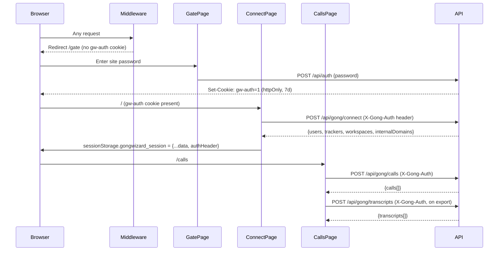

# GongWizard Component Documentation

## 1. Page Structure

```mermaid
graph TD
  MW[middleware.ts] -->|checks gw-auth cookie| GATE[/gate]
  MW -->|passes if authed| HOME[/]
  MW -->|passes if authed| CALLS[/calls]

  ROOT[src/app/layout.tsx\nRootLayout] --> HOME
  ROOT --> CALLS
  ROOT --> GATE

  HOME["src/app/page.tsx\nConnectPage\n(Step 1: Enter Gong API keys)"]
  CALLS["src/app/calls/page.tsx\nCallsPage\n(Step 2: Browse, filter, export)"]
  GATE["src/app/gate/page.tsx\nGatePage\n(Site password gate)"]

  HOME -->|POST /api/gong/connect| CONNECT_API[src/app/api/gong/connect/route.ts]
  CALLS -->|POST /api/gong/calls| CALLS_API[src/app/api/gong/calls/route.ts]
  CALLS -->|POST /api/gong/transcripts| TX_API[src/app/api/gong/transcripts/route.ts]
  GATE -->|POST /api/auth| AUTH_API[src/app/api/auth/route.ts]
```

| Route | File | Layout | Data Fetching |
|---|---|---|---|
| `/gate` | `src/app/gate/page.tsx` | `RootLayout` | Client — POST `/api/auth` on form submit |
| `/` | `src/app/page.tsx` | `RootLayout` | Client — POST `/api/gong/connect` on form submit |
| `/calls` | `src/app/calls/page.tsx` | `RootLayout` | Client — POST `/api/gong/calls` + POST `/api/gong/transcripts` on demand |
| `/api/auth` | `src/app/api/auth/route.ts` | — | Server — validates `SITE_PASSWORD` env var, sets `gw-auth` cookie |
| `/api/gong/connect` | `src/app/api/gong/connect/route.ts` | — | Server — proxies to Gong `/v2/users`, `/v2/settings/trackers`, `/v2/workspaces` |
| `/api/gong/calls` | `src/app/api/gong/calls/route.ts` | — | Server — proxies to Gong `/v2/calls` then `/v2/calls/extensive` |
| `/api/gong/transcripts` | `src/app/api/gong/transcripts/route.ts` | — | Server — proxies to Gong `/v2/calls/transcript` |

---

## 2. Component Hierarchy

### `RootLayout` (`src/app/layout.tsx`)

```
RootLayout
└── <html lang="en">
    └── <body> (Geist + Geist_Mono fonts)
        └── {children}   ← page slot
```

### `GatePage` (`src/app/gate/page.tsx`)

```
GatePage
└── <div> (min-h-screen centered)
    ├── <div> (heading block)
    │   ├── <h1> GongWizard
    │   └── <p> tagline
    └── Card
        ├── CardHeader
        │   └── CardTitle "Enter Password"
        └── CardContent
            └── <form onSubmit={handleSubmit}>
                ├── <div> (field group)
                │   ├── Label (htmlFor="password")
                │   └── <div> (relative wrapper)
                │       ├── Input (type=password|text, id="password")
                │       └── <button> (Eye / EyeOff toggle)
                ├── <p> error message (conditional)
                └── Button (type="submit", size="lg")
                    └── Loader2 (animate-spin, conditional) | "Continue"
```

### `ConnectPage` (`src/app/page.tsx`)

```
ConnectPage
└── <div> (min-h-screen centered)
    ├── <div> (heading block)
    │   ├── <h1> GongWizard
    │   └── <p> tagline
    ├── Card
    │   ├── CardHeader
    │   │   └── CardTitle "Connect to Gong"
    │   └── CardContent
    │       └── <form onSubmit={handleConnect}>
    │           ├── <div> (field group)
    │           │   ├── Label (htmlFor="accessKey")
    │           │   └── Input (type="text", id="accessKey")
    │           ├── <div> (field group)
    │           │   ├── Label (htmlFor="secretKey")
    │           │   └── <div> (relative wrapper)
    │           │       ├── Input (type=password|text, id="secretKey")
    │           │       └── <button> (Eye / EyeOff toggle)
    │           ├── <div> (collapsible help accordion)
    │           │   ├── <button> "How to get these" (ChevronUp/Down)
    │           │   └── <div> (steps list, conditional)
    │           │       └── <ol> 4 steps
    │           ├── <p> error message (conditional)
    │           └── Button (type="submit", size="lg")
    │               └── Loader2 (animate-spin, conditional) | "Connect"
    └── <div> (security badges row)
        ├── <span> Lock + "Credentials stored in session only"
        ├── <span> X + "Cleared when you close this tab"
        └── <span> Shield + "No server-side storage"
```

### `CallsPage` (`src/app/calls/page.tsx`)

```
CallsPage
└── <div> (min-h-screen flex-col)
    ├── <header> (sticky top bar)
    │   ├── <span> "GongWizard" logo
    │   ├── <div> (date range + workspace controls)
    │   │   ├── Label + Input (id="fromDate", type="date")
    │   │   ├── Label + Input (id="toDate", type="date")
    │   │   ├── Label + <select> workspace (conditional: workspaces.length > 1)
    │   │   └── Button "Load Calls" (Loader2 while loading)
    │   └── Button (ghost) "Disconnect" (LogOut icon)
    ├── <div> (3-column body)
    │   ├── <aside> (left, 240px, hidden on mobile) — Filters panel
    │   │   ├── <h3> "Filters"
    │   │   ├── Input (search, Search icon)
    │   │   ├── Checkbox + Label "Exclude internal-only calls"
    │   │   ├── <div> (tracker list, conditional: allTrackers.length > 0)
    │   │   │   ├── <h3> "Trackers"
    │   │   │   └── {allTrackers.map} → Checkbox + Label + count badge
    │   │   └── <div> (call counts, conditional: hasLoaded)
    │   ├── <main> (flex-1) — Call list
    │   │   ├── Input (mobile search, md:hidden)
    │   │   ├── <div> Select All / Deselect All buttons (conditional)
    │   │   ├── <div> error banner (conditional: loadError)
    │   │   ├── <div> loading spinner (conditional: loading)
    │   │   ├── <div> "No calls found" empty state (conditional)
    │   │   ├── <div> "No calls loaded yet" empty state (conditional)
    │   │   └── {filteredCalls.map} → Card per call
    │   │       └── CardContent
    │   │           └── <div> (flex row)
    │   │               ├── Checkbox (selected state)
    │   │               └── <div> (call details)
    │   │                   ├── title + date
    │   │                   ├── duration, speaker counts, accountName
    │   │                   ├── Badge[] topics (secondary variant)
    │   │                   ├── Badge[] trackers (outline, blue)
    │   │                   ├── brief (line-clamp-2, conditional)
    │   │                   └── talk ratio bar (conditional)
    │   └── <aside> (right, 280px, hidden on tablet) — Export panel
    │       ├── empty state (conditional: selectedIds.size === 0)
    │       └── export controls (conditional: selectedIds.size > 0)
    │           ├── selection count + token estimate
    │           ├── context window label (color-coded)
    │           ├── Separator
    │           ├── Label "Format"
    │           │   └── Tabs (markdown | xml | jsonl)
    │           │       ├── TabsList
    │           │       └── TabsTrigger × 3
    │           ├── Label "Options"
    │           │   └── {exportOpts keys.map} → Checkbox + Label
    │           ├── Separator
    │           └── action buttons
    │               ├── Button "Download" (Download icon)
    │               └── Button "Copy to Clipboard" (Copy icon, ≤10 selected)
    └── <div> (mobile export bar, lg:hidden, conditional: selectedIds.size > 0)
        ├── <span> count + token estimate
        └── Button "Export" (Download icon)
```

---

## 3. Component Reference

### `GatePage`
**File:** `src/app/gate/page.tsx`

**Props:** none (page component)

**State managed:**
| State | Type | Purpose |
|---|---|---|
| `password` | `string` | Controlled input value |
| `showPassword` | `boolean` | Toggle password visibility |
| `loading` | `boolean` | Submit in-flight |
| `error` | `string` | Error message display |

**Hooks used:**
- `useState` (4×)
- `useRouter` (next/navigation) — redirect to `/` on success

**API calls:**
- `POST /api/auth` — sends `{ password }`, receives `{ ok: true }` or `{ error }`, sets `gw-auth` cookie server-side

**Children rendered:** `Card`, `CardHeader`, `CardTitle`, `CardContent`, `Input`, `Label`, `Button`, `Eye`, `EyeOff`, `Loader2` (lucide-react)

---

### `ConnectPage`
**File:** `src/app/page.tsx`

**Props:** none (page component)

**State managed:**
| State | Type | Purpose |
|---|---|---|
| `accessKey` | `string` | Gong access key input |
| `secretKey` | `string` | Gong secret key input |
| `showSecret` | `boolean` | Toggle secret visibility |
| `showHelp` | `boolean` | Toggle help accordion |
| `loading` | `boolean` | Submit in-flight |
| `error` | `string` | Error message display |

**Hooks used:**
- `useState` (6×)
- `useRouter` (next/navigation) — push to `/calls` on success

**API calls:**
- `POST /api/gong/connect` with `X-Gong-Auth: btoa(accessKey:secretKey)` — receives `{ users, trackers, workspaces, internalDomains, baseUrl }`

**Side effects:**
- `saveSession({ ...data, authHeader })` — writes connection data to `sessionStorage` under key `gongwizard_session`

**Utility functions (file-local):**
- `saveSession(data: any)` — serializes to `sessionStorage`

**Children rendered:** `Card`, `CardHeader`, `CardTitle`, `CardContent`, `Input`, `Label`, `Button`, `Eye`, `EyeOff`, `ChevronDown`, `ChevronUp`, `Lock`, `X`, `Shield`, `Loader2` (lucide-react)

---

### `CallsPage`
**File:** `src/app/calls/page.tsx`

**Props:** none (page component)

**State managed:**
| State | Type | Initial Value |
|---|---|---|
| `session` | `any \| null` | `null` — populated from `sessionStorage` |
| `fromDate` | `string` | 30 days ago (`yyyy-MM-dd`) |
| `toDate` | `string` | today (`yyyy-MM-dd`) |
| `calls` | `GongCall[]` | `[]` |
| `loading` | `boolean` | `false` |
| `loadError` | `string` | `''` |
| `hasLoaded` | `boolean` | `false` |
| `selectedIds` | `Set<string>` | empty Set |
| `searchText` | `string` | `''` |
| `excludeInternal` | `boolean` | `false` |
| `activeTrackers` | `Set<string>` | empty Set |
| `workspaceId` | `string` | `''` |
| `exportFormat` | `'markdown' \| 'xml' \| 'jsonl'` | `'markdown'` |
| `exportOpts` | `ExportOptions` | all `true` |
| `exporting` | `boolean` | `false` |
| `copied` | `boolean` | `false` |

**Hooks used:**
- `useState` (14×)
- `useEffect` — reads `sessionStorage` on mount, redirects to `/` if no session
- `useMemo` — `allTrackers`, `filteredCalls`, `trackerCounts`, `selectedCalls`, `tokenEstimate`
- `useRouter` (next/navigation) — `router.replace('/')` on session miss or disconnect

**API calls:**
- `POST /api/gong/calls` — fetches and normalizes call list
- `POST /api/gong/transcripts` — fetches raw transcript monologues for selected call IDs

**Key functions (file-local):**

| Function | Signature | Purpose |
|---|---|---|
| `saveSession` | `(data: any) → void` | Writes to `sessionStorage` |
| `getSession` | `() → any \| null` | Reads from `sessionStorage` |
| `estimateTokens` | `(text: string) → number` | `ceil(len / 4)` |
| `contextLabel` | `(tokens: number) → string` | Maps token count to LLM context label |
| `contextColor` | `(tokens: number) → string` | Tailwind class for green/yellow/red |
| `downloadFile` | `(content, filename, mimeType) → void` | Creates blob URL and triggers `<a>` click |
| `formatDuration` | `(seconds: number) → string` | `Xh Ym` / `Xm Ys` / `Xs` |
| `formatTimestamp` | `(ms: number) → string` | `M:SS` |
| `groupTranscriptTurns` | `(sentences, speakerMap) → FormattedTurn[]` | Collapses sequential sentences by same speaker into turns |
| `buildMarkdown` | `(calls, opts) → string` | Formats calls as Markdown |
| `buildCallText` | `(call, opts) → string` | Single-call Markdown block |
| `buildXML` | `(calls, opts) → string` | Formats calls as XML |
| `buildJSONL` | `(calls, opts) → string` | Formats calls as JSONL (one JSON obj per line) |
| `escapeXml` | `(str: string) → string` | XML entity escaping |
| `filterFillerTurns` | `(turns) → FormattedTurn[]` | Removes short filler/greeting utterances |
| `condenseInternalMonologues` | `(turns) → FormattedTurn[]` | Merges 3+ consecutive same-speaker internal turns |
| `loadCalls` | `async () → void` | Fetches and processes calls from API |
| `toggleSelect` | `(id: string) → void` | Toggles a call's selection |
| `selectAll` | `() → void` | Selects all filtered calls |
| `deselectAll` | `() → void` | Clears selection |
| `toggleTracker` | `(name: string) → void` | Toggles a tracker filter |
| `disconnect` | `() → void` | Clears session, redirects to `/` |
| `fetchTranscriptsForSelected` | `async () → CallForExport[]` | Fetches transcripts and assembles `CallForExport` objects |
| `handleExport` | `async () → void` | Triggers download in selected format |
| `handleCopy` | `async () → void` | Copies formatted content to clipboard |

**Types (file-local):**

```typescript
interface Speaker {
  speakerId: string;
  name: string;
  firstName: string;
  isInternal: boolean;
  title?: string;
}

interface TranscriptSentence {
  speakerId: string;
  text: string;
  start: number;
}

interface FormattedTurn {
  speakerId: string;
  firstName: string;
  isInternal: boolean;
  timestamp: string;
  text: string;
}

interface CallForExport {
  id: string;
  title: string;
  date: string;
  duration: number;
  accountName: string;
  speakers: Speaker[];
  brief: string;
  turns: FormattedTurn[];
  interactionStats?: any;
}

interface GongCall {
  id: string;
  title: string;
  started: string;
  duration: number;
  accountName?: string;
  topics?: string[];
  trackers?: string[];
  brief?: string;
  parties?: any[];
  interactionStats?: any;
  internalSpeakerCount: number;
  externalSpeakerCount: number;
  talkRatio?: number;
}

interface ExportOptions {
  removeFillerGreetings: boolean;
  condenseMonologues: boolean;
  includeMetadata: boolean;
  includeAIBrief: boolean;
  includeInteractionStats: boolean;
}
```

**Children rendered:** `Button`, `Card`, `CardContent`, `CardHeader`, `CardTitle`, `Input`, `Label`, `Badge`, `Checkbox`, `Separator`, `ScrollArea` (imported but not used in JSX), `Tabs`, `TabsList`, `TabsTrigger`, `Loader2`, `Download`, `Copy`, `LogOut`, `Search`, `CheckSquare`, `Square`, `AlertCircle` (lucide-react)

---

### API Routes (server-only, no React)

#### `POST /api/auth`
**File:** `src/app/api/auth/route.ts`

Validates `{ password }` against `process.env.SITE_PASSWORD`. On match, sets an `httpOnly` cookie `gw-auth=1` (7-day TTL) and returns `{ ok: true }`.

#### `POST /api/gong/connect`
**File:** `src/app/api/gong/connect/route.ts`

**Request headers:** `X-Gong-Auth` (Base64 `accessKey:secretKey`)

**Request body:** `{ baseUrl? }`

Calls Gong in parallel:
- `GET /v2/users` (paginated) → extract `internalDomains` from email addresses
- `GET /v2/settings/trackers` (paginated)
- `GET /v2/workspaces`

**Response:** `{ users, trackers, workspaces, internalDomains, baseUrl, warnings? }`

Local class: `GongApiError(status, message, endpoint)` — re-thrown as structured HTTP errors.

Local function: `fetchAllPages<T>(endpoint, dataKey, method?, body?)` — handles cursor-based pagination with 350ms delay between pages.

#### `POST /api/gong/calls`
**File:** `src/app/api/gong/calls/route.ts`

**Request headers:** `X-Gong-Auth`

**Request body:** `{ fromDate, toDate, baseUrl?, workspaceId? }`

Pipeline:
1. Paginated `GET /v2/calls?fromDateTime=...&toDateTime=...` → collects all call IDs
2. Batched (10 at a time) `POST /v2/calls/extensive` with full `contentSelector` → extensive call data
3. On 403, falls back to basic call shape

**Response:** `{ calls: NormalizedCall[] }` where each call has `id, title, started, duration, url, direction, parties, topics, trackers, brief, keyPoints, actionItems, interactionStats, context, accountName, accountIndustry, accountWebsite`.

Local function: `extractFieldValues(context, fieldName, objectType?)` — navigates Gong's `context.objects.fields` nested structure (ported from Python v1).

#### `POST /api/gong/transcripts`
**File:** `src/app/api/gong/transcripts/route.ts`

**Request headers:** `X-Gong-Auth`

**Request body:** `{ callIds: string[], baseUrl? }`

Batches call IDs in groups of 50, calls `POST /v2/calls/transcript` for each batch with cursor pagination. Assembles a `transcriptMap` keyed by `callId`.

**Response:** `{ transcripts: Array<{ callId: string, transcript: Monologue[] }> }`

---

## 4. Custom Hooks

No files in a `hooks/` directory are present in the current codebase snapshot. The CLAUDE.md references `src/hooks/useGong` and `src/hooks/useCalls`, but these are not yet in the repomix output — they may be planned or not yet committed.

All hook logic currently lives inline in `CallsPage`:
- Session read/write via `useEffect` + `getSession()`/`saveSession()`
- Filtering via `useMemo` (`filteredCalls`, `trackerCounts`, `selectedCalls`, `tokenEstimate`)
- API fetch via async event handlers (`loadCalls`, `fetchTranscriptsForSelected`)

---

## 5. UI Library Notes

**Library:** shadcn/ui (component generation via `shadcn` CLI v3.8.5)

**Primitives package:** `radix-ui` v1.4.3 (the unified `radix-ui` package — imports like `import { Checkbox as CheckboxPrimitive } from "radix-ui"`)

**Icon library:** `lucide-react` v0.575.0

**Styling:** Tailwind CSS v4 with `tw-animate-css` for data-attribute-driven animations. No `tailwind.config.js` — Tailwind v4 uses CSS-based config.

**Date utilities:** `date-fns` v4.1.0 (`format`, `subDays`)

**Calendar/date picker:** `react-day-picker` v9.14.0 (used only in `Calendar` component; not yet wired to any page)

**Command palette:** `cmdk` v1.1.1 (used only in `Command` component; not yet wired to any page)

**Fonts:** `next/font/google` — Geist (variable: `--font-geist-sans`) + Geist_Mono (variable: `--font-geist-mono`), applied to `<body>` in `RootLayout`.

**Utility function:** `src/lib/utils.ts` exports `cn(...inputs: ClassValue[])` — `twMerge(clsx(inputs))` pattern.

### Installed shadcn Components

| Component | File | Primitive |
|---|---|---|
| `Badge` | `src/components/ui/badge.tsx` | `Slot` from `radix-ui`, `cva` variants: default, secondary, destructive, outline, ghost, link |
| `Button` | `src/components/ui/button.tsx` | `Slot` from `radix-ui`, `cva` variants: default, destructive, outline, secondary, ghost, link; sizes: default, xs, sm, lg, icon, icon-xs, icon-sm, icon-lg |
| `Calendar` | `src/components/ui/calendar.tsx` | `DayPicker` from `react-day-picker`; includes `CalendarDayButton` sub-component |
| `Card` | `src/components/ui/card.tsx` | Plain divs; exports `Card`, `CardHeader`, `CardTitle`, `CardDescription`, `CardAction`, `CardContent`, `CardFooter` |
| `Checkbox` | `src/components/ui/checkbox.tsx` | `Checkbox` from `radix-ui` |
| `Command` | `src/components/ui/command.tsx` | `Command` from `cmdk`; exports `Command`, `CommandDialog`, `CommandInput`, `CommandList`, `CommandEmpty`, `CommandGroup`, `CommandItem`, `CommandShortcut`, `CommandSeparator` |
| `Dialog` | `src/components/ui/dialog.tsx` | `Dialog` from `radix-ui`; exports `Dialog`, `DialogTrigger`, `DialogPortal`, `DialogOverlay`, `DialogContent`, `DialogHeader`, `DialogFooter`, `DialogTitle`, `DialogDescription`, `DialogClose` |
| `Input` | `src/components/ui/input.tsx` | Plain `<input>` |
| `Label` | `src/components/ui/label.tsx` | `Label` from `radix-ui` |
| `Popover` | `src/components/ui/popover.tsx` | `Popover` from `radix-ui`; exports `Popover`, `PopoverTrigger`, `PopoverContent`, `PopoverAnchor`, `PopoverHeader`, `PopoverTitle`, `PopoverDescription` |
| `ScrollArea` | `src/components/ui/scroll-area.tsx` | `ScrollArea` from `radix-ui`; exports `ScrollArea`, `ScrollBar` |
| `Separator` | `src/components/ui/separator.tsx` | `Separator` from `radix-ui` |
| `Tabs` | `src/components/ui/tabs.tsx` | `Tabs` from `radix-ui`; exports `Tabs`, `TabsList`, `TabsTrigger`, `TabsContent`; `tabsListVariants` (default/line) |
| `Toggle` | `src/components/ui/toggle.tsx` | `Toggle` from `radix-ui`; exports `Toggle`, `toggleVariants` |
| `ToggleGroup` | `src/components/ui/toggle-group.tsx` | `ToggleGroup` from `radix-ui`; exports `ToggleGroup`, `ToggleGroupItem`; uses `ToggleGroupContext` for variant/size inheritance |
| `Tooltip` | `src/components/ui/tooltip.tsx` | `Tooltip` from `radix-ui`; exports `Tooltip`, `TooltipTrigger`, `TooltipContent`, `TooltipProvider` |

### Components Used vs. Installed

Components actively used in pages: `Badge`, `Button`, `Card`/`CardContent`/`CardHeader`/`CardTitle`, `Checkbox`, `Input`, `Label`, `Separator`, `Tabs`/`TabsList`/`TabsTrigger`

Components installed but not yet wired to any page: `Calendar`, `Command`, `Dialog`, `Popover`, `ScrollArea` (imported in `CallsPage` but not rendered), `Toggle`, `ToggleGroup`, `Tooltip`

---

## 6. Auth & Session Flow



**Key security properties:**
- `gw-auth` cookie is `httpOnly` — cannot be read by JS
- Gong credentials (`X-Gong-Auth`) live only in `sessionStorage` — cleared on tab close, never sent to any server-side storage
- All Gong API calls are proxied through Next.js API routes — credentials never touch Gong directly from the browser
