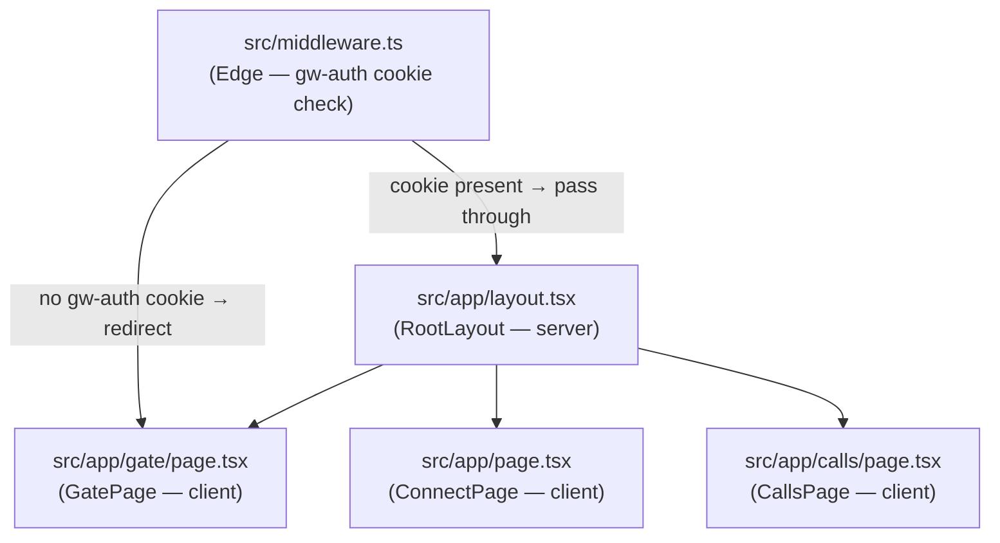

# GongWizard — Component Tree

Generated: 2026-03-02

---

## 1. Page Structure

Routing is handled by Next.js 15 App Router. All pages are client components (`'use client'`). The root layout is a server component.



| Page | File | Layout | Auth Gate | Data Fetching |
|---|---|---|---|---|
| Gate (password entry) | `src/app/gate/page.tsx` | `RootLayout` | None (excluded from middleware) | POST `/api/auth` on submit |
| Connect (Gong credentials) | `src/app/page.tsx` | `RootLayout` | `gw-auth` cookie required | POST `/api/gong/connect` on submit |
| Calls (browse + export + analyze) | `src/app/calls/page.tsx` | `RootLayout` | `gw-auth` cookie required | POST `/api/gong/calls` on load; POST `/api/gong/transcripts` on export/analyze |

---

## 2. Component Hierarchy

### `RootLayout` (`src/app/layout.tsx`)

```
RootLayout
└── <html lang="en">
    └── <body> (Geist + Geist_Mono CSS variables, antialiased)
        └── {children}
```

### `GatePage` (`src/app/gate/page.tsx`)

```
GatePage
└── <div> (min-h-screen centering wrapper)
    ├── <h1> "GongWizard"
    ├── <p> subtitle
    └── Card
        ├── CardHeader
        │   └── CardTitle "Enter Password"
        └── CardContent
            └── <form onSubmit={handleSubmit}>
                ├── Label "Password"
                ├── Input (type=password/text)
                ├── <button> (Eye/EyeOff toggle)
                ├── <p> (error display, conditional)
                └── Button type="submit" (Loader2 when loading)
```

### `ConnectPage` (`src/app/page.tsx`)

```
ConnectPage
└── <div> (min-h-screen centering wrapper)
    ├── <h1> "GongWizard"
    ├── <p> subtitle
    ├── Card
    │   ├── CardHeader
    │   │   └── CardTitle "Connect to Gong"
    │   └── CardContent
    │       └── <form onSubmit={handleConnect}>
    │           ├── Label + Input "Access Key"
    │           ├── Label + Input "Secret Key" (Eye/EyeOff toggle)
    │           ├── <div> expandable "How to get these" help accordion
    │           ├── <p> (error display, conditional)
    │           └── Button type="submit" (Loader2 when loading)
    └── <div> security badges (Lock, X, Shield icons)
```

### `CallsPage` (`src/app/calls/page.tsx`)

The calls page is the primary application view. It is a large client component holding all browse, filter, export, and AI-analyze logic.

```
CallsPage
├── (loading state) — spinner
├── (error state) — error card with reconnect button
└── (loaded state)
    └── <div> two-column layout
        ├── LEFT COLUMN — call list + filters
        │   ├── Header bar
        │   │   ├── Title "GongWizard"
        │   │   ├── Badge (call count)
        │   │   └── <button> disconnect (LogOut icon)
        │   ├── Date range pickers (Popover + Calendar, fromDate/toDate)
        │   ├── WorkspaceFilter (Select or hidden if single workspace)
        │   ├── Fetch button (RefreshCw icon)
        │   ├── Filter panel (collapsible, Filter icon)
        │   │   ├── Input (searchText)
        │   │   ├── Input (participantSearch)
        │   │   ├── Input (aiContentSearch)
        │   │   ├── Checkbox (excludeInternal)
        │   │   ├── Slider (durationRange)
        │   │   ├── Slider (talkRatioRange)
        │   │   ├── Input (minExternalSpeakers)
        │   │   ├── TrackerFilter (ToggleGroup of tracker badges)
        │   │   └── TopicFilter (ToggleGroup of topic badges)
        │   ├── Selection controls (Select All, Clear)
        │   └── ScrollArea — call list
        │       └── (per call) call card
        │           ├── Checkbox (selected)
        │           ├── call title + date
        │           ├── Badge (duration)
        │           ├── Badge (externalSpeakerCount)
        │           ├── Badge (talkRatio, conditional)
        │           └── Tooltip (brief preview, conditional)
        └── RIGHT COLUMN — export + analyze panel
            ├── Tab switcher: "Export" | "Analyze"
            ├── Export tab
            │   ├── ToggleGroup (format: markdown/xml/jsonl/csv)
            │   ├── ExportOptions checkboxes
            │   │   ├── Checkbox removeFillerGreetings
            │   │   ├── Checkbox condenseMonologues
            │   │   ├── Checkbox includeMetadata
            │   │   ├── Checkbox includeAIBrief
            │   │   └── Checkbox includeInteractionStats
            │   ├── Token estimate display (contextLabel + contextColor)
            │   ├── Button "Export File" (Download icon)
            │   ├── Button "Copy to Clipboard" (Copy/Check icon)
            │   └── Button "Export ZIP" (Archive icon)
            └── Analyze tab
                └── AnalyzePanel (src/components/analyze-panel.tsx)
```

### `AnalyzePanel` (`src/components/analyze-panel.tsx`)

Rendered inside the Analyze tab. Manages a four-stage state machine: `idle → scoring → scored → analyzing → results`.

```
AnalyzePanel
├── (stage=idle|scoring) question input stage
│   ├── Label "Research Question"
│   ├── Input (question text)
│   ├── <div> QUESTION_TEMPLATES quick-fill buttons
│   │   └── Button × 5 (Objections, Needs, Competitive, Feedback, Questions)
│   └── Button "Score Calls" (Search icon / Loader2)
├── (stage=scored) relevance review stage
│   ├── Label "Relevance Scores"
│   ├── ScrollArea — scored call list
│   │   └── (per call) <div>
│   │       ├── Checkbox (selected toggle)
│   │       ├── Badge (score/10)
│   │       └── reason text
│   ├── selection count display
│   └── Button "Analyze N Calls" (Sparkles icon)
├── (stage=analyzing) progress display
│   └── Loader2 + analysisProgress text
└── (stage=results) results display
    ├── token usage bar
    ├── Button "JSON" export (Download icon)
    ├── Button "CSV" export (Download icon)
    ├── Card (overallSummary)
    ├── Separator
    ├── Tabs (defaultValue="themes")
    │   ├── TabsList
    │   │   ├── TabsTrigger "Themes" (BarChart3 icon)
    │   │   └── TabsTrigger "By Call" (MessageSquare icon)
    │   ├── TabsContent "themes"
    │   │   └── ScrollArea
    │   │       └── (per theme) Card
    │   │           ├── theme name + Badge (frequency)
    │   │           └── representative_quotes list
    │   └── TabsContent "calls"
    │       └── ScrollArea
    │           └── (per call) collapsible call row
    │               ├── <button> expand toggle (ChevronDown/ChevronRight)
    │               ├── call title
    │               ├── Badge (findings count)
    │               └── (expanded) findings list
    │                   └── (per finding) <div>
    │                       ├── Badge (significance)
    │                       ├── Badge (finding_type)
    │                       ├── timestamp
    │                       ├── exact_quote (italic)
    │                       └── context
    ├── Separator
    └── follow-up questions section
        ├── Label "Follow-Up Questions (N/10)"
        ├── (per follow-up) Card
        │   ├── question text
        │   ├── answer text
        │   └── supporting_quotes list (up to 3)
        └── follow-up input row
            ├── Input (followUpInput)
            └── Button (Send / Loader2)
```

---

## 3. Component Reference

### `GatePage`

**File:** `src/app/gate/page.tsx`

**Props:** None (page component)

**State managed:**
- `password: string`
- `showPassword: boolean`
- `loading: boolean`
- `error: string`

**Hooks used:** `useState`, `useRouter` (next/navigation)

**API calls:**
- `POST /api/auth` — validates password, sets `gw-auth` cookie; on success redirects to `/`

**Children rendered:** `Card`, `CardContent`, `CardHeader`, `CardTitle`, `Input`, `Label`, `Button` (shadcn/ui); `Eye`, `EyeOff`, `Loader2` (lucide-react)

---

### `ConnectPage`

**File:** `src/app/page.tsx`

**Props:** None (page component)

**State managed:**
- `accessKey: string`
- `secretKey: string`
- `showSecret: boolean`
- `showHelp: boolean`
- `loading: boolean`
- `error: string`

**Hooks used:** `useState`, `useRouter`

**API calls:**
- `POST /api/gong/connect` with `X-Gong-Auth: btoa(accessKey:secretKey)` — on success saves `{users, trackers, workspaces, internalDomains, baseUrl, authHeader}` to `sessionStorage['gongwizard_session']` and navigates to `/calls`

**Local functions:** `saveSession(data)` — writes to `sessionStorage`

**Children rendered:** `Card`, `CardContent`, `CardHeader`, `CardTitle`, `Input`, `Label`, `Button`; `Eye`, `EyeOff`, `Lock`, `X`, `Shield`, `ChevronDown`, `ChevronUp`, `Loader2`

---

### `CallsPage`

**File:** `src/app/calls/page.tsx`

**Props:** None (page component)

**State managed:**
- `session: GongSession | null` — loaded from `sessionStorage['gongwizard_session']`
- `calls: GongCall[]` — fetched call list with computed fields
- `loading: boolean`
- `error: string`
- `fromDate: Date`, `toDate: Date` — date range pickers
- `selectedWorkspace: string` — workspace filter
- `selectedIds: Set<string>` — checked calls
- `exportFormat: 'markdown' | 'xml' | 'jsonl' | 'csv'`
- `exportOpts: ExportOptions` — filler removal, condense, metadata, brief, stats toggles
- `activeTab: 'export' | 'analyze'`
- `showFilters: boolean`
- Filter state (delegated to `useFilterState`)

**Hooks used:**
- `useState`, `useEffect`, `useCallback`, `useMemo`
- `useFilterState` (custom) — all filter field state + localStorage persistence
- `useCallExport` (custom) — export/copy/zip logic

**API calls (via `useCallExport`):**
- `POST /api/gong/calls` — fetches paginated call list + extensive metadata
- `POST /api/gong/transcripts` — fetches transcript monologues for selected calls

**Key derived values (useMemo):**
- `filteredCalls` — calls filtered by all active filter predicates from `src/lib/filters.ts`
- `trackerCounts` — per-tracker hit counts across visible calls
- `topicCounts` — per-topic hit counts across visible calls
- `tokenEstimate` — estimated tokens for selected calls (for export UI label)

**Children rendered:** `AnalyzePanel`, all shadcn/ui primitives, lucide-react icons

---

### `AnalyzePanel`

**File:** `src/components/analyze-panel.tsx`

**Props interface:**
```typescript
interface AnalyzePanelProps {
  selectedCalls: any[];   // GongCall objects for currently checked calls
  session: any;           // GongSession from sessionStorage
  allCalls: any[];        // full unfiltered call list (for callMap lookups)
}
```

**State managed:**
- `question: string`
- `stage: 'idle' | 'scoring' | 'scored' | 'analyzing' | 'results'`
- `error: string`
- `scoredCalls: ScoredCall[]` — calls with 0-10 relevance score + selected flag
- `callFindings: CallFindings[]` — per-call extracted findings
- `themes: Theme[]` — cross-call synthesized themes
- `overallSummary: string`
- `analysisProgress: string` — progress message during analysis
- `followUps: FollowUpAnswer[]`
- `followUpInput: string`
- `followUpLoading: boolean`
- `processedDataCache: string` — formatted transcript excerpts, cached for follow-up questions
- `tokensUsed: number`
- `expandedCalls: Set<string>` — which call rows are expanded in "By Call" tab

**Hooks used:** `useState`, `useCallback`

**API calls:**
- `POST /api/analyze/score` — scores selected calls 0-10 for relevance
- `POST /api/gong/transcripts` — fetches transcripts for scored+selected calls
- `POST /api/analyze/process` — smart truncation of long internal monologues (Gemini Flash-Lite)
- `POST /api/analyze/run` — per-call finding extraction (GPT-4o)
- `POST /api/analyze/synthesize` — cross-call theme synthesis (GPT-4o)
- `POST /api/analyze/followup` — answers follow-up questions (GPT-4o)

**Lib functions used:**
- `isInternalParty` from `src/lib/format-utils`
- `buildUtterances`, `alignTrackersToUtterances`, `extractTrackerOccurrences` from `src/lib/tracker-alignment`
- `performSurgery`, `formatExcerptsForAnalysis` from `src/lib/transcript-surgery`

**Internal types:**
```typescript
interface ScoredCall {
  callId: string;
  score: number;
  reason: string;
  relevantSections: string[];
  selected: boolean;
}
interface Finding {
  exact_quote: string;
  timestamp: string;
  context: string;
  significance: string;
  finding_type: string;
}
interface CallFindings {
  callId: string;
  callTitle: string;
  account: string;
  findings: Finding[];
}
interface Theme {
  theme: string;
  frequency: number;
  representative_quotes: string[];
  call_ids: string[];
}
interface FollowUpAnswer {
  question: string;
  answer: string;
  supporting_quotes: Array<{ quote: string; call: string; timestamp: string }>;
}
```

**Children rendered:** `Button`, `Input`, `Label`, `Badge`, `Card`, `CardContent`, `Checkbox`, `Separator`, `Tabs`, `TabsList`, `TabsTrigger`, `TabsContent`, `ScrollArea`; `Loader2`, `Search`, `Sparkles`, `ChevronDown`, `ChevronRight`, `MessageSquare`, `BarChart3`, `Send`, `Download`

---

## 4. Custom Hooks

### `useFilterState`

**File:** `src/hooks/useFilterState.ts`

**Purpose:** Centralizes all call-list filter state. Persists numeric/boolean filters to `localStorage['gongwizard_filters']` so they survive page reloads. Text searches and multi-select sets are session-only (not persisted).

**Parameters:** None

**Return value:**
```typescript
{
  searchText: string;
  setSearchText: (v: string) => void;
  participantSearch: string;
  setParticipantSearch: (v: string) => void;
  aiContentSearch: string;
  setAiContentSearch: (v: string) => void;
  excludeInternal: boolean;
  setExcludeInternal: (v: boolean) => void;
  durationRange: [number, number];
  setDurationRange: (v: [number, number]) => void;
  talkRatioRange: [number, number];
  setTalkRatioRange: (v: [number, number]) => void;
  minExternalSpeakers: number;
  setMinExternalSpeakers: (v: number) => void;
  activeTrackers: Set<string>;
  toggleTracker: (name: string) => void;
  activeTopics: Set<string>;
  toggleTopic: (name: string) => void;
  resetFilters: () => void;
}
```

**Side effects:** Reads/writes `localStorage['gongwizard_filters']`. Silently ignores errors if localStorage is unavailable.

**Persisted fields:** `excludeInternal`, `durationMin`, `durationMax`, `talkRatioMin`, `talkRatioMax`, `minExternalSpeakers`

**Used by:** `CallsPage`

---

### `useCallExport`

**File:** `src/hooks/useCallExport.ts`

**Purpose:** Encapsulates transcript fetch + export logic for all three export actions (single file, clipboard copy, ZIP bundle). Handles the `Speaker` / `FormattedTurn` assembly pipeline.

**Parameters:**
```typescript
interface UseCallExportParams {
  selectedIds: Set<string>;
  session: any;                              // GongSession
  calls: any[];                             // full call list for metadata lookup
  exportFormat: 'markdown' | 'xml' | 'jsonl' | 'csv';
  exportOpts: ExportOptions;
}
```

**Return value:**
```typescript
{
  exporting: boolean;
  copied: boolean;
  handleExport: () => Promise<void>;      // download single file
  handleCopy: () => Promise<void>;        // clipboard
  handleZipExport: () => Promise<void>;   // ZIP with manifest.json
}
```

**API calls:**
- `POST /api/gong/transcripts` (inside `fetchTranscriptsForSelected`) — batched transcript fetch using `selectedIds` and `session.authHeader`

**Lib functions used:**
- `isInternalParty`, `downloadFile` from `src/lib/format-utils`
- `groupTranscriptTurns`, `buildExportContent` from `src/lib/transcript-formatter`
- `downloadZip` from `client-zip` (third-party)
- `format` from `date-fns`

**Side effects:**
- Triggers browser file download via `URL.createObjectURL` + anchor click (`handleExport`, `handleZipExport`)
- Writes to clipboard via `navigator.clipboard.writeText` (`handleCopy`)
- Sets `copied = true` for 2 seconds after clipboard success

**ZIP output structure:**
```
manifest.json               (exportDate, callCount, format, calls[])
calls/
  <sanitized-title>-<date>.<ext>   (one file per call)
```

**Used by:** `CallsPage`

---

## 5. UI Library Notes

**Library:** [shadcn/ui](https://ui.shadcn.com/) — copy-paste component library, not an installed package. All 15 components live directly in `src/components/ui/`.

**Primitives backing layer:** `radix-ui` (unified package `^1.4.3`) — Dialog, Checkbox, Label, Popover, ScrollArea, Separator, Slider, Tabs, Toggle, ToggleGroup, and Tooltip all delegate to Radix primitives.

**Command palette primitive:** `cmdk` (`^1.1.1`) — backs the `Command` component family.

**Calendar primitive:** `react-day-picker` (`^9.14.0`) — backs the `Calendar` / `CalendarDayButton` components.

**Styling:** Tailwind CSS v4 (CSS-first config). Class composition via `clsx` + `tailwind-merge` through the `cn()` utility in `src/lib/utils.ts`. CVA (`class-variance-authority`) drives variant logic inside `Badge`, `Button`, `Tabs`, and `Toggle`.

**Installed shadcn/ui components:**

| Component | File | Primitives |
|---|---|---|
| `Badge` | `src/components/ui/badge.tsx` | CVA, `Slot` (radix-ui) |
| `Button` | `src/components/ui/button.tsx` | CVA, `Slot` (radix-ui) |
| `Calendar`, `CalendarDayButton` | `src/components/ui/calendar.tsx` | react-day-picker `DayPicker` |
| `Card`, `CardHeader`, `CardTitle`, `CardDescription`, `CardAction`, `CardContent`, `CardFooter` | `src/components/ui/card.tsx` | Plain divs |
| `Checkbox` | `src/components/ui/checkbox.tsx` | radix-ui `Checkbox` |
| `Command`, `CommandDialog`, `CommandInput`, `CommandList`, `CommandEmpty`, `CommandGroup`, `CommandItem`, `CommandSeparator`, `CommandShortcut` | `src/components/ui/command.tsx` | `cmdk` `Command`, wraps `Dialog` |
| `Dialog`, `DialogTrigger`, `DialogContent`, `DialogHeader`, `DialogFooter`, `DialogTitle`, `DialogDescription`, `DialogOverlay`, `DialogPortal`, `DialogClose` | `src/components/ui/dialog.tsx` | radix-ui `Dialog` |
| `Input` | `src/components/ui/input.tsx` | Plain `<input>` |
| `Label` | `src/components/ui/label.tsx` | radix-ui `Label` |
| `Popover`, `PopoverTrigger`, `PopoverContent`, `PopoverAnchor`, `PopoverHeader`, `PopoverTitle`, `PopoverDescription` | `src/components/ui/popover.tsx` | radix-ui `Popover` |
| `ScrollArea`, `ScrollBar` | `src/components/ui/scroll-area.tsx` | radix-ui `ScrollArea` |
| `Separator` | `src/components/ui/separator.tsx` | radix-ui `Separator` |
| `Slider` | `src/components/ui/slider.tsx` | radix-ui `Slider` |
| `Tabs`, `TabsList`, `TabsTrigger`, `TabsContent` | `src/components/ui/tabs.tsx` | radix-ui `Tabs`, CVA |
| `Toggle` | `src/components/ui/toggle.tsx` | radix-ui `Toggle`, CVA |
| `ToggleGroup`, `ToggleGroupItem` | `src/components/ui/toggle-group.tsx` | radix-ui `ToggleGroup`, shares `toggleVariants` from `toggle.tsx` |
| `Tooltip`, `TooltipTrigger`, `TooltipContent`, `TooltipProvider` | `src/components/ui/tooltip.tsx` | radix-ui `Tooltip` |

**Fonts:** Geist Sans and Geist Mono loaded via `next/font/google` in `RootLayout`, applied as CSS variables `--font-geist-sans` and `--font-geist-mono`.

**Icons:** `lucide-react` (`^0.575.0`) — used directly in all pages and `AnalyzePanel`; no wrapper components.

**No custom theme config file.** Tailwind v4 uses a CSS-first approach — theme tokens are defined in `src/app/globals.css` rather than a `tailwind.config.ts`. The `next.config.ts` is intentionally empty with no custom configuration.
