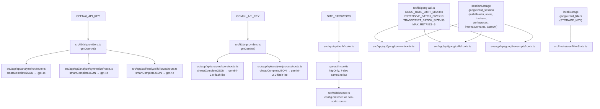

# Configuration Reference

GongWizard configuration reference — environment variables, build/runtime config, feature flags, constants, and third-party service integration.

---

## 1. Environment Variables

GongWizard has three server-side environment variables. No `.env.example` or `.env.local.example` files exist in the repository; variables are referenced directly in code.

| Name | Purpose | Required / Optional | Default Value | Where Used |
|---|---|---|---|---|
| `SITE_PASSWORD` | Password checked against user input on the gate page to issue the `gw-auth` session cookie | Required | — | `src/app/api/auth/route.ts` |
| `OPENAI_API_KEY` | API key for OpenAI; used by the smart AI tier (`gpt-4o`) for call analysis, synthesis, and follow-up routes | Required (AI features) | — | `src/lib/ai-providers.ts` |
| `GEMINI_API_KEY` | API key for Google Gemini; used by the cheap AI tier (`gemini-2.0-flash-lite`) for call scoring and transcript truncation | Required (AI features) | — | `src/lib/ai-providers.ts` |

**Setup**: Create `.env.local` in the project root and set all three.

### How Gong credentials are handled

Gong API credentials (Access Key + Secret Key) are **never stored in environment variables**. The flow is:

1. User enters credentials on `src/app/page.tsx` (the Connect page).
2. The browser Base64-encodes them into an `authHeader` string and stores the full `GongSession` object in `sessionStorage` under the key `gongwizard_session`.
3. Every API proxy request reads the header from the client and passes it to Gong as `Authorization: Basic <authHeader>` via the `X-Gong-Auth` HTTP request header.
4. On tab close, `sessionStorage` is cleared automatically; on explicit disconnect, `sessionStorage.removeItem('gongwizard_session')` is called in `src/app/calls/page.tsx`.

---

## 2. Build / Runtime Configuration

### `next.config.ts`

Location: `next.config.ts`

```typescript
const nextConfig: NextConfig = {
  /* config options here */
};
```

The `nextConfig` object is a bare scaffold with no custom options. Next.js 15 defaults apply — App Router, Turbopack for `npm run dev`, no custom rewrites/redirects/headers/images/output mode.

### `tsconfig.json`

Location: `tsconfig.json`

| Option | Value | Effect |
|---|---|---|
| `target` | `"ES2017"` | Compiles to ES2017 output (async/await native, no regenerator) |
| `lib` | `["dom", "dom.iterable", "esnext"]` | Browser DOM types + latest ECMAScript types |
| `strict` | `true` | All strict checks: `strictNullChecks`, `noImplicitAny`, etc. |
| `noEmit` | `true` | Type-check only; Next.js handles emit via SWC/Turbopack |
| `module` | `"esnext"` | ESM module syntax |
| `moduleResolution` | `"bundler"` | Bundler-style resolution; no `.js` extension needed on imports |
| `resolveJsonModule` | `true` | Allows importing `.json` files as typed modules |
| `isolatedModules` | `true` | Each file must be independently transpilable; required for SWC |
| `incremental` | `true` | Caches type-check state between builds |
| `jsx` | `"react-jsx"` | Automatic JSX transform — no `import React` required per file |
| `paths` | `{ "@/*": ["./src/*"] }` | `@/` resolves to `src/`; used for all internal imports |
| `plugins` | `[{ "name": "next" }]` | Next.js TypeScript plugin for IDE support |

### Tailwind CSS

**Version:** `tailwindcss@^4`

No `tailwind.config.js` or `tailwind.config.ts` exists. Tailwind v4 is configured via CSS-first directives in `src/app/globals.css`. PostCSS integration is provided by `@tailwindcss/postcss@^4`. The only additional styling package is `tw-animate-css@^1.4.0`, which provides animation utilities (`animate-in`, `fade-in-0`, `zoom-in-95`, `slide-in-from-top-2`) used in shadcn/ui component transitions.

### ESLint

**Config:** `eslint-config-next` (standard Next.js ruleset). No custom `.eslintrc` or `eslint.config.*` is present. Run via `npm run lint`.

### Fonts

Location: `src/app/layout.tsx`

Both fonts are loaded via `next/font/google` and self-hosted at build time — no CDN requests at runtime.

| Identifier | Font Family | CSS Variable | Subset |
|---|---|---|---|
| `geistSans` | `Geist` | `--font-geist-sans` | `latin` |
| `geistMono` | `Geist_Mono` | `--font-geist-mono` | `latin` |

---

## 3. Feature Flags / Constants

All hardcoded values that control runtime behavior. None are env-var-togglable.

### Gong API — `src/lib/gong-api.ts`

| Constant | Value | What It Controls |
|---|---|---|
| `GONG_RATE_LIMIT_MS` | `350` | Milliseconds to sleep between paginated requests and batch iterations. Keeps throughput under Gong's ~3 req/s limit. Imported by all three proxy routes. |
| `EXTENSIVE_BATCH_SIZE` | `10` | Call IDs per request to `/v2/calls/extensive`. Matches Gong's API hard limit. Used in `src/app/api/gong/calls/route.ts`. |
| `TRANSCRIPT_BATCH_SIZE` | `50` | Call IDs per request to `/v2/calls/transcript`. Matches Gong's API hard limit. Used in `src/app/api/gong/transcripts/route.ts`. |
| `MAX_RETRIES` | `5` | Maximum retry attempts per Gong API request before throwing. Uses exponential backoff capped at 30 s. HTTP 429 respects `Retry-After` header. |

### Default Gong API Base URL

| Value | Files | What It Controls |
|---|---|---|
| `'https://api.gong.io'` | `src/app/api/gong/connect/route.ts`, `src/app/api/gong/calls/route.ts`, `src/app/api/gong/transcripts/route.ts` | Fallback base URL when the client does not supply a `baseUrl` in the POST body. Trailing slashes stripped via `.replace(/\/+$/, '')`. |

### Auth Cookie — `src/app/api/auth/route.ts` + `src/middleware.ts`

| Property | Value | What It Controls |
|---|---|---|
| Cookie name | `'gw-auth'` | Name of the httpOnly cookie set after successful site password entry |
| Cookie value | `'1'` | Sentinel value checked by middleware (`auth?.value === '1'`) |
| `maxAge` | `604800` s (7 days) | How long the auth cookie persists before requiring re-entry |
| `sameSite` | `'lax'` | Allows top-level navigation from external sites, blocks CSRF |
| `path` | `'/'` | Cookie applies to all routes |
| `httpOnly` | `true` | Not accessible from JavaScript |

### Middleware Route Matcher — `src/middleware.ts`

| Property | Value | What It Controls |
|---|---|---|
| `config.matcher` | `['/((?!_next/static\|_next/image\|favicon.ico).*)']` | Paths where middleware runs. Static assets excluded at matcher level. Inside `middleware()`, these paths bypass the auth check: `/gate`, `/api/`, `/_next/`, `/favicon`. |

### Session Storage Key

Files: `src/app/page.tsx` (write), `src/app/calls/page.tsx` (read/write/clear)

| Key | Storage Type | Contents |
|---|---|---|
| `gongwizard_session` | `sessionStorage` | `GongSession`: `{ authHeader, users, trackers, workspaces, internalDomains, baseUrl }` |

### Filter State Storage Key — `src/hooks/useFilterState.ts`

| Constant | Value | What It Controls |
|---|---|---|
| `STORAGE_KEY` | `'gongwizard_filters'` | `localStorage` key where filter state is persisted across page refreshes |
| Default duration range | `[0, 7200]` | Slider range in seconds (0 – 2 hours) |
| Default talk ratio range | `[0, 100]` | Slider range in percentage points |

### AI Providers — `src/lib/ai-providers.ts`

| Constant / Default | Value | What It Controls |
|---|---|---|
| `TOKEN_BUDGET` | `250_000` | Hard cap on estimated total input tokens per analysis session. Declared in `src/lib/ai-providers.ts` and inlined in `src/components/analyze-panel.tsx`. |
| Cheap tier default `maxOutputTokens` | `1024` | Default output token limit for `cheapComplete` (Gemini) when caller omits `maxTokens` |
| Smart tier default `max_tokens` | `4096` | Default output token limit for `smartComplete` and `smartStream` (GPT-4o) when caller omits `maxTokens` |
| Default `temperature` (both tiers) | `0.3` | Applied when callers omit the `temperature` option |

### AI Model IDs — `src/lib/ai-providers.ts`

| Tier | Model ID | Function(s) | Purpose |
|---|---|---|---|
| Cheap | `'gemini-2.0-flash-lite'` | `cheapComplete`, `cheapCompleteJSON` | Call scoring (`/api/analyze/score`), transcript truncation (`/api/analyze/process`) |
| Smart | `'gpt-4o'` | `smartComplete`, `smartCompleteJSON`, `smartStream` | Call analysis (`/api/analyze/run`), synthesis (`/api/analyze/synthesize`), follow-up (`/api/analyze/followup`) |

### Transcript Surgery — `src/lib/transcript-surgery.ts`

| Constant / Rule | Value | What It Controls |
|---|---|---|
| `FILLER_PATTERNS` | Regex matching `hi`, `hello`, `thanks`, `okay`, etc. | Utterances matching any pattern (or shorter than 5 characters) are filtered out before analysis |
| Minimum utterance word count | `8` words | Utterances under 8 words are skipped entirely during `performSurgery` |
| Greeting/closing window | `60,000` ms | Utterances in the first or last 60 s of a call with fewer than 15 words are classified as greeting/closing and skipped |
| Smart truncation threshold | `60` words | Internal rep monologues over 60 words are flagged `needsSmartTruncation = true` and sent to `/api/analyze/process` for LLM-assisted trimming |
| `WINDOW_MS` (tracker alignment fallback) | `3,000` ms | When a tracker timestamp doesn't fall within any utterance's exact time range, the search expands ±3 s |
| Context lookback depth | `2` utterances | For each external-speaker utterance, up to 2 preceding utterances are captured as `contextBefore`. If the preceding utterance is < 11 words, the one before it is also included (in `enrichContext`). |

### Analysis Scoring — `src/app/api/analyze/score/route.ts` + `src/components/analyze-panel.tsx`

| Constant | Value | What It Controls |
|---|---|---|
| Score range | `0` – `10` | Relevance score for each call; clamped via `Math.max(0, Math.min(10, result.score))` |
| Neutral fallback score | `5` | Applied when scoring a single call fails, so the call is included at medium priority rather than dropped |
| Auto-selection threshold | `3` | After scoring, calls with `score >= 3` are pre-selected for full analysis in `AnalyzePanel` |

### Analysis Question Templates — `src/components/analyze-panel.tsx`

Defined in the `QUESTION_TEMPLATES` constant:

| Label | Pre-filled Question |
|---|---|
| `Objections` | `'What objections are customers raising?'` |
| `Needs` | `'What unmet needs are customers expressing?'` |
| `Competitive` | `'What are customers saying about competitors?'` |
| `Feedback` | `'What product feedback are customers giving?'` |
| `Questions` | `'What questions are customers asking most?'` |

### Token Estimation Heuristics — `src/lib/token-utils.ts`

| Function | Rule | Thresholds |
|---|---|---|
| `estimateTokens(text)` | `Math.ceil(text.length / 4)` | ~4 characters per token for English text |
| `contextLabel(tokens)` | Tiered string label | < 8K → GPT-3.5 (8K); < 16K → Claude Haiku (16K); < 32K → ChatGPT Plus (32K); < 128K → GPT-4o / Claude (128K); < 200K → Claude (200K); else → Exceeds most context windows |
| `contextColor(tokens)` | Tailwind classes | < 32K → `text-green-600`; < 128K → `text-yellow-600`; ≥ 128K → `text-red-600` (dark variants included) |

### Extensive API Fallback — `src/app/api/gong/calls/route.ts`

| Condition | Behavior |
|---|---|
| `/v2/calls/extensive` returns HTTP 403 | Sets `extensiveFailed = true`, breaks out of the batch loop, returns normalized basic call data. Resulting `GongCall` objects have empty `parties`, `topics`, `trackers`, `brief`, and `null` `interactionStats`. |

---

## 4. Third-Party Service Configuration

### Gong REST API

**Purpose:** Source of all call data — user lists, tracker definitions, workspace info, call metadata, and transcripts.

**Required env vars:** None (credentials are user-supplied at runtime).

**SDK / client initialization:** No SDK. All requests use native `fetch`. The `makeGongFetch(baseUrl, authHeader)` factory in `src/lib/gong-api.ts` returns a configured `gongFetch` function that is instantiated per-request in each route handler. Error handling uses the `GongApiError` class (carries `status`, `message`, `endpoint`) and the `handleGongError(error)` utility function, both in `src/lib/gong-api.ts`.

**Endpoints proxied:**

| Endpoint | Method | Batching | Route File |
|---|---|---|---|
| `/v2/users` | GET (cursor-paginated) | — | `src/app/api/gong/connect/route.ts` |
| `/v2/settings/trackers` | GET (cursor-paginated) | — | `src/app/api/gong/connect/route.ts` |
| `/v2/workspaces` | GET | — | `src/app/api/gong/connect/route.ts` |
| `/v2/calls` | GET (cursor-paginated) | — | `src/app/api/gong/calls/route.ts` |
| `/v2/calls/extensive` | POST | `EXTENSIVE_BATCH_SIZE` = 10 | `src/app/api/gong/calls/route.ts` |
| `/v2/calls/transcript` | POST | `TRANSCRIPT_BATCH_SIZE` = 50 | `src/app/api/gong/transcripts/route.ts` |

---

### OpenAI (smart tier)

**Purpose:** High-quality AI completion for analysis, synthesis, and follow-up answer routes.

**Required env var:** `OPENAI_API_KEY`

**Model:** `gpt-4o`

**SDK / client initialization:** `new OpenAI({ apiKey: key })` in `getOpenAI()` in `src/lib/ai-providers.ts`. The client is lazily instantiated and cached in the module-level `_openai` variable.

**Exported functions:** `smartComplete`, `smartCompleteJSON`, `smartStream`

**Used in routes:** `src/app/api/analyze/run/route.ts`, `src/app/api/analyze/synthesize/route.ts`, `src/app/api/analyze/followup/route.ts`

---

### Google Gemini (cheap tier)

**Purpose:** Low-cost, fast AI completion for call scoring and internal monologue truncation.

**Required env var:** `GEMINI_API_KEY`

**Model:** `gemini-2.0-flash-lite`

**SDK / client initialization:** `new GoogleGenAI({ apiKey: key })` via `@google/genai` in `getGemini()` in `src/lib/ai-providers.ts`. The client is lazily instantiated and cached in the module-level `_gemini` variable. JSON mode is requested via `responseMimeType: 'application/json'` in the `config` object.

**Exported functions:** `cheapComplete`, `cheapCompleteJSON`

**Used in routes:** `src/app/api/analyze/score/route.ts`, `src/app/api/analyze/process/route.ts`

---

### Vercel

**Purpose:** Hosting and deployment platform.

**Required env vars:** `SITE_PASSWORD`, `OPENAI_API_KEY`, `GEMINI_API_KEY` must be set in Vercel project environment variable settings.

**Deploy trigger:** Push to `main` branch auto-deploys.

**No Vercel-specific SDK** is used in application code.

---

## 5. Configuration Dependency Diagram


