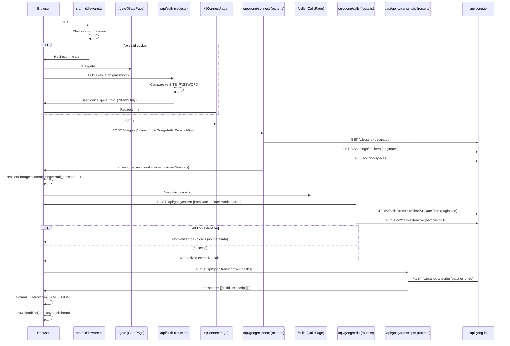

# GongWizard — Configuration Reference

## 1. Environment Variables

GongWizard has exactly one server-side environment variable. There are no `.env.example` or `.env.local.example` files in the repository; the variable is referenced directly in code.

| Name | Purpose | Required/Optional | Default Value | Where Used |
|---|---|---|---|---|
| `SITE_PASSWORD` | Password checked against user input on the gate page to issue the `gw-auth` session cookie | Required | None | `src/app/api/auth/route.ts` |

No other `process.env` references exist in the codebase. Gong API credentials are **not** stored in environment variables — they are supplied by the user at runtime, transmitted via the `X-Gong-Auth` request header, and held only in browser `sessionStorage` under the key `gongwizard_session`.

---

## 2. Build / Runtime Configuration

### `next.config.ts`

File: `next.config.ts`

```typescript
const nextConfig: NextConfig = {
  /* config options here */
};
```

The Next.js config is a stub with no active options. All Next.js defaults apply:

- App Router is used (no `pages/` directory).
- The dev server uses Turbopack (`next dev` — Next.js 16 enables Turbopack by default).
- No custom `rewrites`, `redirects`, `headers`, or `images` configuration.
- No `serverExternalPackages`, `transpilePackages`, or `output` mode set.

**Effective framework version:** `next@16.1.6`

---

### `tsconfig.json`

File: `tsconfig.json`

| Option | Value | Effect |
|---|---|---|
| `target` | `ES2017` | Compiled output targets ES2017 (async/await native) |
| `lib` | `["dom", "dom.iterable", "esnext"]` | Full browser and ESNext APIs available |
| `strict` | `true` | Enables all strict type checks (`strictNullChecks`, `noImplicitAny`, etc.) |
| `noEmit` | `true` | Type-check only; Next.js handles compilation |
| `module` | `esnext` | ESM module syntax |
| `moduleResolution` | `bundler` | Resolves modules as a bundler would (no `.js` extension required on imports) |
| `resolveJsonModule` | `true` | Allows importing `.json` files |
| `isolatedModules` | `true` | Each file must be independently transpilable (required by Next.js/SWC) |
| `incremental` | `true` | Incremental compilation cache enabled |
| `jsx` | `react-jsx` | Uses the React 17+ automatic JSX transform (no `import React` needed) |
| `paths` | `{"@/*": ["./src/*"]}` | `@/` maps to `src/` — used throughout the codebase for all internal imports |
| `plugins` | `[{ "name": "next" }]` | Enables Next.js TypeScript plugin for IDE support |

---

### Tailwind CSS

**Version:** `tailwindcss@^4` (Tailwind v4)

No `tailwind.config.js` or `tailwind.config.ts` file is present in the repomix output. Tailwind v4 uses CSS-first configuration — all theme customization lives in the global CSS file (`src/app/globals.css`, not included in the repomix subset). The PostCSS integration is provided by `@tailwindcss/postcss@^4`.

The codebase uses standard Tailwind v4 utility classes throughout. No custom plugins are referenced in `package.json` beyond `tw-animate-css@^1.4.0`, which provides animation utilities used in shadcn/ui component transitions (e.g., `animate-in`, `fade-in-0`, `zoom-in-95`).

---

### ESLint

**Config:** `eslint-config-next@16.1.6` — the standard Next.js ESLint ruleset.

No custom `.eslintrc` or `eslint.config.*` is present in the repomix output. The Next.js config includes rules for React Hooks, accessibility (`jsx-a11y`), and `@next/next` specific linting.

Run: `npm run lint` (invokes `eslint` with Next.js defaults).

---

## 3. Feature Flags / Constants

These are hardcoded values that control runtime behavior.

### API Pagination Delays

| Name | Value | File | What It Controls |
|---|---|---|---|
| Pagination delay (inline) | `350` ms | `src/app/api/gong/connect/route.ts` | Pause between paginated Gong API requests to avoid rate limiting |
| Pagination delay (inline) | `350` ms | `src/app/api/gong/calls/route.ts` | Same — between page cursor fetches and between batches |
| Pagination delay (inline) | `350` ms | `src/app/api/gong/transcripts/route.ts` | Same — between transcript batch requests |

### Batch Sizes

| Name | Value | File | What It Controls |
|---|---|---|---|
| `BATCH_SIZE` (calls) | `10` | `src/app/api/gong/calls/route.ts` | Number of call IDs sent per `/v2/calls/extensive` POST request |
| `BATCH_SIZE` (transcripts) | `50` | `src/app/api/gong/transcripts/route.ts` | Number of call IDs sent per `/v2/calls/transcript` POST request |

### Gong API Base URL Default

| Name | Value | File | What It Controls |
|---|---|---|---|
| Default base URL (inline) | `'https://api.gong.io'` | `src/app/api/gong/connect/route.ts`, `src/app/api/gong/calls/route.ts`, `src/app/api/gong/transcripts/route.ts` | Fallback Gong API base URL when none is supplied by the client. Can be overridden per-request via `body.baseUrl`. |

### Auth Cookie

| Name | Value | File | What It Controls |
|---|---|---|---|
| Cookie name | `'gw-auth'` | `src/app/api/auth/route.ts`, `src/middleware.ts` | Name of the httpOnly session cookie used for site access gating |
| Cookie value when authenticated | `'1'` | `src/app/api/auth/route.ts`, `src/middleware.ts` | The sentinel value checked by middleware |
| Cookie `maxAge` | `60 * 60 * 24 * 7` (7 days) | `src/app/api/auth/route.ts` | Session cookie lifetime |
| Cookie `sameSite` | `'lax'` | `src/app/api/auth/route.ts` | CSRF protection level |

### SessionStorage Key

| Name | Value | File | What It Controls |
|---|---|---|---|
| `'gongwizard_session'` | string key | `src/app/page.tsx`, `src/app/calls/page.tsx` | Browser `sessionStorage` key holding Gong credentials (`authHeader`), `users`, `trackers`, `workspaces`, `internalDomains`, and `baseUrl` for the current session. Cleared automatically when the tab is closed. |

### Token Estimation

| Name | Value | File | What It Controls |
|---|---|---|---|
| Chars-per-token divisor | `4` | `src/app/calls/page.tsx` (`estimateTokens`) | Rough estimate: `Math.ceil(text.length / 4)`. Used to display context-window fit labels. |

### Context Window Thresholds

Defined in `contextLabel()` in `src/app/calls/page.tsx`:

| Threshold | Label Displayed |
|---|---|
| `< 8,000` tokens | `Fits GPT-3.5 (8K)` |
| `< 16,000` tokens | `Fits Claude Haiku (16K)` |
| `< 32,000` tokens | `Fits ChatGPT Plus (32K)` |
| `< 128,000` tokens | `Fits GPT-4o / Claude (128K)` |
| `< 200,000` tokens | `Fits Claude (200K)` |
| `≥ 200,000` tokens | `Exceeds most context windows` |

Color coding in `contextColor()`:
- Green: `< 32,000` tokens
- Yellow: `32,000–127,999` tokens
- Red: `≥ 128,000` tokens

### Filler Patterns (Transcript Filtering)

Defined as `FILLER_PATTERNS` in `src/app/calls/page.tsx`. When the `removeFillerGreetings` export option is enabled, transcript turns matching this regex (or shorter than 5 characters) are stripped:

```
/^(hi|hello|hey|thanks|thank you|bye|goodbye|talk soon|have a great|sounds good|absolutely|of course|sure|yeah|yes|no|okay|ok|alright|right|great|perfect)[!.,\s]*$/i
```

### Monologue Condensing Threshold

| Value | File | What It Controls |
|---|---|---|
| `> 2` consecutive internal turns | `src/app/calls/page.tsx` (`condenseInternalMonologues`) | When `condenseMonologues` is enabled, only groups of more than 2 consecutive same-speaker internal turns are merged into a single turn. |

### Extensive API Fallback

| Condition | File | Behavior |
|---|---|---|
| `/v2/calls/extensive` returns HTTP 403 | `src/app/api/gong/calls/route.ts` | Falls back to basic call data from `/v2/calls`. Extensive metadata (topics, trackers, brief, context) is unavailable; `parties`, `topics`, `trackers`, `brief`, `interactionStats` are empty/null. |

---

## 4. Third-Party Service Configuration

### Gong API

**Purpose:** Source of all call data — user lists, tracker definitions, workspace info, call metadata, and transcripts.

**Required env vars:** None. Credentials are user-supplied at runtime.

**Authentication:** HTTP Basic Auth. The client constructs a Base64-encoded `accessKey:secretKey` string via `btoa()` in `src/app/page.tsx` (`ConnectPage.handleConnect`) and passes it to all proxy API routes via the `X-Gong-Auth` request header. Proxy routes attach it as `Authorization: Basic <header>`.

**SDK/client:** No SDK. Raw `fetch()` calls via a local `gongFetch()` helper defined inline in each API route file.

**Endpoints used:**

| Endpoint | Method | File | Purpose |
|---|---|---|---|
| `/v2/users` | GET (paginated) | `src/app/api/gong/connect/route.ts` | Fetch all users; extract internal email domains for speaker classification |
| `/v2/settings/trackers` | GET (paginated) | `src/app/api/gong/connect/route.ts` | Fetch company keyword trackers |
| `/v2/workspaces` | GET | `src/app/api/gong/connect/route.ts` | Fetch workspace list for optional workspace filtering |
| `/v2/calls` | GET (paginated) | `src/app/api/gong/calls/route.ts` | Fetch basic call list for a date range; provides call IDs for the extensive step |
| `/v2/calls/extensive` | POST (batched, 10 per batch) | `src/app/api/gong/calls/route.ts` | Fetch full call metadata: parties, topics, trackers, brief, key points, action items, CRM context |
| `/v2/calls/transcript` | POST (batched, 50 per batch) | `src/app/api/gong/transcripts/route.ts` | Fetch transcript monologues (sentences with speakerId, text, start time) |

**Base URL override:** All proxy routes accept an optional `baseUrl` in the POST body (default: `https://api.gong.io`). This allows pointing at a custom Gong instance URL.

---

### Next.js Google Fonts (Geist)

**Purpose:** Typography. Loads `Geist` (sans-serif) and `Geist_Mono` (monospace) from Google Fonts at build time via `next/font/google`.

**Required env vars:** None. Font loading is handled automatically by Next.js at build/runtime.

**Initialization location:** `src/app/layout.tsx`

```typescript
const geistSans = Geist({ variable: "--font-geist-sans", subsets: ["latin"] });
const geistMono = Geist_Mono({ variable: "--font-geist-mono", subsets: ["latin"] });
```

CSS variables `--font-geist-sans` and `--font-geist-mono` are applied on `<body>` via the `antialiased` className.

---

## 5. Request Flow Diagram


