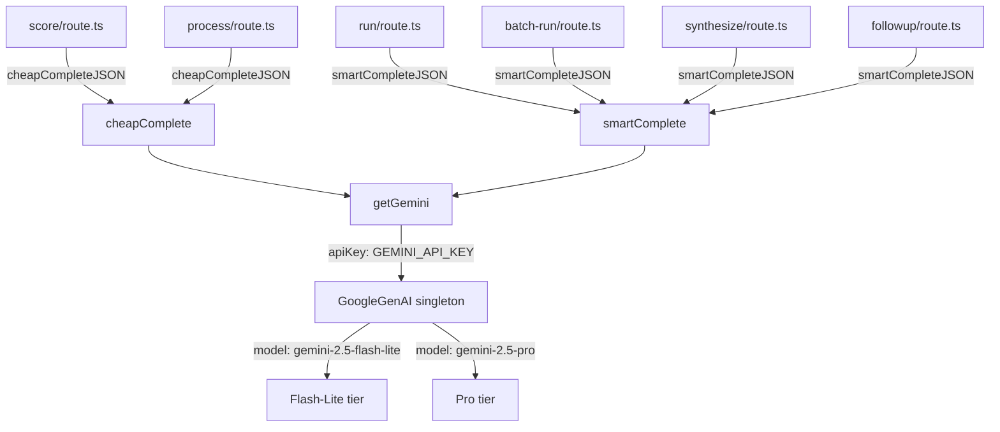

# Configuration Reference

## 1. Environment Variables

| Name | Purpose | Required/Optional | Default Value | Where Used |
| --- | --- | --- | --- | --- |
| `SITE_PASSWORD` | Password checked by `POST /api/auth` to issue the `gw-auth` session cookie. If unset, the route returns HTTP 500. | Required | None | `src/app/api/auth/route.ts` |
| `GEMINI_API_KEY` | API key for Google Gemini. Consumed by the lazy singleton `getGemini()` to construct a `GoogleGenAI` client. Missing key throws `'GEMINI_API_KEY not configured'` at call time. | Required for AI analysis features | None | `src/lib/ai-providers.ts` |

**Notes:**

- No database is used. Gong API credentials are user-supplied at runtime via the Connect page, Base64-encoded as `btoa(accessKey:secretKey)`, stored in browser `sessionStorage` under `gongwizard_session`, and forwarded to all proxy routes via the `X-Gong-Auth` request header. They are never stored server-side and are not environment variables.
- The `openai` package appears in `package.json` but no `process.env.OPENAI_API_KEY` reference exists in any current source file — it is unused at the time of this writing.
- No `.env.example` file exists in the repository. The only `process.env` references in source code are `SITE_PASSWORD` and `GEMINI_API_KEY`.

---

## 2. Build / Runtime Configuration

### `next.config.ts`

Location: `next.config.ts` (project root)

```typescript
const nextConfig: NextConfig = {
  /* config options here */
};
```

The config object is empty — no custom Next.js settings are applied. All behavior is Next.js 16.1.6 defaults, including App Router and Turbopack dev server (enabled by default in Next.js 16 via `next dev`).

One route-level override exists outside `next.config.ts`: `export const maxDuration = 60` is declared at the top of four API route files. This is a Vercel-specific export that raises the serverless function timeout from the default 10 s to 60 s. Affected routes:

| File | `maxDuration` |
| --- | --- |
| `src/app/api/analyze/batch-run/route.ts` | `60` s |
| `src/app/api/analyze/run/route.ts` | `60` s |
| `src/app/api/analyze/synthesize/route.ts` | `60` s |
| `src/app/api/analyze/followup/route.ts` | `60` s |

---

### `tsconfig.json`

Location: `tsconfig.json` (project root)

| Option | Value | Effect |
| --- | --- | --- |
| `target` | `"ES2017"` | Compiles to ES2017 output |
| `lib` | `["dom", "dom.iterable", "esnext"]` | Includes browser DOM and latest ES types |
| `strict` | `true` | Enables all strict type-checks |
| `noEmit` | `true` | Type-check only; Next.js handles compilation |
| `module` | `"esnext"` | ESM module format |
| `moduleResolution` | `"bundler"` | Matches Next.js/Turbopack resolution strategy |
| `resolveJsonModule` | `true` | Allows importing `.json` files as modules |
| `isolatedModules` | `true` | Each file compiled independently (required for SWC/Turbopack) |
| `jsx` | `"react-jsx"` | React 17+ automatic JSX transform — no need to import React |
| `incremental` | `true` | Enables incremental compilation cache |
| `plugins` | `[{ "name": "next" }]` | Activates the Next.js TypeScript plugin for IDE diagnostics |
| `paths` | `{ "@/*": ["./src/*"] }` | `@/` alias resolves to `src/` throughout the codebase |

---

### Tailwind CSS

Tailwind v4 is used. There is no `tailwind.config.ts` file — all configuration is CSS-native via `@theme inline {}` and `:root {}` blocks in `src/app/globals.css`.

**PostCSS plugin** (`postcss.config.mjs`):

```js
plugins: {
  "@tailwindcss/postcss": {},
}
```

**Dark mode variant** (in `globals.css`): `@custom-variant dark (&:is(.dark *))` — activated by adding the `dark` class to a parent element.

**Fonts** (mapped in `@theme inline`):

| CSS Variable | Resolved Value |
| --- | --- |
| `--font-sans` | `var(--font-geist-sans)` — Geist loaded via `next/font/google` in `src/app/layout.tsx` |
| `--font-mono` | `var(--font-geist-mono)` — Geist Mono loaded via `next/font/google` in `src/app/layout.tsx` |

---

### ESLint

Location: `eslint.config.mjs` (project root, flat config format)

| Property | Value |
| --- | --- |
| ESLint version | `^9` |
| Presets extended | `eslint-config-next/core-web-vitals`, `eslint-config-next/typescript` |
| `eslint-config-next` version | `16.1.6` |
| Run command | `npm run lint` |

No custom rule overrides are defined. Default `globalIgnores` cover `.next/**`, `out/**`, `build/**`, and `next-env.d.ts`.

---

## 3. Feature Flags / Constants

### `src/lib/gong-api.ts`

| Name | Value | Type | What It Controls |
| --- | --- | --- | --- |
| `GONG_RATE_LIMIT_MS` | `350` | `number` (ms) | Delay between consecutive Gong API requests. Keeps rate safely under Gong's ~3 req/s limit. Used in every proxy route that paginates or batches. |
| `EXTENSIVE_BATCH_SIZE` | `10` | `number` | Max call IDs per `POST /v2/calls/extensive` request. Gong API hard limit. Used in `src/app/api/gong/calls/route.ts`. |
| `TRANSCRIPT_BATCH_SIZE` | `50` | `number` | Max call IDs per `POST /v2/calls/transcript` request. Gong API hard limit. Used in `src/app/api/gong/transcripts/route.ts` and `src/app/api/gong/search/route.ts`. |
| `MAX_RETRIES` | `5` | `number` | Maximum retry attempts for failed Gong API requests before throwing. 401/403/404 errors throw immediately without retrying. Backoff formula: `Math.min(2 ** attempt * 2, 30) * 1000` ms (caps at 30 s). |

---

### `src/app/api/gong/calls/route.ts`

| Name | Value | Type | What It Controls |
| --- | --- | --- | --- |
| `DEFAULT_DAYS` | `90` | `number` | Date range (days back from now) used when the client sends no `fromDate`/`toDate` in the request body. |
| `CHUNK_DAYS` | `30` | `number` | The date range is split into 30-day windows via `buildDateChunks()` for optimal Gong API performance. Each chunk is fetched sequentially. |

---

### `src/lib/transcript-surgery.ts`

| Name | Value | Type | What It Controls |
| --- | --- | --- | --- |
| `GREETING_CLOSING_WINDOW_MS` | `60_000` | `number` (ms) | First and last 60 seconds of a call are treated as greeting/closing zones. Utterances under 15 words within these zones are excluded from surgical extraction by `isGreetingOrClosing()`. |
| `FILLER_PATTERNS` | Regex array | `RegExp[]` | Matches single-word or short filler utterances (`hi`, `yes`, `okay`, `mm-hmm`, etc.). Matched utterances are excluded by `isFiller()`. Any utterance under 5 characters is also treated as filler. |
| Minimum utterance word count (in `performSurgery`) | `8` | `number` | Utterances shorter than 8 words are dropped during extraction. Ported from V2. |
| Smart truncation threshold (in `performSurgery`) | `60` | `number` (words) | Internal monologues over 60 words are flagged `needsSmartTruncation = true` for AI-assisted condensing via `POST /api/analyze/process`. |
| Context reach-back threshold (in `enrichContext`) | `11` | `number` (words) | If the immediately preceding utterance has fewer than 11 words, `enrichContext` reaches back one more utterance (max depth 2) for richer context. |
| `windowMs` default in `findNearestOutlineItem` | `30_000` | `number` (ms) | Outline item lookup tolerance: returns the closest Gong AI outline item within ±30 seconds of a given utterance timestamp. |

---

### `src/lib/token-utils.ts`

Token estimation formula in `estimateTokens`: `Math.ceil(text.length / 4)` — rough characters-to-tokens approximation.

`contextLabel(tokens)` bucket thresholds:

| Token Range | Label |
| --- | --- |
| < 8,000 | `'Small (fits most models)'` |
| < 16,000 | `'Medium (GPT-4, Claude Haiku)'` |
| < 128,000 | `'Large (GPT-4 Turbo, Claude Opus)'` |
| < 200,000 | `'Very large (Claude Sonnet, Gemini)'` |
| ≥ 200,000 | `'Exceeds typical context windows'` |

`contextColor(tokens)` thresholds:

| Token Range | CSS Classes |
| --- | --- |
| < 32,000 | `text-green-600 dark:text-green-400` |
| < 128,000 | `text-yellow-600 dark:text-yellow-400` |
| ≥ 128,000 | `text-red-600 dark:text-red-400` |

---

### `src/hooks/useFilterState.ts`

| Name | Value | Type | What It Controls |
| --- | --- | --- | --- |
| `STORAGE_KEY` | `'gongwizard_filters'` | `string` | `localStorage` key for persisting numeric/boolean filter state across page reloads. Stores the `PersistedFilters` shape: `excludeInternal`, `durationMin`, `durationMax`, `talkRatioMin`, `talkRatioMax`, `minExternalSpeakers`. |

Default filter values on first load or after `resetFilters()`:

| Filter | Default |
| --- | --- |
| `durationMin` | `0` s |
| `durationMax` | `7200` s (2 hours) |
| `talkRatioMin` | `0` % |
| `talkRatioMax` | `100` % |
| `minExternalSpeakers` | `0` |
| `excludeInternal` | `false` |

---

### `src/lib/session.ts`

| Name | Value | Type | What It Controls |
| --- | --- | --- | --- |
| `SESSION_KEY` | `'gongwizard_session'` | `string` | `sessionStorage` key for the `GongSession` object. Stores `authHeader`, `users`, `trackers`, `workspaces`, `internalDomains`, `baseUrl`. Cleared automatically when the tab closes. |

---

### `src/app/api/auth/route.ts` — Auth Cookie

| Property | Value |
| --- | --- |
| Cookie name | `gw-auth` |
| Cookie value on success | `'1'` |
| `httpOnly` | `true` |
| `maxAge` | `604800` s (7 days) |
| `path` | `'/'` |
| `sameSite` | `'lax'` |

---

### `src/middleware.ts` — Middleware Matcher

| Property | Value |
| --- | --- |
| Matcher pattern | `['/((?!_next/static\|_next/image\|favicon.ico).*)']` |
| Bypassed paths | Routes starting with `/gate`, `/api/auth`, `/favicon` |
| Auth check | Cookie `gw-auth` value must equal `'1'`; otherwise redirect to `/gate` |

---

### Gong API default base URL

All Gong proxy routes accept an optional `baseUrl` field in the POST body (trailing slashes stripped). When omitted, the default is:

```text
https://api.gong.io
```

This supports custom Gong instance URLs used by some enterprise deployments. Applies in `src/app/api/gong/connect/route.ts`, `calls/route.ts`, `transcripts/route.ts`, and `search/route.ts`.

---

### Keyword search cap

| Location | Value | What It Controls |
| --- | --- | --- |
| `src/app/api/gong/search/route.ts` | `500` | Maximum call IDs accepted per search request (`callIds.slice(0, 500)`). |

---

### AI model IDs and invocation parameters

**`src/lib/ai-providers.ts`** — model IDs and default options:

| Tier | Model ID | Default `temperature` | Default `maxOutputTokens` |
| --- | --- | --- | --- |
| Cheap (`cheapComplete` / `cheapCompleteJSON`) | `'gemini-2.5-flash-lite'` | `0.3` | `1024` |
| Smart (`smartComplete` / `smartCompleteJSON` / `smartStream`) | `'gemini-2.5-pro'` | `0.3` | `8192` |

All JSON-returning calls pass `responseMimeType: 'application/json'` (native JSON mode, enabled via `jsonMode: true` internally).

**Per-route call parameters** (override the defaults above):

| Route | Function | `temperature` | `maxTokens` | Purpose |
| --- | --- | --- | --- | --- |
| `src/app/api/analyze/score/route.ts` | `cheapCompleteJSON` | `0.2` | `4096` | Batch call relevance scoring |
| `src/app/api/analyze/process/route.ts` | `cheapCompleteJSON` | `0.2` | `2048` | Smart truncation of long internal monologues |
| `src/app/api/analyze/run/route.ts` | `smartCompleteJSON` | `0.3` | `4096` | Single-call finding extraction |
| `src/app/api/analyze/batch-run/route.ts` | `smartCompleteJSON` | `0.3` | `16384` | Multi-call batch finding extraction |
| `src/app/api/analyze/synthesize/route.ts` | `smartCompleteJSON` | `0.3` | `4096` | Cross-call synthesis |
| `src/app/api/analyze/followup/route.ts` | `smartCompleteJSON` | `0.3` | `4096` | Follow-up Q&A against cached evidence |

---

## 4. Third-Party Service Configuration

### Google Gemini

**Purpose:** Powers all AI analysis — call relevance scoring, smart truncation of internal monologues, per-call finding extraction, multi-call batch extraction, cross-call synthesis, and follow-up Q&A.

| Property | Detail |
| --- | --- |
| Required env var | `GEMINI_API_KEY` |
| SDK package | `@google/genai` `^1.43.0` |
| Client initialization | `src/lib/ai-providers.ts` — lazy module-level singleton: `let _gemini: GoogleGenAI \| null = null`, constructed on first call to `getGemini()` as `new GoogleGenAI({ apiKey: process.env.GEMINI_API_KEY })` |
| Cheap tier model | `gemini-2.5-flash-lite` — used by `cheapComplete` and `cheapCompleteJSON` |
| Smart tier model | `gemini-2.5-pro` — used by `smartComplete`, `smartCompleteJSON`, and `smartStream` |
| Server-side only | Yes — `GEMINI_API_KEY` is a server-only variable; never exposed to the browser |



---

### Gong API

**Purpose:** Source of all call data: users, trackers, workspaces, call list, full call metadata, and transcript monologues. GongWizard operates as a stateless proxy — Gong credentials are never stored server-side.

| Property | Detail |
| --- | --- |
| Required env var | None — credentials are user-supplied at runtime |
| Auth mechanism | HTTP Basic Auth (`Authorization: Basic <base64(accessKey:secretKey)>`), forwarded proxy-style via the `X-Gong-Auth` request header |
| Client initialization | `src/lib/gong-api.ts` — `makeGongFetch(baseUrl, authHeader)` factory function. Returns a per-request `fetch` wrapper with retry/backoff logic. Called at the top of each proxy route handler; no persistent client instance. |
| Credential storage | Browser `sessionStorage` only, under key `gongwizard_session` (managed by `src/lib/session.ts`). Cleared on tab close. Never stored server-side. |
| Default base URL | `https://api.gong.io` |

Proxy routes and the Gong endpoints they call:

| Proxy Route | Gong Endpoints Called |
| --- | --- |
| `src/app/api/gong/connect/route.ts` | `GET /v2/users`, `GET /v2/settings/trackers`, `GET /v2/workspaces` |
| `src/app/api/gong/calls/route.ts` | `GET /v2/calls`, `POST /v2/calls/extensive` |
| `src/app/api/gong/transcripts/route.ts` | `POST /v2/calls/transcript` |
| `src/app/api/gong/search/route.ts` | `POST /v2/calls/transcript` |

---

### Vercel

**Purpose:** Serverless deployment host for the Next.js application and all API route handlers.

| Property | Detail |
| --- | --- |
| Env vars to configure | `SITE_PASSWORD`, `GEMINI_API_KEY` — must be set in Vercel project settings |
| Default function timeout | 10 s (overridden to 60 s for four analyze routes via `export const maxDuration = 60`) |
| Deploy trigger | Push to `main` branch triggers automatic deployment |
| Timezone assumption | `buildDateChunks()` in `src/app/api/gong/calls/route.ts` uses `setHours(0, 0, 0, 0)` / `setHours(23, 59, 59, 999)` — correct when the server runs in UTC (Vercel default) |

---

### `next/font/google` (Geist fonts)

**Purpose:** Self-hosting Geist Sans and Geist Mono at build time, served without external font requests.

| Property | Detail |
| --- | --- |
| Initialization | `src/app/layout.tsx` — `Geist({ variable: '--font-geist-sans', subsets: ['latin'] })` and `Geist_Mono({ variable: '--font-geist-mono', subsets: ['latin'] })` |
| CSS variables injected | `--font-geist-sans`, `--font-geist-mono` — consumed by `@theme inline` in `src/app/globals.css` |
| API key required | No |

---

### `client-zip`

**Purpose:** Browser-side ZIP archive creation for bulk transcript exports.

| Property | Detail |
| --- | --- |
| Package | `client-zip` `^2.5.0` |
| Usage | `src/hooks/useCallExport.ts` — used to bundle multiple transcript files into a single downloadable `.zip` |
| API key required | No — runs entirely in the browser via `src/lib/browser-utils.ts` `downloadFile()` |
