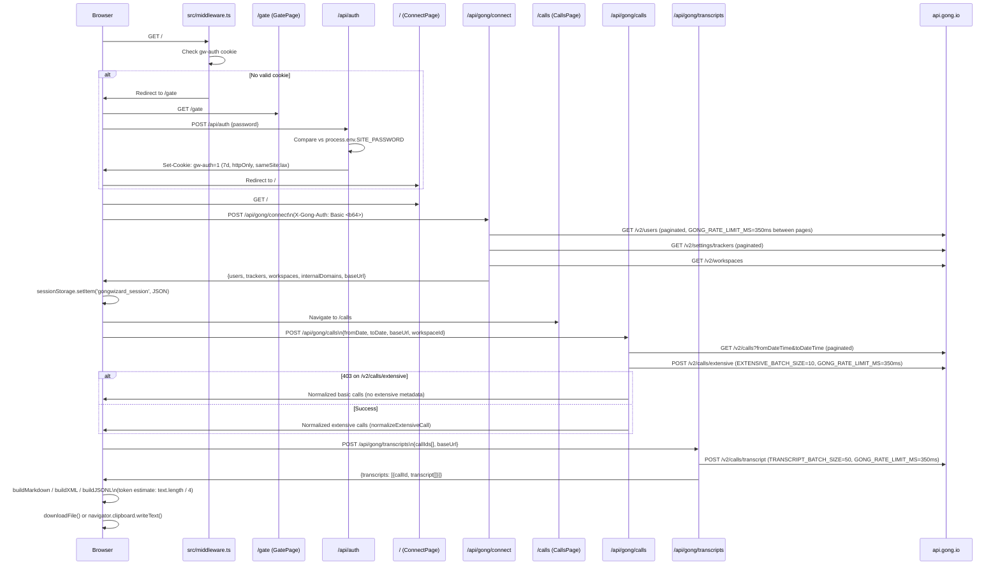

# Configuration Reference

GongWizard configuration reference covering environment variables, build/runtime config, feature flags, constants, and third-party service integration.

---

## 1. Environment Variables

GongWizard has exactly one server-side environment variable. There are no `.env.example` or `.env.local.example` files in the repository; the variable is referenced directly in code.

| Name | Purpose | Required/Optional | Default Value | Where Used |
|---|---|---|---|---|
| `SITE_PASSWORD` | Password checked against user input on the gate page to issue the `gw-auth` session cookie granting access to the app | Required | None | `src/app/api/auth/route.ts` |

No other `process.env` references exist in the codebase. Gong API credentials (`accessKey`, `secretKey`) are entered by the user at runtime on the Connect page, encoded via `btoa` into a Base64 Basic auth string, passed to Next.js API routes via the `X-Gong-Auth` request header, and held only in browser `sessionStorage` under the key `gongwizard_session`. They are never written to any server-side environment or persistent storage.

**Setup**: Create `.env.local` in the project root:

```
SITE_PASSWORD=your_site_password_here
```

---

## 2. Build / Runtime Configuration

### `next.config.ts`

**File**: `next.config.ts`

```ts
const nextConfig: NextConfig = {
  /* config options here */
};
```

The `nextConfig` object is currently empty — no custom rewrites, redirects, headers, or experimental features are configured. Next.js 16 defaults apply, including Turbopack being available for development. No `serverExternalPackages`, `transpilePackages`, `images`, or `output` mode is set.

**Effective framework version:** `next@16.1.6`

---

### `tsconfig.json`

**File**: `tsconfig.json`

| Option | Value | Effect |
|---|---|---|
| `target` | `"ES2017"` | Compiles to ES2017 syntax (async/await natively, no regenerator runtime) |
| `lib` | `["dom", "dom.iterable", "esnext"]` | Includes browser DOM types and latest ECMAScript types |
| `strict` | `true` | Enables all strict type-checking flags (`strictNullChecks`, `noImplicitAny`, etc.) |
| `noEmit` | `true` | Type-checking only; Next.js handles the actual emit via SWC/Turbopack |
| `module` | `"esnext"` | ESM module syntax |
| `moduleResolution` | `"bundler"` | Uses bundler-style resolution (matches Vite/Turbopack conventions; no `.js` extension needed on imports) |
| `resolveJsonModule` | `true` | Allows importing `.json` files as typed modules |
| `isolatedModules` | `true` | Each file must be independently transpilable; required for SWC |
| `incremental` | `true` | Caches type-check results for faster subsequent builds |
| `jsx` | `"react-jsx"` | Uses the automatic JSX transform (no `import React` needed in every file) |
| `paths` | `{ "@/*": ["./src/*"] }` | Alias `@/` maps to `src/` — used for all internal imports throughout the codebase |
| `plugins` | `[{ "name": "next" }]` | Enables the Next.js TypeScript plugin for enhanced IDE support |

---

### Tailwind CSS

**Version:** `tailwindcss@^4` (Tailwind v4)

No `tailwind.config.js` or `tailwind.config.ts` file is present. Tailwind v4 uses CSS-first configuration — all theme customization lives in the global CSS file (`src/app/globals.css`, imported in `src/app/layout.tsx`). PostCSS integration is provided by `@tailwindcss/postcss@^4` (devDependency).

The codebase uses standard Tailwind v4 utility classes throughout. The only additional styling package is `tw-animate-css@^1.4.0`, which provides animation utilities used in shadcn/ui component transitions (e.g., `animate-in`, `fade-in-0`, `zoom-in-95`, `slide-in-from-top-2`).

---

### ESLint

**Config:** `eslint-config-next@16.1.6` — the standard Next.js ESLint ruleset.

No custom `.eslintrc` or `eslint.config.*` is present in the repository. The Next.js config includes rules for React Hooks, accessibility (`jsx-a11y`), and `@next/next`-specific linting.

Run: `npm run lint` (invokes `eslint` via the script in `package.json`).

---

### Fonts

**File**: `src/app/layout.tsx`

Two Google Fonts are loaded via `next/font/google` and self-hosted by Next.js at build time (no CDN requests at runtime):

| Identifier | Font Family | CSS Variable | Subset |
|---|---|---|---|
| `geistSans` | `Geist` | `--font-geist-sans` | `latin` |
| `geistMono` | `Geist_Mono` | `--font-geist-mono` | `latin` |

Both CSS variables are applied to `<body>` alongside the `antialiased` Tailwind class.

---

### `package.json` Scripts

**File**: `package.json`

| Script | Command | Purpose |
|---|---|---|
| `dev` | `next dev` | Starts the development server (Turbopack available in Next.js 16) |
| `build` | `next build` | Produces an optimized production build |
| `start` | `next start` | Serves the production build locally |
| `lint` | `eslint` | Runs ESLint across the project |

---

## 3. Feature Flags / Constants

All hardcoded configuration constants that control runtime behavior are listed below.

### Gong API Rate Limiting and Batch Sizes

**File**: `src/lib/gong-api.ts`

| Constant | Value | What It Controls |
|---|---|---|
| `GONG_RATE_LIMIT_MS` | `350` | Milliseconds to sleep between paginated requests and between batch iterations. Keeps request rate safely below Gong's ~3 req/s enforced limit. Imported and used in all three proxy routes (`connect`, `calls`, `transcripts`). |
| `EXTENSIVE_BATCH_SIZE` | `10` | Maximum number of call IDs sent per request to `/v2/calls/extensive`. Matches the Gong API hard limit of 10 IDs per call. Used in `src/app/api/gong/calls/route.ts`. |
| `TRANSCRIPT_BATCH_SIZE` | `50` | Maximum number of call IDs sent per request to `/v2/calls/transcript`. Matches the Gong API hard limit of 50 IDs per call. Used in `src/app/api/gong/transcripts/route.ts`. |

### Default Gong API Base URL

| Value | Files | What It Controls |
|---|---|---|
| `'https://api.gong.io'` | `src/app/api/gong/calls/route.ts`, `src/app/api/gong/connect/route.ts`, `src/app/api/gong/transcripts/route.ts` | The default Gong REST API base URL used when the client does not supply a `baseUrl` in the POST body. Trailing slashes are stripped via `.replace(/\/+$/, '')` in each route. |

### Auth Cookie

**File**: `src/app/api/auth/route.ts` (writes), `src/middleware.ts` (reads)

| Property | Value | What It Controls |
|---|---|---|
| Cookie name | `'gw-auth'` | The httpOnly cookie set after successful site password entry |
| Cookie value | `'1'` | The sentinel value checked by middleware (`auth?.value === '1'`) |
| `maxAge` | `60 * 60 * 24 * 7` (604800 s = 7 days) | How long the site auth cookie persists before requiring re-entry of the site password |
| `sameSite` | `'lax'` | Allows top-level navigations from external sites while blocking CSRF |
| `path` | `'/'` | Cookie is valid for all routes |
| `httpOnly` | `true` | Cookie is not accessible from JavaScript |

### Middleware Route Matcher

**File**: `src/middleware.ts`

| Property | Value | What It Controls |
|---|---|---|
| `config.matcher` | `['/((?!_next/static\|_next/image\|favicon.ico).*)']` | The paths where middleware runs. Next.js static assets and favicon are excluded at the matcher level. Routes explicitly bypassed inside the `middleware()` function body: `/gate`, `/api/`, `/_next/`, `/favicon`. |

### Session Storage Key

**Files**: `src/app/page.tsx` (`saveSession`), `src/app/calls/page.tsx` (`saveSession`, `getSession`, `disconnect`)

| Key | Value | Contents |
|---|---|---|
| `gongwizard_session` | JSON string | `authHeader` (Base64 Basic auth string), `users` array, `trackers` array, `workspaces` array, `internalDomains` string array, `baseUrl` string |

Cleared on `disconnect()` via `sessionStorage.removeItem('gongwizard_session')` and automatically cleared when the browser tab is closed.

### Token Estimation

**File**: `src/app/calls/page.tsx`

| Heuristic / Constant | Value | Function | What It Controls |
|---|---|---|---|
| Characters per token divisor | `4` | `estimateTokens(text)` | Approximates token count from character length: `Math.ceil(text.length / 4)`. Applied to actual exported text in `buildMarkdown`. |
| Words per minute (speaking rate) | `130` | `tokenEstimate` useMemo | Used in pre-fetch token estimation on the calls page. Multiplied by duration in minutes and tokens-per-word to estimate tokens before transcripts are fetched. |
| Tokens per word | `1.3` | `tokenEstimate` useMemo | Multiplier applied to estimated word count in pre-fetch token estimate. |

### Context Window Labels

**File**: `src/app/calls/page.tsx`, function `contextLabel(tokens)`

| Token Threshold | Label Displayed |
|---|---|
| `< 8,000` | `Fits GPT-3.5 (8K)` |
| `< 16,000` | `Fits Claude Haiku (16K)` |
| `< 32,000` | `Fits ChatGPT Plus (32K)` |
| `< 128,000` | `Fits GPT-4o / Claude (128K)` |
| `< 200,000` | `Fits Claude (200K)` |
| `>= 200,000` | `Exceeds most context windows` |

Color coding via `contextColor(tokens)`:

| Token Threshold | Tailwind Classes |
|---|---|
| `< 32,000` | `text-green-600 dark:text-green-400` |
| `< 128,000` | `text-yellow-600 dark:text-yellow-400` |
| `>= 128,000` | `text-red-600 dark:text-red-400` |

### Filler Turn Filter

**File**: `src/app/calls/page.tsx`, constant `FILLER_PATTERNS`

When the `removeFillerGreetings` export option is `true`, transcript turns are removed if their trimmed text is shorter than 5 characters or matches this regex:

```
/^(hi|hello|hey|thanks|thank you|bye|goodbye|talk soon|have a great|sounds good|absolutely|of course|sure|yeah|yes|no|okay|ok|alright|right|great|perfect)[!.,\s]*$/i
```

Applied by `filterFillerTurns(turns)`.

### Monologue Condensing Threshold

**File**: `src/app/calls/page.tsx`, function `condenseInternalMonologues(turns)`

| Value | What It Controls |
|---|---|
| `> 2` consecutive internal turns | When `condenseMonologues` is enabled, only runs of more than 2 consecutive turns from the same internal speaker are merged into a single turn. Runs of 1 or 2 are preserved to maintain short back-and-forth exchanges. |

### Default Export Options

Initial state of `exportOpts` in `CallsPage` (`src/app/calls/page.tsx`):

| Option | Default | What It Controls |
|---|---|---|
| `removeFillerGreetings` | `true` | Strip filler/greeting turns from the export |
| `condenseMonologues` | `true` | Merge 3+ consecutive same-speaker internal turns into one |
| `includeMetadata` | `true` | Include speaker list and account name in the export |
| `includeAIBrief` | `true` | Include the Gong AI brief in the export |
| `includeInteractionStats` | `true` | Include talk ratio, interactivity, longest monologue, patience, question rate |

### Default Date Range

**File**: `src/app/calls/page.tsx`

| State | Initial Value | What It Controls |
|---|---|---|
| `fromDate` | `format(subDays(today, 30), 'yyyy-MM-dd')` | Default "From" date input: 30 days before the current date (via `date-fns`) |
| `toDate` | `format(today, 'yyyy-MM-dd')` | Default "To" date input: current date |

### Extensive API Fallback

**File**: `src/app/api/gong/calls/route.ts`

| Condition | Behavior |
|---|---|
| `/v2/calls/extensive` returns HTTP 403 | Sets `extensiveFailed = true`, breaks out of the batch loop, falls back to basic `/v2/calls` data. Returned call objects have empty `parties`, `topics`, `trackers`, `brief`, and `null` `interactionStats`. A warning is logged via `console.warn`. |

---

## 4. Third-Party Service Configuration

### Gong REST API

**Purpose:** Source of all call data — user lists, tracker definitions, workspace info, call metadata, and transcripts.

**Required env vars:** None. Credentials are user-supplied at runtime (Access Key + Secret Key from Gong Settings → API → API Keys).

**Authentication:** HTTP Basic Auth. The client constructs a Base64-encoded `accessKey:secretKey` string via `btoa()` in `src/app/page.tsx` (`ConnectPage.handleConnect`) and passes it to all proxy API routes via the `X-Gong-Auth` request header. Proxy routes attach it as `Authorization: Basic <header>` in every outbound request.

**SDK/Client initialization:** No SDK. All requests use native `fetch()`. The `makeGongFetch(baseUrl, authHeader)` factory in `src/lib/gong-api.ts` returns a configured `gongFetch` function that is instantiated per-request in each proxy route handler.

**Error handling:** `GongApiError` class (extends `Error`) carries `status: number`, `message: string`, and `endpoint: string`. The `handleGongError(error)` function in `src/lib/gong-api.ts` maps `GongApiError` instances to typed `NextResponse` JSON responses.

**Endpoints proxied:**

| Endpoint | Method | Batching | Proxy Route File |
|---|---|---|---|
| `/v2/users` | GET (paginated via cursor) | — | `src/app/api/gong/connect/route.ts` |
| `/v2/settings/trackers` | GET (paginated via cursor) | — | `src/app/api/gong/connect/route.ts` |
| `/v2/workspaces` | GET | — | `src/app/api/gong/connect/route.ts` |
| `/v2/calls` | GET (paginated via cursor) | — | `src/app/api/gong/calls/route.ts` |
| `/v2/calls/extensive` | POST | `EXTENSIVE_BATCH_SIZE` = 10 IDs per request | `src/app/api/gong/calls/route.ts` |
| `/v2/calls/transcript` | POST | `TRANSCRIPT_BATCH_SIZE` = 50 IDs per request | `src/app/api/gong/transcripts/route.ts` |

---

### Next.js / Vercel

**Purpose:** Application framework and deployment platform.

**Required env vars:** Only `SITE_PASSWORD`.

**Configuration file:** `next.config.ts` (empty config object — all defaults).

**Deployment:** Push to `main` triggers auto-deploy on Vercel.

---

### `next/font/google` (Google Fonts)

**Purpose:** Loads Geist Sans and Geist Mono typefaces at build time.

**Required env vars:** None. Font loading is handled automatically by Next.js.

**Initialization location:** `src/app/layout.tsx`

```typescript
const geistSans = Geist({ variable: "--font-geist-sans", subsets: ["latin"] });
const geistMono = Geist_Mono({ variable: "--font-geist-mono", subsets: ["latin"] });
```

Fonts are downloaded at build time and self-hosted by Next.js — no Google Fonts CDN requests occur at runtime.

---

### Browser `sessionStorage`

**Purpose:** Ephemeral client-side storage for Gong API credentials and session data for the duration of a browser tab session.

**Required env vars:** None.

**Initialization locations:**
- Written: `saveSession()` in `src/app/page.tsx` (after successful connect) and `src/app/calls/page.tsx`
- Read: `getSession()` in `src/app/calls/page.tsx`
- Cleared: `disconnect()` in `src/app/calls/page.tsx` via `sessionStorage.removeItem('gongwizard_session')`

---

## 5. Configuration Flow Diagram


