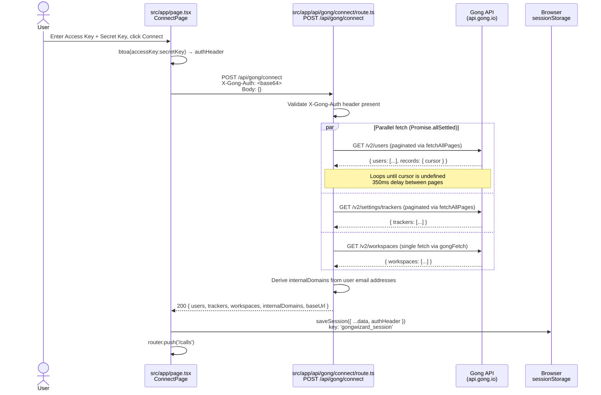
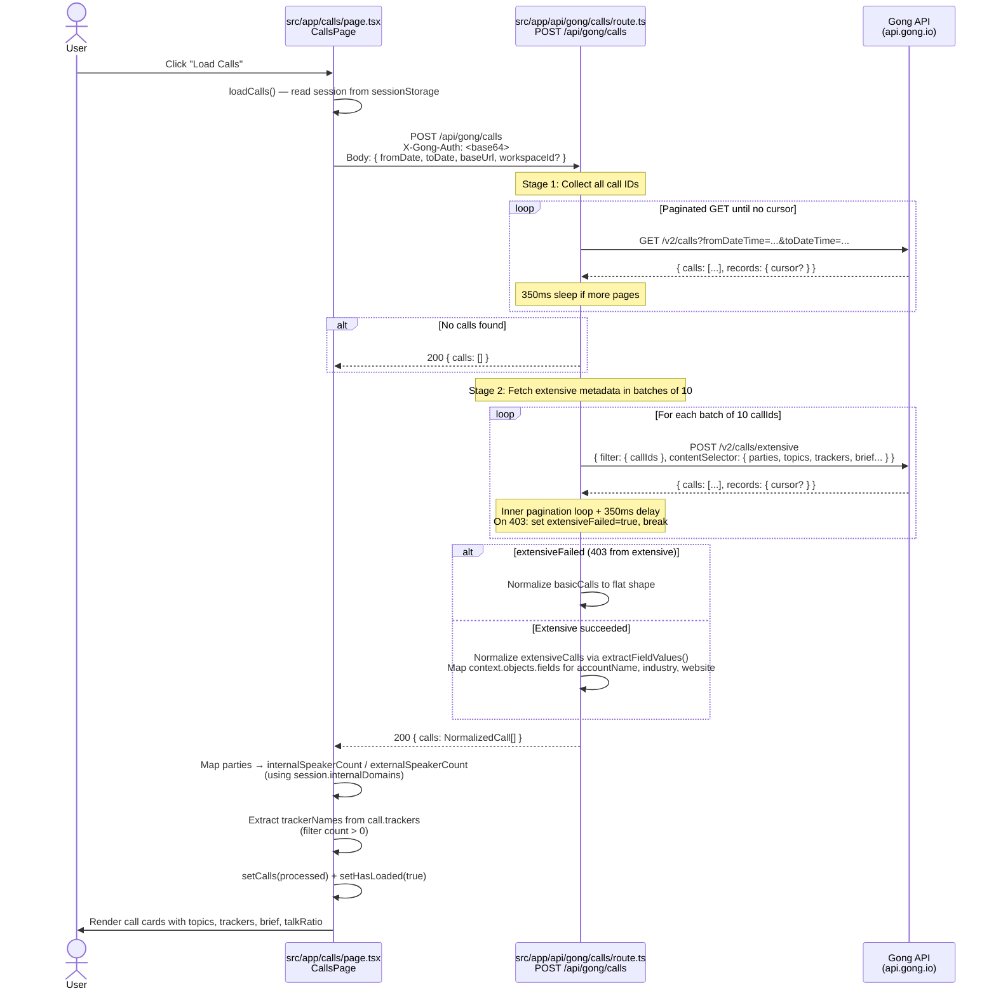
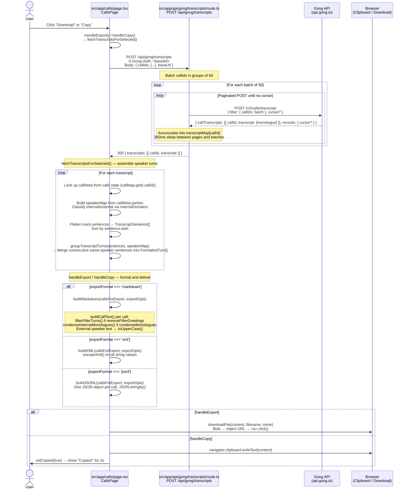

# GongWizard Data Flows

This document describes the major data pipelines in GongWizard. All flows are client-initiated; there are no background jobs or cron processes. The app is stateless — no database is involved. Gong API credentials are stored in `sessionStorage` only and forwarded to Gong via the Next.js proxy routes on each request.

---

## Flow 1: Site Authentication (Password Gate)

**Triggered when:** Any unauthenticated user navigates to any page on the site.

The app uses a shared site password (unrelated to Gong credentials) to restrict access. The Next.js middleware checks for a cookie on every request and redirects unauthenticated users to `/gate`.

```mermaid
sequenceDiagram
    actor User
    participant Browser
    participant Middleware as src/middleware.ts<br/>middleware()
    participant GatePage as src/app/gate/page.tsx<br/>GatePage
    participant AuthRoute as src/app/api/auth/route.ts<br/>POST /api/auth

    User->>Browser: Navigate to any page (e.g. /)
    Browser->>Middleware: HTTP request
    Middleware->>Middleware: Check cookies.get('gw-auth')
    alt gw-auth cookie missing or not '1'
        Middleware-->>Browser: 302 Redirect to /gate
        Browser->>GatePage: Load /gate
        User->>GatePage: Enter site password, submit
        GatePage->>AuthRoute: POST /api/auth { password }
        AuthRoute->>AuthRoute: Compare password to process.env.SITE_PASSWORD
        alt Password correct
            AuthRoute-->>GatePage: 200 { ok: true }<br/>Set-Cookie: gw-auth=1; httpOnly; maxAge=7d
            GatePage->>Browser: router.push('/') + router.refresh()
        else Password wrong
            AuthRoute-->>GatePage: 401 { error: 'Incorrect password.' }
            GatePage->>User: Display error message
        end
    else gw-auth === '1'
        Middleware-->>Browser: NextResponse.next() — allow through
    end
```

**Step-by-step:**

1. `src/middleware.ts:middleware()` runs on every request matching the `matcher` pattern. It skips `/gate`, `/api/*`, and `/_next/*` paths.
2. For all other paths, it reads `request.cookies.get('gw-auth')`. If the value is not `'1'`, it clones the URL, sets `pathname = '/gate'`, and returns a redirect.
3. The user lands on `src/app/gate/page.tsx:GatePage`, which renders a password form.
4. On submit, `GatePage:handleSubmit()` POSTs `{ password }` to `/api/auth`.
5. `src/app/api/auth/route.ts:POST()` compares the submitted password against `process.env.SITE_PASSWORD`. On success it calls `response.cookies.set('gw-auth', '1', { httpOnly: true, maxAge: 604800, sameSite: 'lax' })` and returns `{ ok: true }`.
6. `GatePage` calls `router.push('/')` and `router.refresh()` to proceed to the connect step.

---

## Flow 2: Gong API Connection (Credential Validation)

**Triggered when:** The user submits their Gong Access Key and Secret Key on the Connect page (`/`).

This flow validates credentials and pre-fetches the org-level data (users, trackers, workspaces) that will be needed throughout the session. All results are saved to `sessionStorage` via `saveSession()`.



**Step-by-step:**

1. `src/app/page.tsx:ConnectPage:handleConnect()` Base64-encodes `accessKey:secretKey` using `btoa()` to produce the `authHeader`.
2. It POSTs to `/api/gong/connect` with `X-Gong-Auth: <authHeader>` in the headers.
3. `src/app/api/gong/connect/route.ts:POST()` extracts the auth header and calls three Gong endpoints in parallel using `Promise.allSettled()`:
   - `fetchAllPages('/v2/users', 'users')` — paginates through all users; 350ms sleep between pages to respect rate limits.
   - `fetchAllPages('/v2/settings/trackers', 'trackers')` — paginates through all keyword trackers.
   - `gongFetch('/v2/workspaces')` — single request for workspace list.
4. If the users fetch returns a 401, the route immediately returns `{ error: 'Invalid API credentials' }`. Partial failures for trackers/workspaces generate warnings, not errors.
5. `internalDomains` is derived by extracting the email domain from each user's `emailAddress` field and deduplicating into an array. This is used later for speaker classification.
6. The route returns all results in one response. `ConnectPage:saveSession()` writes the entire payload (including `authHeader`) to `sessionStorage` under the key `'gongwizard_session'`.
7. `router.push('/calls')` navigates to the main calls view.

---

## Flow 3: Call List Fetch (Date-Range Query)

**Triggered when:** The user sets a date range and clicks "Load Calls" on the Calls page (`/calls`).

This is a two-stage pipeline: first fetch basic call IDs, then fetch full metadata in batches of 10 using the extensive endpoint. Falls back to basic data if the extensive endpoint returns 403.



**Step-by-step:**

1. `src/app/calls/page.tsx:CallsPage:loadCalls()` reads `session` from state (previously loaded from `sessionStorage`). It builds the request body with ISO timestamps.
2. `src/app/api/gong/calls/route.ts:POST()` runs Stage 1: a paginated `GET /v2/calls` loop. Each page appends to `basicCalls`; the loop exits when `data?.records?.cursor` is undefined.
3. Stage 2: for every batch of up to 10 `callIds`, it POSTs to `/v2/calls/extensive` with a `contentSelector` requesting `parties`, `topics`, `trackers`, `brief`, `keyPoints`, `actionItems`, `outline`, `structure`, and `context: 'Extended'`. Each batch may itself paginate.
4. If `/v2/calls/extensive` returns 403 (insufficient scope), `extensiveFailed` is set and the loop breaks. The route falls back to normalizing the basic call data, with empty `parties`, `topics`, `trackers`, etc.
5. For extensive calls, `extractFieldValues()` walks the nested `context[].objects[].fields[]` structure (ported from Python v1) to extract `accountName`, `accountIndustry`, and `accountWebsite`.
6. Back in `CallsPage`, each raw call's `parties` array is walked to classify speakers as internal or external using `p.affiliation === 'Internal'` or matching against `session.internalDomains`. Tracker names are extracted and filtered for `count > 0`.
7. `setCalls(processed)` triggers a re-render showing the call list with badges, brief text, and talk ratio bars.

---

## Flow 4: Transcript Fetch and Export

**Triggered when:** The user selects one or more calls and clicks "Download" or "Copy to Clipboard".

This is the primary value-add pipeline: it fetches raw transcript monologues from Gong, reassembles them into speaker turns, applies formatting transforms, and renders the result in Markdown, XML, or JSONL.



**Step-by-step:**

1. `src/app/calls/page.tsx:CallsPage:handleExport()` (or `handleCopy()`) calls `fetchTranscriptsForSelected()` with the current `selectedIds` set.
2. `fetchTranscriptsForSelected()` POSTs the array of call IDs and the `baseUrl` from session to `/api/gong/transcripts`.
3. `src/app/api/gong/transcripts/route.ts:POST()` processes call IDs in batches of 50 (`BATCH_SIZE = 50`). For each batch it POSTs to `/v2/calls/transcript` with `filter: { callIds: batch }`. Results are accumulated into a `transcriptMap` keyed by `callId`. The inner loop handles pagination; `sleep(350)` is called between pages and between batches to stay within Gong's rate limits.
4. The route returns `{ transcripts: [{ callId, transcript }] }` where `transcript` is the raw array of monologue tracks from Gong.
5. Back in `fetchTranscriptsForSelected()`, for each transcript:
   - The matching call metadata is retrieved from the `calls` state map.
   - A `speakerMap: Map<string, Speaker>` is built from `callMeta.parties`. Each party's `isInternal` flag is determined by `p.affiliation === 'Internal'` or by matching the email domain against `session.internalDomains`.
   - Each monologue track (`track.speakerId` + `track.sentences[]`) is flattened into a sorted array of `TranscriptSentence` objects (with `speakerId`, `text`, `start`).
   - `groupTranscriptTurns(sentences, speakerMap)` merges consecutive sentences from the same speaker into `FormattedTurn` objects, each carrying `speakerId`, `firstName`, `isInternal`, `timestamp` (formatted as `m:ss`), and concatenated `text`.
6. The array of `CallForExport` objects is passed to `buildMarkdown()`, `buildXML()`, or `buildJSONL()` depending on `exportFormat`.
7. Each formatter calls `filterFillerTurns()` (removes short/greeting-only utterances) and `condenseInternalMonologues()` (merges 3+ consecutive internal turns from the same speaker) if the corresponding `ExportOptions` flags are set. External speaker text is converted to uppercase to visually distinguish voices.
8. `downloadFile()` creates a `Blob`, generates an object URL, programmatically clicks an `<a>` element, then revokes the URL. For copy, `navigator.clipboard.writeText()` is used and a 2-second "Copied!" state is shown.
