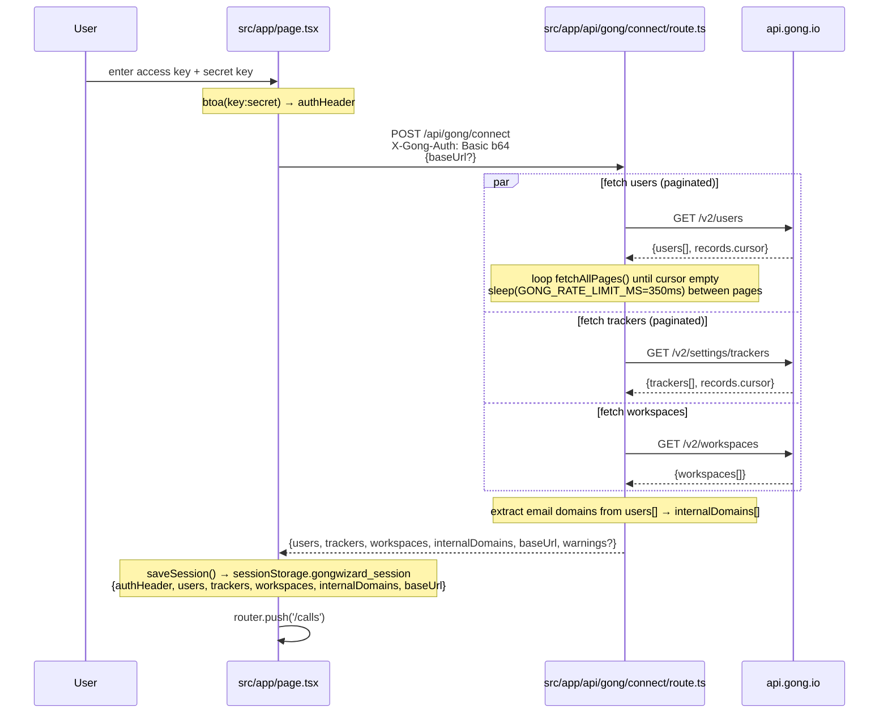
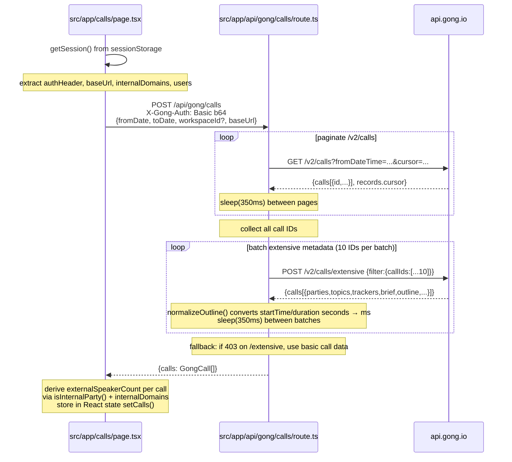
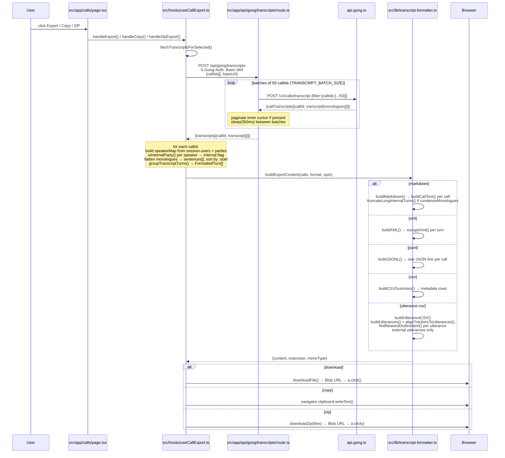
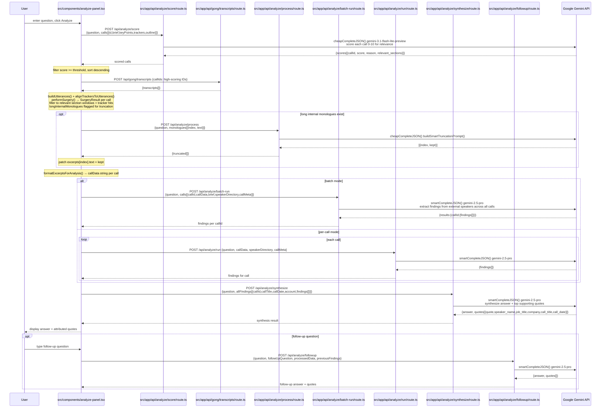
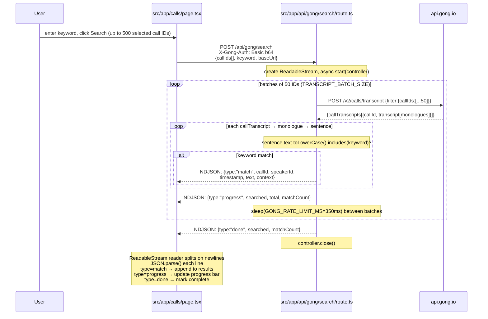

# GongWizard — Data Flows

Auto-generated. Regenerate with `/doc-update` from the project root.

---

## Table of Contents

1. [Site Gate Authentication](#1-site-gate-authentication)
2. [Gong Credential Connect](#2-gong-credential-connect)
3. [Call List Fetch](#3-call-list-fetch)
4. [Transcript Fetch and Export](#4-transcript-fetch-and-export)
5. [AI Research Pipeline (Analyze Panel)](#5-ai-research-pipeline-analyze-panel)
6. [Transcript Keyword Search (Streaming)](#6-transcript-keyword-search-streaming)

---

## 1. Site Gate Authentication

**What it does:** Every request to GongWizard passes through Next.js edge middleware that checks for a `gw-auth` cookie. If absent, the user is redirected to `/gate`. On the gate page the user submits a site password; the API route validates it against `SITE_PASSWORD` and sets a 7-day httpOnly cookie.

**Triggered by:** First visit to any page without a valid `gw-auth` cookie.

```mermaid
sequenceDiagram
    participant Browser
    participant Middleware as src/middleware.ts
    participant GatePage as src/app/gate/page.tsx
    participant AuthAPI as src/app/api/auth/route.ts

    Browser->>Middleware: GET /
    Note over Middleware: reads cookie gw-auth
    Middleware-->>Browser: 302 → /gate (no cookie)

    Browser->>GatePage: GET /gate
    GatePage-->>Browser: render GatePage form

    Browser->>AuthAPI: POST /api/auth {password}
    Note over AuthAPI: compares password to process.env.SITE_PASSWORD
    alt correct password
        AuthAPI-->>Browser: 200 {ok:true} + Set-Cookie: gw-auth=1; httpOnly; maxAge=604800
        Browser->>Middleware: GET /
        Note over Middleware: gw-auth=1 present → allow
        Middleware-->>Browser: 200 (home page)
    else wrong password
        AuthAPI-->>Browser: 401 {error: "Incorrect password."}
        GatePage-->>Browser: show error message
    end
```

**Step-by-step:**

1. `src/middleware.ts` `middleware()` runs on every request. It reads `request.cookies.get('gw-auth')`. If absent and the path is not `/gate`, `/api/auth`, `/api/gong/*`, or `/_next/*`, it redirects to `/gate`.
2. `src/app/gate/page.tsx` `GatePage` renders a password form. The user submits via `handleSubmit()`.
3. `handleSubmit()` POSTs `{password}` to `/api/auth`.
4. `src/app/api/auth/route.ts` `POST()` reads `process.env.SITE_PASSWORD`. On match it calls `response.cookies.set('gw-auth', '1', { httpOnly: true, maxAge: 604800 })` and returns `{ok: true}`.
5. `GatePage` receives `200` and calls `router.push('/')` followed by `router.refresh()`. Subsequent requests pass middleware because the cookie is present.

---

## 2. Gong Credential Connect

**What it does:** The home page (Step 1) collects a Gong API access key and secret key from the user. It constructs an HTTP Basic auth header, then calls the `/api/gong/connect` proxy. The proxy fetches all Gong users, trackers, and workspaces in parallel; derives internal email domains from user records; and returns everything. The client saves this to `sessionStorage` under the key `gongwizard_session`.

**Triggered by:** User submitting API credentials on `src/app/page.tsx`.



**Step-by-step:**

1. `src/app/page.tsx` collects `accessKey` and `secretKey` from the form. It builds `authHeader = 'Basic ' + btoa(accessKey + ':' + secretKey)`.
2. It POSTs to `/api/gong/connect` with `X-Gong-Auth: <authHeader>` and an optional `{baseUrl}` body.
3. `src/app/api/gong/connect/route.ts` `POST()` reads the header and calls `makeGongFetch(baseUrl, authHeader)` from `src/lib/gong-api.ts` to produce a typed fetch wrapper that injects Basic auth on every Gong request.
4. `fetchAllPages()` (defined inline in the route) paginates any Gong endpoint by following `records.cursor`, sleeping `GONG_RATE_LIMIT_MS` (350 ms) between pages via `sleep()` from `src/lib/gong-api.ts`.
5. Three fetches run in parallel via `Promise.allSettled`: `/v2/users`, `/v2/settings/trackers`, `/v2/workspaces`. Partial failures produce `warnings[]` rather than hard errors.
6. Internal email domains are derived: for each user's `emailAddress`, the domain after `@` is added to a `Set<string>` to produce `internalDomains[]`.
7. The route returns `{users, trackers, workspaces, internalDomains, baseUrl}`.
8. Back on the home page, `saveSession()` from `src/lib/session.ts` JSON-serialises the full object into `sessionStorage` under key `gongwizard_session`. The session clears when the tab closes (sessionStorage semantics). The user is navigated to `/calls`.

---

## 3. Call List Fetch

**What it does:** `/calls` page on mount reads the session, then calls `/api/gong/calls` which paginates the Gong call list and batch-fetches extensive metadata (parties, topics, trackers, brief, outline, CRM context) in batches of 10. The fully-enriched call array is returned and stored in React state on the client for filtering and selection.

**Triggered by:** `src/app/calls/page.tsx` mounting after a successful connect.



**Step-by-step:**

1. `src/app/calls/page.tsx` calls `getSession()` from `src/lib/session.ts` on mount to read back the session stored in step 2.
2. It POSTs to `/api/gong/calls` with the date range, optional `workspaceId`, and `baseUrl` from the session.
3. `src/app/api/gong/calls/route.ts` uses `makeGongFetch` then paginates `GET /v2/calls` (with `fromDateTime`, `toDateTime`, optional `workspaceId`) until `records.cursor` is absent. Rate limit sleep of `GONG_RATE_LIMIT_MS` (350 ms) between pages.
4. All collected call IDs are chunked into batches of `CALLS_BATCH_SIZE` (10). Each batch is sent to `POST /v2/calls/extensive`. If Gong returns 403 on the first extensive batch (scope not granted), the route falls back to the basic call data already fetched.
5. `normalizeOutline()` in the route converts Gong's `startTime`/`duration` values (seconds) to milliseconds in `startTimeMs`/`durationMs` fields to align with the transcript timestamps.
6. The route returns `{calls: GongCall[]}` with the full `src/types/gong.ts` shape.
7. Back on `calls/page.tsx`, speaker counts are derived client-side using `isInternalParty()` from `src/lib/format-utils.ts` against `internalDomains`. Results are stored via `setCalls()` and filtered by `useFilterState()` from `src/hooks/useFilterState.ts`.

---

## 4. Transcript Fetch and Export

**What it does:** When the user selects calls and clicks Export, Copy, or Export ZIP, `useCallExport` fetches transcripts from `/api/gong/transcripts`, assembles speaker maps from session data, groups sentences into per-turn blocks, and passes the result to the appropriate export builder which produces a file (Markdown, XML, JSONL, CSV, or Utterance CSV) that is downloaded or copied to clipboard.

**Triggered by:** User clicking Export / Copy / Export ZIP in `src/app/calls/page.tsx`.



**Step-by-step:**

1. The user selects calls on `src/app/calls/page.tsx` (tracked in `selectedIds: Set<string>` state). Clicking export invokes one of `handleExport`, `handleCopy`, or `handleZipExport` on the `useCallExport` hook from `src/hooks/useCallExport.ts`.
2. All three handlers call `fetchTranscriptsForSelected()`. This POSTs to `/api/gong/transcripts` with the selected IDs and `X-Gong-Auth` from session.
3. `src/app/api/gong/transcripts/route.ts` `POST()` chunks IDs into batches of `TRANSCRIPT_BATCH_SIZE` (50). Each batch calls `POST /v2/calls/transcript` with `{filter:{callIds:[...]}}`. An inner cursor loop handles pagination within each batch. A `sleep(GONG_RATE_LIMIT_MS)` separates batches.
4. Transcripts are accumulated in `transcriptMap: Record<string, monologue[]>` keyed by `callId`. The route returns `{transcripts: [{callId, transcript}]}`.
5. Back in `fetchTranscriptsForSelected()`, each transcript is matched to its call metadata from the `calls` prop. A `speakerMap` is built from `callMeta.parties` using `isInternalParty()` from `src/lib/format-utils.ts` against `session.internalDomains`.
6. Monologue sentences are flattened into a flat `TranscriptSentence[]` and sorted by `start` (milliseconds). `groupTranscriptTurns()` from `src/lib/transcript-formatter.ts` groups consecutive same-speaker sentences into `FormattedTurn[]` objects with timestamp, firstName, and isInternal.
7. `buildExportContent()` routes to the appropriate builder:
   - `buildMarkdown()` / `buildXML()` / `buildJSONL()`: all use `truncateLongInternalTurns()` when `condenseMonologues` is enabled, which applies `truncateIfLong()` to internal turns >= 150 words (first 2 + last 2 sentences with `[...]`).
   - `buildCSVSummary()`: one row per call, metadata only (topics, trackers, talk ratio, key points, action items, Gong URL).
   - `buildUtteranceCSV()`: external speaker utterances only. Calls `buildUtterances()` and `alignTrackersToUtterances()` from `src/lib/tracker-alignment.ts`, then `findNearestOutlineItem()` from `src/lib/transcript-surgery.ts` for the `Outline Section` column. Includes `PRIMARY_ANALYSIS_TEXT` and `REFERENCE_ONLY_CONTEXT` columns.
8. `downloadFile()` from `src/lib/browser-utils.ts` creates a Blob URL and triggers a synthetic `<a>` click. For ZIP, `downloadZip()` from `client-zip` assembles per-call files plus a `manifest.json` into a ZIP blob.

---

## 5. AI Research Pipeline (Analyze Panel)

**What it does:** The `AnalyzePanel` component orchestrates a multi-stage AI pipeline: (1) score calls for relevance using call metadata, (2) fetch transcripts for high-scoring calls, (3) perform surgical extraction of relevant utterances, (4) optionally use AI to truncate long internal monologues, (5) run per-call or batch AI analysis to extract verbatim external-speaker findings, (6) synthesize findings across all calls into a direct answer with attributed quotes. A follow-up question loop is available post-synthesis.

**Triggered by:** User entering a research question and clicking Analyze in `src/components/analyze-panel.tsx`.



**Step-by-step:**

1. `src/components/analyze-panel.tsx` collects a research question. On submit it sends all loaded call metadata (brief, keyPoints, trackers, outline) to `POST /api/analyze/score`.
2. `src/app/api/analyze/score/route.ts` calls `cheapCompleteJSON()` from `src/lib/ai-providers.ts` (Gemini Flash-Lite `gemini-3.1-flash-lite-preview`, temp 0.2) with a prompt asking for a 0-10 relevance score plus `relevant_sections` names per call. Falls back to neutral score 5 on parse error.
3. The panel filters calls above a score threshold and requests their transcripts from `/api/gong/transcripts` (same flow as section 4, steps 2-4).
4. Client-side: `buildUtterances()` and `alignTrackersToUtterances()` from `src/lib/tracker-alignment.ts` produce `Utterance[]` with tracker labels attached. `performSurgery()` from `src/lib/transcript-surgery.ts` filters utterances to those inside `relevant_sections` time windows (via `buildChapterWindows()`) or carrying tracker hits. Filler patterns, greeting/closing zone utterances (first/last 60s), and turns under 8 words are dropped. Long internal monologues (> 60 words) are flagged in `SurgeryResult.longInternalMonologues`.
5. If long internal monologues exist, they are batched into a single `POST /api/analyze/process` call. `src/app/api/analyze/process/route.ts` builds a prompt via `buildSmartTruncationPrompt()` from `src/lib/transcript-surgery.ts` and calls `cheapCompleteJSON()`. Returned `{index, kept}` pairs patch the excerpt text back into the `SurgeryResult`.
6. `formatExcerptsForAnalysis()` from `src/lib/transcript-surgery.ts` renders each call's excerpts into a structured text block with section headers, tracker labels, speaker names/titles, outline item context, and timestamps.
7. Analysis runs in batch mode (all calls in one prompt) via `POST /api/analyze/batch-run`, or per-call via `POST /api/analyze/run` for large transcript sets. Both routes call `smartCompleteJSON()` (Gemini 2.5 Pro `gemini-2.5-pro`, temp 0.3, maxTokens 4096/16384) with a system prompt requiring verbatim external-speaker-only quotes with full attribution.
8. All per-call findings are collected into `allFindings[]` and sent to `POST /api/analyze/synthesize`. `src/app/api/analyze/synthesize/route.ts` calls `smartCompleteJSON()` to produce a 2-4 sentence direct answer plus attributed supporting quotes. Only calls with `is_external` findings are included.
9. If the user submits a follow-up question, it goes to `POST /api/analyze/followup` with the original `processedData` and `previousFindings` for context. The response is the same `{answer, quotes[]}` shape.

---

## 6. Transcript Keyword Search (Streaming)

**What it does:** The transcript search feature lets the user search across hundreds of calls for a keyword by scanning raw transcript sentences. The `/api/gong/search` route fetches transcripts in batches of 50, scans each sentence for the keyword case-insensitively, and streams matches back as newline-delimited JSON (NDJSON). The client reads the stream incrementally, updating a progress indicator and match list in real time.

**Triggered by:** User entering a keyword and clicking Search on the calls page search tab.



**Step-by-step:**

1. The user enters a keyword on `src/app/calls/page.tsx`. The page sends up to 500 selected call IDs plus the keyword to `POST /api/gong/search` with the `X-Gong-Auth` session header.
2. `src/app/api/gong/search/route.ts` `POST()` validates auth and inputs, caps IDs at 500, lowercases the keyword, and constructs a `ReadableStream` with an `async start(controller)` closure.
3. The stream chunks IDs into groups of `TRANSCRIPT_BATCH_SIZE` (50) and calls `gongFetch('/v2/calls/transcript', ...)` (produced by `makeGongFetch()` from `src/lib/gong-api.ts`). Failed batches are caught and skipped with `console.error`.
4. For each `callTranscript` in the response, it iterates monologues and sentences. When `sentence.text.toLowerCase().includes(lowerKeyword)` is true, it `emit()`s a `{type:"match", callId, speakerId, timestamp, text, context}` object. `timestamp` is formatted via `formatTimestamp()` from `src/lib/format-utils.ts` (converts milliseconds `sentence.start` to `M:SS`). `context` is the preceding sentence text (`sentences[j-1]?.text`).
5. After each batch, a `{type:"progress", searched, total, matchCount}` line is emitted. `sleep(GONG_RATE_LIMIT_MS)` runs between batches to respect the Gong rate limit.
6. When all batches are complete, `{type:"done", searched, matchCount}` is emitted and `controller.close()` ends the stream.
7. The response is `Content-Type: application/x-ndjson`. The client reads it with a `ReadableStream` reader, accumulating a text buffer, splitting on `\n`, JSON-parsing each complete line, and routing to UI state updates based on the `type` field.
