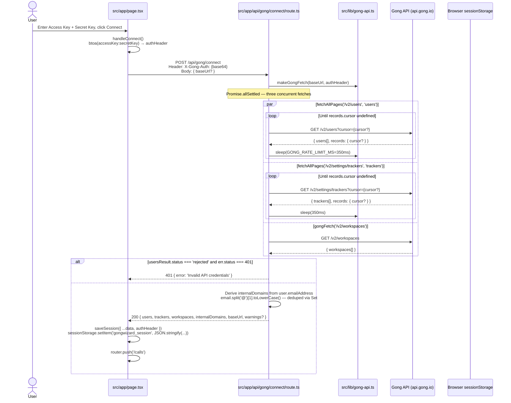

# GongWizard Data Flows

This document describes the major data pipelines in GongWizard. All flows are client-initiated; there are no background jobs or cron processes. The app is stateless — no database is involved. Gong API credentials are stored in `sessionStorage` only and forwarded to Gong via the Next.js proxy routes on each request.

---

## Flow 1: Site Authentication (Password Gate)

**Triggered when:** Any unauthenticated user navigates to any page on the site.

The app uses a shared site password (unrelated to Gong credentials) to restrict access. The Next.js Edge middleware checks for a `gw-auth` cookie on every request and redirects unauthenticated users to `/gate`.

```mermaid
sequenceDiagram
    actor User
    participant Browser
    participant Middleware as src/middleware.ts
    participant GatePage as src/app/gate/page.tsx
    participant AuthRoute as src/app/api/auth/route.ts

    User->>Browser: Navigate to any page (e.g. /)
    Browser->>Middleware: HTTP request
    Middleware->>Middleware: middleware() — pathname check
    alt Path is /gate, /api/*, /_next/*, /favicon
        Middleware-->>Browser: NextResponse.next() — bypass
    else All other paths
        Middleware->>Middleware: request.cookies.get('gw-auth')
        alt Cookie missing or value !== '1'
            Middleware-->>Browser: 302 Redirect to /gate
            Browser->>GatePage: Render GatePage
            User->>GatePage: Enter site password, submit
            GatePage->>GatePage: handleSubmit()
            GatePage->>AuthRoute: POST /api/auth { password }
            AuthRoute->>AuthRoute: Compare vs process.env.SITE_PASSWORD
            alt Correct password
                AuthRoute-->>GatePage: 200 { ok: true }<br/>Set-Cookie: gw-auth=1; httpOnly; maxAge=604800; sameSite=lax
                GatePage->>Browser: router.push('/') + router.refresh()
            else Wrong password
                AuthRoute-->>GatePage: 401 { error: 'Incorrect password.' }
                GatePage->>User: setError() — show error message
            end
        else Cookie value === '1'
            Middleware-->>Browser: NextResponse.next()
        end
    end
```

**Step-by-step:**

1. `src/middleware.ts:middleware()` runs on every request matching the `config.matcher` pattern (`/((?!_next/static|_next/image|favicon.ico).*)`). It passes through `/gate`, `/api/*`, `/_next/*`, and `/favicon` unconditionally.
2. For all other paths, it reads `request.cookies.get('gw-auth')`. If the value is not `'1'`, it calls `request.nextUrl.clone()`, sets `url.pathname = '/gate'`, and returns `NextResponse.redirect(url)`.
3. The user lands on `src/app/gate/page.tsx:GatePage`, which renders a password `<form>`.
4. On submit, `GatePage:handleSubmit()` POSTs `{ password }` as JSON to `/api/auth`.
5. `src/app/api/auth/route.ts:POST()` compares the submitted value against `process.env.SITE_PASSWORD`. On match it calls `response.cookies.set('gw-auth', '1', { httpOnly: true, maxAge: 60*60*24*7, path: '/', sameSite: 'lax' })` and returns `{ ok: true }`.
6. `GatePage` calls `router.push('/')` and `router.refresh()` to navigate to the connect step with the new cookie in place.

---

## Flow 2: Gong API Connection and Session Bootstrap

**Triggered when:** The user submits their Gong Access Key and Secret Key on the Connect page (`/`).

This flow validates Gong credentials and pre-fetches org-level data (users, trackers, workspaces) needed throughout the session. The derived `internalDomains` array is what drives speaker classification in all later flows. Results are saved to `sessionStorage` via `saveSession()`.



**Step-by-step:**

1. `src/app/page.tsx:ConnectPage:handleConnect()` encodes `accessKey:secretKey` with `btoa()` to produce `authHeader`. Credentials never leave the browser in plaintext.
2. It POSTs to `/api/gong/connect` with `X-Gong-Auth: {authHeader}` in the request header. The body optionally includes a `baseUrl` to support non-default Gong instance URLs; it defaults to `https://api.gong.io`.
3. `src/app/api/gong/connect/route.ts:POST()` calls `makeGongFetch(baseUrl, authHeader)` from `src/lib/gong-api.ts` to create a scoped fetch function that injects `Authorization: Basic {authHeader}` and `Content-Type: application/json` on every outbound request to Gong.
4. Three Gong endpoints fire concurrently via `Promise.allSettled()`:
   - `fetchAllPages('/v2/users', 'users', 'GET')` — inner cursor loop; `sleep(GONG_RATE_LIMIT_MS)` (350ms) between pages.
   - `fetchAllPages('/v2/settings/trackers', 'trackers', 'GET')` — same pagination pattern.
   - `gongFetch('/v2/workspaces')` — single non-paginated fetch.
5. If `/v2/users` returns a 401, the route returns `401 { error: 'Invalid API credentials' }` immediately. Tracker or workspace failures add warning strings to the response body but do not fail the connection.
6. `internalDomains` is derived by iterating all user records, extracting `email.split('@').pop().trim().toLowerCase()`, and deduplicating via `Set<string>`. This set is the sole source of truth for speaker classification in all subsequent flows.
7. `ConnectPage:saveSession()` writes `{ users, trackers, workspaces, internalDomains, baseUrl, authHeader }` to `sessionStorage['gongwizard_session']`. `router.push('/calls')` navigates to the calls view.

---

## Flow 3: Call List Fetch (Date-Range Query with Extensive Fallback)

**Triggered when:** The user sets a date range and clicks "Load Calls" on the Calls page (`/calls`).

This is a two-stage server-side pipeline: first paginate basic call IDs from `/v2/calls`, then fetch full metadata in batches of 10 from `/v2/calls/extensive`. If extensive returns 403 (missing API scope), the route silently falls back to the basic call shape.

```mermaid
sequenceDiagram
    actor User
    participant CallsPage as src/app/calls/page.tsx
    participant CallsRoute as src/app/api/gong/calls/route.ts
    participant GongLib as src/lib/gong-api.ts
    participant GongAPI as Gong API

    User->>CallsPage: Click "Load Calls"
    CallsPage->>CallsPage: loadCalls()<br/>Read session from sessionStorage via getSession()
    CallsPage->>CallsRoute: POST /api/gong/calls<br/>Header: X-Gong-Auth: {base64}<br/>Body: { fromDate, toDate, baseUrl, workspaceId? }

    Note over CallsRoute: Stage 1 — Paginate basic call list

    loop Until records.cursor undefined
        CallsRoute->>GongAPI: GET /v2/calls?fromDateTime=&toDateTime=&workspaceId?&cursor?
        GongAPI-->>CallsRoute: { calls[], records: { cursor? } }
        CallsRoute->>GongLib: sleep(350ms) if cursor present
    end

    alt basicCalls.length === 0
        CallsRoute-->>CallsPage: 200 { calls: [] }
    end

    Note over CallsRoute: Stage 2 — Extensive metadata (EXTENSIVE_BATCH_SIZE=10)

    loop For each batch of 10 callIds
        loop Until batchCursor undefined
            CallsRoute->>GongAPI: POST /v2/calls/extensive<br/>{ filter:{callIds}, contentSelector:{parties,topics,trackers,brief,keyPoints,actionItems,outline,structure,context:'Extended'} }
            alt Response 403
                GongAPI-->>CallsRoute: 403
                CallsRoute->>CallsRoute: extensiveFailed = true; break outer loop
            else Success
                GongAPI-->>CallsRoute: { calls[], records: { cursor? } }
                CallsRoute->>GongLib: sleep(350ms) if batchCursor
            end
        end
        CallsRoute->>GongLib: sleep(350ms) between batches
    end

    alt extensiveFailed
        CallsRoute->>CallsRoute: basicCalls.map() — flat normalize with empty parties/topics/trackers
    else Extensive succeeded
        CallsRoute->>CallsRoute: extensiveCalls.map(normalizeExtensiveCall)<br/>extractFieldValues(c.context, 'name', 'Account') → accountName<br/>extractFieldValues(c.context, 'industry', 'Account') → accountIndustry
    end

    CallsRoute-->>CallsPage: 200 { calls: NormalizedCall[] }

    CallsPage->>CallsPage: Per call: isInternalParty(p, internalDomains)<br/>→ internalSpeakerCount / externalSpeakerCount
    CallsPage->>CallsPage: Extract trackerNames (filter t.count > 0)
    CallsPage->>CallsPage: setCalls(processed) + setHasLoaded(true)
    CallsPage->>User: Render filtered call list
```

**Step-by-step:**

1. `src/app/calls/page.tsx:CallsPage:loadCalls()` reads `session` from React state (hydrated from `sessionStorage` on mount via `getSession()`). It constructs ISO date strings with `T00:00:00Z` / `T23:59:59Z` suffixes and posts them to `/api/gong/calls`.
2. `src/app/api/gong/calls/route.ts:POST()` runs Stage 1: a `do/while` cursor loop against `GET /v2/calls`. Each page's `data.calls` is pushed into `basicCalls[]`. Loop exits when `data?.records?.cursor` is undefined. `sleep(GONG_RATE_LIMIT_MS)` runs between pages.
3. Stage 2 batches `callIds` into groups of `EXTENSIVE_BATCH_SIZE = 10`. Each batch calls `POST /v2/calls/extensive` with a `contentSelector` specifying `parties: true`, `content.topics`, `content.trackers`, `content.brief`, `content.keyPoints`, `content.actionItems`, `content.outline`, `content.structure`, and `context: 'Extended'` for CRM data. Each batch may itself paginate via an inner `batchCursor` loop.
4. A `GongApiError` with `status === 403` from the extensive endpoint sets `extensiveFailed = true` and breaks the outer loop. All other non-403 errors are rethrown and handled by `handleGongError()`.
5. `normalizeExtensiveCall()` flattens Gong's deeply nested shape into a consistent record. `extractFieldValues(c.context, fieldName, objectType)` walks `context[].objects[].fields[]` to pull CRM fields like `accountName`, `accountIndustry`, and `accountWebsite` out of the `context: 'Extended'` payload.
6. Back in `CallsPage`, each call's `parties[]` is classified with `isInternalParty()`: checks `party.affiliation === 'Internal'` first; falls back to email domain lookup against `session.internalDomains`. Counts are stored as `internalSpeakerCount` / `externalSpeakerCount`. Tracker names with `t.count > 0` are extracted into a flat `trackerNames[]`.
7. `setCalls(processed)` and `setHasLoaded(true)` trigger a re-render showing the call list.

---

## Flow 4: Transcript Fetch, Assembly, and Export

**Triggered when:** The user selects one or more calls and clicks "Download" or "Copy to Clipboard".

This is the primary value pipeline. Raw Gong monologue tracks are fetched in batches of 50, reassembled into chronological speaker turns, filtered through optional cleanup transforms, and serialized to Markdown, XML, or JSONL for delivery to an LLM.

```mermaid
sequenceDiagram
    actor User
    participant CallsPage as src/app/calls/page.tsx
    participant TranscriptsRoute as src/app/api/gong/transcripts/route.ts
    participant GongLib as src/lib/gong-api.ts
    participant GongAPI as Gong API
    participant Browser as Browser (Clipboard / File Download)

    User->>CallsPage: Click Download or Copy
    CallsPage->>CallsPage: handleExport() or handleCopy()<br/>setExporting(true)
    CallsPage->>CallsPage: fetchTranscriptsForSelected()

    CallsPage->>TranscriptsRoute: POST /api/gong/transcripts<br/>Header: X-Gong-Auth: {base64}<br/>Body: { callIds: [...selectedIds], baseUrl }

    Note over TranscriptsRoute: TRANSCRIPT_BATCH_SIZE = 50

    loop For i=0; i < callIds.length; i += 50
        loop Until records.cursor undefined (same batch)
            TranscriptsRoute->>GongAPI: POST /v2/calls/transcript<br/>{ filter: { callIds: batch }, cursor? }
            GongAPI-->>TranscriptsRoute: { callTranscripts[]: { callId, transcript[] }, records: { cursor? } }
            TranscriptsRoute->>TranscriptsRoute: Accumulate into transcriptMap[callId].push(...monologues)
            TranscriptsRoute->>GongLib: sleep(350ms) if cursor
        end
        TranscriptsRoute->>GongLib: sleep(350ms) between batches
    end

    TranscriptsRoute-->>CallsPage: 200 { transcripts: [{ callId, transcript[] }] }

    Note over CallsPage: fetchTranscriptsForSelected() — client-side assembly

    loop For each { callId, transcript }
        CallsPage->>CallsPage: callMap.get(t.callId) → callMeta (from calls state)
        CallsPage->>CallsPage: Build speakerMap: Map<speakerId, Speaker><br/>isInternalParty(p, internalDomains) per party
        CallsPage->>CallsPage: Flatten all track.sentences → TranscriptSentence[]<br/>sentences.sort((a,b) => a.start - b.start)
        CallsPage->>CallsPage: groupTranscriptTurns(sentences, speakerMap)<br/>→ flushGroup() merges consecutive same-speakerId sentences<br/>→ formatTimestamp(start_ms) → 'm:ss' string
    end

    Note over CallsPage: buildExportContent() — format rendering

    alt exportFormat === 'markdown'
        CallsPage->>CallsPage: buildMarkdown(calls, exportOpts)<br/>buildCallText() per call:<br/>  filterFillerTurns() if removeFillerGreetings<br/>  condenseInternalMonologues() if condenseMonologues<br/>  External turn text → toUpperCase()
    else exportFormat === 'xml'
        CallsPage->>CallsPage: buildXML(calls, exportOpts)<br/>escapeXml() on all string values
    else exportFormat === 'jsonl'
        CallsPage->>CallsPage: buildJSONL(calls, exportOpts)<br/>JSON.stringify() per call → joined by newline
    end

    alt handleExport
        CallsPage->>Browser: downloadFile(content, filename, mimeType)<br/>new Blob → URL.createObjectURL → <a>.click() → revokeObjectURL
        Browser-->>User: File saved to disk
    else handleCopy
        CallsPage->>Browser: navigator.clipboard.writeText(content)
        CallsPage->>CallsPage: setCopied(true) → setTimeout 2s → setCopied(false)
        Browser-->>User: "Copied!" feedback
    end
```

**Step-by-step:**

1. `src/app/calls/page.tsx:CallsPage:handleExport()` or `handleCopy()` fires when the user clicks the export buttons. Both call `fetchTranscriptsForSelected()`.
2. `fetchTranscriptsForSelected()` POSTs `{ callIds: [...selectedIds], baseUrl }` to `/api/gong/transcripts` with the stored `authHeader` in `X-Gong-Auth`.
3. `src/app/api/gong/transcripts/route.ts:POST()` slices `callIds` into batches of `TRANSCRIPT_BATCH_SIZE = 50` (Gong's per-request limit for this endpoint). For each batch, a `do/while` cursor loop posts to `POST /v2/calls/transcript` with `filter: { callIds: batch }`. Results are merged into `transcriptMap: Record<string, any[]>` keyed by `callId`. `sleep(GONG_RATE_LIMIT_MS)` runs on inner cursor pages and between outer batches.
4. The route returns `{ transcripts: [{ callId, transcript }] }`. The `transcript` field is the raw array of monologue track objects from Gong (each track has `speakerId` and `sentences[]` with `{ text, start }` in milliseconds).
5. Back in `fetchTranscriptsForSelected()`, each transcript is assembled into a `CallForExport`:
   - A `speakerMap: Map<string, Speaker>` is built from `callMeta.parties` (stored during the calls fetch — the transcript endpoint returns no party data). `isInternalParty()` checks `party.affiliation === 'Internal'` first, then falls back to email domain matching against `session.internalDomains`.
   - All tracks are flattened into a single `TranscriptSentence[]` sorted by `sentence.start` (milliseconds from call start).
   - `groupTranscriptTurns(sentences, speakerMap)` calls `flushGroup()` whenever the speaker changes, merging all consecutive sentences from the same speaker into one `FormattedTurn`. `formatTimestamp(ms)` converts the start offset to `m:ss`.
6. The array of `CallForExport` objects is passed to `buildExportContent(calls, exportFormat, exportOpts)`, which dispatches to one of three renderers:
   - `buildMarkdown()` → `buildCallText()` per call. Applies `filterFillerTurns()` (removes turns under 5 chars or matching `FILLER_PATTERNS`) and `condenseInternalMonologues()` (merges runs of 3+ consecutive turns from the same internal speaker). External speaker text is `toUpperCase()`.
   - `buildXML()`: wraps each call in `<call>` with `<speakers>`, optional `<brief>`, optional `<interactionStats>`, and `<transcript><turn>` elements. All string values pass through `escapeXml()`.
   - `buildJSONL()`: one `JSON.stringify()` object per call, newline-joined. `transcript[]` contains `{ time, speaker, role, text }` objects.
7. For download, `downloadFile(content, filename, mimeType)` creates a `Blob`, calls `URL.createObjectURL()`, injects a hidden `<a>`, triggers `.click()`, then calls `URL.revokeObjectURL()`. For copy, `navigator.clipboard.writeText(content)` delivers the content, and `setCopied(true)` with a 2-second `setTimeout` shows transient feedback.
