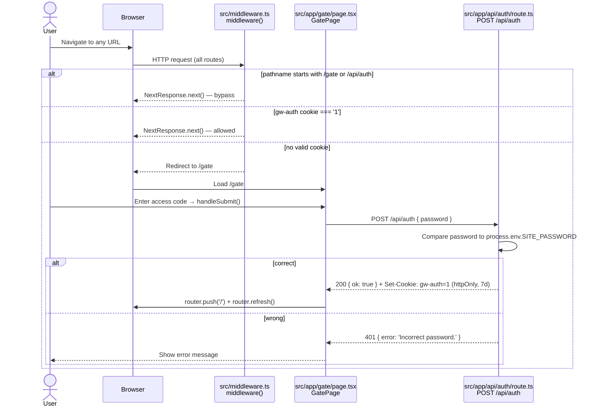
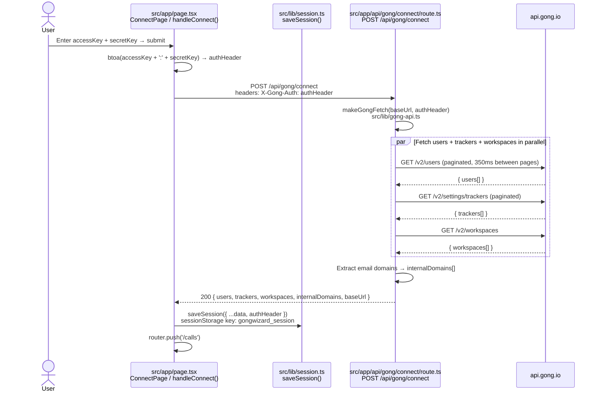
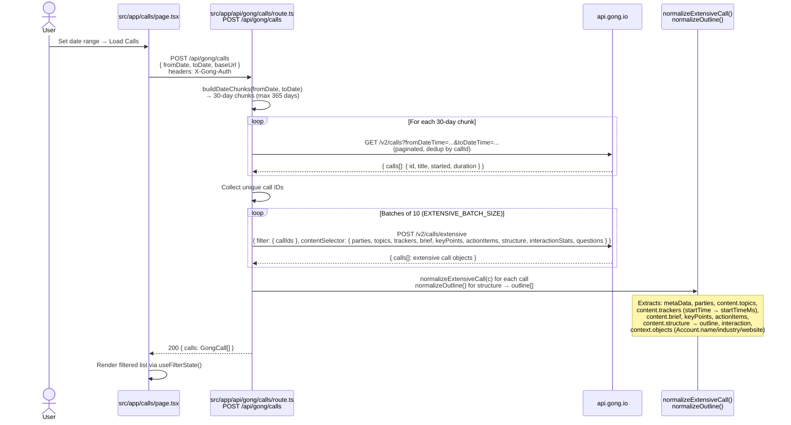
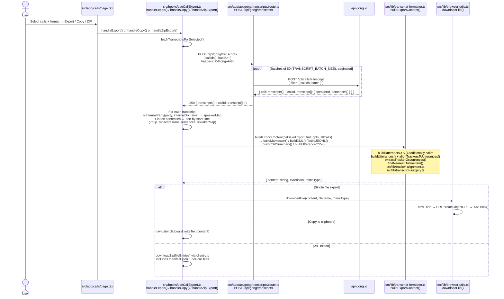

# GongWizard — Data Flows

Sequence diagrams for the five major data pipelines. Each diagram uses actual actors, function names, and file paths from the codebase.

---

## 1. Authentication Flow

**What it does:** Enforces a site-level password gate before any page or API route is accessible. Triggered on every browser request.



**Step-by-step:**

1. Every browser request hits `middleware()` in `src/middleware.ts` before reaching any page or API route. The middleware config matcher excludes `_next/static`, `_next/image`, and `favicon.ico`.
2. The middleware exempts `/gate` and `/api/auth` (the only two paths that must work without a cookie) by calling `NextResponse.next()` immediately.
3. For all other paths, the middleware reads `request.cookies.get('gw-auth')`. If its value is `'1'`, the request proceeds.
4. Otherwise, the middleware clones the request URL, sets `pathname = '/gate'`, and returns a redirect.
5. On the gate page, `GatePage` (`src/app/gate/page.tsx`) renders a password form. On submit, `handleSubmit()` POSTs `{ password }` to `/api/auth`.
6. `POST /api/auth` (`src/app/api/auth/route.ts`) compares the submitted password to `process.env.SITE_PASSWORD`. On match, it calls `response.cookies.set('gw-auth', '1', { httpOnly: true, maxAge: 60*60*24*7, path: '/', sameSite: 'lax' })` and returns `{ ok: true }`.
7. On success, `GatePage` calls `router.push('/')` and `router.refresh()` to re-run middleware with the new cookie.

---

## 2. Gong Connection Flow

**What it does:** Takes a user-supplied Gong API key pair, verifies it by fetching workspace metadata, and stores the resulting session in `sessionStorage`. Triggered when the user submits credentials on the Connect page.



**Step-by-step:**

1. `ConnectPage` (`src/app/page.tsx`) collects `accessKey` and `secretKey`. On submit, `handleConnect()` calls `btoa(accessKey + ':' + secretKey)` to produce a base-64 Basic Auth header.
2. It POSTs to `/api/gong/connect` with the encoded credentials in `X-Gong-Auth`.
3. `POST /api/gong/connect` (`src/app/api/gong/connect/route.ts`) calls `makeGongFetch(baseUrl, authHeader)` from `src/lib/gong-api.ts` to build a fetch wrapper with exponential backoff (up to `MAX_RETRIES = 5`) and a 350 ms inter-page delay (`GONG_RATE_LIMIT_MS`).
4. The route fires `Promise.allSettled` across three parallel fetches: `fetchAllPages('/v2/users', 'users')`, `fetchAllPages('/v2/settings/trackers', 'trackers')`, and a single `gongFetch('/v2/workspaces')`. `fetchAllPages` follows cursor-based pagination automatically.
5. If `/v2/users` returns 401, the route immediately returns `{ error: 'Invalid API credentials' }` with status 401.
6. From the users list, the route extracts all unique email domains into `internalDomains[]`. This array powers speaker classification across all downstream operations.
7. The route returns `{ users, trackers, workspaces, internalDomains, baseUrl }` (plus optional `warnings[]` if non-critical fetches failed).
8. Back in `ConnectPage`, `saveSession({ ...data, authHeader })` from `src/lib/session.ts` writes the entire payload as JSON to `sessionStorage` under the key `gongwizard_session`.
9. `router.push('/calls')` navigates to the call browser.

---

## 3. Call List Fetch Flow

**What it does:** Fetches a date-bounded list of calls with full metadata (topics, trackers, AI briefs, outline, CRM context). Triggered when the user sets a date range and clicks "Load Calls" on the Calls page.



**Step-by-step:**

1. The Calls page (`src/app/calls/page.tsx`) POSTs `{ fromDate, toDate, baseUrl }` to `/api/gong/calls` with `X-Gong-Auth`.
2. `POST /api/gong/calls` (`src/app/api/gong/calls/route.ts`) validates the date range (maximum `MAX_DATE_RANGE_DAYS = 365`), then calls `buildDateChunks(fromDate, toDate)` to split the range into 30-day (`CHUNK_DAYS`) slices.
3. **Step 1 — basic call IDs:** For each chunk, the route paginates `GET /v2/calls?fromDateTime=...&toDateTime=...`. It deduplicates calls by ID in `seenCallIds` (the Gong API can return the same call in overlapping windows).
4. **Step 2 — extensive metadata:** The collected IDs are batched into groups of `EXTENSIVE_BATCH_SIZE = 10` and sent to `POST /v2/calls/extensive`. The `contentSelector` requests `parties`, `topics`, `trackers`, `brief`, `keyPoints`, `actionItems`, `structure` (outline), `interactionStats`, `questions`, and `context: 'Extended'` (CRM objects). If this endpoint returns 403, the route falls back gracefully to the basic call data.
5. Each 350 ms delay (`GONG_RATE_LIMIT_MS`) separates consecutive Gong API requests. `makeGongFetch` from `src/lib/gong-api.ts` provides exponential backoff on errors.
6. **Step 3 — normalization:** `normalizeExtensiveCall(c)` extracts all fields from Gong's nested `metaData`/`content`/`parties` structure into a flat `GongCall` shape. `normalizeOutline()` converts `section.startTime` (seconds) to `startTimeMs` (milliseconds). Tracker occurrences get the same conversion. `extractFieldValues(c.context, ...)` extracts CRM fields like `accountName`, `accountIndustry`, `accountWebsite` from `context.objects.fields`.
7. The normalized `GongCall[]` array is returned to the Calls page, which applies client-side filtering via `useFilterState()` (`src/hooks/useFilterState.ts`).

---

## 4. Transcript Export Flow

**What it does:** Fetches raw transcript monologues for selected calls, assembles speaker-classified `CallForExport` objects, and renders them as Markdown, XML, JSONL, summary CSV, or utterance-level CSV. Triggered when the user clicks Export, Copy, or ZIP on the Calls page.



**Step-by-step:**

1. The user selects calls and a format on the Calls page. Clicking Export/Copy/ZIP calls `handleExport()`, `handleCopy()`, or `handleZipExport()` from `useCallExport` (`src/hooks/useCallExport.ts`).
2. All three paths call `fetchTranscriptsForSelected()`, which POSTs `{ callIds, baseUrl }` to `/api/gong/transcripts` with `X-Gong-Auth`.
3. `POST /api/gong/transcripts` (`src/app/api/gong/transcripts/route.ts`) batches the IDs into groups of `TRANSCRIPT_BATCH_SIZE = 50` and POSTs each batch to Gong's `POST /v2/calls/transcript`. Each batch may paginate via cursor. Results accumulate into `transcriptMap[callId]`.
4. Back in `fetchTranscriptsForSelected()`, for each transcript the hook: (a) builds a `speakerMap` using `isInternalParty(party, internalDomains)` from `src/lib/format-utils.ts`; (b) flattens all monologue sentences into a flat `TranscriptSentence[]` sorted by `start`; (c) calls `groupTranscriptTurns(sentences, speakerMap)` from `src/lib/transcript-formatter.ts` to merge consecutive same-speaker sentences into `FormattedTurn[]`.
5. The result is an array of `CallForExport` objects, each containing `id`, `title`, `date`, `duration`, `accountName`, `speakers[]`, `brief`, `turns[]`, `interactionStats`, and `rawMonologues` (needed for utterance-level CSV).
6. `buildExportContent(callsForExport, fmt, opts, allCalls)` in `src/lib/transcript-formatter.ts` dispatches to the appropriate builder. `buildMarkdown` and `buildXML` optionally call `truncateLongInternalTurns()` when `condenseMonologues` is enabled. `buildUtteranceCSV` also calls `buildUtterances()` and `alignTrackersToUtterances()` from `src/lib/tracker-alignment.ts` and `findNearestOutlineItem()` from `src/lib/transcript-surgery.ts` to annotate each external utterance with tracker hits and outline section context.
7. The rendered string is either downloaded via `downloadFile()` (`src/lib/browser-utils.ts`), written to the clipboard, or packaged into a ZIP with `downloadZip` from `client-zip`.

---

## 5. AI Research Pipeline

**What it does:** Answers a user research question across selected calls using a four-stage pipeline: relevance scoring → surgical transcript extraction → finding extraction → synthesis. Supports follow-up Q&A against cached evidence. Triggered when the user enters a question in `AnalyzePanel` and clicks "Find Relevant Calls", then "Analyze".

```mermaid
sequenceDiagram
    actor User
    participant Panel as src/components/analyze-panel.tsx<br/>AnalyzePanel
    participant ScoreAPI as src/app/api/analyze/score/route.ts<br/>POST /api/analyze/score
    participant TranscriptsAPI as src/app/api/gong/transcripts/route.ts
    participant Surgery as src/lib/transcript-surgery.ts<br/>performSurgery()<br/>formatExcerptsForAnalysis()
    participant ProcessAPI as src/app/api/analyze/process/route.ts<br/>POST /api/analyze/process
    participant BatchAPI as src/app/api/analyze/batch-run/route.ts<br/>POST /api/analyze/batch-run
    participant SynthAPI as src/app/api/analyze/synthesize/route.ts<br/>POST /api/analyze/synthesize
    participant FollowupAPI as src/app/api/analyze/followup/route.ts<br/>POST /api/analyze/followup
    participant Gemini as Google Gemini API

    User->>Panel: Type question → Find Relevant Calls → handleScore()

    Panel->>ScoreAPI: POST /api/analyze/score<br/>{ question, calls[]: { id, title, brief, keyPoints, outline, trackers, topics, talkRatio } }
    ScoreAPI->>Gemini: cheapCompleteJSON() → gemini-2.0-flash-lite<br/>Score 0-10 + relevant outline section names
    Gemini-->>ScoreAPI: { scores[]: { callId, score, reason, relevant_sections[] } }
    ScoreAPI-->>Panel: Sorted scored calls; auto-select score >= 3

    User->>Panel: Review scores, adjust selection → Analyze → handleAnalyze()

    Panel->>TranscriptsAPI: POST /api/gong/transcripts<br/>{ callIds (selected), baseUrl }<br/>headers: X-Gong-Auth
    TranscriptsAPI-->>Panel: { transcripts[]: { callId, transcript[] } }

    loop For each selected call
        Panel->>Panel: buildUtterances(monologues, speakerClassifier)<br/>extractTrackerOccurrences(call.trackers)<br/>alignTrackersToUtterances(utterances, trackerOccs)<br/>src/lib/tracker-alignment.ts

        Panel->>Surgery: performSurgery(callId, utterances, outline, relevantSections, callDurationMs, speakerMap)
        Note over Surgery: Filters: isFiller(), isGreetingOrClosing(), < 8 words<br/>Includes: utterances in chapter windows OR with tracker hits<br/>Enriches context: enrichContext() (look-back 1-2 turns)<br/>Flags internal monologues > 60 words as needsSmartTruncation

        opt Has long internal monologues
            Panel->>ProcessAPI: POST /api/analyze/process<br/>{ question, monologues[]: { index, text } }
            ProcessAPI->>Gemini: cheapCompleteJSON() → gemini-2.0-flash-lite<br/>buildSmartTruncationPrompt()
            Gemini-->>ProcessAPI: [{ index, kept: string }]
            ProcessAPI-->>Panel: { truncated[] } → patch surgery.excerpts[t.index].text
        end

        Panel->>Surgery: formatExcerptsForAnalysis(excerpts, callTitle, callDate, ...)<br/>externalOnly=true
    end

    Panel->>BatchAPI: POST /api/analyze/batch-run<br/>{ question, calls[]: { callId, callData, brief, speakerDirectory, callMeta } }<br/>maxDuration = 60s
    BatchAPI->>Gemini: smartCompleteJSON() → gemini-2.5-pro<br/>Extract verbatim external-speaker quotes per call
    Gemini-->>BatchAPI: { results: { [callId]: { findings[] } } }
    BatchAPI-->>Panel: BatchResult

    Panel->>SynthAPI: POST /api/analyze/synthesize<br/>{ question, allFindings[] }
    SynthAPI->>Gemini: smartCompleteJSON() → gemini-2.5-pro<br/>2-4 sentence answer + representative verbatim quotes
    Gemini-->>SynthAPI: { answer: string, quotes[]: QuoteAttribution }
    SynthAPI-->>Panel: First QAEntry → setConversation([firstEntry])
    Panel->>Panel: setProcessedDataCache(allProcessedData joined)

    Panel-->>User: Display answer + sourced quotes

    opt Follow-up (up to MAX_QUESTIONS = 5 total)
        User->>Panel: Type follow-up → handleFollowUp()
        Panel->>FollowupAPI: POST /api/analyze/followup<br/>{ question, followUpQuestion, processedData (cached), previousFindings }
        FollowupAPI->>Gemini: smartCompleteJSON() → gemini-2.5-pro
        Gemini-->>FollowupAPI: { answer: string, quotes[] }
        FollowupAPI-->>Panel: New QAEntry → append to conversation[]
    end
```

**Step-by-step:**

### Stage 1 — Scoring (`handleScore`)

1. `AnalyzePanel` (`src/components/analyze-panel.tsx`) POSTs `{ question, calls[] }` to `/api/analyze/score`. Each call entry includes `id`, `title`, `brief`, `keyPoints`, `outline`, `trackers`, `topics`, and `talkRatio` — metadata only, no transcripts.
2. `POST /api/analyze/score` (`src/app/api/analyze/score/route.ts`) builds a prompt listing all calls and calls `cheapCompleteJSON()` from `src/lib/ai-providers.ts`, which uses `gemini-2.0-flash-lite` with `responseMimeType: 'application/json'`.
3. The model returns `{ scores[]: { callId, score, reason, relevant_sections[] } }`. Scores are clamped 0–10. A fallback returns score 5 for all calls if the batch fails.
4. `AnalyzePanel` sorts scores descending and auto-selects calls with `score >= 3`. The user can manually adjust before proceeding.

### Stage 2 — Transcript fetch and surgical extraction (`handleAnalyze`)

1. `handleAnalyze()` fetches transcripts for selected calls via `POST /api/gong/transcripts` (same flow as the export pipeline — see Flow 4, steps 2–3).
2. For each call, `AnalyzePanel` calls `buildUtterances(monologues, speakerClassifier)` and `alignTrackersToUtterances(utterances, trackerOccs)` from `src/lib/tracker-alignment.ts` to produce time-stamped, tracker-annotated utterance objects.
3. `performSurgery(callId, utterances, outline, relevantSections, callDurationMs, speakerMap)` in `src/lib/transcript-surgery.ts` filters the utterance list to only segments inside the relevant outline chapter windows (identified by scoring) or with tracker hits. It strips filler (`isFiller()`), greetings/closings (`isGreetingOrClosing()` — first/last 60 s with fewer than 15 words), and utterances under 8 words. External utterances get context enrichment via `enrichContext()` (looks back 1–2 turns). Internal monologues over 60 words are flagged `needsSmartTruncation = true`.
4. For each call with `needsSmartTruncation` excerpts, `AnalyzePanel` calls `POST /api/analyze/process` with the long monologue segments. `buildSmartTruncationPrompt()` asks `gemini-2.0-flash-lite` to keep only sentences that set up customer responses, contain pricing/product claims, or pose questions the customer answers. The result patches `surgery.excerpts[t.index].text` in place.
5. `formatExcerptsForAnalysis(excerpts, ..., externalOnly=true)` renders the surgical output as a dense text block grouped by outline section, annotated with Gong AI outline item descriptions, tracker labels, and resolved speaker names/titles. Internal rep utterances are suppressed; Gong AI outline items serve as proxy for rep context.

### Stage 3 — Batch finding extraction

1. `AnalyzePanel` sends all call payloads together to `POST /api/analyze/batch-run` (`src/app/api/analyze/batch-run/route.ts`, `maxDuration = 60`). The payload is `{ question, calls[]: { callId, callData, brief, speakerDirectory, callMeta } }`.
2. The route builds a unified prompt with an external-speakers header and per-call sections using the surgical `callData` blocks, then calls `smartCompleteJSON()` using `gemini-2.5-pro`.
3. The model returns `{ results: { [callId]: { findings[] } } }` where each finding is `{ exact_quote, speaker_name, job_title, company, is_external, timestamp, context, significance, finding_type }`.

### Stage 4 — Synthesis

1. If any call has `is_external` findings, `AnalyzePanel` POSTs `{ question, allFindings[] }` to `POST /api/analyze/synthesize` (`src/app/api/analyze/synthesize/route.ts`, `maxDuration = 60`).
2. The route flattens external findings into a quoted evidence block and calls `smartCompleteJSON()` on `gemini-2.5-pro`. The model returns `{ answer: string, quotes[]: { quote, speaker_name, job_title, company, call_title, call_date } }`.
3. `AnalyzePanel` stores this as the first `QAEntry` in `conversation[]` and caches the raw processed transcript text in `processedDataCache` for follow-up use.

### Follow-up Q&A loop

1. The user can ask up to `MAX_QUESTIONS = 5` total questions (initial + follow-ups). `handleFollowUp()` POSTs `{ question, followUpQuestion, processedData (cached), previousFindings }` to `POST /api/analyze/followup` (`src/app/api/analyze/followup/route.ts`, `maxDuration = 60`).
2. This route answers using only the cached `processedData` evidence — no re-fetch of transcripts — making follow-up responses fast and consistent with the original analysis. It calls `smartCompleteJSON()` on `gemini-2.5-pro`.
3. Each follow-up appends a new `QAEntry` to `conversation[]`. The conversation is exportable as JSON or CSV via `handleExportJSON()` and `handleExportCSV()`.
