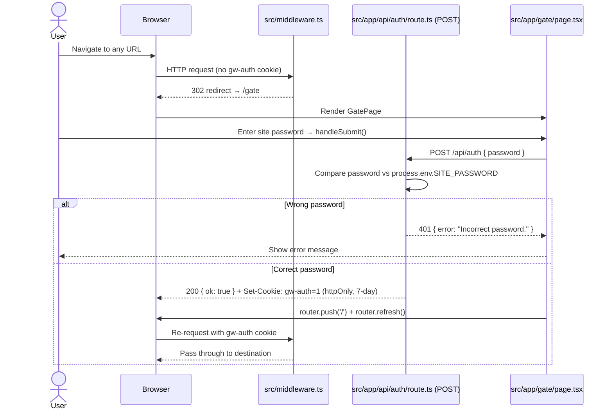
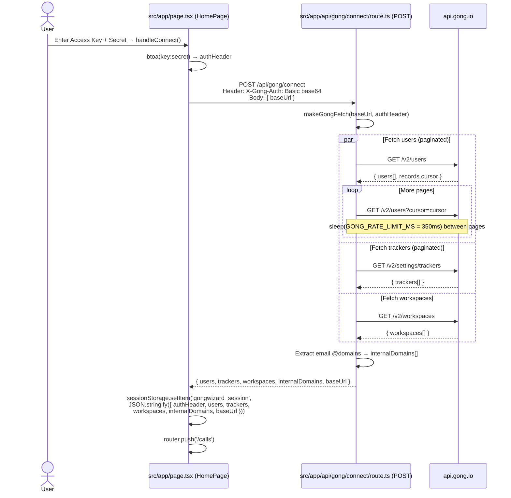
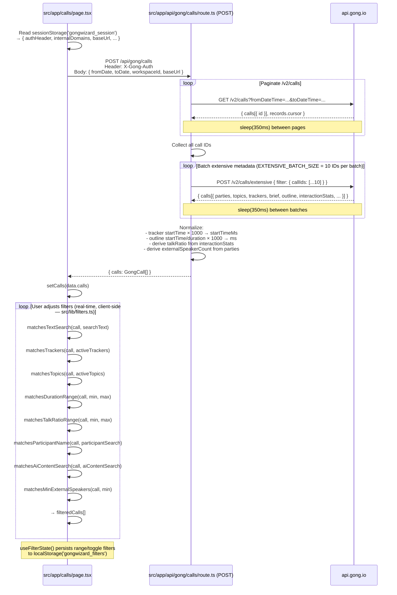
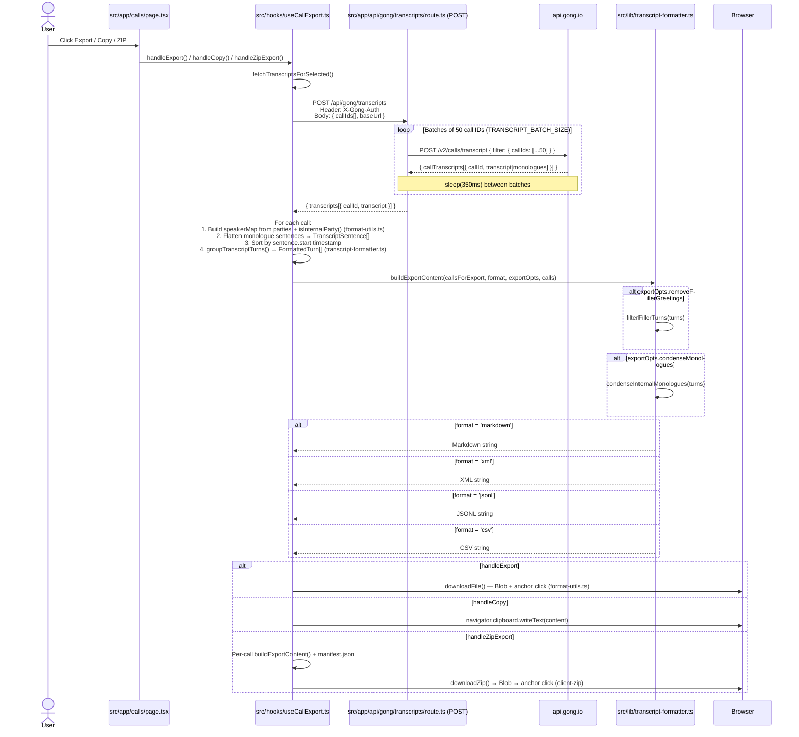
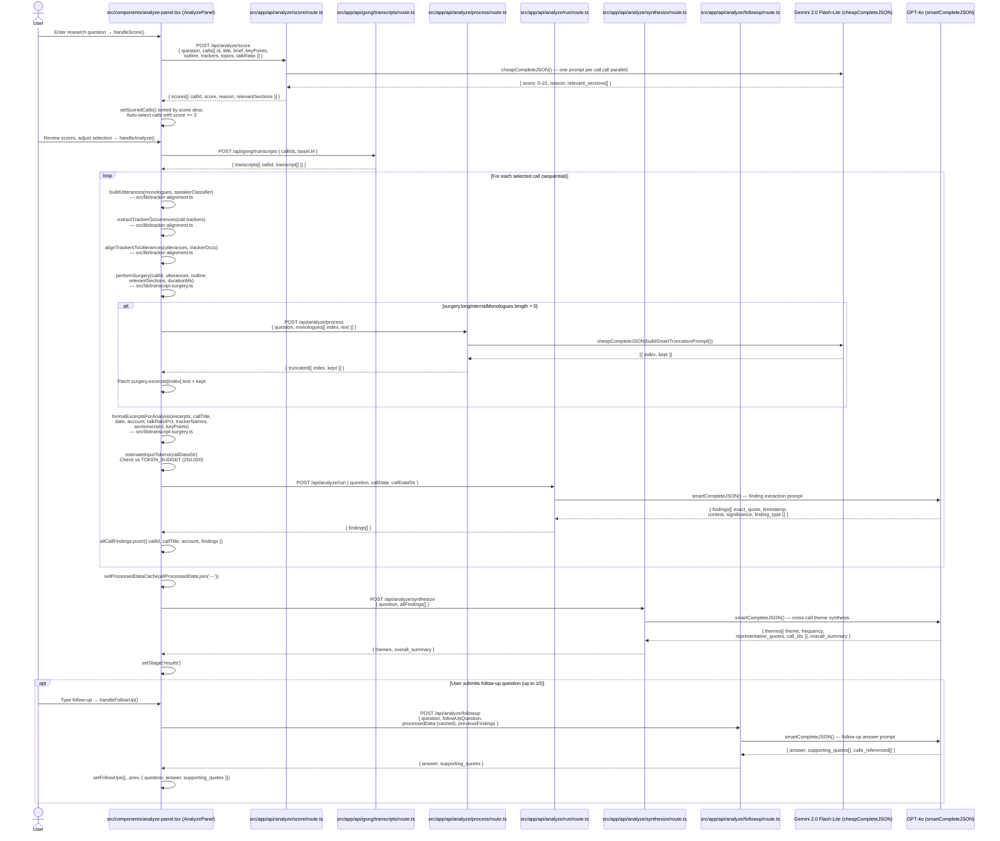

# GongWizard — Data Flows

Five major data pipelines in the application, from site authentication through AI-powered call analysis.

---

## Flow 1: Site Authentication (Gate)

**What it does:** Enforces a site-wide password before any Gong credentials are entered. Every request is checked by edge middleware; unauthenticated users are redirected to `/gate`.

**Triggered by:** First visit to any page on the site, or when the `gw-auth` cookie is absent or expired.

### Step-by-step

1. **`src/middleware.ts`** — Edge middleware runs on every request. If `gw-auth` cookie is absent, it redirects to `/gate`. Requests to `/gate` and `/api/auth` are excluded from the check.
2. **`src/app/gate/page.tsx` — `GatePage` / `handleSubmit()`** — User types the site password. On submit, it POSTs to `/api/auth` with `{ password }`.
3. **`src/app/api/auth/route.ts` — `POST()`** — Compares the submitted password against `process.env.SITE_PASSWORD`. On match, sets an `httpOnly` cookie named `gw-auth` with a 7-day `maxAge`. Returns `{ ok: true }`.
4. **`GatePage` — `router.push('/')`** — On success, redirects to the home/connect page. Subsequent requests carry the cookie and pass middleware.

---

## Flow 2: Gong API Connection & Session Initialization

**What it does:** Validates Gong API credentials, fetches users/trackers/workspaces in parallel, derives `internalDomains` from user email addresses, and stores the complete session object in `sessionStorage`.

**Triggered by:** User submitting their Gong API key and secret on `src/app/page.tsx` (the Connect step).

### Step-by-step

1. **`src/app/page.tsx` — `handleConnect()`** — Constructs a Basic Auth header via `btoa(key + ':' + secret)`. POSTs to `/api/gong/connect` with the header in `X-Gong-Auth` and an optional custom `baseUrl` in the body.
2. **`src/app/api/gong/connect/route.ts` — `POST()`** — Calls `makeGongFetch()` from `src/lib/gong-api.ts` to create a bound fetcher. Fires three Gong API calls concurrently via `Promise.allSettled()`:
   - `fetchAllPages('/v2/users', 'users')` — paginates with cursor; sleeps `GONG_RATE_LIMIT_MS` (350 ms) between pages.
   - `fetchAllPages('/v2/settings/trackers', 'trackers')` — same pagination pattern.
   - `gongFetch('/v2/workspaces')` — single non-paginated request.
3. **Domain extraction** — Iterates over all user `emailAddress` values, splits on `@`, builds a `Set<string>` of lowercase domains → `internalDomains[]`. Later consumed by `isInternalParty()` in `src/lib/format-utils.ts` to classify call participants as internal or external.
4. **`src/app/page.tsx`** — Merges the response into a `GongSession` object (typed in `src/types/gong.ts`) and persists it to `sessionStorage` under key `gongwizard_session`. Navigates to `/calls`.

---

## Flow 3: Call List Fetch & Filtering

**What it does:** Loads call metadata from Gong (paginated call list + batched extensive metadata), normalizes timestamps into milliseconds, and runs the resulting `GongCall[]` through client-side filter predicates in real time as the user adjusts filters.

**Triggered by:** Page load of `src/app/calls/page.tsx`, after session is read from `sessionStorage`.

### Step-by-step

1. **`src/app/calls/page.tsx`** — On mount, reads `gongwizard_session` from `sessionStorage`. POSTs to `/api/gong/calls` with date range, optional workspace filter, and `baseUrl`.
2. **`src/app/api/gong/calls/route.ts` — `POST()`** — Paginates `GET /v2/calls` with a cursor loop, collecting all call IDs. Then batches IDs at `EXTENSIVE_BATCH_SIZE` (10) per batch into `POST /v2/calls/extensive` requests, sleeping 350 ms between each batch. If `/v2/calls/extensive` returns 403 (scope issue), falls back to basic call data.
3. **Normalization** — Tracker `startTime` and outline `startTime`/`duration` values from Gong (in seconds) are multiplied by 1000 to produce millisecond values stored on `GongCall` (`src/types/gong.ts`). `externalSpeakerCount` is derived by counting parties where `isInternalParty()` returns false.
4. **Client-side filtering** — `src/hooks/useFilterState.ts` manages all filter state, persisting range/toggle values to `localStorage('gongwizard_filters')`. The calls page derives `filteredCalls` by running the loaded call list through the pure predicates in `src/lib/filters.ts`: `matchesTextSearch`, `matchesTrackers`, `matchesTopics`, `matchesDurationRange`, `matchesTalkRatioRange`, `matchesParticipantName`, `matchesMinExternalSpeakers`, `matchesAiContentSearch`.

---

## Flow 4: Transcript Export Pipeline

**What it does:** Fetches raw transcript monologues for selected calls, builds speaker-labelled turn groups, applies optional filler removal and monologue condensing, then renders the output in the user's chosen format (Markdown, XML, JSONL, or CSV) and delivers it as a file download, clipboard copy, or ZIP archive.

**Triggered by:** User clicking Export, Copy, or ZIP in `src/app/calls/page.tsx` after selecting calls.

### Step-by-step

1. **`src/app/calls/page.tsx`** — User selects calls and clicks an export action. Delegates to `useCallExport` in `src/hooks/useCallExport.ts`, which receives `selectedIds`, `session`, `calls`, `exportFormat`, and `exportOpts`.
2. **`fetchTranscriptsForSelected()` in `src/hooks/useCallExport.ts`** — POSTs selected call IDs to `/api/gong/transcripts` with `X-Gong-Auth` forwarded from `session.authHeader`.
3. **`src/app/api/gong/transcripts/route.ts` — `POST()`** — Chunks call IDs into batches of `TRANSCRIPT_BATCH_SIZE` (50). For each batch, POSTs to `POST /v2/calls/transcript`. Handles cursor pagination within each batch. Accumulates `transcriptMap: Record<callId, monologue[]>`. Returns `{ transcripts: [{ callId, transcript }] }`.
4. **Turn building in `src/hooks/useCallExport.ts`** — For each call, constructs a `speakerMap` using `isInternalParty()` from `src/lib/format-utils.ts` and `session.internalDomains`. Flattens monologue sentences to `TranscriptSentence[]`, sorts by `start` time, then calls `groupTranscriptTurns()` from `src/lib/transcript-formatter.ts` to produce speaker-labelled `FormattedTurn[]`.
5. **`buildExportContent()` in `src/lib/transcript-formatter.ts`** — Applies optional `filterFillerTurns()` (removes short/filler turns) and `condenseInternalMonologues()` (merges consecutive same-speaker internal turns). Renders the chosen format. Token count is estimated via `estimateTokens()` from `src/lib/token-utils.ts` and shown in the UI.
6. **Delivery** — `downloadFile()` from `src/lib/format-utils.ts` for single-file export; `navigator.clipboard.writeText()` for copy; `downloadZip()` (client-zip library) for ZIP with per-call files and a `manifest.json`.

---

## Flow 5: AI Research Analysis Pipeline

**What it does:** A five-stage pipeline that scores call relevance with a cheap model, surgically extracts relevant transcript segments, truncates long internal monologues, runs per-call finding extraction with a smart model, then synthesizes cross-call themes. Supports iterative follow-up questions against the cached processed data.

**Triggered by:** User entering a research question and clicking "Score Calls" then "Analyze" in `src/components/analyze-panel.tsx`.

### Step-by-step

**Stage 1 — Scoring (`handleScore`)**

1. **`src/components/analyze-panel.tsx` — `handleScore()`** — Sends all selected calls' metadata (title, brief, keyPoints, outline, trackers, topics, talkRatio) to `POST /api/analyze/score`.
2. **`src/app/api/analyze/score/route.ts` — `POST()`** — Scores all calls in parallel using `cheapCompleteJSON()` from `src/lib/ai-providers.ts`, which calls Gemini 2.0 Flash-Lite (`gemini-2.0-flash-lite`). Returns a 0–10 relevance score, one-sentence reason, and the outline section names most likely to contain signal.
3. Back in the panel: calls are sorted by score descending. Any call scoring ≥ 3 is pre-selected. User can deselect before proceeding to analysis.

**Stage 2 — Transcript Fetch**

4. **`handleAnalyze()`** — Fetches transcripts for the selected calls via `POST /api/gong/transcripts` (same route as the export pipeline, batched at 50 IDs with 350 ms rate limiting).

**Stage 3 — Transcript Surgery (per call, sequential)**

5. **`buildUtterances()`** in `src/lib/tracker-alignment.ts` — Converts raw Gong monologue objects into `Utterance[]` with `startTimeMs`/`endTimeMs`/`midTimeMs`, speaker classification via the `speakerClassifier` closure, and empty `trackers[]`.
6. **`extractTrackerOccurrences()` + `alignTrackersToUtterances()`** in `src/lib/tracker-alignment.ts` — Aligns tracker firing timestamps to utterances using four-step logic: exact containment → ±3s (`WINDOW_MS`) fallback → speaker preference → closest by midpoint distance. Mutates `utterance.trackers[]` in place.
7. **`performSurgery()`** in `src/lib/transcript-surgery.ts` — Filters out filler turns (via `isFiller()`), greeting/closing turns (first/last 60 s, under 15 words), and sub-8-word turns. Retains only utterances falling within relevant outline time windows (from `buildChapterWindows()`) or carrying tracker matches. Adds `contextBefore` for external-speaker utterances via `enrichContext()`. Flags internal monologues over 60 words as `needsSmartTruncation`.

**Stage 4 — Smart Truncation (conditional)**

8. If `surgery.longInternalMonologues` is non-empty, the panel POSTs them to `POST /api/analyze/process`. **`src/app/api/analyze/process/route.ts`** calls `buildSmartTruncationPrompt()` from `src/lib/transcript-surgery.ts` and passes it to `cheapCompleteJSON()` (Gemini Flash-Lite). The returned `kept` strings are patched back into `surgery.excerpts[index].text`, replacing the long originals.

**Stage 5 — Per-call Finding Extraction**

9. **`formatExcerptsForAnalysis()`** in `src/lib/transcript-surgery.ts` — Renders excerpts as a structured text block with call metadata header, `[REP CONTEXT]`/`[CUSTOMER]` labels, tracker annotations, and section names.
10. **`POST /api/analyze/run`** — `src/app/api/analyze/run/route.ts` calls `smartCompleteJSON()` (GPT-4o, `gpt-4o`) with the formatted excerpt block. Returns structured findings: `exact_quote`, `timestamp`, `context`, `significance` (high/medium/low), `finding_type` (objection/need/competitive/question/feedback).
11. Token usage is accumulated via `estimateInputTokens()` (chars / 4) and checked against `TOKEN_BUDGET` (250,000). If exceeded, analysis halts and an error is displayed.

**Stage 6 — Synthesis**

12. **`POST /api/analyze/synthesize`** — `src/app/api/analyze/synthesize/route.ts` calls `smartCompleteJSON()` (GPT-4o) with all per-call findings combined. Returns cross-call `themes[]` with frequency counts and representative verbatim quotes, plus an `overall_summary`. The panel stores these and transitions to `stage = 'results'`.

**Follow-up Questions**

13. The full `processedDataCache` string (all `callDataStr` blocks joined with `---`) and `callFindings` are cached in component state after analysis completes. On each follow-up, **`POST /api/analyze/followup`** sends the cache plus the new question to `smartCompleteJSON()` (GPT-4o). Returns `{ answer, supporting_quotes[], calls_referenced[] }`. Up to 10 follow-ups are allowed per analysis session.
