# GongWizard — Library Module Documentation

## Table of Contents

1. [Module Overview](#module-overview)
   - [src/lib/gong-api.ts](#srclibgong-apits)
   - [src/lib/ai-providers.ts](#srclibai-providersts)
   - [src/lib/transcript-formatter.ts](#srclibTranscript-formatterts)
   - [src/lib/transcript-surgery.ts](#srclibTranscript-surgeryts)
   - [src/lib/tracker-alignment.ts](#srclibtracker-alignmentts)
   - [src/lib/filters.ts](#srclibfiltersts)
   - [src/lib/token-utils.ts](#srclibtoken-utilsts)
   - [src/lib/format-utils.ts](#srclibformat-utilsts)
   - [src/lib/utils.ts](#srclibUtilsts)
   - [src/hooks/useFilterState.ts](#srchooksusefilterstatets)
   - [src/hooks/useCallExport.ts](#srchooksusecallexportts)
   - [src/types/gong.ts](#srctypesgongts)
   - [src/middleware.ts](#srcmiddlewarets)
2. [Dependency Graph](#dependency-graph)
3. [Constants and Configuration](#constants-and-configuration)

---

## Module Overview

### src/lib/gong-api.ts

**Purpose:** Shared Gong API fetch client used by all three proxy routes. Provides retry logic, rate-limit handling, and error normalization for every call to `api.gong.io`.

**Key exports:**

| Export | Signature | Description |
|---|---|---|
| `GongApiError` | `class GongApiError extends Error { status: number; endpoint: string }` | Typed error for Gong HTTP failures |
| `sleep` | `(ms: number) => Promise<void>` | Promise-based delay used by retry loops |
| `makeGongFetch` | `(baseUrl: string, authHeader: string) => (endpoint: string, options?: RequestInit) => Promise<any>` | Factory that returns a pre-authorized fetch function with exponential-backoff retry (up to `MAX_RETRIES`) |
| `handleGongError` | `(error: unknown) => NextResponse` | Converts a `GongApiError` or unknown error into an appropriate `NextResponse` JSON error |
| `GONG_RATE_LIMIT_MS` | `350` | Inter-request delay constant |
| `EXTENSIVE_BATCH_SIZE` | `10` | Max call IDs per `/v2/calls/extensive` batch |
| `TRANSCRIPT_BATCH_SIZE` | `50` | Max call IDs per `/v2/calls/transcript` batch |
| `MAX_RETRIES` | `5` | Maximum fetch retry attempts |

**External dependencies:** `next/server` (NextResponse)

**Internal dependencies:** none

---

### src/lib/ai-providers.ts

**Purpose:** Two-tier AI abstraction: cheap completions via Gemini Flash-Lite and smart completions via GPT-4o. All analysis API routes import from this module exclusively — no direct SDK calls exist outside it.

**Key exports:**

| Export | Signature | Description |
|---|---|---|
| `cheapComplete` | `(prompt: string, options?: { temperature?: number; maxTokens?: number; jsonMode?: boolean }) => Promise<string>` | Generates text via `gemini-2.0-flash-lite`. Uses native JSON mode when `jsonMode: true`. |
| `cheapCompleteJSON<T>` | `(prompt: string, options?: { temperature?: number; maxTokens?: number }) => Promise<T>` | Calls `cheapComplete` with `jsonMode: true`, parses result. |
| `smartComplete` | `(prompt: string, options?: { temperature?: number; maxTokens?: number; systemPrompt?: string; jsonMode?: boolean }) => Promise<string>` | Generates text via `gpt-4o` with optional system prompt. |
| `smartCompleteJSON<T>` | `(prompt: string, options?: { temperature?: number; maxTokens?: number; systemPrompt?: string }) => Promise<T>` | Calls `smartComplete` with `jsonMode: true` (`response_format: json_object`), parses result. |
| `smartStream` | `(prompt: string, options?: { temperature?: number; maxTokens?: number; systemPrompt?: string }) => AsyncGenerator<string>` | Streams GPT-4o token deltas as an async generator. |
| `estimateInputTokens` | `(text: string) => number` | Estimates token count at ~4 chars/token. |
| `checkBudget` | `(usedTokens: number, newTokens: number) => boolean` | Returns `true` if `usedTokens + newTokens <= TOKEN_BUDGET`. |
| `TOKEN_BUDGET` | `250_000` | Hard per-session token budget constant. |

**External dependencies:** `@google/genai` (GoogleGenAI), `openai` (OpenAI)

**Internal dependencies:** none

---

### src/lib/transcript-formatter.ts

**Purpose:** All transcript export rendering. Converts raw `FormattedTurn[]` arrays into Markdown, XML, JSONL, and CSV output strings. Also handles filler removal and internal-monologue condensing.

**Key exports:**

**Types:**

| Type | Fields |
|---|---|
| `Speaker` | `speakerId`, `name`, `firstName`, `isInternal`, `title?` |
| `TranscriptSentence` | `speakerId`, `text`, `start` (ms) |
| `FormattedTurn` | `speakerId`, `firstName`, `isInternal`, `timestamp`, `text` |
| `CallForExport` | `id`, `title`, `date`, `duration`, `accountName`, `speakers`, `brief`, `turns`, `interactionStats?` |
| `ExportOptions` | `removeFillerGreetings`, `condenseMonologues`, `includeMetadata`, `includeAIBrief`, `includeInteractionStats` |

**Functions:**

| Export | Signature | Description |
|---|---|---|
| `groupTranscriptTurns` | `(sentences: TranscriptSentence[], speakerMap: Map<string, Speaker>) => FormattedTurn[]` | Groups consecutive same-speaker sentences into turns. |
| `filterFillerTurns` | `(turns: FormattedTurn[]) => FormattedTurn[]` | Removes turns matching `FILLER_PATTERNS` or under 5 chars. |
| `condenseInternalMonologues` | `(turns: FormattedTurn[]) => FormattedTurn[]` | Collapses runs of 3+ consecutive same-speaker internal turns into one. |
| `buildMarkdown` | `(calls: CallForExport[], opts: ExportOptions) => string` | Renders full Markdown export with token estimate header. |
| `buildXML` | `(calls: CallForExport[], opts: ExportOptions) => string` | Renders XML export with `<calls>/<call>/<transcript>/<turn>` hierarchy. |
| `buildJSONL` | `(calls: CallForExport[], opts: ExportOptions) => string` | Renders one JSON object per call, newline-delimited. |
| `buildCSVSummary` | `(calls: CallForExport[], allCalls: any[]) => string` | Renders a flat CSV with metadata columns (no transcript text). |
| `buildExportContent` | `(calls: CallForExport[], fmt: 'markdown' \| 'xml' \| 'jsonl' \| 'csv', opts: ExportOptions, allCalls?: any[]) => { content: string; extension: string; mimeType: string }` | Dispatches to the appropriate builder and returns content + file extension + MIME type. |

**External dependencies:** none

**Internal dependencies:** `token-utils` (estimateTokens), `format-utils` (formatDuration, formatTimestamp)

---

### src/lib/transcript-surgery.ts

**Purpose:** Surgical extraction of analysis-relevant transcript segments for the AI analysis pipeline. Reduces a full ~16K-token transcript to ~2–3K tokens of targeted excerpts by applying section-window gating, tracker matching, filler removal, and context enrichment.

**Key exports:**

**Types:**

| Type | Fields |
|---|---|
| `OutlineSection` | `name`, `startTimeMs`, `durationMs`, `items?` |
| `SurgicalExcerpt` | `speakerId`, `text`, `timestampMs`, `timestampFormatted`, `isInternal`, `trackers`, `sectionName?`, `needsSmartTruncation`, `contextBefore?` |
| `SurgeryResult` | `callId`, `excerpts`, `sectionsUsed`, `originalUtteranceCount`, `extractedUtteranceCount`, `longInternalMonologues` |

**Functions:**

| Export | Signature | Description |
|---|---|---|
| `buildChapterWindows` | `(outline: OutlineSection[], relevantSections: string[]) => Array<{ name: string; startMs: number; endMs: number }>` | Converts relevant section names into time windows for extraction gating. |
| `performSurgery` | `(callId: string, utterances: Utterance[], outline: OutlineSection[], relevantSections: string[], callDurationMs: number) => SurgeryResult` | Main extraction entry point. Applies filler, greeting, word-count, section-window, and tracker gates. Flags internal monologues >60 words as needing smart truncation. |
| `buildSmartTruncationPrompt` | `(question: string, monologues: Array<{ index: number; text: string }>) => string` | Builds the Gemini prompt to condense long internal rep monologues, batching all of a call's long turns into a single request. |
| `formatExcerptsForAnalysis` | `(excerpts: SurgicalExcerpt[], callTitle: string, callDate: string, accountName: string, talkRatioPct: number, trackersFired: string[], relevantSections: string[], keyPoints: string[]) => string` | Serializes extracted excerpts into the text block passed to GPT-4o for finding extraction. Labels external speech as `CUSTOMER`, internal as `REP CONTEXT`. |

**Internal dependencies:** `tracker-alignment` (Utterance type)

---

### src/lib/tracker-alignment.ts

**Purpose:** Aligns Gong tracker keyword occurrences (which carry timestamps) to their nearest transcript utterance. Ported from GongWizard V2's Python implementation (app.py lines 650–730).

**Key exports:**

**Types:**

| Type | Fields |
|---|---|
| `TrackerOccurrence` | `trackerName`, `phrase?`, `startTimeMs`, `speakerId?` |
| `Utterance` | `speakerId`, `text`, `startTimeMs`, `endTimeMs`, `midTimeMs`, `trackers`, `isInternal` |

**Functions:**

| Export | Signature | Description |
|---|---|---|
| `buildUtterances` | `(monologues: Array<{ speakerId: string; sentences?: Array<{ text: string; start: number; end?: number }> }>, speakerClassifier: (speakerId: string) => boolean) => Utterance[]` | Flattens raw transcript monologues into per-turn `Utterance` objects with time bounds computed. |
| `alignTrackersToUtterances` | `(utterances: Utterance[], trackerOccurrences: TrackerOccurrence[]) => string[]` | Assigns each tracker occurrence to the closest utterance using exact containment → ±3s fallback → speaker preference → midpoint proximity. Mutates `utterance.trackers` in place. Returns names of unmatched trackers. |
| `extractTrackerOccurrences` | `(trackers: Array<{ name: string; occurrences?: Array<{ startTimeMs: number; speakerId?: string; phrase?: string }> }>) => TrackerOccurrence[]` | Flattens the `GongCall.trackers` array into a flat list of `TrackerOccurrence` objects. |

**Internal dependencies:** none

---

### src/lib/filters.ts

**Purpose:** Pure, stateless filter predicate functions for the call list. All filtering logic for the calls page is centralized here and shared between the UI and any future server-side use.

**Key exports:**

| Export | Signature | Description |
|---|---|---|
| `matchesTextSearch` | `(call: FilterableCall, query: string) => boolean` | Matches against `title` and `brief`. |
| `matchesTrackers` | `(call: FilterableCall, activeTrackers: Set<string>) => boolean` | OR-match: call must have at least one tracker in the active set. |
| `matchesTopics` | `(call: FilterableCall, activeTopics: Set<string>) => boolean` | OR-match: call must have at least one topic in the active set. |
| `matchesDurationRange` | `(call: FilterableCall, min: number, max: number) => boolean` | Duration in seconds within `[min, max]`. |
| `matchesTalkRatioRange` | `(call: FilterableCall, min: number, max: number) => boolean` | Talk ratio percentage within `[min, max]`; calls with no ratio pass through. |
| `matchesParticipantName` | `(call: FilterableCall, query: string) => boolean` | Substring match across all party names. |
| `matchesMinExternalSpeakers` | `(call: FilterableCall, min: number) => boolean` | Passes when `externalSpeakerCount >= min`. |
| `matchesAiContentSearch` | `(call: FilterableCall, query: string) => boolean` | Searches `brief`, `keyPoints`, `actionItems`, and outline section text. |
| `computeTrackerCounts` | `(calls: FilterableCall[], allTrackers: string[]) => Record<string, number>` | Returns count of calls that fired each tracker (used for filter UI badges). |
| `computeTopicCounts` | `(calls: FilterableCall[]) => Record<string, number>` | Returns count of calls containing each topic. |

**Internal dependencies:** none

---

### src/lib/token-utils.ts

**Purpose:** Token estimation and context-window labeling for the export UI. Helps users understand how exported content fits into AI model context limits.

**Key exports:**

| Export | Signature | Description |
|---|---|---|
| `estimateTokens` | `(text: string) => number` | Estimates token count at ~4 chars/token (`Math.ceil(text.length / 4)`). |
| `contextLabel` | `(tokens: number) => string` | Returns a human-readable label ("Fits GPT-4o / Claude (128K)") for a token count. |
| `contextColor` | `(tokens: number) => string` | Returns a Tailwind color class (green/yellow/red) for the token count. |

**Internal dependencies:** none

---

### src/lib/format-utils.ts

**Purpose:** Small presentation and browser utilities shared across the client-side export pipeline and hook code.

**Key exports:**

| Export | Signature | Description |
|---|---|---|
| `formatDuration` | `(seconds: number) => string` | Formats seconds as `"Xh Ym"`, `"Xm Ys"`, or `"Xs"`. |
| `isInternalParty` | `(party: any, internalDomains: string[]) => boolean` | Returns `true` if `party.affiliation === 'Internal'` OR the email domain is in `internalDomains`. This is the canonical speaker classification logic. |
| `downloadFile` | `(content: string, filename: string, mimeType: string) => void` | Creates a Blob, fires a programmatic anchor click to download, then revokes the object URL. |
| `formatTimestamp` | `(ms: number) => string` | Formats milliseconds as `"M:SS"` for transcript display. |
| `truncateToFirstSentence` | `(text: string, maxChars?: number) => string` | Truncates to the first sentence end or `maxChars` (default 120), appending `…`. |

**Internal dependencies:** none

---

### src/lib/utils.ts

**Purpose:** shadcn/ui standard `cn()` helper — merges Tailwind class strings using `clsx` and `tailwind-merge`.

**Key exports:**

| Export | Signature |
|---|---|
| `cn` | `(...inputs: ClassValue[]) => string` |

**External dependencies:** `clsx`, `tailwind-merge`

---

### src/hooks/useFilterState.ts

**Purpose:** Manages all call-list filter state with localStorage persistence for range/toggle filters and session-only state for text searches and multi-select sets.

**Key exports:**

| Export | Description |
|---|---|
| `useFilterState` | Returns all filter state values and their setters. Numeric/boolean filters persist to `localStorage` under `gongwizard_filters`. Text searches and active tracker/topic sets are session-only. |

**Returned state:**

| Field | Type | Persisted |
|---|---|---|
| `searchText` / `setSearchText` | `string` | No |
| `participantSearch` / `setParticipantSearch` | `string` | No |
| `aiContentSearch` / `setAiContentSearch` | `string` | No |
| `excludeInternal` / `setExcludeInternal` | `boolean` | Yes |
| `durationRange` / `setDurationRange` | `[number, number]` | Yes |
| `talkRatioRange` / `setTalkRatioRange` | `[number, number]` | Yes |
| `minExternalSpeakers` / `setMinExternalSpeakers` | `number` | Yes |
| `activeTrackers` / `toggleTracker` | `Set<string>` | No |
| `activeTopics` / `toggleTopic` | `Set<string>` | No |
| `resetFilters` | `() => void` | Clears all state and removes `localStorage` entry |

**Internal dependencies:** none

---

### src/hooks/useCallExport.ts

**Purpose:** Orchestrates the full export flow: fetches transcripts for selected calls via the `/api/gong/transcripts` proxy, builds speaker maps, groups turns, and dispatches to download/copy/ZIP handlers.

**Key exports:**

| Export | Description |
|---|---|
| `useCallExport(params: UseCallExportParams)` | Returns `{ exporting, copied, handleExport, handleCopy, handleZipExport }` |

**`UseCallExportParams`:**

| Field | Type |
|---|---|
| `selectedIds` | `Set<string>` |
| `session` | any (GongSession shape) |
| `calls` | `any[]` |
| `exportFormat` | `'markdown' \| 'xml' \| 'jsonl' \| 'csv'` |
| `exportOpts` | `ExportOptions` |

- `handleExport` — downloads a single file via `downloadFile`.
- `handleCopy` — writes content to clipboard.
- `handleZipExport` — generates one file per call plus a `manifest.json`, packages into a ZIP via `client-zip`, downloads.

**External dependencies:** `date-fns` (format), `client-zip` (downloadZip)

**Internal dependencies:** `format-utils` (isInternalParty, downloadFile), `transcript-formatter` (groupTranscriptTurns, buildExportContent, Speaker, TranscriptSentence, CallForExport, ExportOptions)

---

### src/types/gong.ts

**Purpose:** Canonical TypeScript type definitions for all Gong API shapes and derived application objects. Shared across API routes, components, and utilities.

**Key types:**

| Type | Purpose |
|---|---|
| `GongCall` | Full enriched call object returned by the calls proxy |
| `GongParty` | Call participant with `speakerId`, `emailAddress`, `affiliation` |
| `GongTracker` | Named tracker with `occurrences[]` |
| `TrackerOccurrence` | Individual tracker hit with `startTimeMs` (converted) and optional `speakerId` |
| `OutlineSection` / `OutlineItem` | Call outline chapter with timestamps in ms |
| `GongQuestion` | Question extracted by Gong AI |
| `InteractionStats` | `talkRatio`, `longestMonologue`, `interactivity`, `patience`, `questionRate` |
| `GongSession` | SessionStorage payload: `authHeader`, `users`, `trackers`, `workspaces`, `internalDomains`, `baseUrl` |
| `GongUser` | User from `/v2/users` |
| `SessionTracker` | Tracker from `/v2/settings/trackers` |
| `GongWorkspace` | Workspace from `/v2/workspaces` |
| `TranscriptMonologue` / `TranscriptSentence` | Raw transcript shapes from `/v2/calls/transcript` |
| `ScoredCall` | Analysis pipeline: call with `score` (0–10) and `relevantSections` |
| `AnalysisFinding` | Single evidence quote from the analysis pipeline |
| `SynthesisTheme` | Cross-call pattern with `frequency` and `representativeQuotes` |

---

### src/middleware.ts

**Purpose:** Next.js Edge middleware enforcing the site-level password gate. Redirects unauthenticated requests to `/gate`; API routes, `/_next/`, and `/favicon` bypass the check.

**Behavior:** Checks for cookie `gw-auth=1`. Auth is set by `POST /api/auth` which validates `SITE_PASSWORD` and sets a 7-day httpOnly cookie. API routes are excluded because they authenticate via the `X-Gong-Auth` header instead.

---

## Dependency Graph

```mermaid
flowchart TD
    subgraph lib["src/lib"]
        gong-api["gong-api.ts"]
        ai-providers["ai-providers.ts"]
        transcript-formatter["transcript-formatter.ts"]
        transcript-surgery["transcript-surgery.ts"]
        tracker-alignment["tracker-alignment.ts"]
        filters["filters.ts"]
        token-utils["token-utils.ts"]
        format-utils["format-utils.ts"]
        utils["utils.ts"]
    end

    subgraph hooks["src/hooks"]
        useFilterState["useFilterState.ts"]
        useCallExport["useCallExport.ts"]
    end

    subgraph analyze["src/app/api/analyze"]
        route-score["score/route.ts"]
        route-process["process/route.ts"]
        route-run["run/route.ts"]
        route-synthesize["synthesize/route.ts"]
        route-followup["followup/route.ts"]
    end

    subgraph gong-routes["src/app/api/gong"]
        route-calls["calls/route.ts"]
        route-transcripts["transcripts/route.ts"]
        route-connect["connect/route.ts"]
    end

    subgraph external["External Services"]
        GongAPI["Gong API\napi.gong.io"]
        Gemini["Google Gemini\nFlash-Lite"]
        GPT4o["OpenAI\nGPT-4o"]
    end

    transcript-formatter --> token-utils
    transcript-formatter --> format-utils
    transcript-surgery --> tracker-alignment

    useCallExport --> format-utils
    useCallExport --> transcript-formatter

    route-score --> ai-providers
    route-process --> ai-providers
    route-process --> transcript-surgery
    route-run --> ai-providers
    route-synthesize --> ai-providers
    route-followup --> ai-providers

    route-calls --> gong-api
    route-transcripts --> gong-api
    route-connect --> gong-api

    ai-providers --> Gemini
    ai-providers --> GPT4o
    gong-api --> GongAPI

    CallsPage["calls/page.tsx"] --> filters
    CallsPage --> token-utils
    CallsPage --> format-utils
    CallsPage --> tracker-alignment
    CallsPage --> transcript-surgery
    CallsPage --> useFilterState
    CallsPage --> useCallExport

    UI["components/ui/*"] --> utils
```

---

## Constants and Configuration

| Name | Value | File | Purpose |
|---|---|---|---|
| `GONG_RATE_LIMIT_MS` | `350` | `src/lib/gong-api.ts` | Millisecond delay between Gong API requests. Keeps request rate safely under Gong's ~3 req/s limit. |
| `EXTENSIVE_BATCH_SIZE` | `10` | `src/lib/gong-api.ts` | Max call IDs per `/v2/calls/extensive` POST. Gong API hard limit. |
| `TRANSCRIPT_BATCH_SIZE` | `50` | `src/lib/gong-api.ts` | Max call IDs per `/v2/calls/transcript` POST. Gong API hard limit. |
| `MAX_RETRIES` | `5` | `src/lib/gong-api.ts` | Maximum retry attempts for a failing Gong API request. 401/403 errors are not retried. |
| `TOKEN_BUDGET` | `250_000` | `src/lib/ai-providers.ts` | Hard per-session AI token budget used by `checkBudget()`. |
| `WINDOW_MS` | `3000` | `src/lib/tracker-alignment.ts` | ±3 second fallback window used when a tracker timestamp falls outside all utterance time ranges. |
| `STORAGE_KEY` (filters) | `'gongwizard_filters'` | `src/hooks/useFilterState.ts` | `localStorage` key for persisted filter state (range sliders, toggles). |
| `STORAGE_KEY` (session) | `'gongwizard_session'` | `src/app/page.tsx` | `sessionStorage` key for Gong auth session (authHeader, users, trackers, etc.). Cleared on tab close. |
| `FILLER_PATTERNS` | regex list | `src/lib/transcript-surgery.ts` | Pattern list used to drop one-word acknowledgment turns (hi, yeah, okay, mm-hmm, etc.) from surgical extraction. |
| `FILLER_PATTERNS` | regex list | `src/lib/transcript-formatter.ts` | Parallel pattern list used in export rendering (slightly narrower — no mm-hmm/uh-huh). |
| Context window thresholds | `8000 / 16000 / 32000 / 128000 / 200000` | `src/lib/token-utils.ts` | Token breakpoints mapping to specific AI model context limits for the export UI indicator. |
| `durationMax` default | `7200` | `src/hooks/useFilterState.ts` | Default maximum duration filter (2 hours in seconds). |
| Internal monologue threshold | `60` words | `src/lib/transcript-surgery.ts` | Internal rep turns exceeding this word count are flagged for smart truncation by Gemini. |
| Min utterance word count | `8` words | `src/lib/transcript-surgery.ts` | Utterances under 8 words are discarded during surgical extraction (V2 ported rule). |
| Greeting/closing window | `60_000` ms | `src/lib/transcript-surgery.ts` | Utterances in the first or last 60 seconds of a call are treated as greetings/closings and skipped if under 15 words. |
