# GongWizard — Lib Modules Reference

_Auto-generated from source. Organized by subdirectory._

---

## Table of Contents

- [src/lib/](#srclibmodules)
  - [gong-api.ts](#gong-apits)
  - [ai-providers.ts](#ai-providersts)
  - [transcript-formatter.ts](#transcript-formatterts)
  - [transcript-surgery.ts](#transcript-surgeryts)
  - [tracker-alignment.ts](#tracker-alignmentts)
  - [filters.ts](#filtersts)
  - [session.ts](#sessionts)
  - [format-utils.ts](#format-utilsts)
  - [token-utils.ts](#token-utilsts)
  - [browser-utils.ts](#browser-utilsts)
  - [utils.ts](#utilsts)
- [src/types/](#srctypes)
  - [gong.ts](#gongts)
- [Dependency Graph](#dependency-graph)
- [Constants and Configuration](#constants-and-configuration)

---

## src/lib/ Modules

### gong-api.ts

**Path:** `src/lib/gong-api.ts`

**Purpose:** Shared Gong API utilities — typed error class, authenticated fetch factory with exponential backoff and rate-limit retry, and centralized error handler for Next.js route handlers.

**Key exports:**

```typescript
class GongApiError extends Error {
  constructor(status: number, message: string, endpoint: string)
  status: number
  endpoint: string
}

function sleep(ms: number): Promise<void>

function makeGongFetch(
  baseUrl: string,
  authHeader: string
): (endpoint: string, options?: RequestInit) => Promise<any>

function handleGongError(error: unknown): NextResponse

const GONG_RATE_LIMIT_MS: number    // 350
const EXTENSIVE_BATCH_SIZE: number  // 10
const TRANSCRIPT_BATCH_SIZE: number // 50
const MAX_RETRIES: number           // 5
```

**External dependencies:** `next/server` (NextResponse)

**Internal dependencies:** none

**Notes:** `makeGongFetch` returns a closure that handles 401/403 (throws immediately, no retry), 429 (respects `Retry-After` header or exponential backoff), and all other errors (exponential backoff up to 30s). Auth is HTTP Basic injected via the `Authorization` header on every request.

---

### ai-providers.ts

**Path:** `src/lib/ai-providers.ts`

**Purpose:** Two-tier Gemini abstraction — cheap tier (Flash-Lite, for scoring and truncation) and smart tier (2.5 Pro, for finding extraction and synthesis). Exposes both JSON and streaming variants.

**Key exports:**

```typescript
function cheapComplete(
  prompt: string,
  options?: { temperature?: number; maxTokens?: number; jsonMode?: boolean }
): Promise<string>

function cheapCompleteJSON<T = unknown>(
  prompt: string,
  options?: { temperature?: number; maxTokens?: number }
): Promise<T>

function smartComplete(
  prompt: string,
  options?: { temperature?: number; maxTokens?: number; systemPrompt?: string; jsonMode?: boolean }
): Promise<string>

function smartCompleteJSON<T = unknown>(
  prompt: string,
  options?: { temperature?: number; maxTokens?: number; systemPrompt?: string }
): Promise<T>

async function* smartStream(
  prompt: string,
  options?: { temperature?: number; maxTokens?: number; systemPrompt?: string }
): AsyncGenerator<string>
```

**External dependencies:** `@google/genai` (GoogleGenAI)

**Internal dependencies:** none

**Notes:** Gemini client is lazily initialized as a module-level singleton (`_gemini`). Reads `GEMINI_API_KEY` from `process.env` at first call. Flash-Lite default `maxOutputTokens` is 1024; 2.5 Pro default is 8192. Both JSON variants use `responseMimeType: 'application/json'` via the Gemini SDK, then `JSON.parse` the result.

---

### transcript-formatter.ts

**Path:** `src/lib/transcript-formatter.ts`

**Purpose:** All export rendering — assembles `CallForExport` objects into Markdown, XML, JSONL, summary CSV, and utterance-level CSV strings. The main output module consumed by `useCallExport`.

**Key exports:**

```typescript
interface Speaker {
  speakerId: string; name: string; firstName: string; isInternal: boolean; title?: string
}

interface TranscriptSentence {
  speakerId: string; text: string; start: number
}

interface FormattedTurn {
  speakerId: string; firstName: string; isInternal: boolean; timestamp: string; text: string
}

interface CallForExport {
  id: string; title: string; date: string; duration: number; accountName: string
  speakers: Speaker[]; brief: string; turns: FormattedTurn[]; interactionStats?: any
  rawMonologues?: Array<{
    speakerId: string;
    sentences?: Array<{ text: string; start: number; end?: number }>
  }>
}

interface ExportOptions {
  condenseMonologues: boolean; includeMetadata: boolean
  includeAIBrief: boolean; includeInteractionStats: boolean
}

function groupTranscriptTurns(
  sentences: TranscriptSentence[],
  speakerMap: Map<string, Speaker>
): FormattedTurn[]

function truncateLongInternalTurns(turns: FormattedTurn[]): FormattedTurn[]

function buildMarkdown(calls: CallForExport[], opts: ExportOptions): string
function buildXML(calls: CallForExport[], opts: ExportOptions): string
function buildJSONL(calls: CallForExport[], opts: ExportOptions): string
function buildCSVSummary(calls: CallForExport[], allCalls: any[]): string
function buildUtteranceCSV(calls: CallForExport[], allCalls: any[]): string

function buildExportContent(
  calls: CallForExport[],
  fmt: 'markdown' | 'xml' | 'jsonl' | 'csv' | 'utterance-csv',
  opts: ExportOptions,
  allCalls?: any[]
): { content: string; extension: string; mimeType: string }
```

**External dependencies:** none

**Internal dependencies:**

- `./token-utils` — `estimateTokens` (token count in Markdown header)
- `./format-utils` — `formatDuration`, `formatTimestamp`
- `./tracker-alignment` — `buildUtterances`, `alignTrackersToUtterances`, `extractTrackerOccurrences`, `Utterance`
- `./transcript-surgery` — `findNearestOutlineItem`, `OutlineSection`

**Notes:** `buildUtteranceCSV` is the most complex export — builds utterances from raw monologues, runs full tracker alignment, and looks up the nearest Gong AI outline item per utterance. Only external speaker turns are emitted as primary rows; internal turns appear only as `REFERENCE_ONLY_CONTEXT`. `truncateLongInternalTurns` fires at `INTERNAL_WORD_THRESHOLD = 150` words, keeping first 2 + last 2 sentences with `[...]` separator. External speaker text is rendered in ALL CAPS across Markdown, XML, and JSONL formats.

---

### transcript-surgery.ts

**Path:** `src/lib/transcript-surgery.ts`

**Purpose:** Surgical transcript extraction for the AI research pipeline — reduces ~16K tokens per call to ~2–3K of analysis-ready evidence by filtering to relevant outline sections, stripping filler and greetings, enriching external utterances with preceding context, and flagging long internal monologues for further AI condensing.

**Key exports:**

```typescript
interface OutlineSection {
  name: string; startTimeMs: number; durationMs: number
  items?: Array<{ text: string; startTimeMs: number; durationMs: number }>
}

interface SurgicalExcerpt {
  speakerId: string; text: string; timestampMs: number; timestampFormatted: string
  isInternal: boolean; trackers: string[]; sectionName?: string
  needsSmartTruncation: boolean; contextBefore?: string
  outlineItemText?: string; speakerName?: string; speakerTitle?: string
}

interface SurgeryResult {
  callId: string; excerpts: SurgicalExcerpt[]; sectionsUsed: string[]
  originalUtteranceCount: number; extractedUtteranceCount: number
  longInternalMonologues: Array<{ index: number; text: string; wordCount: number }>
}

function buildChapterWindows(
  outline: OutlineSection[],
  relevantSections: string[]
): Array<{ name: string; startMs: number; endMs: number }>

function findNearestOutlineItem(
  outline: OutlineSection[],
  timestampMs: number,
  windowMs?: number  // default 30_000
): string | undefined

function performSurgery(
  callId: string,
  utterances: Utterance[],
  outline: OutlineSection[],
  relevantSections: string[],
  callDurationMs: number,
  speakerMap?: Record<string, { name: string; title: string }>
): SurgeryResult

function buildSmartTruncationPrompt(
  question: string,
  monologues: Array<{ index: number; text: string }>
): string

function formatExcerptsForAnalysis(
  excerpts: SurgicalExcerpt[],
  callTitle: string,
  callDate: string,
  accountName: string,
  talkRatioPct: number,
  trackersFired: string[],
  relevantSections: string[],
  keyPoints: string[],
  externalOnly?: boolean  // default false
): string
```

**External dependencies:** none

**Internal dependencies:**

- `./tracker-alignment` — `Utterance` (type import only)

**Notes:** `performSurgery` applies five sequential gates per utterance: filler regex check (`FILLER_PATTERNS`), greeting/closing window (`GREETING_CLOSING_WINDOW_MS = 60_000` ms), minimum 8-word count, relevant section window containment, and tracker hit presence — the utterance must pass the section OR tracker gate to be included. Internal monologues over 60 words are flagged `needsSmartTruncation = true` and their indices returned in `longInternalMonologues` for the `/api/analyze/process` route. `findNearestOutlineItem` is also exported for use by `transcript-formatter.ts`.

---

### tracker-alignment.ts

**Path:** `src/lib/tracker-alignment.ts`

**Purpose:** Aligns Gong tracker occurrence timestamps to transcript utterances using a four-step algorithm ported from GongWizard V2 (`app.py` lines 650–730). Mutates utterance objects in place to attach tracker names.

**Key exports:**

```typescript
interface TrackerOccurrence {
  trackerName: string; phrase?: string; startTimeMs: number; speakerId?: string
}

interface Utterance {
  speakerId: string; text: string; startTimeMs: number; endTimeMs: number
  midTimeMs: number; trackers: string[]; isInternal: boolean
}

function buildUtterances(
  monologues: Array<{
    speakerId: string;
    sentences?: Array<{ text: string; start: number; end?: number }>
  }>,
  speakerClassifier: (speakerId: string) => boolean
): Utterance[]

function alignTrackersToUtterances(
  utterances: Utterance[],
  trackerOccurrences: TrackerOccurrence[]
): string[]  // returns names of unmatched trackers

function extractTrackerOccurrences(
  trackers: Array<{
    name: string;
    occurrences?: Array<{ startTimeMs: number; speakerId?: string; phrase?: string }>
  }>
): TrackerOccurrence[]
```

**External dependencies:** none

**Internal dependencies:** none

**Notes:** `buildUtterances` converts Gong's sentence-level `start`/`end` timestamps from seconds to milliseconds. The four alignment steps are: (1) exact containment — tracker timestamp within `[startTimeMs, endTimeMs]`; (2) ±`WINDOW_MS` (3000ms) fallback expansion; (3) speaker preference narrowing when `TrackerOccurrence.speakerId` is set; (4) closest midpoint. Utterances with `startTimeMs === 0` are excluded from matching (treated as missing, not start-of-call).

---

### filters.ts

**Path:** `src/lib/filters.ts`

**Purpose:** Pure, stateless filter predicates for the call list page. Each function tests one `FilterableCall` against a single criterion. Also provides count-aggregation helpers for populating tracker and topic filter chips.

**Key exports:**

```typescript
interface FilterableCall {
  title: string; brief?: string; duration: number; topics?: string[]
  trackers?: string[]; parties?: any[]; externalSpeakerCount: number
  talkRatio?: number; keyPoints?: string[]; actionItems?: string[]
  outline?: Array<{ name: string; items?: Array<{ text: string }> }>
}

function matchesTextSearch(call: FilterableCall, query: string): boolean
function matchesTrackers(call: FilterableCall, activeTrackers: Set<string>): boolean
function matchesTopics(call: FilterableCall, activeTopics: Set<string>): boolean
function matchesDurationRange(call: FilterableCall, min: number, max: number): boolean
function matchesTalkRatioRange(call: FilterableCall, min: number, max: number): boolean
function matchesParticipantName(call: FilterableCall, query: string): boolean
function matchesMinExternalSpeakers(call: FilterableCall, min: number): boolean
function matchesAiContentSearch(call: FilterableCall, query: string): boolean

function computeTrackerCounts(calls: FilterableCall[], allTrackers: string[]): Record<string, number>
function computeTopicCounts(calls: FilterableCall[]): Record<string, number>
```

**External dependencies:** none

**Internal dependencies:** none

**Notes:** `matchesAiContentSearch` searches `brief`, `keyPoints`, `actionItems`, and all outline section names + item texts — not the raw transcript. `matchesTalkRatioRange` converts Gong's float (0–1) to integer percentage before comparison. Calls with `talkRatio === undefined` pass the talk ratio filter by default (return `true`). Tracker and topic filters are OR-logic across the active set.

---

### session.ts

**Path:** `src/lib/session.ts`

**Purpose:** Thin `sessionStorage` wrapper for reading and writing the Gong session object. Session is automatically cleared when the browser tab closes (browser `sessionStorage` lifecycle).

**Key exports:**

```typescript
function saveSession(data: Record<string, unknown>): void
function getSession(): Record<string, unknown> | null
```

**External dependencies:** browser `sessionStorage` API

**Internal dependencies:** none

---

### format-utils.ts

**Path:** `src/lib/format-utils.ts`

**Purpose:** Shared display formatting helpers — duration strings, MM:SS timestamps, internal-party classification by email domain, and first-sentence truncation.

**Key exports:**

```typescript
function formatDuration(seconds: number): string
// Returns "Xh Ym" / "Xm Ys" / "Xs"

function formatTimestamp(ms: number): string
// Input is milliseconds; returns "M:SS"

function isInternalParty(party: any, internalDomains: string[]): boolean
// Returns true if party.affiliation === 'Internal' OR email domain is in internalDomains

function truncateToFirstSentence(text: string, maxChars?: number): string
// Default maxChars = 120; appends '…' if truncated
```

**External dependencies:** none

**Internal dependencies:** none

---

### token-utils.ts

**Path:** `src/lib/token-utils.ts`

**Purpose:** Client-side token estimation and context window labeling for the export size guidance display in the UI.

**Key exports:**

```typescript
function estimateTokens(text: string): number
// Approximation: Math.ceil(text.length / 4)

function contextLabel(tokens: number): string
// Returns human-readable label: "Small", "Medium", "Large", "Very large", or "Exceeds typical"

function contextColor(tokens: number): string
// Returns Tailwind class: green (<32K), yellow (32K–128K), red (≥128K)
```

**External dependencies:** none

**Internal dependencies:** none

---

### browser-utils.ts

**Path:** `src/lib/browser-utils.ts`

**Purpose:** Browser-side file download utility. Creates a Blob, generates an object URL, clicks an ephemeral anchor element, then immediately revokes the URL.

**Key exports:**

```typescript
function downloadFile(content: string, filename: string, mimeType: string): void
```

**External dependencies:** browser DOM / `URL.createObjectURL` API

**Internal dependencies:** none

---

### utils.ts

**Path:** `src/lib/utils.ts`

**Purpose:** shadcn/ui standard `cn()` helper — merges Tailwind classes with conflict resolution.

**Key exports:**

```typescript
function cn(...inputs: ClassValue[]): string
```

**External dependencies:** `clsx`, `tailwind-merge`

**Internal dependencies:** none

---

## src/types/

### gong.ts

**Path:** `src/types/gong.ts`

**Purpose:** All shared TypeScript interfaces used across API routes, lib modules, hooks, and components. Single source of truth for Gong data shapes and analysis result types.

**Key exports:**

```typescript
interface GongCall {
  id: string; title: string; started: string; duration: number; url?: string
  direction?: string; parties: GongParty[]; topics: string[]; trackers: string[]
  brief: string; keyPoints: string[]; actionItems: string[]; outline: OutlineSection[]
  questions: GongQuestion[]; interactionStats: InteractionStats | null; context: any[]
  accountName: string; accountIndustry: string; accountWebsite: string
  internalSpeakerCount: number; externalSpeakerCount: number; talkRatio?: number
}

interface GongParty {
  speakerId?: string; name?: string; title?: string; emailAddress?: string
  affiliation?: string; userId?: string; methods?: string[]
}

interface GongTracker {
  id?: string; name: string; count?: number; occurrences: TrackerOccurrence[]
}

interface TrackerOccurrence {
  startTime?: number    // original seconds from Gong API
  startTimeMs: number   // converted to milliseconds by calls/route.ts
  speakerId?: string; phrase?: string
}

interface OutlineSection {
  name: string; startTimeMs: number; durationMs: number; items: OutlineItem[]
}

interface OutlineItem { text: string; startTimeMs: number; durationMs: number }

interface GongQuestion { text?: string; speakerId?: string; startTime?: number }

interface InteractionStats {
  talkRatio?: number; longestMonologue?: number
  interactivity?: number; patience?: number; questionRate?: number
}

interface GongSession {
  authHeader: string; users: GongUser[]; trackers: SessionTracker[]
  workspaces: GongWorkspace[]; internalDomains: string[]; baseUrl: string
}

interface GongUser {
  id: string; emailAddress: string; firstName?: string; lastName?: string; title?: string
}

interface SessionTracker { id: string; name: string }
interface GongWorkspace { id: string; name: string }

interface TranscriptMonologue {
  speakerId: string; sentences: TranscriptSentence[]
}

interface TranscriptSentence {
  text: string; start: number; end?: number  // milliseconds
}

interface ScoredCall {
  callId: string; score: number; reason: string; relevantSections: string[]
}

interface AnalysisFinding {
  quote: string; timestamp: string; context: string
  significance: 'high' | 'medium' | 'low'
  findingType: 'objection' | 'need' | 'competitive' | 'question' | 'feedback'
  callId: string; callTitle: string; account: string
}

interface SynthesisTheme {
  theme: string; frequency: number; representativeQuotes: string[]; callIds: string[]
}
```

**External dependencies:** none

**Internal dependencies:** none

---

## Dependency Graph

```mermaid
flowchart TD
    subgraph external["External Services"]
        GEMINI["Google Gemini API\n(Flash-Lite + 2.5 Pro)"]
        GONG_API["Gong REST API\n(api.gong.io)"]
        BROWSER_STORAGE["Browser Storage\n(sessionStorage / localStorage)"]
    end

    subgraph routes["API Routes (consumers)"]
        SCORE["/api/analyze/score"]
        PROCESS["/api/analyze/process"]
        BATCH_RUN["/api/analyze/batch-run"]
        SYNTHESIZE["/api/analyze/synthesize"]
        FOLLOWUP["/api/analyze/followup"]
        GONG_CONNECT["/api/gong/connect"]
        GONG_CALLS["/api/gong/calls"]
        GONG_TRANSCRIPTS["/api/gong/transcripts"]
        GONG_SEARCH["/api/gong/search"]
    end

    subgraph hooks["Hooks (consumers)"]
        USE_EXPORT["useCallExport"]
        USE_FILTER["useFilterState"]
    end

    subgraph lib["src/lib/"]
        AI["ai-providers.ts"]
        GONG["gong-api.ts"]
        FORMATTER["transcript-formatter.ts"]
        SURGERY["transcript-surgery.ts"]
        TRACKER["tracker-alignment.ts"]
        FILTERS["filters.ts"]
        SESSION["session.ts"]
        FORMAT_UTILS["format-utils.ts"]
        TOKEN["token-utils.ts"]
        BROWSER["browser-utils.ts"]
        UTILS["utils.ts"]
    end

    subgraph types["src/types/"]
        GONG_TYPES["gong.ts"]
    end

    %% External service connections
    AI --> GEMINI
    GONG --> GONG_API
    SESSION --> BROWSER_STORAGE
    USE_FILTER --> BROWSER_STORAGE

    %% Route → lib dependencies
    SCORE --> AI
    PROCESS --> AI
    PROCESS --> SURGERY
    BATCH_RUN --> AI
    SYNTHESIZE --> AI
    FOLLOWUP --> AI
    GONG_CONNECT --> GONG
    GONG_CALLS --> GONG
    GONG_TRANSCRIPTS --> GONG
    GONG_SEARCH --> GONG
    GONG_SEARCH --> FORMAT_UTILS

    %% Hook → lib dependencies
    USE_EXPORT --> FORMATTER
    USE_EXPORT --> BROWSER

    %% Intra-lib dependencies
    FORMATTER --> TOKEN
    FORMATTER --> FORMAT_UTILS
    FORMATTER --> TRACKER
    FORMATTER --> SURGERY

    SURGERY --> TRACKER

    %% Types annotation
    GONG_TYPES -. "shared interfaces\nacross all layers" .-> FORMATTER
```



---

## Constants and Configuration

| Name | Value | File | Purpose |
| --- | --- | --- | --- |
| `GONG_RATE_LIMIT_MS` | `350` | `src/lib/gong-api.ts` | Milliseconds to wait between paginated Gong API requests. Keeps throughput safely under Gong's ~3 req/s limit. |
| `EXTENSIVE_BATCH_SIZE` | `10` | `src/lib/gong-api.ts` | Maximum call IDs per `/v2/calls/extensive` POST. Hard limit enforced by Gong. |
| `TRANSCRIPT_BATCH_SIZE` | `50` | `src/lib/gong-api.ts` | Maximum call IDs per `/v2/calls/transcript` POST. Hard limit enforced by Gong. |
| `MAX_RETRIES` | `5` | `src/lib/gong-api.ts` | Maximum retry attempts before throwing. Backoff formula: `min(2^attempt * 2, 30)` seconds. |
| `INTERNAL_WORD_THRESHOLD` | `150` | `src/lib/transcript-formatter.ts` | Word count above which internal (rep) turns are condensed to first 2 + last 2 sentences with `[...]` in the middle. |
| `GREETING_CLOSING_WINDOW_MS` | `60_000` | `src/lib/transcript-surgery.ts` | First and last 60 seconds of a call are treated as greeting/closing zones. Short utterances (< 15 words) in these windows are dropped by `performSurgery`. |
| `WINDOW_MS` (tracker alignment) | `3000` | `src/lib/tracker-alignment.ts` | ±3 second fallback window when exact tracker-to-utterance containment fails. |
| `SESSION_KEY` | `'gongwizard_session'` | `src/lib/session.ts` | `sessionStorage` key. Stores `authHeader`, `users`, `trackers`, `workspaces`, `internalDomains`, `baseUrl`. Cleared on tab close. |
| `STORAGE_KEY` | `'gongwizard_filters'` | `src/hooks/useFilterState.ts` | `localStorage` key. Persists numeric/boolean filters only; text searches (`searchText`, `participantSearch`, `aiContentSearch`) are not persisted. |
| Token label thresholds | `8000 / 16000 / 128000 / 200000` | `src/lib/token-utils.ts` | Breakpoints for the four context window size labels shown in the export UI ("Small", "Medium", "Large", "Very large"). |
| Token color thresholds | `32000 / 128000` | `src/lib/token-utils.ts` | Green below 32K tokens, yellow 32K–128K, red above 128K. |
| Gemini cheap model | `'gemini-2.0-flash-lite'` | `src/lib/ai-providers.ts` | Used for relevance scoring and smart truncation. Default `maxOutputTokens`: 1024. |
| Gemini smart model | `'gemini-2.5-pro'` | `src/lib/ai-providers.ts` | Used for finding extraction, synthesis, and follow-up Q&A. Default `maxOutputTokens`: 8192. |
| `findNearestOutlineItem` window | `30_000` ms | `src/lib/transcript-surgery.ts` | Default ±30s window for matching a transcript timestamp to the nearest Gong AI outline item description. |
| Smart truncation word threshold | `60` words | `src/lib/transcript-surgery.ts` | Internal monologues exceeding this length are flagged `needsSmartTruncation = true` and queued for `/api/analyze/process`. |
| Minimum utterance word count | `8` words | `src/lib/transcript-surgery.ts` | Utterances shorter than 8 words are dropped during surgery (ported from GongWizard V2 rule). |
