# GongWizard — Library Modules Reference

Generated from source: `src/lib/`, `src/hooks/`, `src/types/`

---

## Table of Contents

1. [Module Overview](#1-module-overview)
   - [src/lib/ai-providers.ts](#srclibai-providersts)
   - [src/lib/gong-api.ts](#srclibgong-apits)
   - [src/lib/transcript-formatter.ts](#srclibtranscript-formatterts)
   - [src/lib/transcript-surgery.ts](#srclibtranscript-surgeryts)
   - [src/lib/tracker-alignment.ts](#srclibtracker-alignmentts)
   - [src/lib/filters.ts](#srclibfiltersts)
   - [src/lib/session.ts](#srclibsessionts)
   - [src/lib/format-utils.ts](#srclibformat-utilsts)
   - [src/lib/token-utils.ts](#srclibtoken-utilsts)
   - [src/lib/browser-utils.ts](#srclibbrowser-utilsts)
   - [src/lib/utils.ts](#srclibutils)
   - [src/hooks/useCallExport.ts](#srchooksusecallexportts)
   - [src/hooks/useFilterState.ts](#srchooksusefilterstatets)
   - [src/types/gong.ts](#srctypesgongts)
2. [Dependency Graph](#2-dependency-graph)
3. [Constants and Configuration](#3-constants-and-configuration)

---

## 1. Module Overview

### `src/lib/ai-providers.ts`

**Purpose:** Abstracts all Gemini API access into a cheap tier (Gemini 2.5 Flash-Lite for scoring/truncation) and a smart tier (Gemini 2.5 Pro for analysis, synthesis, follow-up). Manages a lazily-initialized singleton `GoogleGenAI` client.

**Key exports:**

```typescript
function cheapComplete(prompt: string, options?: {
  temperature?: number;
  maxTokens?: number;
  jsonMode?: boolean;
}): Promise<string>

function cheapCompleteJSON<T = unknown>(prompt: string, options?: {
  temperature?: number;
  maxTokens?: number;
}): Promise<T>

function smartComplete(prompt: string, options?: {
  temperature?: number;
  maxTokens?: number;
  systemPrompt?: string;
  jsonMode?: boolean;
}): Promise<string>

function smartCompleteJSON<T = unknown>(prompt: string, options?: {
  temperature?: number;
  maxTokens?: number;
  systemPrompt?: string;
}): Promise<T>

function smartStream(prompt: string, options?: {
  temperature?: number;
  maxTokens?: number;
  systemPrompt?: string;
}): AsyncGenerator<string>
```

**External dependencies:** `@google/genai` (GoogleGenAI)

**Internal dependencies:** None

**Notes:**
- `cheapComplete` / `cheapCompleteJSON` use `gemini-2.5-flash-lite` (fast, low cost)
- `smartComplete` / `smartCompleteJSON` / `smartStream` use `gemini-2.5-pro` (full quality)
- `smartStream` uses `generateContentStream` for incremental output
- All functions throw if the API returns an empty response or invalid JSON
- `GEMINI_API_KEY` env var required; throws if missing on first call

---

### `src/lib/gong-api.ts`

**Purpose:** Shared Gong API client utilities — HTTP fetch factory with exponential backoff and retry, typed error class, rate-limit constants, and a standardized error handler for Route Handlers.

**Key exports:**

```typescript
class GongApiError extends Error {
  constructor(status: number, message: string, endpoint: string)
  status: number
  endpoint: string
}

function sleep(ms: number): Promise<void>

function makeGongFetch(baseUrl: string, authHeader: string): (
  endpoint: string,
  options?: RequestInit
) => Promise<any>

function handleGongError(error: unknown): NextResponse

const GONG_RATE_LIMIT_MS: number    // 350
const EXTENSIVE_BATCH_SIZE: number  // 10
const TRANSCRIPT_BATCH_SIZE: number // 50
const MAX_RETRIES: number           // 5
```

**External dependencies:** `next/server` (NextResponse)

**Internal dependencies:** None

**Notes:**
- `makeGongFetch` returns a closure that injects `Authorization: Basic <authHeader>` on every request
- 401/403/404 responses are thrown immediately (no retry) — they indicate credential or permission issues
- 429 responses respect the `Retry-After` header if present; otherwise uses exponential backoff
- Backoff formula: `Math.min(2^attempt * 2, 30) * 1000` ms, capped at 30 seconds
- `handleGongError` converts `GongApiError` to appropriate HTTP status; all other errors map to 500

---

### `src/lib/transcript-formatter.ts`

**Purpose:** All export rendering — converts assembled `CallForExport` objects into Markdown, XML, JSONL, summary CSV, and utterance-level CSV formats. Also provides the `groupTranscriptTurns` function that groups raw sentences into speaker turns.

**Key exports:**

```typescript
// Types
interface Speaker {
  speakerId: string; name: string; firstName: string;
  isInternal: boolean; title?: string;
}
interface TranscriptSentence { speakerId: string; text: string; start: number }
interface FormattedTurn {
  speakerId: string; firstName: string; isInternal: boolean;
  timestamp: string; text: string;
}
interface CallForExport {
  id: string; title: string; date: string; duration: number;
  accountName: string; speakers: Speaker[]; brief: string;
  turns: FormattedTurn[]; interactionStats?: any;
  rawMonologues?: Array<{
    speakerId: string;
    sentences?: Array<{ text: string; start: number; end?: number }>;
  }>;
}
interface ExportOptions {
  condenseMonologues: boolean; includeMetadata: boolean;
  includeAIBrief: boolean; includeInteractionStats: boolean;
}

// Functions
function groupTranscriptTurns(
  sentences: TranscriptSentence[],
  speakerMap: Map<string, Speaker>
): FormattedTurn[]

function truncateLongInternalTurns(turns: FormattedTurn[]): FormattedTurn[]

function buildMarkdown(calls: CallForExport[], opts: ExportOptions): string
function buildXML(calls: CallForExport[], opts: ExportOptions): string
function buildJSONL(calls: CallForExport[], opts: ExportOptions): string
function buildCSVSummary(calls: CallForExport[], allCalls: any[]): string
function buildUtteranceCSV(calls: CallForExport[], allCalls: any[]): string

function buildExportContent(
  calls: CallForExport[],
  fmt: 'markdown' | 'xml' | 'jsonl' | 'csv' | 'utterance-csv',
  opts: ExportOptions,
  allCalls?: any[]
): { content: string; extension: string; mimeType: string }
```

**External dependencies:** None (pure computation)

**Internal dependencies:**
- `./token-utils` — `estimateTokens` (used in Markdown header)
- `./format-utils` — `formatDuration`, `formatTimestamp`
- `./tracker-alignment` — `buildUtterances`, `alignTrackersToUtterances`, `extractTrackerOccurrences`, `Utterance`
- `./transcript-surgery` — `findNearestOutlineItem`, `OutlineSection`

**Notes:**
- External speaker text is rendered in ALL CAPS in Markdown, XML, and JSONL formats for LLM signal
- `truncateLongInternalTurns`: internal turns with 150+ words are condensed to first 2 + last 2 sentences with `[...]`
- `buildUtteranceCSV` skips calls without `rawMonologues`; outputs one row per external utterance with columns: Call ID, Call Date, Account Name, Speaker Name, Speaker Title, Outline Section, Tracker Hits, PRIMARY\_ANALYSIS\_TEXT, REFERENCE\_ONLY\_CONTEXT
- `buildExportContent` is the single dispatch entry point; used by `useCallExport`

---

### `src/lib/transcript-surgery.ts`

**Purpose:** Surgical extraction of relevant transcript segments for AI analysis — reduces a ~16K token raw transcript to ~2–3K of high-signal evidence. Filters out filler, greetings/closings, short utterances, and off-topic sections; enriches external utterances with preceding context and Gong AI outline item descriptions.

**Key exports:**

```typescript
// Types
interface OutlineSection {
  name: string; startTimeMs: number; durationMs: number;
  items?: Array<{ text: string; startTimeMs: number; durationMs: number }>;
}
interface SurgicalExcerpt {
  speakerId: string; text: string; timestampMs: number;
  timestampFormatted: string; isInternal: boolean; trackers: string[];
  sectionName?: string; needsSmartTruncation: boolean;
  contextBefore?: string; outlineItemText?: string;
  speakerName?: string; speakerTitle?: string;
}
interface SurgeryResult {
  callId: string; excerpts: SurgicalExcerpt[]; sectionsUsed: string[];
  originalUtteranceCount: number; extractedUtteranceCount: number;
  longInternalMonologues: Array<{ index: number; text: string; wordCount: number }>;
}

// Functions
function buildChapterWindows(
  outline: OutlineSection[],
  relevantSections: string[]
): Array<{ name: string; startMs: number; endMs: number }>

function findNearestOutlineItem(
  outline: OutlineSection[],
  timestampMs: number,
  windowMs?: number  // default 30_000
): string | undefined

function performSurgery(
  callId: string,
  utterances: Utterance[],
  outline: OutlineSection[],
  relevantSections: string[],
  callDurationMs: number,
  speakerMap?: Record<string, { name: string; title: string }>
): SurgeryResult

function buildSmartTruncationPrompt(
  question: string,
  monologues: Array<{ index: number; text: string }>
): string

function formatExcerptsForAnalysis(
  excerpts: SurgicalExcerpt[],
  callTitle: string,
  callDate: string,
  accountName: string,
  talkRatioPct: number,
  trackersFired: string[],
  relevantSections: string[],
  keyPoints: string[],
  externalOnly?: boolean  // default false
): string
```

**External dependencies:** None (pure computation)

**Internal dependencies:**
- `./tracker-alignment` — `Utterance` type

**Notes:**
- Utterances filtered out by `performSurgery`: filler (matches `FILLER_PATTERNS`), greeting/closing (first/last 60s AND < 15 words), under 8 words, not in a relevant outline section AND no tracker match
- `needsSmartTruncation` is set for internal monologues > 60 words — the caller sends those to `/api/analyze/process` (Gemini Flash-Lite) and patches the results back into `excerpts[index].text`
- Context enrichment uses reach-back: if the preceding utterance is 10 words or fewer, reaches back one more level (max depth 2)
- `findNearestOutlineItem` uses a ±30s window; returns the closest item text within that window
- `formatExcerptsForAnalysis` groups excerpts by section, prints Gong AI outline item annotations when they change, and labels each turn INTERNAL/EXTERNAL with resolved name and title

---

### `src/lib/tracker-alignment.ts`

**Purpose:** Aligns Gong tracker keyword occurrences (which carry timestamps but no utterance pointer) to specific transcript utterances using a four-step algorithm ported from GongWizard v2.

**Key exports:**

```typescript
interface TrackerOccurrence {
  trackerName: string; phrase?: string;
  startTimeMs: number; speakerId?: string;
}
interface Utterance {
  speakerId: string; text: string; startTimeMs: number;
  endTimeMs: number; midTimeMs: number;
  trackers: string[]; isInternal: boolean;
}

function buildUtterances(
  monologues: Array<{
    speakerId: string;
    sentences?: Array<{ text: string; start: number; end?: number }>;
  }>,
  speakerClassifier: (speakerId: string) => boolean
): Utterance[]

function alignTrackersToUtterances(
  utterances: Utterance[],
  trackerOccurrences: TrackerOccurrence[]
): string[]  // returns names of unmatched trackers

function extractTrackerOccurrences(
  trackers: Array<{
    name: string;
    occurrences?: Array<{ startTimeMs: number; speakerId?: string; phrase?: string }>;
  }>
): TrackerOccurrence[]
```

**External dependencies:** None

**Internal dependencies:** None

**Notes:**
- `buildUtterances` converts Gong sentence arrays to utterance objects; Gong `sentences.start` values are in **seconds** and are multiplied by 1000 to produce milliseconds
- Alignment algorithm (four steps applied in order):
  1. Exact containment: `startTimeMs <= ts <= endTimeMs`
  2. ±3s fallback window (`WINDOW_MS = 3000`)
  3. Speaker preference: narrows candidates to utterances matching `speakerId` if present
  4. Closest midpoint: sorts remaining candidates by `|ts - midTimeMs|`, assigns to closest
- `alignTrackersToUtterances` mutates `utterance.trackers` in place
- Utterances with `startTimeMs === 0` are excluded from alignment (treated as missing timestamp, not start of call)

---

### `src/lib/filters.ts`

**Purpose:** Pure, stateless filter predicates for the call list. Each function takes a `FilterableCall` and returns a boolean. Also provides two aggregation helpers for computing tracker and topic display counts across the full call list.

**Key exports:**

```typescript
interface FilterableCall {
  title: string; brief?: string; duration: number; topics?: string[];
  trackers?: string[]; parties?: any[]; externalSpeakerCount: number;
  talkRatio?: number; keyPoints?: string[]; actionItems?: string[];
  outline?: Array<{ name: string; items?: Array<{ text: string }> }>;
}

function matchesTextSearch(call: FilterableCall, query: string): boolean
function matchesTrackers(call: FilterableCall, activeTrackers: Set<string>): boolean
function matchesTopics(call: FilterableCall, activeTopics: Set<string>): boolean
function matchesDurationRange(call: FilterableCall, min: number, max: number): boolean
function matchesTalkRatioRange(call: FilterableCall, min: number, max: number): boolean
function matchesParticipantName(call: FilterableCall, query: string): boolean
function matchesMinExternalSpeakers(call: FilterableCall, min: number): boolean
function matchesAiContentSearch(call: FilterableCall, query: string): boolean

function computeTrackerCounts(
  calls: FilterableCall[],
  allTrackers: string[]
): Record<string, number>

function computeTopicCounts(calls: FilterableCall[]): Record<string, number>
```

**External dependencies:** None

**Internal dependencies:** None

**Notes:**
- `matchesTextSearch` searches only `title` and `brief`
- `matchesAiContentSearch` searches `brief`, `keyPoints`, `actionItems`, and all outline section names plus item texts
- `matchesTalkRatioRange` converts `talkRatio` (0–1 fraction) to integer percent before comparing
- `matchesTrackers` / `matchesTopics` use OR logic — a call passes if it has ANY of the active filter values
- All predicates return `true` when their filter is empty/zero (pass-through)

---

### `src/lib/session.ts`

**Purpose:** Thin wrapper for reading and writing the `gongwizard_session` key in `sessionStorage`. The session holds Gong credentials, user list, tracker list, workspace list, internal domains, and base URL for the current browser tab.

**Key exports:**

```typescript
function saveSession(data: Record<string, unknown>): void
function getSession(): Record<string, unknown> | null
```

**External dependencies:** Browser `sessionStorage` API

**Internal dependencies:** None

**Notes:**
- Storage key: `gongwizard_session` (module-level constant)
- `getSession` swallows parse errors and returns `null` on any failure
- Session is cleared automatically when the browser tab closes (sessionStorage lifetime)
- See `GongSession` in `src/types/gong.ts` for the expected shape of the stored object

---

### `src/lib/format-utils.ts`

**Purpose:** Shared presentation utilities for formatting call durations and timestamps. Also contains `isInternalParty`, the core speaker-classification logic based on Gong affiliation field and email domain matching.

**Key exports:**

```typescript
function formatDuration(seconds: number): string
// Examples: 3661 → "1h 1m", 90 → "1m 30s", 45 → "45s"

function formatTimestamp(ms: number): string
// Examples: 90500 → "1:30", 3600000 → "60:00"

function isInternalParty(party: any, internalDomains: string[]): boolean
// Returns true if party.affiliation === 'Internal' OR email domain is in internalDomains

function truncateToFirstSentence(text: string, maxChars?: number): string
// maxChars default: 120. Truncates at first '. '; if none, truncates at maxChars with '...'
```

**External dependencies:** None

**Internal dependencies:** None

**Notes:**
- `isInternalParty` checks `party.affiliation === 'Internal'` first (Gong-provided flag), then falls back to email domain matching against `internalDomains` derived from `/v2/users`
- `formatTimestamp` input is **milliseconds**; `formatDuration` input is **seconds**

---

### `src/lib/token-utils.ts`

**Purpose:** Token count estimation and UI labeling for AI context window guidance shown to users on the export panel.

**Key exports:**

```typescript
function estimateTokens(text: string): number
// Approximation: Math.ceil(text.length / 4)

function contextLabel(tokens: number): string
// Returns human-readable tier label based on token count thresholds

function contextColor(tokens: number): string
// Returns Tailwind text color class: green (<32K), yellow (<128K), red (>=128K)
```

**External dependencies:** None

**Internal dependencies:** None

**Notes:**
- `contextLabel` thresholds: < 8K = "Small (fits most models)", < 16K = "Medium (GPT-4, Claude Haiku)", < 128K = "Large (GPT-4 Turbo, Claude Opus)", < 200K = "Very large (Claude Sonnet, Gemini)", >= 200K = "Exceeds typical context windows"
- `contextColor` color thresholds: < 32K = green, < 128K = yellow, >= 128K = red

---

### `src/lib/browser-utils.ts`

**Purpose:** Browser-only file download helper using the ephemeral anchor + object URL pattern.

**Key exports:**

```typescript
function downloadFile(content: string, filename: string, mimeType: string): void
```

**External dependencies:** Browser DOM (`Blob`, `URL.createObjectURL`, `URL.revokeObjectURL`)

**Internal dependencies:** None

**Notes:**
- Creates a `Blob`, generates an object URL, programmatically clicks an `<a>` element, then immediately revokes the URL to free memory
- Used by `useCallExport` for single-file downloads; ZIP exports use `client-zip`'s `downloadZip` directly in the hook

---

### `src/lib/utils.ts`

**Purpose:** Standard shadcn/ui `cn()` utility for merging Tailwind class strings with conflict resolution.

**Key exports:**

```typescript
function cn(...inputs: ClassValue[]): string
```

**External dependencies:** `clsx`, `tailwind-merge`

**Internal dependencies:** None

---

### `src/hooks/useCallExport.ts`

**Purpose:** Encapsulates all transcript export logic — fetches transcripts from the proxy API, assembles `CallForExport` objects with speaker classification, dispatches to `buildExportContent`, and exposes handlers for single-file download, clipboard copy, and ZIP bundle export.

**Key exports:**

```typescript
interface UseCallExportParams {
  selectedIds: Set<string>;
  session: GongSession;
  calls: GongCall[];
  exportFormat: 'markdown' | 'xml' | 'jsonl' | 'csv' | 'utterance-csv';
  exportOpts: ExportOptions;
}

function useCallExport(params: UseCallExportParams): {
  exporting: boolean;
  copied: boolean;
  handleExport: () => Promise<void>;
  handleCopy: () => Promise<void>;
  handleZipExport: () => Promise<void>;
}
```

**External dependencies:** `client-zip` (downloadZip), `date-fns` (format)

**Internal dependencies:**
- `@/lib/format-utils` — `isInternalParty`
- `@/lib/browser-utils` — `downloadFile`
- `@/lib/transcript-formatter` — `groupTranscriptTurns`, `buildExportContent`, `Speaker`, `TranscriptSentence`, `CallForExport`, `ExportOptions`
- `@/types/gong` — `GongSession`, `GongCall`

**Notes:**
- `fetchTranscriptsForSelected` calls `POST /api/gong/transcripts` with `X-Gong-Auth` header; assembles `Speaker` objects from `callMeta.parties` using `isInternalParty`
- Sentences are flattened from all monologues, sorted ascending by `start` time, then passed to `groupTranscriptTurns`
- `handleZipExport` generates one file per call in a `calls/` subdirectory plus a `manifest.json` at the archive root
- ZIP filenames are sanitized: lowercased, non-alphanumeric chars replaced with `-`, truncated to 50 chars

---

### `src/hooks/useFilterState.ts`

**Purpose:** Manages the complete filter state for the calls page — combines persisted numeric/boolean filters (written to `localStorage`) with session-only text and multi-select state. Provides stable setter callbacks with automatic write-through persistence on every change.

**Key exports:**

```typescript
function useFilterState(): {
  searchText: string; setSearchText: (v: string) => void;
  participantSearch: string; setParticipantSearch: (v: string) => void;
  aiContentSearch: string; setAiContentSearch: (v: string) => void;
  excludeInternal: boolean; setExcludeInternal: (v: boolean) => void;
  durationRange: [number, number]; setDurationRange: (v: [number, number]) => void;
  talkRatioRange: [number, number]; setTalkRatioRange: (v: [number, number]) => void;
  minExternalSpeakers: number; setMinExternalSpeakers: (v: number) => void;
  activeTrackers: Set<string>; toggleTracker: (name: string) => void;
  activeTopics: Set<string>; toggleTopic: (name: string) => void;
  resetFilters: () => void;
}
```

**External dependencies:** Browser `localStorage` API

**Internal dependencies:** None

**Notes:**
- Storage key: `gongwizard_filters`
- Persisted fields: `excludeInternal`, `durationMin`, `durationMax`, `talkRatioMin`, `talkRatioMax`, `minExternalSpeakers`
- Not persisted (session-only): `searchText`, `participantSearch`, `aiContentSearch`, `activeTrackers`, `activeTopics`
- Uses a `useRef` (`currentFilters`) to hold current persisted values so `updatePersisted` can be declared with `[]` deps (stable reference) without stale closure issues
- `resetFilters` calls raw state setters (bypassing persistence wrappers) then calls `localStorage.removeItem` directly to avoid re-persisting default values
- Duration range defaults: `[0, 7200]` (0–2 hours); talk ratio range defaults: `[0, 100]`

---

### `src/types/gong.ts`

**Purpose:** Single source of truth for all shared TypeScript interfaces used across API routes, components, and lib modules.

**Key exports:**

```typescript
interface GongCall {
  id: string; title: string; started: string; duration: number; url?: string;
  direction?: string; parties: GongParty[]; topics: string[]; trackers: string[];
  trackerData?: GongTracker[]; brief: string; keyPoints: string[];
  actionItems: string[]; outline: OutlineSection[]; questions: GongQuestion[];
  interactionStats: InteractionStats | null; context: any[];
  accountName: string; accountIndustry: string; accountWebsite: string;
  internalSpeakerCount: number; externalSpeakerCount: number; talkRatio?: number;
}

interface GongParty {
  speakerId?: string; name?: string; title?: string;
  emailAddress?: string; affiliation?: string; userId?: string; methods?: string[];
}

interface GongTracker {
  id?: string; name: string; count?: number; occurrences: TrackerOccurrence[];
}

interface TrackerOccurrence {
  startTime?: number;    // raw seconds from Gong API
  startTimeMs: number;   // pre-converted to milliseconds by calls/route.ts
  speakerId?: string; phrase?: string;
}

interface OutlineSection {
  name: string; startTimeMs: number; durationMs: number; items: OutlineItem[];
}

interface OutlineItem { text: string; startTimeMs: number; durationMs: number }

interface GongQuestion { text?: string; speakerId?: string; startTime?: number }

interface InteractionStats {
  talkRatio?: number; longestMonologue?: number; interactivity?: number;
  patience?: number; questionRate?: number;
}

interface GongSession {
  authHeader: string; users: GongUser[]; trackers: SessionTracker[];
  workspaces: GongWorkspace[]; internalDomains: string[]; baseUrl: string;
}

interface GongUser { id: string; emailAddress: string; firstName?: string; lastName?: string; title?: string }
interface SessionTracker { id: string; name: string }
interface GongWorkspace { id: string; name: string }

interface TranscriptMonologue { speakerId: string; sentences: TranscriptSentence[] }
interface TranscriptSentence { text: string; start: number; end?: number }

interface ScoredCall {
  callId: string; score: number; reason: string; relevantSections: string[];
}

interface AnalysisFinding {
  quote: string; timestamp: string; context: string;
  significance: 'high' | 'medium' | 'low';
  findingType: 'objection' | 'need' | 'competitive' | 'question' | 'feedback';
  callId: string; callTitle: string; account: string;
}

interface SynthesisTheme {
  theme: string; frequency: number; representativeQuotes: string[]; callIds: string[];
}
```

**External dependencies:** None

**Internal dependencies:** None

**Notes:**
- `TrackerOccurrence.startTime` preserves the raw Gong seconds value; `startTimeMs` is always pre-converted by `calls/route.ts` normalizeOutline logic
- `OutlineSection` / `OutlineItem` timestamps are also pre-converted to ms in `calls/route.ts`
- `AnalysisFinding` and `SynthesisTheme` are defined for forward compatibility (Phase 3 analysis features)
- `GongSession` is the shape stored under the `gongwizard_session` key in `sessionStorage`

---

## 2. Dependency Graph

```mermaid
flowchart TD
  subgraph "External Services"
    GEMINI["Google Gemini API\nFlash-Lite + 2.5 Pro"]
    GONG["Gong REST API\napi.gong.io"]
  end

  subgraph "src/lib/"
    AI["ai-providers.ts"]
    GAPI["gong-api.ts"]
    TSURG["transcript-surgery.ts"]
    TFMT["transcript-formatter.ts"]
    TALIGN["tracker-alignment.ts"]
    FILT["filters.ts"]
    SESS["session.ts"]
    FMTU["format-utils.ts"]
    TOKU["token-utils.ts"]
    BROW["browser-utils.ts"]
    UTILS["utils.ts"]
  end

  subgraph "src/hooks/"
    EXPORT["useCallExport.ts"]
    FILTER["useFilterState.ts"]
  end

  subgraph "src/types/"
    TYPES["gong.ts"]
  end

  subgraph "API Routes (analyze)"
    SCORE["/api/analyze/score"]
    PROC["/api/analyze/process"]
    RUN["/api/analyze/run"]
    BATCH["/api/analyze/batch-run"]
    SYNTH["/api/analyze/synthesize"]
    FOLLOWUP["/api/analyze/followup"]
  end

  subgraph "API Routes (gong)"
    CONNECT["/api/gong/connect"]
    CALLS["/api/gong/calls"]
    TRANS["/api/gong/transcripts"]
    SEARCH["/api/gong/search"]
  end

  subgraph "Components"
    PANEL["analyze-panel.tsx"]
  end

  AI --> GEMINI
  GAPI --> GONG

  SCORE --> AI
  PROC --> AI
  RUN --> AI
  BATCH --> AI
  SYNTH --> AI
  FOLLOWUP --> AI

  CONNECT --> GAPI
  CALLS --> GAPI
  TRANS --> GAPI
  SEARCH --> GAPI
  SEARCH --> FMTU

  TSURG --> TALIGN

  TFMT --> TOKU
  TFMT --> FMTU
  TFMT --> TALIGN
  TFMT --> TSURG

  EXPORT --> FMTU
  EXPORT --> BROW
  EXPORT --> TFMT
  EXPORT --> TYPES

  PANEL --> FMTU
  PANEL --> TALIGN
  PANEL --> TSURG
```



---

## 3. Constants and Configuration

| Name | Value | File | Purpose |
|---|---|---|---|
| `GONG_RATE_LIMIT_MS` | `350` | `src/lib/gong-api.ts` | Minimum delay (ms) between paginated Gong API requests; keeps rate safely under Gong's ~3 req/s limit |
| `EXTENSIVE_BATCH_SIZE` | `10` | `src/lib/gong-api.ts` | Max call IDs per `/v2/calls/extensive` POST batch (Gong API hard limit) |
| `TRANSCRIPT_BATCH_SIZE` | `50` | `src/lib/gong-api.ts` | Max call IDs per `/v2/calls/transcript` POST batch (Gong API hard limit) |
| `MAX_RETRIES` | `5` | `src/lib/gong-api.ts` | Max retry attempts per Gong API request before throwing |
| `INTERNAL_WORD_THRESHOLD` | `150` | `src/lib/transcript-formatter.ts` | Internal speaker turns with 150+ words are condensed to first 2 + last 2 sentences when `condenseMonologues` is enabled |
| `GREETING_CLOSING_WINDOW_MS` | `60_000` | `src/lib/transcript-surgery.ts` | Utterances in the first or last 60 seconds of a call AND under 15 words are filtered out during surgery as greetings/closings |
| `WINDOW_MS` (tracker alignment) | `3000` | `src/lib/tracker-alignment.ts` | Fallback window (±3 seconds) for tracker-to-utterance alignment when exact containment fails |
| `SESSION_KEY` | `'gongwizard_session'` | `src/lib/session.ts` | sessionStorage key holding Gong credentials, users, trackers, workspaces, and internal domains |
| `STORAGE_KEY` (filters) | `'gongwizard_filters'` | `src/hooks/useFilterState.ts` | localStorage key for persisted filter state (duration, talk ratio, excludeInternal, minExternalSpeakers) |
| `TOKEN_BUDGET` | `800_000` | `src/components/analyze-panel.tsx` | Max estimated input tokens across all calls before analysis pipeline is halted; leaves headroom for system prompt and output within Gemini 2.5 Pro's ~1M token context window |
| `MAX_QUESTIONS` | `5` | `src/components/analyze-panel.tsx` | Maximum follow-up questions allowed per analysis session |
| `MAX_RANGE_DAYS` | `365` | `src/app/page.tsx` | Maximum date range selectable on the Connect page (1 year) |
| `durationRange` defaults | `[0, 7200]` | `src/hooks/useFilterState.ts` | Default call duration filter range: 0 to 7200 seconds (2 hours) |
| `talkRatioRange` defaults | `[0, 100]` | `src/hooks/useFilterState.ts` | Default internal talk ratio filter range: 0–100% |
| Backoff cap | `30 * 1000 ms` | `src/lib/gong-api.ts` | Maximum retry delay for Gong API requests; exponential backoff is capped at 30 seconds |
| Cheap model | `'gemini-2.5-flash-lite'` | `src/lib/ai-providers.ts` | Gemini model for scoring and smart truncation (fast, low cost) |
| Smart model | `'gemini-2.5-pro'` | `src/lib/ai-providers.ts` | Gemini model for finding extraction, synthesis, and follow-up Q&A (full quality) |
| `smartComplete` default `maxOutputTokens` | `8192` | `src/lib/ai-providers.ts` | Default output token limit for smart tier calls (overridden per-route: batch-run uses 16384) |
| `findNearestOutlineItem` window | `30_000 ms` | `src/lib/transcript-surgery.ts` | Default ±30s search window for matching a transcript timestamp to the nearest Gong AI outline item description |
