# GongWizard — Library & Module Documentation

---

## Module Overview

### 1. `src/lib/utils.ts`

**Purpose:** Single utility export providing a Tailwind-aware class merging helper used by every UI component.

**Key exports:**

```typescript
function cn(...inputs: ClassValue[]): string
```

Merges class name arrays/conditionals using `clsx`, then deduplicates Tailwind utility conflicts using `tailwind-merge`. Called in every `src/components/ui/` file.

**External dependencies:** `clsx`, `tailwind-merge`

**Internal dependencies:** none

---

### 2. `src/middleware.ts`

**Purpose:** Next.js Edge middleware that enforces site-wide password protection by checking for a `gw-auth` cookie before allowing access to any page route.

**Key exports:**

```typescript
function middleware(request: NextRequest): NextResponse
export const config: { matcher: string[] }
```

**Logic:** Bypasses auth check for `/gate`, `/api/`, `/_next/`, and `/favicon`. All other routes require `gw-auth` cookie value `'1'`; missing cookie redirects to `/gate`.

**External dependencies:** `next/server`

**Internal dependencies:** none

---

### 3. `src/app/api/auth/route.ts`

**Purpose:** Password-gate API endpoint. Validates the site password against `SITE_PASSWORD` env var and sets a session cookie on success.

**Key exports:**

```typescript
async function POST(request: Request): Promise<NextResponse>
```

**Cookie set on success:** `gw-auth=1`, `httpOnly: true`, `maxAge: 604800` (7 days), `path: '/'`, `sameSite: 'lax'`.

**External dependencies:** `next/server`

**Internal dependencies:** none

---

### 4. `src/app/api/gong/connect/route.ts`

**Purpose:** Proxy endpoint that validates Gong API credentials and returns bootstrapped session data (users, trackers, workspaces, internalDomains) needed by the client for the rest of the session.

**Key exports:**

```typescript
async function POST(request: NextRequest): Promise<NextResponse>
```

**Internal classes:**

```typescript
class GongApiError extends Error {
  constructor(status: number, message: string, endpoint: string)
}
```

**Internal helpers (module-scoped):**

```typescript
async function gongFetch(endpoint: string, options?: RequestInit): Promise<any>
async function fetchAllPages<T>(endpoint: string, dataKey: string, method?: 'GET' | 'POST', body?: object): Promise<T[]>
```

**Gong endpoints called:** `GET /v2/users`, `GET /v2/settings/trackers`, `GET /v2/workspaces`

**Response shape:**
```typescript
{
  users: any[],
  trackers: any[],
  workspaces: any[],
  internalDomains: string[],   // email domains extracted from user records
  baseUrl: string,
  warnings?: string[]
}
```

**Auth:** Reads `X-Gong-Auth` request header (Base64 `accessKey:secretKey`), forwards as HTTP Basic to Gong.

**External dependencies:** `next/server`, Gong REST API

**Internal dependencies:** none

---

### 5. `src/app/api/gong/calls/route.ts`

**Purpose:** Proxy endpoint that fetches a date-range of calls from Gong, using the extensive endpoint for full metadata and falling back to basic calls on 403.

**Key exports:**

```typescript
async function POST(request: NextRequest): Promise<NextResponse>
```

**Internal classes:**

```typescript
class GongApiError extends Error {
  constructor(status: number, message: string, endpoint: string)
}
```

**Internal helpers (module-scoped):**

```typescript
function sleep(ms: number): Promise<void>
function extractFieldValues(context: any[] | undefined, fieldName: string, objectType?: string): string[]
async function gongFetch(endpoint: string, options?: RequestInit): Promise<any>
```

`extractFieldValues` traverses Gong's nested `context.objects.fields` structure to pull CRM values (e.g., account name, industry, website). Ported from Python v1 `extract_field_values()`.

**Request body:**
```typescript
{
  fromDate: string,    // ISO datetime string
  toDate: string,
  baseUrl?: string,
  workspaceId?: string
}
```

**Fetch strategy:**
1. Paginate `GET /v2/calls` to collect all call IDs in the date range.
2. Batch IDs in groups of `BATCH_SIZE = 10`, call `POST /v2/calls/extensive` with `contentSelector` for topics, trackers, brief, keyPoints, actionItems, outline, structure, and `context: 'Extended'`.
3. If extensive returns 403, fall back to the basic call shape.

**Normalized response shape per call:**
```typescript
{
  id, title, started, duration, url, direction,
  parties, topics, trackers, brief, keyPoints, actionItems,
  interactionStats, context,
  accountName, accountIndustry, accountWebsite   // from CRM context
}
```

**External dependencies:** `next/server`, Gong REST API

**Internal dependencies:** none

---

### 6. `src/app/api/gong/transcripts/route.ts`

**Purpose:** Proxy endpoint that fetches transcript monologues for an array of call IDs in batches, accumulating all pages.

**Key exports:**

```typescript
async function POST(request: NextRequest): Promise<NextResponse>
```

**Internal classes:**

```typescript
class GongApiError extends Error {
  constructor(status: number, message: string, endpoint: string)
}
```

**Internal helpers:**

```typescript
function sleep(ms: number): Promise<void>
async function gongFetch(endpoint: string, options?: RequestInit): Promise<any>
```

**Request body:**
```typescript
{
  callIds: string[],
  baseUrl?: string
}
```

**Fetch strategy:** Groups `callIds` into batches of `BATCH_SIZE = 50`, calls `POST /v2/calls/transcript` with `filter.callIds`. Paginates via cursor. Adds 350ms delay between batches to respect rate limits.

**Response shape:**
```typescript
{
  transcripts: Array<{ callId: string, transcript: any[] }>
}
```

**External dependencies:** `next/server`, Gong REST API

**Internal dependencies:** none

---

### 7. `src/components/ui/` — shadcn/ui Component Library

Standard shadcn/ui components styled for this project with Tailwind v4. All import `cn` from `@/lib/utils`. None contain project-specific logic.

| File | Exports | Key external deps |
|---|---|---|
| `badge.tsx` | `Badge`, `badgeVariants` | `class-variance-authority`, `radix-ui` (Slot) |
| `button.tsx` | `Button`, `buttonVariants` | `class-variance-authority`, `radix-ui` (Slot) |
| `calendar.tsx` | `Calendar`, `CalendarDayButton` | `react-day-picker`, `lucide-react` |
| `card.tsx` | `Card`, `CardHeader`, `CardTitle`, `CardDescription`, `CardAction`, `CardContent`, `CardFooter` | none beyond React |
| `checkbox.tsx` | `Checkbox` | `radix-ui` (Checkbox), `lucide-react` |
| `command.tsx` | `Command`, `CommandDialog`, `CommandInput`, `CommandList`, `CommandEmpty`, `CommandGroup`, `CommandSeparator`, `CommandItem`, `CommandShortcut` | `cmdk`, `lucide-react` |
| `dialog.tsx` | `Dialog`, `DialogTrigger`, `DialogPortal`, `DialogOverlay`, `DialogContent`, `DialogHeader`, `DialogFooter`, `DialogTitle`, `DialogDescription` | `radix-ui` (Dialog) |
| `input.tsx` | `Input` | none beyond React |
| `label.tsx` | `Label` | `radix-ui` (Label) |
| `popover.tsx` | `Popover`, `PopoverTrigger`, `PopoverContent`, `PopoverAnchor`, `PopoverHeader`, `PopoverTitle`, `PopoverDescription` | `radix-ui` (Popover) |
| `scroll-area.tsx` | `ScrollArea`, `ScrollBar` | `radix-ui` (ScrollArea) |
| `separator.tsx` | `Separator` | `radix-ui` (Separator) |
| `tabs.tsx` | `Tabs`, `TabsList`, `TabsTrigger`, `TabsContent`, `tabsListVariants` | `radix-ui` (Tabs), `class-variance-authority` |
| `toggle.tsx` | `Toggle`, `toggleVariants` | `radix-ui` (Toggle), `class-variance-authority` |
| `toggle-group.tsx` | `ToggleGroup`, `ToggleGroupItem` | `radix-ui` (ToggleGroup) |
| `tooltip.tsx` | `Tooltip`, `TooltipTrigger`, `TooltipContent`, `TooltipProvider` | `radix-ui` (Tooltip) |

---

### 8. `src/app/calls/page.tsx` — Inline Utility Functions

`calls/page.tsx` is the main application page and contains several non-trivial utility functions that are co-located rather than extracted to `lib/`. These are documented here because they contain meaningful project-specific logic.

#### Session helpers

```typescript
function saveSession(data: any): void
function getSession(): any | null
```

Persist and retrieve the Gong session object (authHeader, users, trackers, workspaces, internalDomains, baseUrl) in `sessionStorage` under key `gongwizard_session`.

#### Token estimation

```typescript
function estimateTokens(text: string): number     // Math.ceil(text.length / 4)
function contextLabel(tokens: number): string      // maps token count to LLM context window label
function contextColor(tokens: number): string      // returns Tailwind text color class
```

`contextLabel` thresholds: 8K → GPT-3.5, 16K → Claude Haiku, 32K → ChatGPT Plus, 128K → GPT-4o/Claude, 200K → Claude 200K.

#### Speaker classification

```typescript
function groupTranscriptTurns(
  sentences: TranscriptSentence[],
  speakerMap: Map<string, Speaker>
): FormattedTurn[]
```

Collapses consecutive sentences from the same speaker into a single `FormattedTurn`. Looks up speaker metadata from `speakerMap`; falls back to first-name extraction or `'Unknown'`. Internal speaker classification derives from `p.affiliation === 'Internal'` or email domain match against `internalDomains` from session.

#### Transcript cleanup filters

```typescript
function filterFillerTurns(turns: FormattedTurn[]): FormattedTurn[]
function condenseInternalMonologues(turns: FormattedTurn[]): FormattedTurn[]
```

`filterFillerTurns` removes turns shorter than 5 characters or matching `FILLER_PATTERNS` (greetings, affirmations, farewells). `condenseInternalMonologues` merges runs of 3+ consecutive turns from the same internal speaker into a single turn.

#### Export formatters

```typescript
function buildMarkdown(calls: CallForExport[], opts: ExportOptions): string
function buildXML(calls: CallForExport[], opts: ExportOptions): string
function buildJSONL(calls: CallForExport[], opts: ExportOptions): string
function buildCallText(call: CallForExport, opts: ExportOptions): string   // used by buildMarkdown
function escapeXml(str: string): string
```

All three formatters apply the same `ExportOptions` flags (`removeFillerGreetings`, `condenseMonologues`, `includeMetadata`, `includeAIBrief`, `includeInteractionStats`). External speakers are rendered in ALL CAPS in all formats. Internal speakers are tagged `[I]`, external `[E]`.

#### File download

```typescript
function downloadFile(content: string, filename: string, mimeType: string): void
```

Creates a Blob URL, programmatically clicks an `<a>` tag, then revokes the URL.

---

## Dependency Graph

```mermaid
flowchart TD
    subgraph Browser["Browser (Client)"]
        ConnectPage["src/app/page.tsx\nConnectPage"]
        CallsPage["src/app/calls/page.tsx\nCallsPage"]
        GatePage["src/app/gate/page.tsx\nGatePage"]
    end

    subgraph UIComponents["src/components/ui/"]
        Button
        Card
        Input
        Badge
        Checkbox
        Separator
        ScrollArea
        Tabs
        Calendar
        Command
        Dialog
        Label
        Popover
        Toggle
        ToggleGroup
        Tooltip
    end

    subgraph LibUtils["src/lib/"]
        Utils["utils.ts\ncn()"]
    end

    subgraph Middleware["src/middleware.ts"]
        MW["middleware()"]
    end

    subgraph APIRoutes["src/app/api/"]
        AuthRoute["api/auth/route.ts\nPOST /api/auth"]
        ConnectRoute["api/gong/connect/route.ts\nPOST /api/gong/connect"]
        CallsRoute["api/gong/calls/route.ts\nPOST /api/gong/calls"]
        TranscriptsRoute["api/gong/transcripts/route.ts\nPOST /api/gong/transcripts"]
    end

    subgraph GongAPI["External: Gong REST API"]
        GongUsers["GET /v2/users"]
        GongTrackers["GET /v2/settings/trackers"]
        GongWorkspaces["GET /v2/workspaces"]
        GongCallsBasic["GET /v2/calls"]
        GongCallsExtensive["POST /v2/calls/extensive"]
        GongTranscripts["POST /v2/calls/transcript"]
    end

    subgraph SessionStore["Browser: sessionStorage"]
        Session["gongwizard_session\n{authHeader, users, trackers,\nworkspaces, internalDomains, baseUrl}"]
    end

    subgraph CookieStore["Browser: Cookie"]
        Cookie["gw-auth=1\nhttpOnly, 7-day TTL"]
    end

    GatePage -->|POST /api/auth| AuthRoute
    AuthRoute -->|sets| Cookie
    MW -->|reads| Cookie

    ConnectPage -->|POST /api/gong/connect\nX-Gong-Auth header| ConnectRoute
    ConnectRoute --> GongUsers
    ConnectRoute --> GongTrackers
    ConnectRoute --> GongWorkspaces
    ConnectPage -->|saves| Session

    CallsPage -->|reads| Session
    CallsPage -->|POST /api/gong/calls\nX-Gong-Auth header| CallsRoute
    CallsRoute --> GongCallsBasic
    CallsRoute --> GongCallsExtensive
    CallsPage -->|POST /api/gong/transcripts\nX-Gong-Auth header| TranscriptsRoute
    TranscriptsRoute --> GongTranscripts

    UIComponents -->|all import| Utils
    ConnectPage --> Button
    ConnectPage --> Card
    ConnectPage --> Input
    ConnectPage --> Label
    GatePage --> Button
    GatePage --> Card
    GatePage --> Input
    GatePage --> Label
    CallsPage --> Button
    CallsPage --> Card
    CallsPage --> Input
    CallsPage --> Badge
    CallsPage --> Checkbox
    CallsPage --> Separator
    CallsPage --> ScrollArea
    CallsPage --> Tabs
    CallsPage --> Label
```



---

## Constants and Configuration

| Name | Value | File | Purpose |
|---|---|---|---|
| `BATCH_SIZE` (calls) | `10` | `src/app/api/gong/calls/route.ts` | Max call IDs per `POST /v2/calls/extensive` request. Gong's documented limit. |
| `BATCH_SIZE` (transcripts) | `50` | `src/app/api/gong/transcripts/route.ts` | Max call IDs per `POST /v2/calls/transcript` request. |
| Rate-limit delay | `350` ms | `src/app/api/gong/connect/route.ts`, `calls/route.ts`, `transcripts/route.ts` | Inter-page delay for paginated Gong API calls to avoid rate limiting. |
| `gw-auth` cookie `maxAge` | `604800` (60×60×24×7) | `src/app/api/auth/route.ts` | Site password session duration: 7 days. |
| `gongwizard_session` | string key | `src/app/page.tsx`, `src/app/calls/page.tsx` | sessionStorage key for Gong connection state. Cleared on tab close. |
| `FILLER_PATTERNS` | regex array | `src/app/calls/page.tsx` | Patterns matched against transcript turns to remove filler words/phrases (`hi`, `thanks`, `bye`, `yeah`, etc.) when `removeFillerGreetings` export option is enabled. |
| Token estimate divisor | `4` | `src/app/calls/page.tsx` (`estimateTokens`) | Characters-per-token approximation: `Math.ceil(text.length / 4)`. Standard rough estimate for LLM token counting. |
| Speaking rate estimate | `130` words/min | `src/app/calls/page.tsx` (`tokenEstimate` useMemo) | Used to estimate token count from call duration before transcripts are fetched. Slightly below average to account for pauses. |
| Words-to-tokens multiplier | `1.3` | `src/app/calls/page.tsx` (`tokenEstimate` useMemo) | Multiplied against estimated word count to get token estimate. |
| Context window thresholds | 8K / 16K / 32K / 128K / 200K | `src/app/calls/page.tsx` (`contextLabel`) | Token counts used to classify export size against known LLM context window sizes. |
| Condense monologue threshold | `3` turns | `src/app/calls/page.tsx` (`condenseInternalMonologues`) | Minimum consecutive same-speaker internal turns before they are merged into one. |
| Default date range | 30 days back | `src/app/calls/page.tsx` | `fromDate` initializes to `subDays(today, 30)` via `date-fns`. |
| Default export options | `removeFillerGreetings: true`, `condenseMonologues: true`, `includeMetadata: true`, `includeAIBrief: true`, `includeInteractionStats: true` | `src/app/calls/page.tsx` | Initial state for export panel toggles. |
| `contentSelector.context` | `'Extended'` | `src/app/api/gong/calls/route.ts` | Tells Gong's `/v2/calls/extensive` to return CRM context data (account, opportunity) in addition to call data. |
| `SITE_PASSWORD` | env var | `src/app/api/auth/route.ts` | Site-wide password stored in environment. Not hardcoded. |
