# Lib Modules

Shared library code in `src/lib/`. Two files; no subdirectories.

---

## Module Overview

### `src/lib/gong-api.ts`

Shared Gong API utilities used by all three proxy route handlers. Provides the typed error class, a fetch factory, a centralized error-to-`NextResponse` converter, rate-limit constants, and a `sleep` helper.

**Key exports:**

| Export | Signature | Returns |
|---|---|---|
| `GongApiError` | `new GongApiError(status: number, message: string, endpoint: string)` | `GongApiError extends Error` |
| `sleep` | `sleep(ms: number)` | `Promise<void>` |
| `makeGongFetch` | `makeGongFetch(baseUrl: string, authHeader: string)` | `(endpoint: string, options?: RequestInit) => Promise<unknown>` |
| `handleGongError` | `handleGongError(error: unknown)` | `NextResponse` |
| `GONG_RATE_LIMIT_MS` | `const` `350` | `number` |
| `EXTENSIVE_BATCH_SIZE` | `const` `10` | `number` |
| `TRANSCRIPT_BATCH_SIZE` | `const` `50` | `number` |

**External dependencies:** `next/server` (`NextResponse`)

**Internal dependencies:** none

---

### `src/lib/utils.ts`

Single-function module that merges Tailwind class strings. Used by every shadcn/ui component and page file.

**Key exports:**

| Export | Signature | Returns |
|---|---|---|
| `cn` | `cn(...inputs: ClassValue[])` | `string` |

**External dependencies:** `clsx`, `tailwind-merge`

**Internal dependencies:** none

---

## Dependency Graph

```mermaid
flowchart TD
    subgraph lib["src/lib/"]
        GA["gong-api.ts\nGongApiError · makeGongFetch\nhandleGongError · sleep\nGONG_RATE_LIMIT_MS\nEXTENSIVE_BATCH_SIZE\nTRANSCRIPT_BATCH_SIZE"]
        UT["utils.ts\ncn()"]
    end

    subgraph api_routes["src/app/api/gong/"]
        RC["connect/route.ts"]
        RL["calls/route.ts"]
        RT["transcripts/route.ts"]
    end

    subgraph ui_components["src/components/ui/"]
        BADGE["badge.tsx"]
        BUTTON["button.tsx"]
        CALENDAR["calendar.tsx"]
        CARD["card.tsx"]
        CHECKBOX["checkbox.tsx"]
        COMMAND["command.tsx"]
        DIALOG["dialog.tsx"]
        INPUT["input.tsx"]
        LABEL["label.tsx"]
        POPOVER["popover.tsx"]
        SCROLL["scroll-area.tsx"]
        SEP["separator.tsx"]
        TABS["tabs.tsx"]
        TOGGLE["toggle.tsx"]
        TOGGLEG["toggle-group.tsx"]
        TOOLTIP["tooltip.tsx"]
    end

    subgraph pages["src/app/"]
        HOME["page.tsx"]
        CALLS["calls/page.tsx"]
        GATE["gate/page.tsx"]
    end

    subgraph external_services["External Services"]
        GONG_API["Gong API\nhttps://api.gong.io"]
        NEXT_SERVER["next/server\nNextResponse"]
    end

    RC --> GA
    RL --> GA
    RT --> GA
    GA --> NEXT_SERVER
    GA -.->|"used to call"| GONG_API

    BADGE --> UT
    BUTTON --> UT
    CALENDAR --> UT
    CARD --> UT
    CHECKBOX --> UT
    COMMAND --> UT
    DIALOG --> UT
    INPUT --> UT
    LABEL --> UT
    POPOVER --> UT
    SCROLL --> UT
    SEP --> UT
    TABS --> UT
    TOGGLE --> UT
    TOGGLEG --> UT
    TOOLTIP --> UT
    HOME --> UT
    CALLS --> UT
    GATE --> UT
```

---

## Constants and Configuration

All constants are defined in `src/lib/gong-api.ts`.

| Name | Value | Purpose |
|---|---|---|
| `GONG_RATE_LIMIT_MS` | `350` | Milliseconds to `sleep` between paginated or batched Gong API requests. Keeps request rate safely under Gong's ~3 req/s enforced limit. Used in all three proxy routes. |
| `EXTENSIVE_BATCH_SIZE` | `10` | Max call IDs per `POST /v2/calls/extensive` request. Hard limit imposed by the Gong API. |
| `TRANSCRIPT_BATCH_SIZE` | `50` | Max call IDs per `POST /v2/calls/transcript` request. Hard limit imposed by the Gong API. |
