# GongWizard — Lib Module Documentation

---

## Module Overview

### `src/lib/gong-api.ts`

**Purpose:** Shared Gong API client factory and error handling used by all three proxy routes. Implements exponential backoff retry logic with up to 5 attempts and HTTP 429 rate-limit handling.

**Key exports:**

| Export | Signature | Description |
|---|---|---|
| `GongApiError` | `class GongApiError extends Error { status: number; endpoint: string }` | Typed error for Gong API failures; carries HTTP status and endpoint path |
| `sleep` | `(ms: number) => Promise<void>` | Promisified delay used between retries and batch requests |
| `makeGongFetch` | `(baseUrl: string, authHeader: string) => (endpoint: string, options?: RequestInit) => Promise<any>` | Returns a pre-authorized fetch function that retries up to `MAX_RETRIES` times with exponential backoff |
| `handleGongError` | `(error: unknown) => NextResponse` | Converts `GongApiError` or unknown errors to appropriate `NextResponse` JSON with correct HTTP status |
| `GONG_RATE_LIMIT_MS` | `350` | Milliseconds to sleep between paginated/batched requests |
| `EXTENSIVE_BATCH_SIZE` | `10` | Maximum call IDs per `/v2/calls/extensive` POST batch |
| `TRANSCRIPT_BATCH_SIZE` | `50` | Maximum call IDs per `/v2/calls/transcript` POST batch |
| `MAX_RETRIES` | `5` | Maximum retry attempts before giving up |

**External dependencies:** `next/server` (NextResponse)

**Internal dependencies:** None

---

### `src/lib/ai-providers.ts`

**Purpose:** AI provider abstraction with two tiers — a cheap tier using Gemini Flash-Lite for scoring/truncation and a smart tier using Gemini 2.5 Pro for analysis and synthesis. Exposes both JSON-mode and streaming variants.

**Key exports:**

| Export | Signature | Description |
|---|---|---|
| `cheapComplete` | `(prompt: string, options?: { temperature?: number; maxTokens?: number; jsonMode?: boolean }) => Promise<string>` | Single-call text completion via `gemini-3.1-flash-lite-preview` |
| `cheapCompleteJSON<T>` | `(prompt: string, options?: { temperature?: number; maxTokens?: number }) => Promise<T>` | JSON-mode wrapper around `cheapComplete`; parses and returns typed result |
| `smartComplete` | `(prompt: string, options?: { temperature?: number; maxTokens?: number; systemPrompt?: string; jsonMode?: boolean }) => Promise<string>` | Text completion via `gemini-2.5-pro`; supports system prompt |
| `smartCompleteJSON<T>` | `(prompt: string, options?: { temperature?: number; maxTokens?: number; systemPrompt?: string }) => Promise<T>` | JSON-mode wrapper around `smartComplete` |
| `smartStream` | `(prompt: string, options?: { temperature?: number; maxTokens?: number; systemPrompt?: string }) => AsyncGenerator<string>` | Streaming text completion via `gemini-2.5-pro`; yields text chunks |

**External dependencies:** `@google/genai` (GoogleGenAI)

**Internal dependencies:** None

**Notes:** Client is lazily initialized via `getGemini()` on first call; throws if `GEMINI_API_KEY` env var is missing.

---

### `src/lib/transcript-formatter.ts`

**Purpose:** All export format builders (Markdown, XML, JSONL, CSV summary, Utterance CSV) and transcript grouping/condensing logic. Orchestrates `tracker-alignment`, `transcript-surgery`, `token-utils`, and `format-utils` into final export content.

**Key exports:**

| Export | Signature | Description |
|---|---|---|
| `groupTranscriptTurns` | `(sentences: TranscriptSentence[], speakerMap: Map<string, Speaker>) => FormattedTurn[]` | Groups consecutive same-speaker sentences into speaker turns; resolves first name and internal/external flag |
| `truncateLongInternalTurns` | `(turns: FormattedTurn[]) => FormattedTurn[]` | For internal rep turns ≥150 words: keeps first 2 + last 2 sentences with `[...]` in between |
| `buildMarkdown` | `(calls: CallForExport[], opts: ExportOptions) => string` | Generates a single Markdown document with metadata header, speaker list, Gong AI brief, and transcript |
| `buildXML` | `(calls: CallForExport[], opts: ExportOptions) => string` | Generates XML with `<calls>` / `<call>` / `<transcript>` / `<turn>` structure; escapes all values |
| `buildJSONL` | `(calls: CallForExport[], opts: ExportOptions) => string` | One JSON object per call, newline-separated; includes speakers and transcript turns |
| `buildCSVSummary` | `(calls: CallForExport[], allCalls: any[]) => string` | 15-column CSV with call metadata, topics, trackers, talk ratio, key points, action items |
| `buildUtteranceCSV` | `(calls: CallForExport[], allCalls: any[]) => string` | External-speaker-only utterance-level CSV; aligns trackers, resolves outline sections, adds preceding context column |
| `buildExportContent` | `(calls: CallForExport[], fmt: 'markdown' \| 'xml' \| 'jsonl' \| 'csv' \| 'utterance-csv', opts: ExportOptions, allCalls?: any[]) => { content: string; extension: string; mimeType: string }` | Dispatcher that routes to the appropriate builder and returns content plus file metadata |

**Interfaces exported:** `Speaker`, `TranscriptSentence`, `FormattedTurn`, `CallForExport`, `ExportOptions`

**External dependencies:** None directly

**Internal dependencies:** `token-utils` (estimateTokens), `format-utils` (formatDuration, formatTimestamp), `tracker-alignment` (buildUtterances, alignTrackersToUtterances, extractTrackerOccurrences), `transcript-surgery` (findNearestOutlineItem, OutlineSection)

---

### `src/lib/transcript-surgery.ts`

**Purpose:** Surgical transcript extraction — reduces ~16K tokens per call to ~2–3K of analysis-ready input. Filters filler, greetings, short utterances, and off-topic content. Ported from GongWizard V2 with enhancements.

**Key exports:**

| Export | Signature | Description |
|---|---|---|
| `buildChapterWindows` | `(outline: OutlineSection[], relevantSections: string[]) => Array<{ name: string; startMs: number; endMs: number }>` | Maps relevant section names to millisecond time windows from the outline |
| `findNearestOutlineItem` | `(outline: OutlineSection[], timestampMs: number, windowMs?: number) => string \| undefined` | Finds the closest Gong AI outline item description within ±30s of a timestamp |
| `performSurgery` | `(callId: string, utterances: Utterance[], outline: OutlineSection[], relevantSections: string[], callDurationMs: number, speakerMap?: Record<string, { name: string; title: string }>) => SurgeryResult` | Main extraction function: filters by section/tracker relevance, marks long internal monologues for AI truncation, enriches external utterances with preceding context |
| `buildSmartTruncationPrompt` | `(question: string, monologues: Array<{ index: number; text: string }>) => string` | Builds a prompt batching all long internal turns for a single `cheapCompleteJSON` call to keep only analysis-relevant sentences |
| `formatExcerptsForAnalysis` | `(excerpts: SurgicalExcerpt[], callTitle: string, callDate: string, accountName: string, talkRatioPct: number, trackersFired: string[], relevantSections: string[], keyPoints: string[], externalOnly?: boolean) => string` | Formats extracted excerpts into a structured text block for the smart AI model; groups by section, annotates with Gong AI outline items, tracker hits, speaker attribution |

**Interfaces exported:** `OutlineSection`, `SurgicalExcerpt`, `SurgeryResult`

**External dependencies:** None

**Internal dependencies:** `tracker-alignment` (Utterance type)

---

### `src/lib/tracker-alignment.ts`

**Purpose:** Aligns Gong tracker keyword occurrences (which have timestamps) to the nearest transcript utterance using the V2 algorithm: exact containment → ±3s fallback → speaker preference → closest midpoint. Ported from GongWizard V2 `app.py` lines 650–730.

**Key exports:**

| Export | Signature | Description |
|---|---|---|
| `buildUtterances` | `(monologues: Array<{ speakerId: string; sentences?: Array<{ text: string; start: number; end?: number }> }>, speakerClassifier: (speakerId: string) => boolean) => Utterance[]` | Flattens raw transcript monologues into per-turn utterances with millisecond timestamps; Gong `sentences.start` is in seconds and is converted to ms |
| `alignTrackersToUtterances` | `(utterances: Utterance[], trackerOccurrences: TrackerOccurrence[]) => string[]` | Mutates utterances in place, adding matched tracker names to `.trackers`; returns list of unmatched tracker names |
| `extractTrackerOccurrences` | `(trackers: Array<{ name: string; occurrences?: Array<{ startTimeMs: number; speakerId?: string; phrase?: string }> }>) => TrackerOccurrence[]` | Flattens nested tracker/occurrences structure into a flat list of `TrackerOccurrence` objects |

**Interfaces exported:** `TrackerOccurrence`, `Utterance`

**External dependencies:** None

**Internal dependencies:** None

---

### `src/lib/format-utils.ts`

**Purpose:** Shared formatting functions used across both server-side API routes and client-side export code.

**Key exports:**

| Export | Signature | Description |
|---|---|---|
| `formatDuration` | `(seconds: number) => string` | Formats seconds as `Xh Ym`, `Xm Ys`, or `Xs` |
| `isInternalParty` | `(party: any, internalDomains: string[]) => boolean` | Returns true if `party.affiliation` is `'Internal'` or the party's email domain matches any entry in `internalDomains` |
| `formatTimestamp` | `(ms: number) => string` | Formats milliseconds as `M:SS` (e.g. `4:02`); input is milliseconds |
| `truncateToFirstSentence` | `(text: string, maxChars?: number) => string` | Truncates at first sentence boundary up to `maxChars` (default 120); appends `…` if truncated by length |

**External dependencies:** None

**Internal dependencies:** None

---

### `src/lib/token-utils.ts`

**Purpose:** Token count estimation and context-window labeling for AI export guidance shown in the UI.

**Key exports:**

| Export | Signature | Description |
|---|---|---|
| `estimateTokens` | `(text: string) => number` | Estimates token count as `ceil(text.length / 4)` |
| `contextLabel` | `(tokens: number) => string` | Returns a human-readable label describing which AI model context windows the content fits in (GPT-3.5 8K → Claude Haiku 16K → ChatGPT Plus 32K → GPT-4o/Claude 128K → Claude 200K → exceeds all) |
| `contextColor` | `(tokens: number) => string` | Returns a Tailwind CSS class (`text-green-600`, `text-yellow-600`, `text-red-600`) based on token count thresholds |

**External dependencies:** None

**Internal dependencies:** None

---

### `src/lib/session.ts`

**Purpose:** Thin wrapper around `sessionStorage` for persisting Gong API credentials and session data. Data is cleared automatically when the browser tab closes.

**Key exports:**

| Export | Signature | Description |
|---|---|---|
| `saveSession` | `(data: Record<string, unknown>) => void` | Serializes and writes session data to `sessionStorage` under key `gongwizard_session` |
| `getSession` | `() => Record<string, unknown> \| null` | Reads and deserializes session data; returns null on missing key or parse error |

**External dependencies:** Browser `sessionStorage`

**Internal dependencies:** None

---

### `src/lib/browser-utils.ts`

**Purpose:** Browser-only utility for triggering file downloads via a temporary anchor element.

**Key exports:**

| Export | Signature | Description |
|---|---|---|
| `downloadFile` | `(content: string, filename: string, mimeType: string) => void` | Creates a Blob URL, clicks a hidden `<a>` tag to trigger browser download, then revokes the URL |

**External dependencies:** Browser `URL`, `Blob`, `document`

**Internal dependencies:** None

---

### `src/lib/filters.ts`

**Purpose:** Pure, side-effect-free filter predicates for the call list. Each function tests one dimension independently so `src/app/calls/page.tsx` can compose them freely without any shared state.

**Key exports:**

| Export | Signature | Description |
|---|---|---|
| `matchesTextSearch` | `(call: FilterableCall, query: string) => boolean` | Matches query against call title and brief |
| `matchesTrackers` | `(call: FilterableCall, activeTrackers: Set<string>) => boolean` | Returns true if any active tracker is present on the call; empty set passes all |
| `matchesTopics` | `(call: FilterableCall, activeTopics: Set<string>) => boolean` | Same pattern as `matchesTrackers` for Gong AI topics |
| `matchesDurationRange` | `(call: FilterableCall, min: number, max: number) => boolean` | Inclusive duration filter in seconds |
| `matchesTalkRatioRange` | `(call: FilterableCall, min: number, max: number) => boolean` | Talk ratio filter in percent (0–100); skips calls without a ratio |
| `matchesParticipantName` | `(call: FilterableCall, query: string) => boolean` | Matches query against participant name, firstName, and lastName fields |
| `matchesMinExternalSpeakers` | `(call: FilterableCall, min: number) => boolean` | Filters to calls with at least `min` external speakers |
| `matchesAiContentSearch` | `(call: FilterableCall, query: string) => boolean` | Searches Gong AI brief, key points, action items, and outline section/item text |
| `computeTrackerCounts` | `(calls: FilterableCall[], allTrackers: string[]) => Record<string, number>` | Counts how many calls each tracker appears in, for sidebar badge display |
| `computeTopicCounts` | `(calls: FilterableCall[]) => Record<string, number>` | Counts how many calls each topic appears in |

**External dependencies:** None

**Internal dependencies:** None

---

### `src/lib/utils.ts`

**Purpose:** Tailwind class merging utility re-exported for use by every shadcn/ui component.

**Key exports:**

| Export | Signature | Description |
|---|---|---|
| `cn` | `(...inputs: ClassValue[]) => string` | Combines `clsx` (conditional class logic) with `tailwind-merge` (deduplication of conflicting Tailwind classes) |

**External dependencies:** `clsx`, `tailwind-merge`

**Internal dependencies:** None

---

## Dependency Graph

```mermaid
flowchart TD
    subgraph lib["src/lib/"]
        AI["ai-providers.ts"]
        GONG["gong-api.ts"]
        FMT["format-utils.ts"]
        TOK["token-utils.ts"]
        SES["session.ts"]
        BRW["browser-utils.ts"]
        FIL["filters.ts"]
        UTL["utils.ts"]
        TRK["tracker-alignment.ts"]
        SRG["transcript-surgery.ts"]
        TFM["transcript-formatter.ts"]
    end

    subgraph hooks["src/hooks/"]
        EXP["useCallExport.ts"]
        FST["useFilterState.ts"]
    end

    subgraph api_gong["src/app/api/gong/"]
        CONNECT["connect/route.ts"]
        CALLS["calls/route.ts"]
        TRANS["transcripts/route.ts"]
        SEARCH["search/route.ts"]
    end

    subgraph api_analyze["src/app/api/analyze/"]
        SCORE["score/route.ts"]
        PROC["process/route.ts"]
        RUN["run/route.ts"]
        BATCH["batch-run/route.ts"]
        SYNTH["synthesize/route.ts"]
        FOLL["followup/route.ts"]
    end

    subgraph external["External Services"]
        GEMINI["Google Gemini API"]
        GONG_API["Gong API\nhttps://api.gong.io"]
    end

    AI --> GEMINI
    GONG --> GONG_API

    CONNECT --> GONG
    CALLS --> GONG
    TRANS --> GONG
    SEARCH --> GONG
    SEARCH --> FMT

    SCORE --> AI
    PROC --> AI
    PROC --> SRG
    RUN --> AI
    BATCH --> AI
    SYNTH --> AI
    FOLL --> AI

    TFM --> TOK
    TFM --> FMT
    TFM --> TRK
    TFM --> SRG

    SRG --> TRK

    EXP --> FMT
    EXP --> BRW
    EXP --> TFM

    FST -.->|localStorage| FST
    SES -.->|sessionStorage| SES
```

---

## Constants and Configuration

| Name | Value | File | Purpose |
|---|---|---|---|
| `GONG_RATE_LIMIT_MS` | `350` | `src/lib/gong-api.ts` | Milliseconds between Gong API requests; keeps request rate safely under Gong's ~3 req/s limit |
| `EXTENSIVE_BATCH_SIZE` | `10` | `src/lib/gong-api.ts` | Max call IDs per `/v2/calls/extensive` batch (Gong API hard limit) |
| `TRANSCRIPT_BATCH_SIZE` | `50` | `src/lib/gong-api.ts` | Max call IDs per `/v2/calls/transcript` batch (Gong API hard limit) |
| `MAX_RETRIES` | `5` | `src/lib/gong-api.ts` | Max retry attempts; backoff is `min(2^attempt * 2, 30)` seconds |
| `SESSION_KEY` | `'gongwizard_session'` | `src/lib/session.ts` | sessionStorage key for Gong credentials and session data |
| `STORAGE_KEY` | `'gongwizard_filters'` | `src/hooks/useFilterState.ts` | localStorage key for persisted filter state (duration, talk ratio, external speaker threshold, excludeInternal flag) |
| `INTERNAL_WORD_THRESHOLD` | `150` | `src/lib/transcript-formatter.ts` | Internal rep turns longer than this word count are condensed to first 2 + last 2 sentences with `[...]` |
| `GREETING_CLOSING_WINDOW_MS` | `60_000` | `src/lib/transcript-surgery.ts` | First and last 60 seconds of a call are treated as greeting/closing zones; short utterances in these windows are skipped |
| `WINDOW_MS` (tracker alignment) | `3000` | `src/lib/tracker-alignment.ts` | ±3 second fallback window used when a tracker timestamp does not land inside any utterance's exact time range |
| `MAX_DATE_RANGE_DAYS` | `365` | `src/app/api/gong/calls/route.ts` | Hard cap on date query range to prevent accidental multi-year fetches |
| `CHUNK_DAYS` | `30` | `src/app/api/gong/calls/route.ts` | Gong API performs best with ≤30-day windows; call list queries are split into 30-day chunks |
| Cheap AI model | `'gemini-3.1-flash-lite-preview'` | `src/lib/ai-providers.ts` | Used for scoring and smart truncation (low cost, high speed) |
| Smart AI model | `'gemini-2.5-pro'` | `src/lib/ai-providers.ts` | Used for per-call analysis, batch analysis, synthesis, and follow-up |
| Default cheap `maxOutputTokens` | `1024` | `src/lib/ai-providers.ts` | Default output token limit for `cheapComplete` |
| Default smart `maxOutputTokens` | `8192` | `src/lib/ai-providers.ts` | Default output token limit for `smartComplete` and `smartStream` |
| Token green threshold | `< 32,000` | `src/lib/token-utils.ts` | Export shown as green (fits GPT-4o/Claude 128K or smaller) |
| Token yellow threshold | `32,000–127,999` | `src/lib/token-utils.ts` | Export shown as yellow (fits GPT-4o/Claude 128K but not smaller) |
| Token red threshold | `≥ 128,000` | `src/lib/token-utils.ts` | Export shown as red (exceeds most context windows) |
| Smart truncation threshold | `60 words` | `src/lib/transcript-surgery.ts` | Internal monologues over 60 words are flagged for AI-assisted truncation via `buildSmartTruncationPrompt` |
| Min utterance words | `8` | `src/lib/transcript-surgery.ts` | Utterances under 8 words are discarded during surgery (ported from V2 rule) |
| Outline lookup window | `30,000 ms` | `src/lib/transcript-surgery.ts` | `findNearestOutlineItem` searches ±30 seconds from an utterance timestamp |
